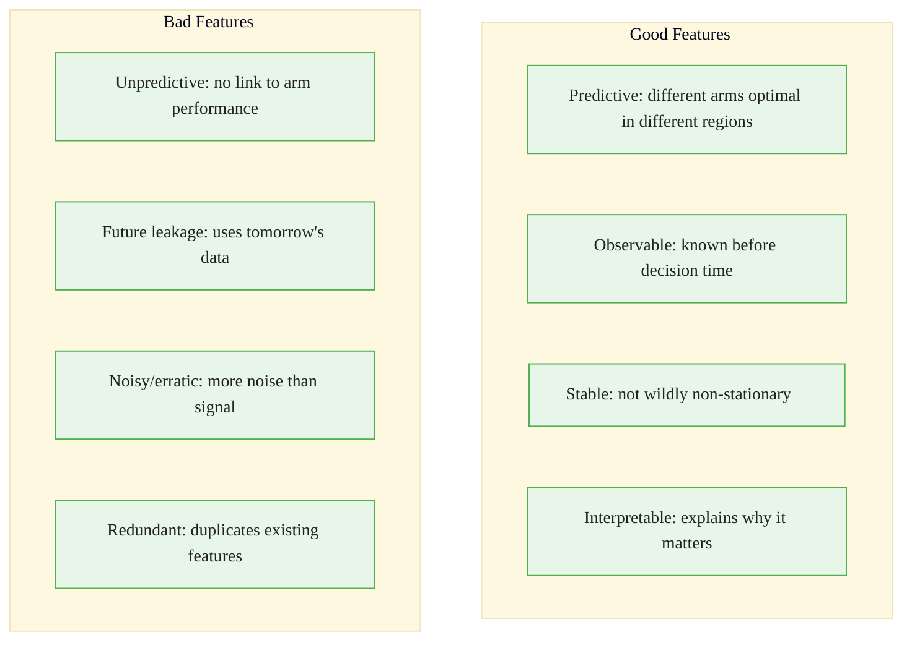
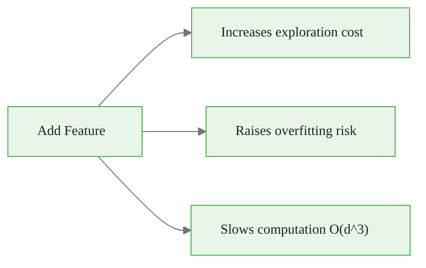
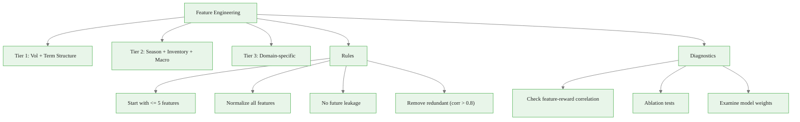

<!-- _class: lead -->

# Feature Engineering for Contextual Bandits

## Module 3: Contextual Bandits
### Multi-Armed Bandits for Commodity Trading

<!-- Speaker notes: This deck covers Feature Engineering for Contextual Bandits. Set the context for the audience and explain how this topic fits into the broader course on multi-armed bandits for commodity trading. -->
---

## In Brief

Good context features are the difference between a bandit that learns useful patterns and one that just adds complexity.

> **The paradox:** Too few features = can't capture regimes. Too many = overfitting and expensive exploration.

**Sweet spot:** 3-7 features capturing core drivers of regime-dependent performance.

<!-- Speaker notes: This opening summary sets the context for the entire deck. Read the key quote aloud and pause to let it sink in. The goal is to establish the core problem or concept before diving into details. -->

<div class="callout-key">

Bandits learn AND earn simultaneously -- the core advantage over traditional A/B testing.

</div>

---

## Feature Selection Framework



<!-- Speaker notes: The diagram on Feature Selection Framework illustrates the key relationships visually. Walk through the flow step by step, pointing out decision points and outcomes. Visual representations like this help students build mental models of the concepts. -->

<div class="callout-insight">

**Insight:** The exploration-exploitation tradeoff is not a fixed ratio -- it should adapt as uncertainty decreases over time.

</div>

---

## Commodity Context Hierarchy

| Tier | Features | When to Include |
|------|----------|----------------|
| **Tier 1** (Always) | Volatility regime, term structure | Always |
| **Tier 2** (Often) | Seasonality, inventory surprise, macro regime | When relevant |
| **Tier 3** (Specific) | Weather (ag), production (energy), PMI (metals) | Domain-specific |

<!-- Speaker notes: This comparison table on Commodity Context Hierarchy is a key reference. Walk through each row, highlighting the most important distinctions. Students should understand when to use each option based on the criteria shown. -->

<div class="callout-warning">

**Warning:** Non-stationary reward distributions violate bandit assumptions. Always implement change detection in production systems.

</div>

---

## Five Properties of Good Features

1. **Predictive:** Arm rankings change across feature regions
2. **Observable:** Known before decision time (no future leakage)
3. **Sufficient variation:** Not constant across observations
4. **Low noise-to-signal:** Use smoothed/rolling values
5. **Interpretable:** You can explain why it matters

<!-- Speaker notes: Cover Five Properties of Good Features at a steady pace. Highlight the key points and connect them to the broader course themes. Check for audience questions before moving to the next slide. -->

<div class="callout-info">

**Info:** The regret of the best bandit algorithms grows logarithmically with time, compared to linearly for A/B testing.

</div>

---

## Recipe 1: Volatility Regime

<div class="code-window">
<div class="code-header">
<div class="dots"><span class="dot-red"></span><span class="dot-yellow"></span><span class="dot-green"></span></div>
<span class="filename">example.py</span>
</div>

```python
def compute_volatility_regime(prices, window=20):
    returns = prices.pct_change()
    rolling_vol = returns.rolling(window).std()
    vol_zscore = (rolling_vol - rolling_vol.mean()) / rolling_vol.std()
    return vol_zscore
```

</div>

> **Why:** Defensive commodities (gold) perform better in high-vol; growth commodities (industrial metals) prefer low-vol.

<!-- Speaker notes: This code example for Recipe 1: Volatility Regime is production-ready. Walk through the implementation, noting any important design patterns or potential modifications for different use cases. -->
---

## Recipe 2: Term Structure

<div class="code-window">
<div class="code-header">
<div class="dots"><span class="dot-red"></span><span class="dot-yellow"></span><span class="dot-green"></span></div>
<span class="filename">example.py</span>
</div>

```python
def compute_term_structure(front_price, back_price):
    term_spread = (back_price - front_price) / front_price
    return term_spread
```

</div>

> **Why:** Contango = oversupply (bad). Backwardation = shortage (good).

## Recipe 3: Seasonality

```python
def compute_seasonality(date):
    month_sin = np.sin(2 * np.pi * date.month / 12)
    month_cos = np.cos(2 * np.pi * date.month / 12)
    return np.array([month_sin, month_cos])
```

> **Why:** Strong patterns in agriculture (harvest) and energy (heating demand).

<!-- Speaker notes: This code example for Recipe 2: Term Structure is production-ready. Walk through the implementation, noting any important design patterns or potential modifications for different use cases. -->
---

## Recipe 4: Inventory Surprise

```python
def compute_inventory_surprise(actual, expected, hist_std):
    surprise = (actual - expected) / hist_std
    return surprise
```

## Recipe 5: Macro Regime

```python
def compute_macro_regime(dollar_index, vix):
    dollar_z = (dollar_index - dollar_index.mean()) / dollar_index.std()
    vix_z = (vix - vix.mean()) / vix.std()
    return 0.5 * dollar_z + 0.5 * vix_z  # Risk-off composite
```

<!-- Speaker notes: This code example for Recipe 4: Inventory Surprise is production-ready. Walk through the implementation, noting any important design patterns or potential modifications for different use cases. -->
---

## Full Feature Pipeline

```python
class CommodityContextFeatures:
    def extract_features(self, prices, dates):
        features = pd.DataFrame(index=dates)
        returns = prices.pct_change()

        # Volatility regime
        vol = returns.rolling(20).std()
        features['vol_zscore'] = (vol - vol.mean()) / vol.std()

        # Momentum proxy for term structure
        mom = prices.pct_change(20)
        features['term_proxy'] = (mom - mom.mean()) / mom.std()
```

<!-- Speaker notes: Code continues on the next slide. This first part sets up the structure. -->

---

## Full Feature Pipeline (continued)

```python
        # Seasonality (cyclical encoding)
        features['month_sin'] = np.sin(2 * np.pi * dates.month / 12)
        features['month_cos'] = np.cos(2 * np.pi * dates.month / 12)

        # Trend strength
        ma_short = prices.rolling(20).mean()
        ma_long = prices.rolling(50).mean()
        features['trend'] = (ma_short - ma_long) / ma_long
        return features.fillna(0)
```

<!-- Speaker notes: This code example for Full Feature Pipeline is production-ready. Walk through the implementation, noting any important design patterns or potential modifications for different use cases. -->
---

## The 5-Feature Rule

> Start with 5 or fewer features. Add more only if they demonstrably improve offline performance.

Each additional feature:



**Process:** Start minimal, add one at a time, measure impact.

<!-- Speaker notes: The diagram on The 5-Feature Rule illustrates the key relationships visually. Walk through the flow step by step, pointing out decision points and outcomes. Visual representations like this help students build mental models of the concepts. -->
---

## Normalization

**Why:** LinUCB assumes features on similar scales.

| Method | Formula | When |
|--------|---------|------|
| Z-score | $(x - \mu)/\sigma$ | Roughly Gaussian |
| Min-max | $(x - \min)/(max - \min)$ | Want $[0, 1]$ range |
| Robust | $(x - \text{median})/\text{IQR}$ | Has outliers |

**Missing values:** Forward fill or fill with 0 (after normalization). Never drop rows in online bandits.

<!-- Speaker notes: This comparison table on Normalization is a key reference. Walk through each row, highlighting the most important distinctions. Students should understand when to use each option based on the criteria shown. -->
---

<!-- _class: lead -->

# Common Pitfalls

<!-- Speaker notes: Transition slide for the Common Pitfalls section. Pause briefly to let the audience absorb the previous content before moving into this new topic area. -->
---

## Feature Engineering Pitfalls

| Pitfall | Example | Fix |
|---------|---------|-----|
| Future leakage | Tomorrow's inventory in today's context | Use `.shift(1)` to lag |
| Non-stationary features | VIX mean changed after 2008 | Rolling window normalization |
| Redundant features | Both VIX and SPX 20-day vol (corr ~0.9) | Drop one or PCA |
| Categorical without encoding | "January" as string | One-hot or sin/cos |
| Ignoring importance | All features weighted equally | Examine $\theta$ weights |

<!-- Speaker notes: Walk through Feature Engineering Pitfalls carefully. Emphasize why this mistake is common and how to recognize it in practice. The commodity trading example makes it concrete -- ask if anyone has encountered this in their own work. -->
---

## Diagnostic Tools

```python
def diagnose_features(features, rewards, arm):
    # 1. Correlation with rewards
    corr = features.corrwith(rewards[arm])
    print(f"Feature-reward correlation:\n{corr}")

    # 2. Feature variance
    print(f"Feature variance:\n{features.var()}")

    # 3. Inter-feature correlation
    print(f"Correlation matrix:\n{features.corr()}")
```

**Ablation test:** Drop each feature one at a time, measure regret change.

<!-- Speaker notes: This code example for Diagnostic Tools is production-ready. Walk through the implementation, noting any important design patterns or potential modifications for different use cases. -->
---

## Visual Summary



<!-- Speaker notes: This visual summary captures the key relationships from the entire deck. Walk through each branch of the diagram, connecting back to the main concepts covered. This slide works well as a reference -- encourage students to screenshot it for later review. -->