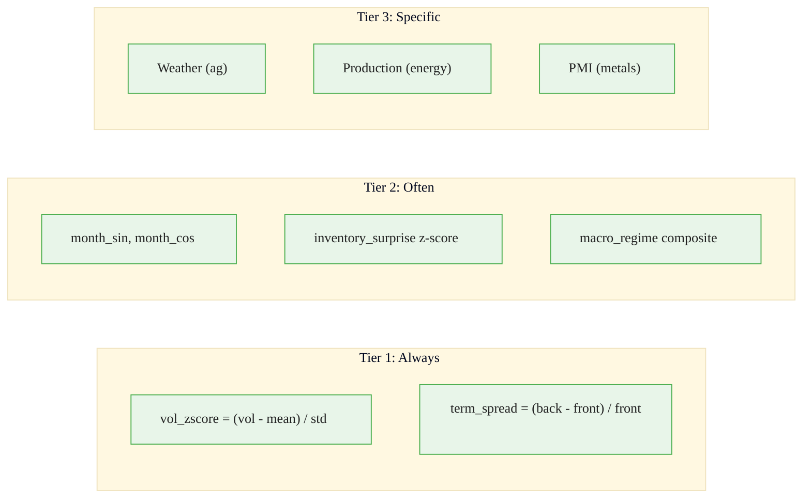
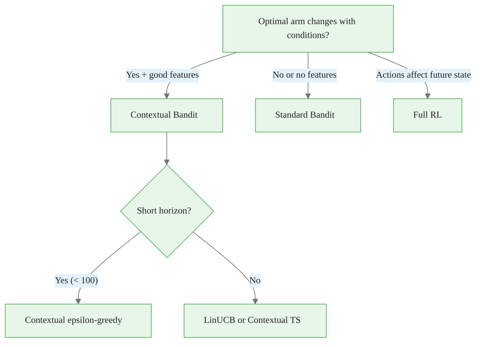
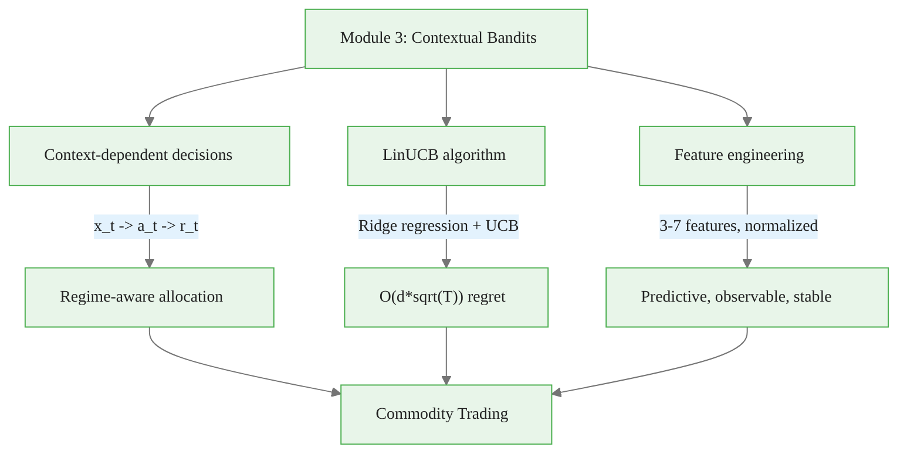

<!-- _class: lead -->

# Contextual Bandits Cheatsheet

## Module 3 Quick Reference
### Multi-Armed Bandits for Commodity Trading

<!-- Speaker notes: This deck covers Contextual Bandits Cheatsheet. Set the context for the audience and explain how this topic fits into the broader course on multi-armed bandits for commodity trading. -->
---

## Standard vs Contextual Bandits

| Concept | Standard | Contextual |
|---------|----------|------------|
| **Input** | None | Context vector $x_t$ |
| **Decision** | $a_t \in \{1,\ldots,K\}$ | $a_t = f(x_t)$ |
| **Reward** | $r_t \sim P(r \mid a_t)$ | $r_t \sim P(r \mid x_t, a_t)$ |
| **Goal** | Learn best arm | Learn best arm **per context** |
| **Regret** | $O(\sqrt{T})$ | $O(d\sqrt{T})$ |

<!-- Speaker notes: This comparison table on Standard vs Contextual Bandits is a key reference. Walk through each row, highlighting the most important distinctions. Students should understand when to use each option based on the criteria shown. -->

<div class="callout-key">

Bandits learn AND earn simultaneously -- the core advantage over traditional A/B testing.

</div>

---

## LinUCB Algorithm

```
Initialize: A_a = lambda*I, b_a = 0 for all arms

At each round t:
  1. Observe context x_t
  2. For each arm a:
     theta_a = solve(A_a, b_a)
     UCB_a = x^T theta_a + alpha * sqrt(x^T A_a^-1 x)
  3. Choose a_t = argmax UCB_a
  4. Observe reward, update:
     A[a_t] += x * x^T
     b[a_t] += r * x
```

<!-- Speaker notes: This code example for LinUCB Algorithm is production-ready. Walk through the implementation, noting any important design patterns or potential modifications for different use cases. -->

<div class="callout-insight">

**Insight:** The exploration-exploitation tradeoff is not a fixed ratio -- it should adapt as uncertainty decreases over time.

</div>

---

## LinUCB Code Template

<div class="code-window">
<div class="code-header">
<div class="dots"><span class="dot-red"></span><span class="dot-yellow"></span><span class="dot-green"></span></div>
<span class="filename">example.py</span>
</div>

```python
class LinUCB:
    def __init__(self, n_arms, context_dim, alpha=1.0, lambda_=1.0):
        self.A = [lambda_ * np.eye(context_dim) for _ in range(n_arms)]
        self.b = [np.zeros(context_dim) for _ in range(n_arms)]
        self.alpha = alpha
```

</div>

<!-- Speaker notes: Code continues on the next slide. This first part sets up the structure. -->

<div class="callout-warning">

**Warning:** Non-stationary reward distributions violate bandit assumptions. Always implement change detection in production systems.

</div>

---

## LinUCB Code Template (continued)

<div class="code-window">
<div class="code-header">
<div class="dots"><span class="dot-red"></span><span class="dot-yellow"></span><span class="dot-green"></span></div>
<span class="filename">example.py</span>
</div>

```python
    def choose_arm(self, context):
        ucb_scores = []
        for a in range(len(self.A)):
            theta = np.linalg.solve(self.A[a], self.b[a])
            pred = context @ theta
            std = np.sqrt(context @ np.linalg.solve(self.A[a], context))
            ucb_scores.append(pred + self.alpha * std)
        return np.argmax(ucb_scores)

    def update(self, arm, context, reward):
        self.A[arm] += np.outer(context, context)
        self.b[arm] += reward * context
```

</div>

<!-- Speaker notes: Walk through the code line by line. Highlight the key design decisions and explain why each parameter or function call matters. This code is copy-paste ready -- students can use it directly in their own projects. -->

<div class="callout-info">

**Info:** The regret of the best bandit algorithms grows logarithmically with time, compared to linearly for A/B testing.

</div>

---

## Feature Checklist

- [ ] **Observable** -- Known before decision (no future leakage)
- [ ] **Predictive** -- Different arms optimal in different contexts
- [ ] **Scaled** -- Normalized to similar ranges
- [ ] **Non-redundant** -- Low correlation with other features
- [ ] **Stationary** -- Distribution doesn't drift wildly

<!-- Speaker notes: This checklist is a practical tool for real-world application. Suggest students save or print this for reference when implementing their own systems. Walk through each item briefly, explaining why it matters. -->
---

## Commodity Context Features



<!-- Speaker notes: The diagram on Commodity Context Features illustrates the key relationships visually. Walk through the flow step by step, pointing out decision points and outcomes. Visual representations like this help students build mental models of the concepts. -->
---

## Parameter Selection

| Parameter | Default | Range | Notes |
|-----------|---------|-------|-------|
| $\alpha$ | 1.0 | [0.1, 2.0] | Exploration strength |
| $\lambda$ | 1.0 | [0.01, 10] | Regularization |
| $d$ (features) | 3-5 | 2-15 | Start small |

**Regret scales with $d$:** More features = slower learning.

<!-- Speaker notes: This comparison table on Parameter Selection is a key reference. Walk through each row, highlighting the most important distinctions. Students should understand when to use each option based on the criteria shown. -->
---

## Troubleshooting

| Symptom | Cause | Fix |
|---------|-------|-----|
| Always same arm | $\alpha$ too small | Increase $\alpha$ |
| Random choices | $\alpha$ too large or bad features | Decrease $\alpha$, check features |
| Worse than standard bandit | Bad features | Check feature-reward correlation |
| Numerical errors | $\lambda$ too small | Set $\lambda \geq 1.0$ |
| Slow convergence | Too many features | Feature selection |

<!-- Speaker notes: This comparison table on Troubleshooting is a key reference. Walk through each row, highlighting the most important distinctions. Students should understand when to use each option based on the criteria shown. -->
---

## Key Formulas

**Ridge regression:** $\hat{\theta}_a = A_a^{-1}b_a$

**Uncertainty:** $\sigma_a(x) = \sqrt{x^T A_a^{-1} x}$

**UCB score:** $\text{UCB}_a(x) = x^T\hat{\theta}_a + \alpha \cdot \sigma_a(x)$

**Regret bound:** $O(d\sqrt{T \log T})$

<!-- Speaker notes: The mathematical treatment of Key Formulas formalizes what we discussed intuitively. Walk through each variable and equation, relating them back to the commodity trading context. Ensure the audience follows the notation before moving on. -->
---

## When to Use What



<!-- Speaker notes: The diagram on When to Use What illustrates the key relationships visually. Walk through the flow step by step, pointing out decision points and outcomes. Visual representations like this help students build mental models of the concepts. -->
---

## Visual Summary



<!-- Speaker notes: This visual summary captures the key relationships from the entire deck. Walk through each branch of the diagram, connecting back to the main concepts covered. This slide works well as a reference -- encourage students to screenshot it for later review. -->