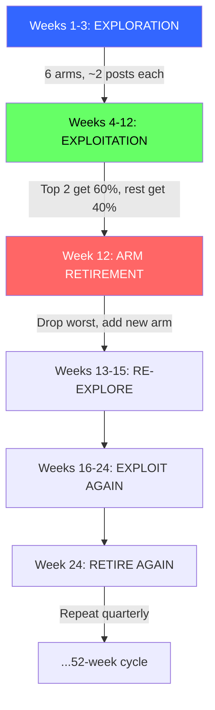
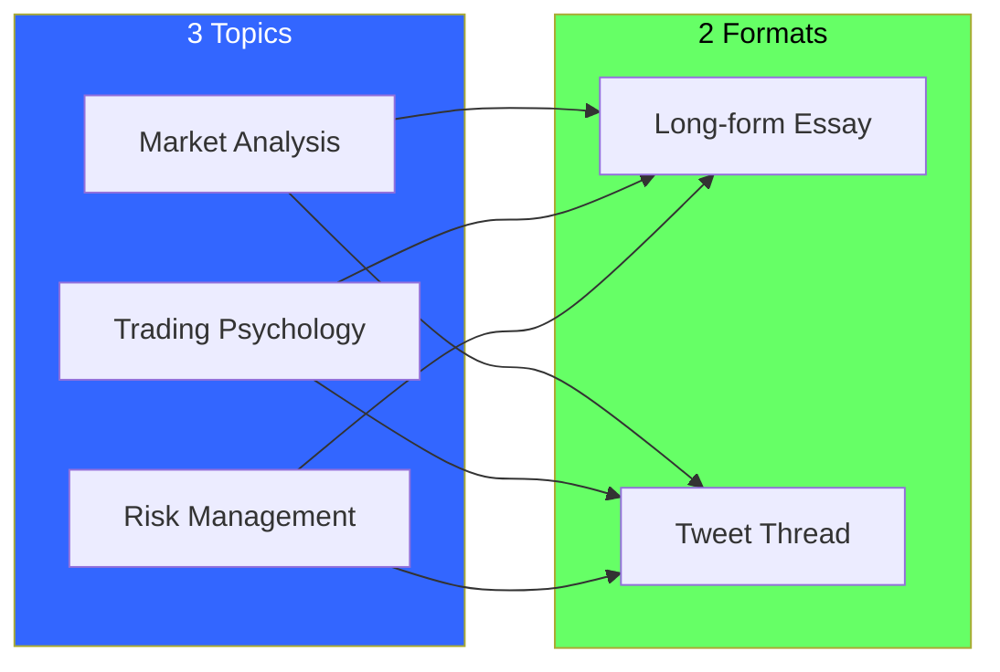
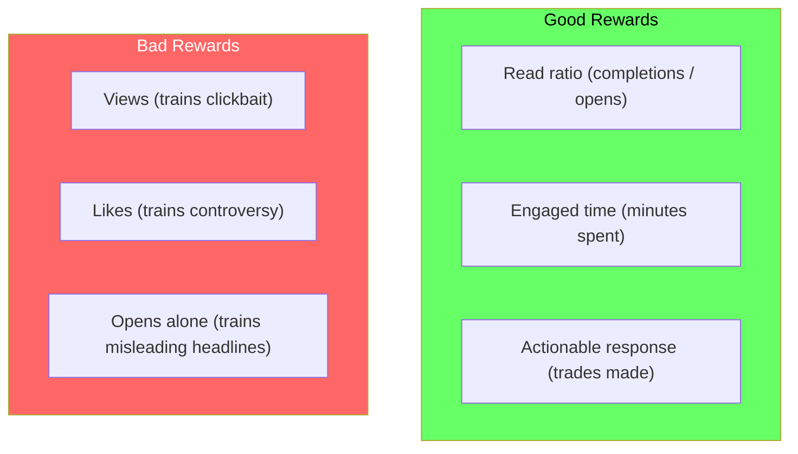
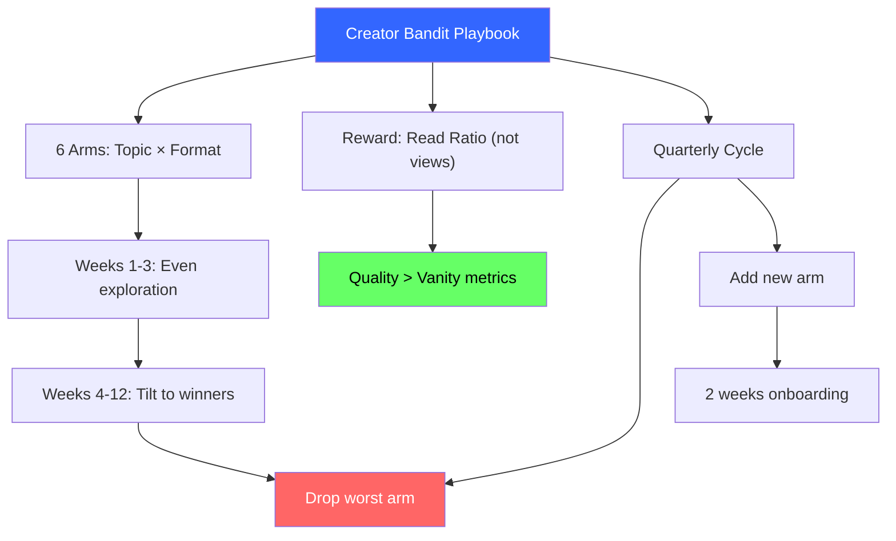

<!-- _class: lead -->

# Creator Bandit Playbook

## Module 4: Content & Growth Optimization
### Multi-Armed Bandits for Commodity Trading

<!-- Speaker notes: This deck covers Creator Bandit Playbook. Set the context for the audience and explain how this topic fits into the broader course on multi-armed bandits for commodity trading. -->
---

## In Brief

Content publishing as a multi-armed bandit: arms are **topic x format** combinations, rewards are **quality engagement** (read ratio, not views).

> Publish evenly, tilt toward winners, keep exploring, prune what doesn't work.

**Three creator archetypes:**

| Approach | Pattern | Problem |
|----------|---------|---------|
| Emotional | Viral spike -> chase -> burnout | Inconsistent |
| A/B Test | Test 8 weeks -> pick winner -> stuck | Too slow |
| **Bandit** | **Tilt + 20% explore + quarterly prune** | **Adaptive** |

<!-- Speaker notes: This opening summary sets the context for the entire deck. Read the key quote aloud and pause to let it sink in. The goal is to establish the core problem or concept before diving into details. -->
---

## Creator Bandit Lifecycle



<!-- Speaker notes: The diagram on Creator Bandit Lifecycle illustrates the key relationships visually. Walk through the flow step by step, pointing out decision points and outcomes. Visual representations like this help students build mental models of the concepts. -->
---

## Key Insight: Non-Stationarity

Content creation is **inherently sequential and non-stationary:**

1. **Arms = repeatable content types** (topic x format, not individual posts)
2. **Rewards = engagement quality** (read ratio, shares -- NOT views)
3. **Exploration budget** = deliberate experimentation slots (20%)
4. **Arm retirement** = monthly pruning for new ideas

> The antidote to "I went viral once, so I'll chase that high forever."

<!-- Speaker notes: This is the single most important idea in the deck. Make sure the audience understands and remembers this insight. Consider asking the audience to restate it in their own words before proceeding. -->
---

## Arms: Topic x Format Matrix



**Result:** 3 topics x 2 formats = **6 arms** (repeatable weekly)

<!-- Speaker notes: The diagram on Arms: Topic x Format Matrix illustrates the key relationships visually. Walk through the flow step by step, pointing out decision points and outcomes. Visual representations like this help students build mental models of the concepts. -->
---

## Formal Definition

**Phase 1 (Weeks 1-3): Uniform Exploration**
$$\hat{\mu}_k = \frac{1}{n_k} \sum r_t \quad \text{for each arm } k$$

**Phase 2 (Weeks 4-12): Tilted Exploitation**
- Top 2 arms: 60% of publishing slots
- Middle 2 arms: 20% (monitoring)
- Bottom 2 arms: 20% (keep exploring)

**Phase 3 (Week 12, 24, 36): Arm Retirement**
$$k_{\text{worst}} = \arg\min_k \hat{\mu}_k \quad \to \text{retire and replace}$$

<!-- Speaker notes: This is the formal mathematical treatment. Walk through each symbol and equation carefully, connecting back to the intuitive explanation from the previous slides. Do not rush this slide -- pause after each equation to ensure comprehension. -->
---

## Reward Design: Quality Not Vanity



> A thread with 50K views but 2% read ratio loses to an essay with 5K views and 40% read ratio.

<!-- Speaker notes: The diagram on Reward Design: Quality Not Vanity illustrates the key relationships visually. Walk through the flow step by step, pointing out decision points and outcomes. Visual representations like this help students build mental models of the concepts. -->
---

## Code: Creator Bandit Simulation

```python
import numpy as np

arms = ["Market Analysis × Essay", "Market Analysis × Thread",
        "Trading Psychology × Essay", "Trading Psychology × Video",
        "Risk Management × Essay", "Risk Management × Thread"]
true_means = [0.45, 0.38, 0.52, 0.41, 0.35, 0.48]

n_arms = len(arms)
pulls = np.zeros(n_arms)
rewards = np.zeros(n_arms)

# Phase 1: Exploration (weeks 1-3)
for week in range(3):
    for arm in range(n_arms):
        reward = np.clip(np.random.normal(true_means[arm], 0.1), 0, 1)
        pulls[arm] += 1
        rewards[arm] += reward
```

<!-- Speaker notes: Walk through the code line by line. Highlight the key design decisions and explain why each parameter or function call matters. This code is copy-paste ready -- students can use it directly in their own projects. -->
---

## Code: Exploitation + Retirement

```python
# Phase 2: Tilted exploitation (weeks 4-52)
for week in range(3, 52):
    avg_rewards = rewards / np.maximum(pulls, 1)
    ranking = np.argsort(avg_rewards)[::-1]

    # Top 2 get 60%, others get 40%
    week_arms = (
        [ranking[0]] * 3 + [ranking[1]] * 2 +
        [ranking[i] for i in range(2, n_arms)]
    )
    np.random.shuffle(week_arms)
```

<!-- Speaker notes: Code continues on the next slide. This first part sets up the structure. -->

---

## Code: Exploitation + Retirement (continued)

```python
    for arm in week_arms[:5]:  # 5 posts/week
        reward = np.clip(np.random.normal(true_means[arm], 0.1), 0, 1)
        pulls[arm] += 1
        rewards[arm] += reward

    # Quarterly arm retirement
    if week in [12, 24, 36]:
        worst = ranking[-1]
        print(f"Week {week}: Retire '{arms[worst]}'")
        pulls[worst] = 0
        rewards[worst] = 0
```

<!-- Speaker notes: Walk through the code line by line. Highlight the key design decisions and explain why each parameter or function call matters. This code is copy-paste ready -- students can use it directly in their own projects. -->
---

<!-- _class: lead -->

# Common Pitfalls

<!-- Speaker notes: Transition slide for the Common Pitfalls section. Pause briefly to let the audience absorb the previous content before moving into this new topic area. -->
---

## Pitfall 1: Chasing Viral Spikes

| Trap | Why It Fails | Fix |
|------|-------------|-----|
| "50K views! Only do threads!" | Virality is high-variance noise | Use **read ratio** not views |
| One spike != best format | Algorithm lottery, not real signal | Track **average** across many posts |

> A thread with 50K views and 2% read ratio = 1K readers. An essay with 5K views and 40% read ratio = 2K readers.

<!-- Speaker notes: Walk through Pitfall 1: Chasing Viral Spikes carefully. Emphasize why this mistake is common and how to recognize it in practice. The commodity trading example makes it concrete -- ask if anyone has encountered this in their own work. -->
---

## Pitfall 2: No Exploration Budget

**The trap:** "My top 2 arms work, so I'll only publish those."

**Why it fails:** Audiences evolve. New formats emerge. Without exploration, you miss the next thing.

**The fix:** Reserve 20% for exploration = 1 post/week if publishing 5x/week.

<!-- Speaker notes: Walk through Pitfall 2: No Exploration Budget carefully. Emphasize why this mistake is common and how to recognize it in practice. The commodity trading example makes it concrete -- ask if anyone has encountered this in their own work. -->
---

## Pitfall 3: Wrong Metric & Non-Repeatable Arms

<div class="columns">
<div>

### Wrong Metric
- Clickbait headlines get more opens
- Bandit picks clickbait
- You alienate real audience
- **Fix:** Read ratio as reward

</div>
<div>

### Non-Repeatable Arms
- "Analysis of Feb 2026 OPEC Meeting" is one-time
- Can't learn from single events
- **Fix:** Arms must be weekly-repeatable
- "Market Analysis x Video" (repeatable)

</div>
</div>

<!-- Speaker notes: Walk through Pitfall 3: Wrong Metric & Non-Repeatable Arms carefully. Emphasize why this mistake is common and how to recognize it in practice. The commodity trading example makes it concrete -- ask if anyone has encountered this in their own work. -->
---

## Connections

<div class="columns">
<div>

### Builds On
- **Module 2:** Thompson Sampling for content
- **Module 1:** Epsilon-greedy with e=0.2
- **Module 3:** Add context for personalized strategies

</div>
<div>

### Leads To
- **Module 5:** Same framework for trading strategies
- **Module 7:** Ship as recommendation system
- **Guide 02:** Conversion optimization
- **Guide 03:** Arm retirement system

</div>
</div>

<!-- Speaker notes: The connections section shows how this topic links to the rest of the course. Highlight the 'Builds On' prerequisites to remind students of what they should already know, and use 'Leads To' to create anticipation for upcoming modules. -->
---

## Visual Summary



<!-- Speaker notes: This visual summary captures the key relationships from the entire deck. Walk through each branch of the diagram, connecting back to the main concepts covered. This slide works well as a reference -- encourage students to screenshot it for later review. -->