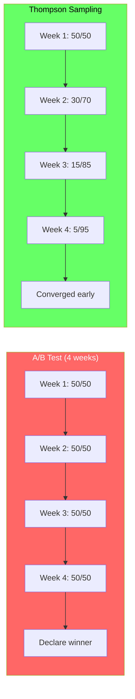
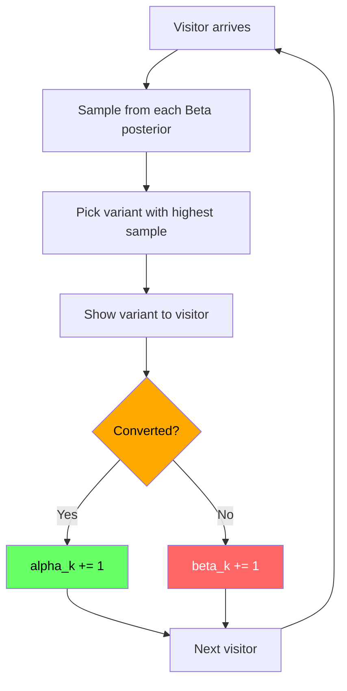
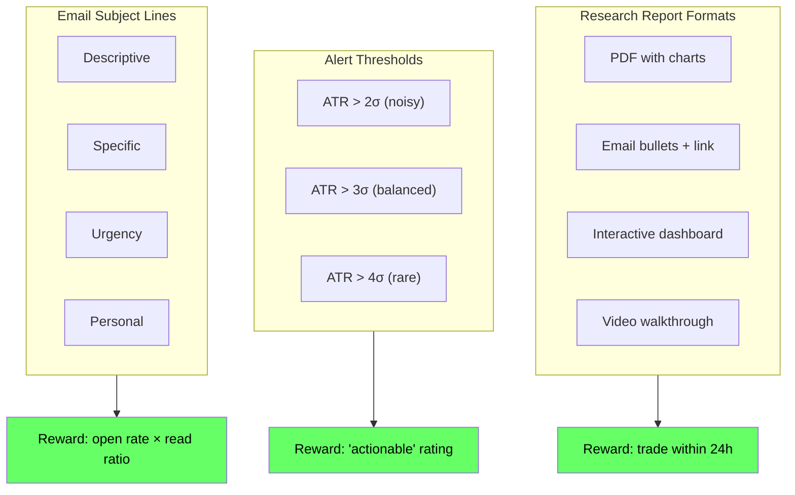
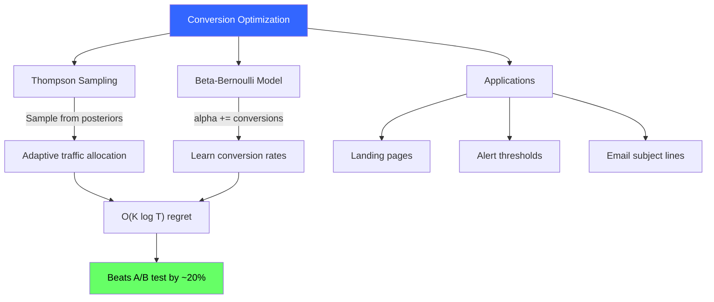

<!-- _class: lead -->

# Conversion Optimization with Bandits

## Module 4: Content & Growth Optimization
### Multi-Armed Bandits for Commodity Trading

<!-- Speaker notes: This deck covers Conversion Optimization with Bandits. Set the context for the audience and explain how this topic fits into the broader course on multi-armed bandits for commodity trading. -->
---

## In Brief

Why waste traffic on inferior landing pages when you could tilt toward winners **while you learn**?

| Approach | Traffic Split | Opportunity Cost |
|----------|--------------|-----------------|
| A/B Test | 50/50 for 4 weeks | High (linear regret) |
| **Thompson Sampling** | **Adaptive: 50/50 -> 5/95** | **Low (log regret)** |

> Conversion optimization is the **perfect** use case for Bayesian bandits: binary outcomes, unknown rates, high opportunity cost.

<!-- Speaker notes: This opening summary sets the context for the entire deck. Read the key quote aloud and pause to let it sink in. The goal is to establish the core problem or concept before diving into details. -->
---

## A/B Test vs Thompson Sampling



**Result:** Thompson Sampling saves ~75 conversions over 10,000 visitors.

<!-- Speaker notes: The diagram on A/B Test vs Thompson Sampling illustrates the key relationships visually. Walk through the flow step by step, pointing out decision points and outcomes. Visual representations like this help students build mental models of the concepts. -->
---

## Why Bandits Win: Posterior Evolution

```
Start           After 100        After 500        After 2000
Variant A:    Beta(1,1)      Beta(4, 96)     Beta(16, 484)    Beta(61, 1939)
              [flat]         [peaked at 3%]   [tight at 3%]    [very tight]
Variant B:    Beta(1,1)      Beta(7, 93)     Beta(31, 469)    Beta(121, 1879)
              [flat]         [peaked at 6%]   [tight at 6%]    [very tight]
```

> Wide posteriors = more exploration. Tight posteriors = automatic exploitation.

<!-- Speaker notes: This code example for Why Bandits Win: Posterior Evolution is production-ready. Walk through the implementation, noting any important design patterns or potential modifications for different use cases. -->
---

## Formal Definition

**Problem:** K variants, each with unknown $\theta_k \in [0, 1]$

**Thompson Sampling for Conversion Rates:**

Initialize: $\alpha_k \leftarrow 1, \; \beta_k \leftarrow 1$ for all variants

For each visitor $t$:
1. **Sample:** $\tilde{\theta}_k \sim \text{Beta}(\alpha_k, \beta_k)$
2. **Select:** $a_t = \arg\max_k \tilde{\theta}_k$
3. **Observe:** $r_t \in \{0, 1\}$
4. **Update:** $\alpha_{a_t} \leftarrow \alpha_{a_t} + r_t, \; \beta_{a_t} \leftarrow \beta_{a_t} + (1 - r_t)$

**Regret:** $E[\text{Regret}_T] = O(K \log T)$ vs A/B test: $\Theta(T)$

<!-- Speaker notes: This is the formal mathematical treatment. Walk through each symbol and equation carefully, connecting back to the intuitive explanation from the previous slides. Do not rush this slide -- pause after each equation to ensure comprehension. -->
---

## Thompson Sampling Mechanics



<!-- Speaker notes: The diagram on Thompson Sampling Mechanics illustrates the key relationships visually. Walk through the flow step by step, pointing out decision points and outcomes. Visual representations like this help students build mental models of the concepts. -->
---

## Code: Conversion Bandit

```python
import numpy as np

class ConversionBandit:
    def __init__(self, n_variants):
        self.n = n_variants
        self.alpha = np.ones(n_variants)  # Prior successes
        self.beta = np.ones(n_variants)   # Prior failures

    def select_variant(self):
        """Thompson Sampling: sample from posteriors"""
        samples = np.random.beta(self.alpha, self.beta)
        return np.argmax(samples)
```

<!-- Speaker notes: Code continues on the next slide. This first part sets up the structure. -->

---

## Code: Conversion Bandit (continued)

```python
    def update(self, variant, converted):
        """Update posterior after observing result"""
        if converted:
            self.alpha[variant] += 1
        else:
            self.beta[variant] += 1

    def get_means(self):
        """Current conversion rate estimates"""
        return self.alpha / (self.alpha + self.beta)
```

<!-- Speaker notes: Walk through the code line by line. Highlight the key design decisions and explain why each parameter or function call matters. This code is copy-paste ready -- students can use it directly in their own projects. -->
---

## Code: Simulation Results

```python
true_rates = [0.03, 0.06, 0.04, 0.05]  # 4 variants
bandit = ConversionBandit(len(true_rates))
conversions = np.zeros(len(true_rates))

for visitor in range(10000):
    variant = bandit.select_variant()
    converted = np.random.rand() < true_rates[variant]
    bandit.update(variant, converted)
    conversions[variant] += converted
```

**Output:**
```
Variant 0:  523 visitors, 2.9% conv (true: 3.0%)
Variant 1: 8891 visitors, 6.1% conv (true: 6.0%)  ← 89% traffic!
Variant 2:  312 visitors, 4.2% conv (true: 4.0%)
Variant 3:  274 visitors, 4.7% conv (true: 5.0%)
```

<!-- Speaker notes: Walk through the code line by line. Highlight the key design decisions and explain why each parameter or function call matters. This code is copy-paste ready -- students can use it directly in their own projects. -->
---

## Commodity Trading Applications



<!-- Speaker notes: The diagram on Commodity Trading Applications illustrates the key relationships visually. Walk through the flow step by step, pointing out decision points and outcomes. Visual representations like this help students build mental models of the concepts. -->
---

## Multi-Step Funnel Extension

For funnel with steps $S_1, S_2, \ldots, S_n$:

| Approach | Pros | Cons |
|----------|------|------|
| **One end-to-end bandit** | Cleaner setup | Slow learning (sparse signal) |
| **Independent bandit per step** | Faster learning, localized | More complexity |

> **Recommendation:** Separate bandits per step. Faster feedback, easier debugging.

```
Landing page → Email signup (4 variants, bandit #1)
Email → Confirm (3 subject lines, bandit #2)
Confirmed → First purchase (2 onboarding flows, bandit #3)
```

<!-- Speaker notes: This slide connects theory to implementation for Multi-Step Funnel Extension. Start with the mathematical formulation, then show how each term maps to a line of code. This bridge between theory and practice is one of the most valuable aspects of the course. -->
---

<!-- _class: lead -->

# Common Pitfalls

<!-- Speaker notes: Transition slide for the Common Pitfalls section. Pause briefly to let the audience absorb the previous content before moving into this new topic area. -->
---

## Pitfall 1: Stopping Too Early

**The trap:** "After 200 visitors, B has 8% vs A's 3%. Ship it!"

**Why it fails:** Small samples have huge variance. B might have gotten lucky.

**The fix:**
- Let posteriors tighten (credible intervals don't overlap)
- Minimum sample rule: each variant gets >= 100 visitors
- Thompson Sampling naturally handles this (wide posteriors = more exploration)

<!-- Speaker notes: Walk through Pitfall 1: Stopping Too Early carefully. Emphasize why this mistake is common and how to recognize it in practice. The commodity trading example makes it concrete -- ask if anyone has encountered this in their own work. -->
---

## Pitfall 2: Too Many Variants

**The trap:** Testing 20 variants, one shows 10% by chance.

**The fix:**
- Start with <= 5 variants
- Informative priors: Beta(2, 20) if you expect ~10% conversion
- Monitor credible intervals, not just point estimates

<!-- Speaker notes: Walk through Pitfall 2: Too Many Variants carefully. Emphasize why this mistake is common and how to recognize it in practice. The commodity trading example makes it concrete -- ask if anyone has encountered this in their own work. -->
---

## Pitfall 3: Wrong Conversion Metric

| Bad Metric | Why Bad | Better Metric |
|-----------|---------|---------------|
| "Add to cart" | Doesn't correlate with revenue | Completed purchase |
| "Email opened" | Trains clickbait | Open x read ratio |
| "Started free trial" | Vanity metric | Trial -> paid conversion |
| "Page viewed" | Trains SEO spam | Trader took action |

> For commodity reports: optimize for "trader made a trade" not "opened email."

<!-- Speaker notes: Walk through Pitfall 3: Wrong Conversion Metric carefully. Emphasize why this mistake is common and how to recognize it in practice. The commodity trading example makes it concrete -- ask if anyone has encountered this in their own work. -->
---

## Connections

<div class="columns">
<div>

### Builds On
- **Module 2:** Thompson Sampling with Beta-Bernoulli
- **Module 1:** UCB1 also works, but TS is simpler for binary rewards

</div>
<div>

### Leads To
- **Module 7:** Ship as website optimization service
- **Module 6:** Discounted TS for drifting conversion rates
- **Guide 01:** Same framework for content engagement
- **Guide 03:** Arm management for variants

</div>
</div>

<!-- Speaker notes: The connections section shows how this topic links to the rest of the course. Highlight the 'Builds On' prerequisites to remind students of what they should already know, and use 'Leads To' to create anticipation for upcoming modules. -->
---

## Visual Summary



<!-- Speaker notes: This visual summary captures the key relationships from the entire deck. Walk through each branch of the diagram, connecting back to the main concepts covered. This slide works well as a reference -- encourage students to screenshot it for later review. -->