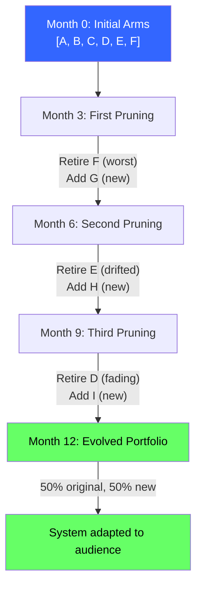
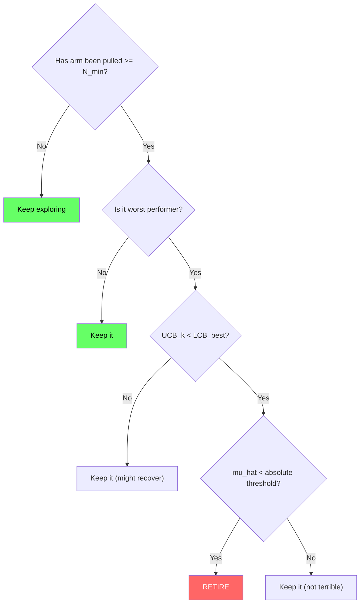
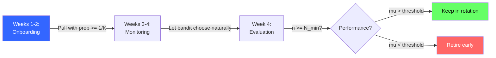
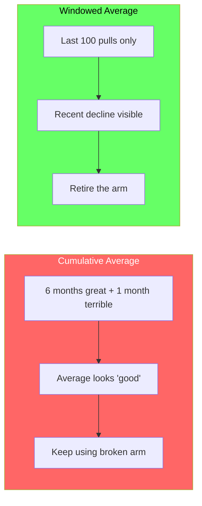
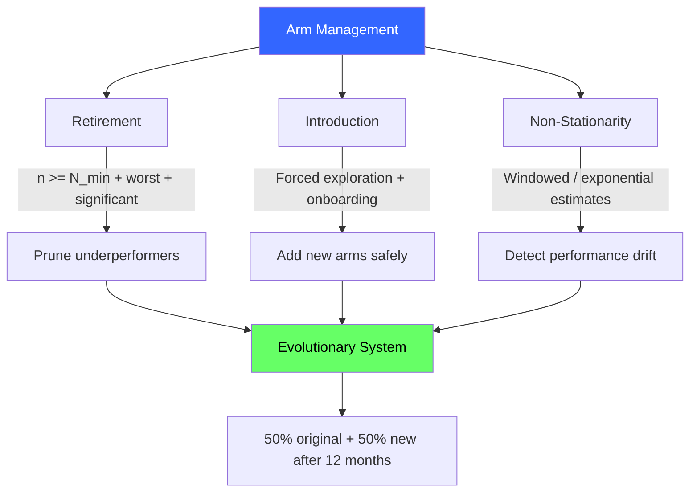

<!-- _class: lead -->

# Arm Management
## Retirement, Introduction, and Evolution

## Module 4: Content & Growth Optimization
### Multi-Armed Bandits for Commodity Trading

<!-- Speaker notes: This deck covers Arm Management. Set the context for the audience and explain how this topic fits into the broader course on multi-armed bandits for commodity trading. -->
---

## In Brief

Real-world bandit systems aren't static. New options emerge, old options stop working.

> The best bandit systems are **gardens, not monuments**.

| Mindset | Approach | Outcome |
|---------|----------|---------|
| Monument | Design perfect arms, test, use forever | Stale, outdated |
| **Garden** | **Start, prune worst, plant new, evolve** | **Adaptive** |

<!-- Speaker notes: This opening summary sets the context for the entire deck. Read the key quote aloud and pause to let it sink in. The goal is to establish the core problem or concept before diving into details. -->
---

## Evolutionary Bandit System



<!-- Speaker notes: The diagram on Evolutionary Bandit System illustrates the key relationships visually. Walk through the flow step by step, pointing out decision points and outcomes. Visual representations like this help students build mental models of the concepts. -->
---

## Four Key Techniques

1. **Arm retirement:** Drop arms that are provably worse
2. **Arm introduction:** Add new arms with onboarding exploration
3. **Windowed estimates:** Weight recent data more (non-stationarity)
4. **Minimum pull constraints:** Don't retire until fair evaluation

<!-- Speaker notes: Cover Four Key Techniques at a steady pace. Highlight the key points and connect them to the broader course themes. Check for audience questions before moving to the next slide. -->
---

## Retirement Decision Tree



<!-- Speaker notes: The diagram on Retirement Decision Tree illustrates the key relationships visually. Walk through the flow step by step, pointing out decision points and outcomes. Visual representations like this help students build mental models of the concepts. -->
---

## Formal Retirement Criteria

Retire arm $k$ at time $t$ if ALL conditions met:

1. **Minimum pulls:** $n_k(t) \geq N_{\min}$ (e.g., 50)
2. **Worst performer:** $\hat{\mu}_k \leq \min_{j \neq k} \hat{\mu}_j$
3. **Statistical significance:**

$$\text{UCB}_k < \text{LCB}_{\text{best}}$$

where:

$$\text{UCB}_k = \hat{\mu}_k + \sqrt{\frac{2 \log t}{n_k}}, \quad \text{LCB}_{\text{best}} = \hat{\mu}_{\text{best}} - \sqrt{\frac{2 \log t}{n_{\text{best}}}}$$

<!-- Speaker notes: This is the formal mathematical treatment. Walk through each symbol and equation carefully, connecting back to the intuitive explanation from the previous slides. Do not rush this slide -- pause after each equation to ensure comprehension. -->
---

## Introduction Protocol

When introducing new arm $k_{\text{new}}$:



**Alternative:** Optimistic initialization -- set $\hat{\mu}_{k_{\text{new}}} = \hat{\mu}_{\text{best}}$

<!-- Speaker notes: The diagram on Introduction Protocol illustrates the key relationships visually. Walk through the flow step by step, pointing out decision points and outcomes. Visual representations like this help students build mental models of the concepts. -->
---

## Non-Stationary Handling

<div class="columns">
<div>

### Windowed Average
$$\hat{\mu}_k = \frac{1}{W} \sum_{i=n_k-W+1}^{n_k} r_i$$

Uses last $W$ observations only.

</div>
<div>

### Exponentially Weighted
$$\hat{\mu}_k \leftarrow \alpha \cdot \hat{\mu}_k + (1-\alpha) \cdot r_{\text{new}}$$

$\alpha \in [0.9, 0.99]$ (higher = more memory)

</div>
</div>

> **Why:** Cumulative averages mask performance drift. An arm great for 6 months but terrible recently still looks "good" cumulatively.

<!-- Speaker notes: The mathematical treatment of Non-Stationary Handling formalizes what we discussed intuitively. Walk through each variable and equation, relating them back to the commodity trading context. Ensure the audience follows the notation before moving on. -->
---

## Code: Evolutionary Bandit

```python
import numpy as np

class EvolutionaryBandit:
    def __init__(self, initial_arms, min_pulls=50):
        self.arms = initial_arms
        self.n_pulls = {arm: 0 for arm in initial_arms}
        self.rewards = {arm: [] for arm in initial_arms}
        self.min_pulls = min_pulls
        self.retired = []

    def get_mean(self, arm, window=None):
        if not self.rewards[arm]:
            return 0.0
        data = self.rewards[arm][-window:] if window else self.rewards[arm]
        return np.mean(data)
```

<!-- Speaker notes: Walk through the code line by line. Highlight the key design decisions and explain why each parameter or function call matters. This code is copy-paste ready -- students can use it directly in their own projects. -->
---

## Code: Retirement and Introduction

```python
    def retire_worst(self, threshold=None):
        eligible = [a for a in self.arms
                    if self.n_pulls[a] >= self.min_pulls]
        if len(eligible) <= 2:  # Keep minimum 2 arms
            return None
        means = {a: self.get_mean(a, window=100) for a in eligible}
        worst = min(eligible, key=lambda a: means[a])
        if threshold and means[worst] < threshold:
            self.arms.remove(worst)
            self.retired.append(worst)
            return worst
        return None
```

<!-- Speaker notes: Code continues on the next slide. This first part sets up the structure. -->

---

## Code: Retirement and Introduction (continued)

```python
    def add_arm(self, new_arm, onboarding_pulls=10):
        self.arms.append(new_arm)
        self.n_pulls[new_arm] = 0
        self.rewards[new_arm] = []
        return onboarding_pulls  # Force this many pulls
```

<!-- Speaker notes: Walk through the code line by line. Highlight the key design decisions and explain why each parameter or function call matters. This code is copy-paste ready -- students can use it directly in their own projects. -->
---

## Commodity Trading Applications

| Application | Retirement Trigger | Introduction Protocol |
|------------|-------------------|----------------------|
| **Strategy portfolio** | Sharpe < 0.5 over 60 days | 10% capital for 30 trades |
| **Research formats** | Read ratio dropped 45% -> 18% | 20% audience for 10 issues |
| **Alert channels** | CTR < 10% or cost > $0.05/alert | Test with subset for 2 weeks |

> Market regimes change. A backwardation strategy from 2020 might bleed in 2024.

<!-- Speaker notes: This comparison table on Commodity Trading Applications is a key reference. Walk through each row, highlighting the most important distinctions. Students should understand when to use each option based on the criteria shown. -->
---

<!-- _class: lead -->

# Common Pitfalls

<!-- Speaker notes: Transition slide for the Common Pitfalls section. Pause briefly to let the audience absorb the previous content before moving into this new topic area. -->
---

## Pitfall 1: Retiring Too Aggressively

**The trap:** "Arm C had a bad week, drop it."

**The fix:**
- Minimum pull requirement (>= 50 for content, >= 100 for trading)
- Check confidence intervals, not just point estimates
- Require "worst performer" for multiple evaluation periods

<!-- Speaker notes: Walk through Pitfall 1: Retiring Too Aggressively carefully. Emphasize why this mistake is common and how to recognize it in practice. The commodity trading example makes it concrete -- ask if anyone has encountered this in their own work. -->
---

## Pitfall 2: No Onboarding for New Arms

**The trap:** Add new arm, let bandit choose, new arm never gets selected.

**Why:** Existing arms have tight confidence bounds, new arm has wide uncertainty + unlucky early results.

**The fix:**
- **Forced exploration:** 1/K traffic for first N pulls
- **Optimistic initialization:** Set initial estimate high
- **Onboarding period:** 2 weeks guaranteed exposure

<!-- Speaker notes: Walk through Pitfall 2: No Onboarding for New Arms carefully. Emphasize why this mistake is common and how to recognize it in practice. The commodity trading example makes it concrete -- ask if anyone has encountered this in their own work. -->
---

## Pitfall 3: Ignoring Non-Stationarity



<!-- Speaker notes: Walk through Pitfall 3: Ignoring Non-Stationarity carefully. Emphasize why this mistake is common and how to recognize it in practice. The commodity trading example makes it concrete -- ask if anyone has encountered this in their own work. -->
---

## Pitfall 4: Retiring Without Replacement

**The trap:** Retire 4 arms over 12 months, don't add new ones. Down to 2 arms.

**The fix:**
- **1-for-1 replacement:** Every retirement = one new introduction
- **Ideation pipeline:** Maintain a queue of "next to test"
- **Experimentation budget:** Always reserve 10-20% for new arms

<!-- Speaker notes: Walk through Pitfall 4: Retiring Without Replacement carefully. Emphasize why this mistake is common and how to recognize it in practice. The commodity trading example makes it concrete -- ask if anyone has encountered this in their own work. -->
---

## Connections

<div class="columns">
<div>

### Builds On
- **Module 1 (UCB):** Confidence intervals for retirement
- **Module 2 (TS):** Bayesian credible intervals
- **Module 6:** Discounted TS, sliding windows

</div>
<div>

### Leads To
- **Module 5:** Strategy retirement in commodity portfolios
- **Module 7:** Automated arm management in production
- **Guide 01:** Quarterly retirement in creator playbook
- **Guide 02:** Same logic for landing page variants

</div>
</div>

<!-- Speaker notes: The connections section shows how this topic links to the rest of the course. Highlight the 'Builds On' prerequisites to remind students of what they should already know, and use 'Leads To' to create anticipation for upcoming modules. -->
---

## Visual Summary



<!-- Speaker notes: This visual summary captures the key relationships from the entire deck. Walk through each branch of the diagram, connecting back to the main concepts covered. This slide works well as a reference -- encourage students to screenshot it for later review. -->