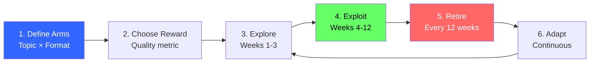
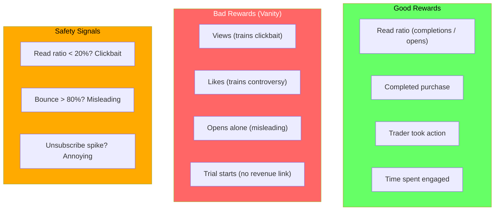
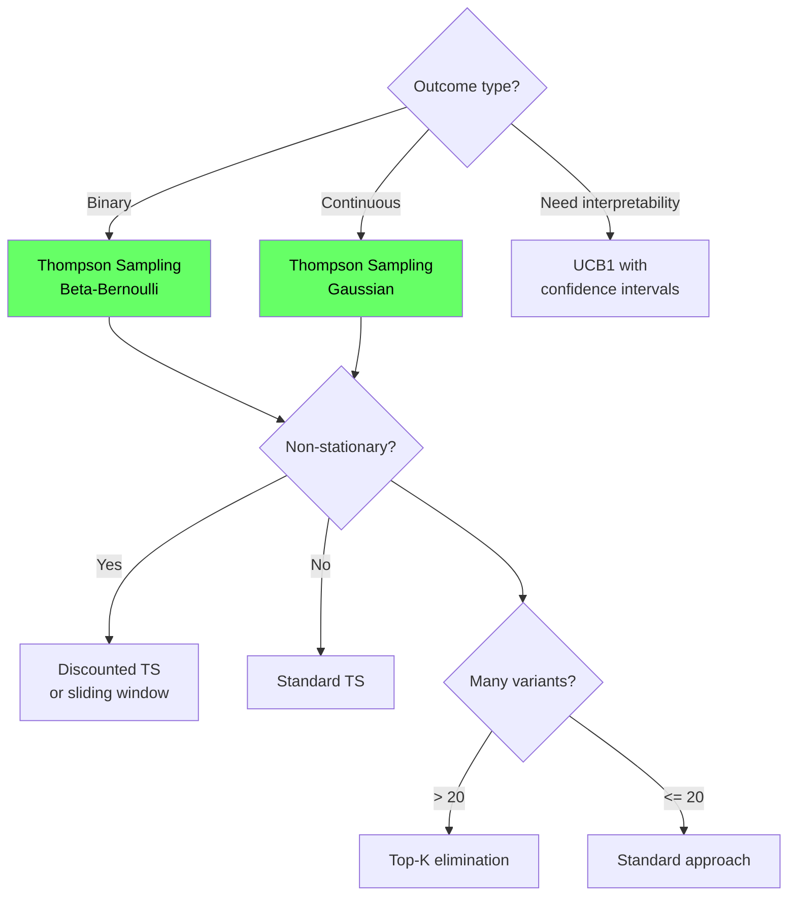
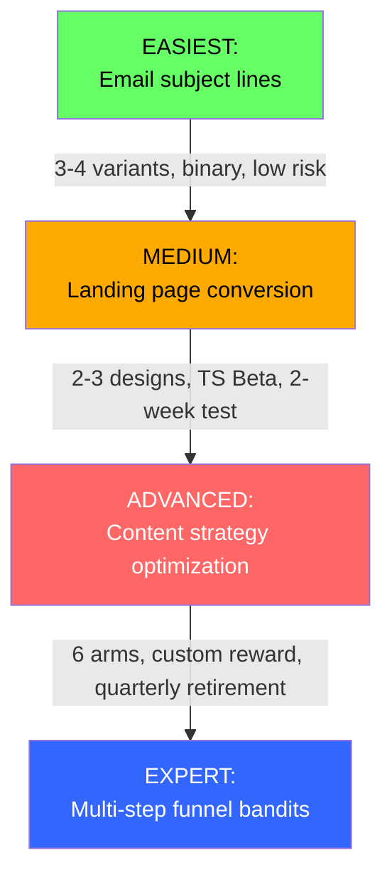
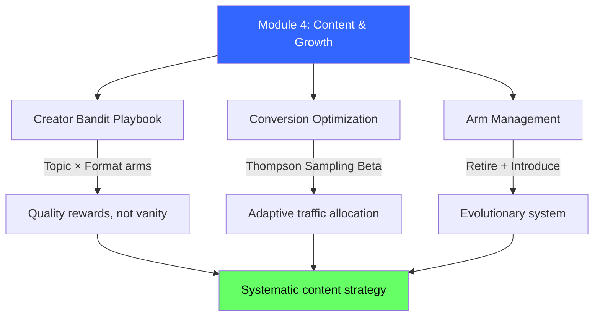

<!-- _class: lead -->

# Content & Growth Cheatsheet

## Module 4 Quick Reference
### Multi-Armed Bandits for Commodity Trading

<!-- Speaker notes: This deck covers Content & Growth Cheatsheet. Set the context for the audience and explain how this topic fits into the broader course on multi-armed bandits for commodity trading. -->
---

## Creator Bandit: 6-Step Framework



<!-- Speaker notes: The diagram on Creator Bandit: 6-Step Framework illustrates the key relationships visually. Walk through the flow step by step, pointing out decision points and outcomes. Visual representations like this help students build mental models of the concepts. -->
---

## Conversion Optimization Template

```python
# Thompson Sampling for Beta-Bernoulli
alpha = np.ones(K)  # Prior successes + 1
beta = np.ones(K)   # Prior failures + 1

# Each visitor
samples = np.random.beta(alpha, beta)
variant = np.argmax(samples)

# Update
if converted:
    alpha[variant] += 1
else:
    beta[variant] += 1
```

**Regret:** $O(K \log T)$ vs A/B test: $\Theta(T)$

<!-- Speaker notes: This slide connects theory to implementation for Conversion Optimization Template. Start with the mathematical formulation, then show how each term maps to a line of code. This bridge between theory and practice is one of the most valuable aspects of the course. -->
---

## Reward Design: Good vs Bad



<!-- Speaker notes: The diagram on Reward Design: Good vs Bad illustrates the key relationships visually. Walk through the flow step by step, pointing out decision points and outcomes. Visual representations like this help students build mental models of the concepts. -->
---

## Arm Management Decision Summary

| Action | Criteria | Protocol |
|--------|----------|----------|
| **Retire** | $n_k \geq 50$ AND worst AND $\text{UCB}_k < \text{LCB}_{\text{best}}$ | Remove, replace 1-for-1 |
| **Introduce** | New idea in pipeline | 2 weeks forced exploration at 1/K traffic |
| **Keep** | Performing well or insufficient data | Continue monitoring |

<!-- Speaker notes: This comparison table on Arm Management Decision Summary is a key reference. Walk through each row, highlighting the most important distinctions. Students should understand when to use each option based on the criteria shown. -->
---

## Common Patterns by Use Case

| Use Case | Arms | Reward |
|----------|------|--------|
| Content Strategy | Topic x Format | Read ratio |
| Landing Page Testing | Page variants | Conversion rate |
| Email Optimization | Subject lines | Open x read ratio |
| Pricing Experiments | Price points | Revenue per visit |
| Trading Alerts | Thresholds | Actionable trades |
| Report Formats | Delivery modes | Trader engagement |

<!-- Speaker notes: This comparison table on Common Patterns by Use Case is a key reference. Walk through each row, highlighting the most important distinctions. Students should understand when to use each option based on the criteria shown. -->
---

## Algorithm Selection



<!-- Speaker notes: The diagram on Algorithm Selection illustrates the key relationships visually. Walk through the flow step by step, pointing out decision points and outcomes. Visual representations like this help students build mental models of the concepts. -->
---

## Non-Stationary Estimates

<div class="columns">
<div>

### Windowed Average
$$\hat{\mu}_k = \frac{1}{W} \sum_{i=n_k-W+1}^{n_k} r_i$$

Hard cutoff at $W$ observations.

</div>
<div>

### Exponentially Weighted
$$\hat{\mu}_k \leftarrow \alpha \cdot \hat{\mu}_k + (1-\alpha) \cdot r_{\text{new}}$$

Smooth decay, $\alpha \in [0.9, 0.99]$.

</div>
</div>

**Retirement criterion:**
$$\text{UCB}_k = \hat{\mu}_k + \sqrt{\frac{2 \log t}{n_k}}, \quad \text{LCB}_{\text{best}} = \hat{\mu}_{\text{best}} - \sqrt{\frac{2 \log t}{n_{\text{best}}}}$$

<!-- Speaker notes: The mathematical treatment of Non-Stationary Estimates formalizes what we discussed intuitively. Walk through each variable and equation, relating them back to the commodity trading context. Ensure the audience follows the notation before moving on. -->
---

## Red Flags: When NOT to Use Bandits

| Red Flag | Why | Alternative |
|----------|-----|-------------|
| "I need statistical significance" | Bandits optimize regret, not p-values | Traditional A/B test |
| "I can test for 1 week only" | Too short to adapt | Fixed allocation |
| "I have 100 variants" | Too many arms, slow learning | Successive elimination |
| "Reward arrives after 6 months" | Bandits need timely feedback | Proxy metrics |
| "One bad decision = catastrophic" | Bandits explore all arms initially | Controlled rollout |

<!-- Speaker notes: This comparison table on Red Flags: When NOT to Use Bandits is a key reference. Walk through each row, highlighting the most important distinctions. Students should understand when to use each option based on the criteria shown. -->
---

## Implementation Checklist

- [ ] Define arms (repeatable, mutually exclusive)
- [ ] Choose reward metric (quality, not vanity)
- [ ] Add safety signals (prevent gaming)
- [ ] Set exploration budget (10-20%)
- [ ] Define minimum pulls before retirement (>= 50)
- [ ] Choose retirement cadence (monthly/quarterly)
- [ ] Plan introduction protocol (onboarding period)
- [ ] Implement windowed estimates (handle drift)
- [ ] Monitor performance metrics (regret, conversion lift)
- [ ] Document arm retirement decisions (audit trail)

<!-- Speaker notes: This checklist is a practical tool for real-world application. Suggest students save or print this for reference when implementing their own systems. Walk through each item briefly, explaining why it matters. -->
---

## Quick Wins: Start Here



<!-- Speaker notes: The diagram on Quick Wins: Start Here illustrates the key relationships visually. Walk through the flow step by step, pointing out decision points and outcomes. Visual representations like this help students build mental models of the concepts. -->
---

## Visual Summary



<!-- Speaker notes: This visual summary captures the key relationships from the entire deck. Walk through each branch of the diagram, connecting back to the main concepts covered. This slide works well as a reference -- encourage students to screenshot it for later review. -->