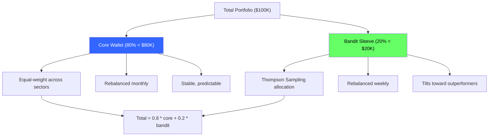
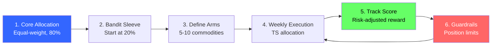
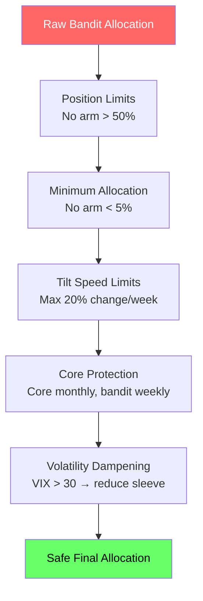
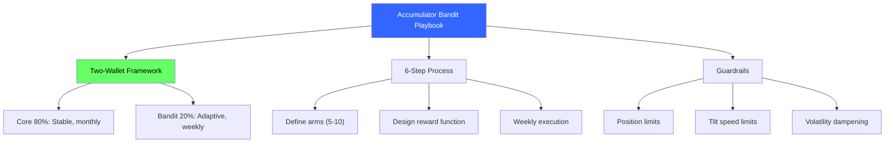

<!-- _class: lead -->

# Accumulator Bandit Playbook

## Module 5: Commodity Trading Bandits
### Multi-Armed Bandits for Commodity Trading

<!-- Speaker notes: This deck covers Accumulator Bandit Playbook. Set the context for the audience and explain how this topic fits into the broader course on multi-armed bandits for commodity trading. -->
---

## In Brief

A 6-step system for bandit-based commodity allocation. Separate stable core holdings from an adaptive bandit sleeve.

> Don't use bandits to predict prices. Use them to **allocate contributions under uncertainty**.

**The Two-Wallet Framework:**

| Wallet | % | Behavior | Rebalance |
|--------|---|----------|-----------|
| Core | 80% | Equal-weight, stable | Monthly |
| Bandit Sleeve | 20% | Thompson Sampling, adaptive | Weekly |

<!-- Speaker notes: This opening summary sets the context for the entire deck. Read the key quote aloud and pause to let it sink in. The goal is to establish the core problem or concept before diving into details. -->
---

## Two-Wallet Architecture



<!-- Speaker notes: The diagram on Two-Wallet Architecture illustrates the key relationships visually. Walk through the flow step by step, pointing out decision points and outcomes. Visual representations like this help students build mental models of the concepts. -->
---

## The 6-Step Playbook



<!-- Speaker notes: The diagram on The 6-Step Playbook illustrates the key relationships visually. Walk through the flow step by step, pointing out decision points and outcomes. Visual representations like this help students build mental models of the concepts. -->
---

## Formal Definition

**Total portfolio weight at time $t$:**

$$w_{\text{total}}(t) = C \cdot w_{\text{core}} + B \cdot w_{\text{bandit}}(t)$$

**Accumulator Objective:**

$$\max \sum_t \left[ r(t) - \lambda \cdot \sigma(t) \right]$$

**Subject to guardrails:**
- Position limits: $w_i(t) \leq w_{\max}$
- Tilt speed: $|w_i(t) - w_i(t-1)| \leq \Delta_{\max}$
- Minimum allocation: $w_i(t) \geq w_{\min} > 0$

<!-- Speaker notes: This is the formal mathematical treatment. Walk through each symbol and equation carefully, connecting back to the intuitive explanation from the previous slides. Do not rush this slide -- pause after each equation to ensure comprehension. -->
---

## Step 1-3: Core, Sleeve, and Arms

<div class="columns">
<div>

### Core Allocation
- Equal-weight across sectors
- Or strategic based on fundamentals
- Rebalanced monthly (not weekly)

### Bandit Sleeve Size
- Conservative: 10-15%
- Moderate: 20-25%
- Aggressive: 30-40%

</div>
<div>

### Arm Definitions (5-10)
```python
# Broad sectors
arms = ['Energy', 'Metals',
        'Grains', 'Softs',
        'Livestock']

# Granular commodities
arms = ['WTI', 'Gold', 'Copper',
        'NatGas', 'Corn',
        'Soybeans', 'Coffee',
        'Cattle']
```

</div>
</div>

<!-- Speaker notes: This code example for Step 1-3: Core, Sleeve, and Arms is production-ready. Walk through the implementation, noting any important design patterns or potential modifications for different use cases. -->
---

## Step 4-5: Execution and Scoring

**Weekly Execution:**
1. Core wallet: Execute planned contributions (equal-weight)
2. Bandit sleeve: Get weights from Thompson Sampling
3. Execute trades to match target
4. End of week: Calculate returns, update beliefs

**Reward Function Matching:**

| Goal | Reward Function |
|------|----------------|
| Accumulate steadily | Sharpe ratio |
| Minimize regret | Return vs best arm |
| Hold comfortably | Return - $\lambda$ * max_drawdown |
| Align with thesis | Return - $\lambda$ * deviation |

<!-- Speaker notes: This comparison table on Step 4-5: Execution and Scoring is a key reference. Walk through each row, highlighting the most important distinctions. Students should understand when to use each option based on the criteria shown. -->
---

## Code: Two-Wallet Bandit

```python
class TwoWalletBandit:
    def __init__(self, arms, core_pct=0.8, bandit_pct=0.2,
                 prior_mean=0.001, prior_std=0.02,
                 min_allocation=0.05, max_allocation=0.50):
        self.arms = arms
        self.K = len(arms)
        self.core_pct = core_pct
        self.bandit_pct = bandit_pct
        self.means = np.full(self.K, prior_mean)
        self.stds = np.full(self.K, prior_std)
        self.n = np.zeros(self.K)
        self.min_alloc = min_allocation
        self.max_alloc = max_allocation
```

<!-- Speaker notes: Walk through the code line by line. Highlight the key design decisions and explain why each parameter or function call matters. This code is copy-paste ready -- students can use it directly in their own projects. -->
---

## Code: Allocation and Update

```python
    def get_bandit_weights(self):
        samples = np.random.normal(self.means, self.stds)
        exp_samples = np.exp(samples - samples.max())
        weights = exp_samples / exp_samples.sum()
        weights = np.clip(weights, self.min_alloc, self.max_alloc)
        return weights / weights.sum()

    def get_total_weights(self):
        w_core = np.ones(self.K) / self.K
        w_bandit = self.get_bandit_weights()
        return self.core_pct * w_core + self.bandit_pct * w_bandit
```

<!-- Speaker notes: Code continues on the next slide. This first part sets up the structure. -->

---

## Code: Allocation and Update (continued)

```python
    def update(self, returns):
        for i in range(self.K):
            self.n[i] += 1
            lr = 1 / (self.n[i] + 1)
            self.means[i] = (1 - lr) * self.means[i] + lr * returns[i]
            self.stds[i] = self.stds[i] / np.sqrt(1 + self.n[i])
```

<!-- Speaker notes: Walk through the code line by line. Highlight the key design decisions and explain why each parameter or function call matters. This code is copy-paste ready -- students can use it directly in their own projects. -->
---

## Step 6: Hard Guardrails



<!-- Speaker notes: The diagram on Step 6: Hard Guardrails illustrates the key relationships visually. Walk through the flow step by step, pointing out decision points and outcomes. Visual representations like this help students build mental models of the concepts. -->
---

<!-- _class: lead -->

# Common Pitfalls

<!-- Speaker notes: Transition slide for the Common Pitfalls section. Pause briefly to let the audience absorb the previous content before moving into this new topic area. -->
---

## Five Key Pitfalls

| Pitfall | What Happens | Fix |
|---------|-------------|-----|
| Raw returns as reward | Trend-chases, buys high | Risk-adjusted rewards |
| No minimum allocation | Zeros out arms after 1 bad week | min_allocation >= 5% |
| Bandit sleeve too large | Portfolio becomes HFT machine | Start with 20% or less |
| No core wallet | Extreme concentration, wild swings | Always 60-80% in core |
| Ignoring transaction costs | Gains eaten by spreads | Add turnover penalty |

<!-- Speaker notes: Walk through Five Key Pitfalls carefully. Emphasize why this mistake is common and how to recognize it in practice. The commodity trading example makes it concrete -- ask if anyone has encountered this in their own work. -->
---

## Connections

<div class="columns">
<div>

### Builds On
- **Module 1:** Thompson Sampling
- **Module 2:** Regret analysis
- **Module 3:** Contextual bandits

</div>
<div>

### Leads To
- **Module 6:** Bandits vs A/B testing
- **Project 2:** Build your own system
- **Bayesian Forecasting:** Enhanced regime detection

</div>
</div>

<!-- Speaker notes: The connections section shows how this topic links to the rest of the course. Highlight the 'Builds On' prerequisites to remind students of what they should already know, and use 'Leads To' to create anticipation for upcoming modules. -->
---

## Visual Summary



<!-- Speaker notes: This visual summary captures the key relationships from the entire deck. Walk through each branch of the diagram, connecting back to the main concepts covered. This slide works well as a reference -- encourage students to screenshot it for later review. -->