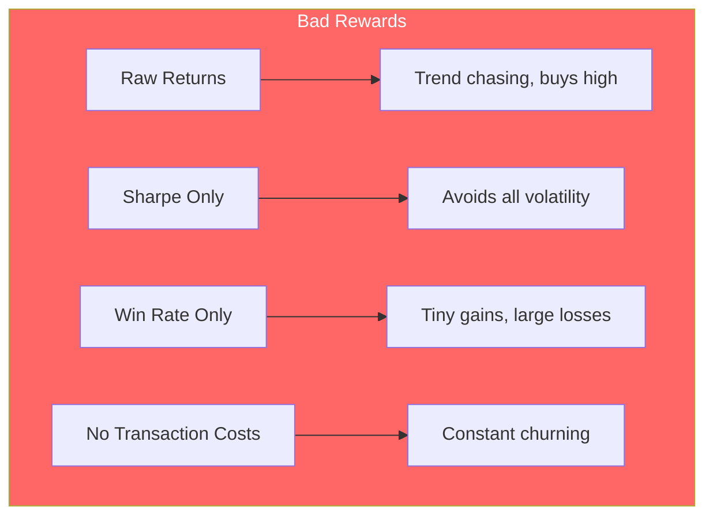
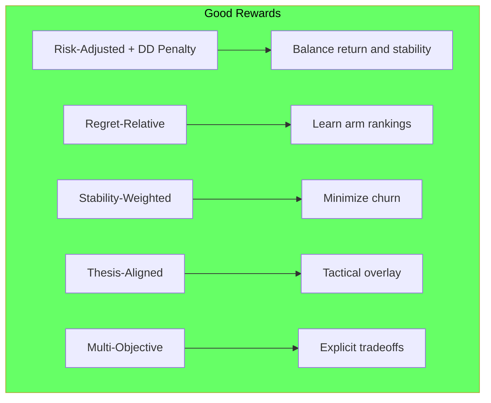
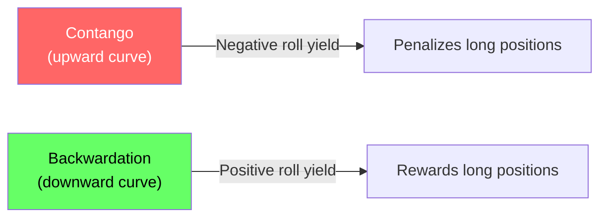
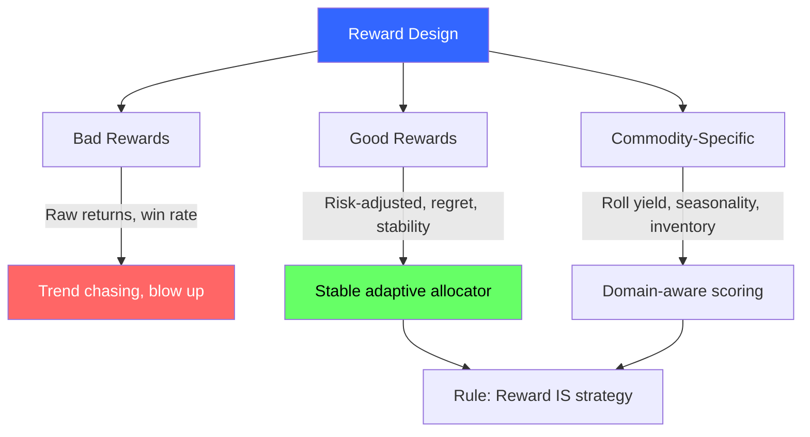

<!-- _class: lead -->

# Reward Design for Commodities

## Module 5: Commodity Trading Bandits
### Multi-Armed Bandits for Commodity Trading

<!-- Speaker notes: This deck covers Reward Design for Commodities. Set the context for the audience and explain how this topic fits into the broader course on multi-armed bandits for commodity trading. -->
---

## In Brief

Your reward function is the most important decision in bandit-based trading. It defines what "success" means.

> **Your reward function IS your trading strategy.** Choose poorly and you train a system that sabotages your real goals.

<!-- Speaker notes: This opening summary sets the context for the entire deck. Read the key quote aloud and pause to let it sink in. The goal is to establish the core problem or concept before diving into details. -->
---

## Bad Rewards and What They Train



> **Rule:** Avoid raw returns in risk-managed settings. Exception: risk-neutral contexts with very short horizons where simplicity outweighs accuracy.

<!-- Speaker notes: The diagram on Bad Rewards and What They Train illustrates the key relationships visually. Walk through the flow step by step, pointing out decision points and outcomes. Visual representations like this help students build mental models of the concepts. -->
---

## Bad Reward 1: Raw Returns

```python
def naive_reward(returns):
    return returns  # This is a disaster
```

**What happens:**
- Week 1: WTI +5%, Gold -2% -> Allocate 80% to WTI
- Week 2: WTI -8% (mean reversion) -> Lose big
- Week 3: Pivot to Gold (recovering) -> Always late, always wrong

> Classic "buy high, sell low" behavior.

<!-- Speaker notes: This code example for Bad Reward 1: Raw Returns is production-ready. Walk through the implementation, noting any important design patterns or potential modifications for different use cases. -->
---

## Good Reward Designs



<!-- Speaker notes: The diagram on Good Reward Designs illustrates the key relationships visually. Walk through the flow step by step, pointing out decision points and outcomes. Visual representations like this help students build mental models of the concepts. -->
---

## Good Reward 1: Risk-Adjusted with Drawdown Penalty

```python
def risk_adjusted_reward(returns, volatility, drawdown, lambda_dd=2.0):
    sharpe = returns.mean() / (volatility + 1e-6)
    dd_penalty = lambda_dd * abs(drawdown)
    return sharpe - dd_penalty
```

**Example:**
- WTI: +2% avg, 5% vol, -3% DD -> Reward = 0.34
- NatGas: +3% avg, 12% vol, -15% DD -> Reward = -0.05

> Prefers WTI despite lower raw returns (smoother path).

<!-- Speaker notes: This code example for Good Reward 1: Risk-Adjusted with Drawdown Penalty is production-ready. Walk through the implementation, noting any important design patterns or potential modifications for different use cases. -->
---

## Good Reward 2: Regret-Relative

```python
def regret_relative_reward(arm_returns, all_arm_returns):
    best_possible = all_arm_returns.max()
    regret = best_possible - arm_returns
    return -regret  # Minimize regret
```

**What it trains:** Learn which arms are consistently good. Balance exploration with exploitation.

<!-- Speaker notes: This code example for Good Reward 2: Regret-Relative is production-ready. Walk through the implementation, noting any important design patterns or potential modifications for different use cases. -->
---

## Good Reward 3: Stability-Weighted

```python
def stability_weighted_reward(returns, allocation_change, lambda_churn=1.0):
    return returns - lambda_churn * allocation_change
```

**Good Reward 4: Thesis-Aligned**

```python
def thesis_aligned_reward(returns, allocation, strategic_weights,
                          lambda_alignment=0.5):
    alignment_penalty = np.linalg.norm(allocation - strategic_weights)
    return returns - lambda_alignment * alignment_penalty
```

<!-- Speaker notes: This code example for Good Reward 3: Stability-Weighted is production-ready. Walk through the implementation, noting any important design patterns or potential modifications for different use cases. -->
---

## Reward Comparison Summary

| Reward Type | Formula | Use When |
|-------------|---------|----------|
| **Raw Returns** | $r_t$ | Rarely -- only risk-neutral, short-horizon |
| **Sharpe** | $r / \sigma$ | Minimize vol goal |
| **Risk-Adjusted** | $r / \sigma - \lambda \cdot DD$ | General accumulation |
| **Regret-Relative** | $r - r_{\text{best}}$ | Relative performance |
| **Stability** | $r - \lambda \cdot \text{turnover}$ | Tax/cost sensitive |
| **Thesis** | $r - \lambda \cdot \|w - w_s\|$ | Strategic overlay |

<!-- Speaker notes: This comparison table on Reward Comparison Summary is a key reference. Walk through each row, highlighting the most important distinctions. Students should understand when to use each option based on the criteria shown. -->
---

## Commodity-Specific: Contango/Backwardation

```python
def commodity_adjusted_reward(spot_returns, roll_yield, volatility):
    total_returns = spot_returns + roll_yield
    return total_returns / (volatility + 1e-6)
```



> Ignoring roll yield overweights contango commodities (bad).

<!-- Speaker notes: The diagram on Commodity-Specific: Contango/Backwardation illustrates the key relationships visually. Walk through the flow step by step, pointing out decision points and outcomes. Visual representations like this help students build mental models of the concepts. -->
---

## Commodity-Specific: Seasonality

```python
def seasonal_adjusted_reward(returns, month, commodity, seasonal_patterns):
    expected = seasonal_patterns[commodity][month]
    surprise = returns - expected
    return surprise  # Reward beating seasonal expectation
```

**Key patterns:**
- Corn: Strong Apr-Aug (growing season risk)
- NatGas: Strong Nov-Feb (heating demand)
- WTI: Strong May-Aug (driving season)

> Rewarding absolute returns ignores seasonal context.

<!-- Speaker notes: This code example for Commodity-Specific: Seasonality is production-ready. Walk through the implementation, noting any important design patterns or potential modifications for different use cases. -->
---

## Multi-Objective Reward

```python
def multi_objective_reward(returns, volatility, drawdown, turnover,
                           weights=(0.4, 0.3, 0.2, 0.1)):
    w_ret, w_vol, w_dd, w_turn = weights
    return_score = returns / 0.10
    vol_score = max(0, 1 - volatility / 0.20)
    dd_score = max(0, 1 - abs(drawdown) / 0.15)
    turnover_score = max(0, 1 - turnover / 0.30)
    return (w_ret * return_score + w_vol * vol_score +
            w_dd * dd_score + w_turn * turnover_score)
```

> Explicit tradeoff between competing objectives.

<!-- Speaker notes: This code example for Multi-Objective Reward is production-ready. Walk through the implementation, noting any important design patterns or potential modifications for different use cases. -->
---

## Reward Design Checklist

- [ ] **Aligned with goal:** Measures what you actually want?
- [ ] **Bounded:** No extreme values causing numerical issues?
- [ ] **Stationary:** Consistent scale over time?
- [ ] **Observable:** Computable from available data?
- [ ] **Actionable:** Bandit can influence this metric?
- [ ] **Robust:** Handles outliers and missing data?
- [ ] **Interpretable:** Explainable to stakeholders?

<!-- Speaker notes: This checklist is a practical tool for real-world application. Suggest students save or print this for reference when implementing their own systems. Walk through each item briefly, explaining why it matters. -->
---

<!-- _class: lead -->

# Common Pitfalls

<!-- Speaker notes: Transition slide for the Common Pitfalls section. Pause briefly to let the audience absorb the previous content before moving into this new topic area. -->
---

## Four Key Pitfalls

| Pitfall | Example | Fix |
|---------|---------|-----|
| Reward-goal mismatch | Goal: steady accum, reward: max returns | Write goal first, design reward to match |
| Overfitting to recent data | Designed for trending market, regime shifts | Regime-aware contextual bandits |
| Ignoring non-stationarity | Same reward scale for VIX 15 vs VIX 30 | Normalize by recent volatility |
| Too many objectives | 7+ objectives at once | Pick 2-3 primary, constrain the rest |

<!-- Speaker notes: Walk through Four Key Pitfalls carefully. Emphasize why this mistake is common and how to recognize it in practice. The commodity trading example makes it concrete -- ask if anyone has encountered this in their own work. -->
---

## Connections

<div class="columns">
<div>

### Builds On
- **Module 2:** Regret analysis
- **Bayesian statistics:** Prior beliefs

</div>
<div>

### Leads To
- **Module 4:** Regime-dependent rewards
- **Guardrails Guide:** Constraints that complement rewards
- **Portfolio optimization:** MPT objectives

</div>
</div>

<!-- Speaker notes: The connections section shows how this topic links to the rest of the course. Highlight the 'Builds On' prerequisites to remind students of what they should already know, and use 'Leads To' to create anticipation for upcoming modules. -->
---

## Visual Summary



<!-- Speaker notes: This visual summary captures the key relationships from the entire deck. Walk through each branch of the diagram, connecting back to the main concepts covered. This slide works well as a reference -- encourage students to screenshot it for later review. -->