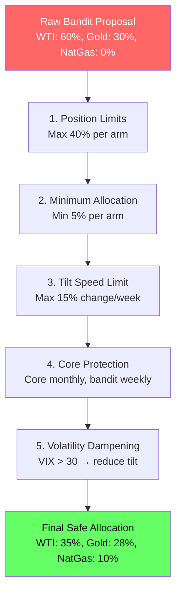
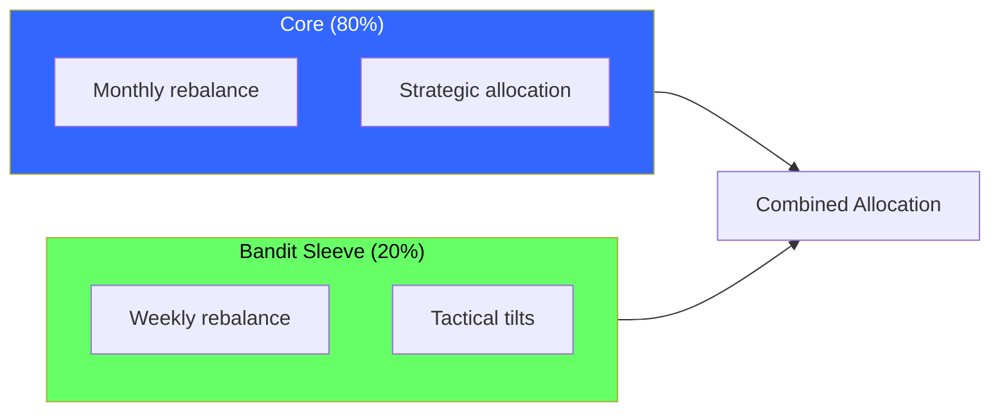
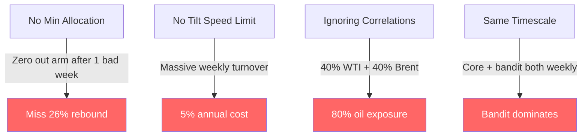
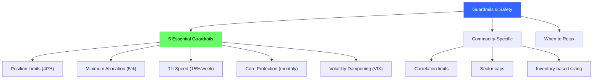

<!-- _class: lead -->

# Guardrails and Safety

## Module 5: Commodity Trading Bandits
### Multi-Armed Bandits for Commodity Trading

<!-- Speaker notes: This deck covers Guardrails and Safety. Set the context for the audience and explain how this topic fits into the broader course on multi-armed bandits for commodity trading. -->
---

## In Brief

Bandit algorithms without constraints become dangerous optimization machines.

> **Without guardrails, bandit investing becomes a dopamine machine.**

A pure bandit will:
- Concentrate in the recent winner (concentration risk)
- Abandon arms after one bad result
- Rebalance constantly (transaction cost explosion)
- Ignore regime changes

<!-- Speaker notes: This opening summary sets the context for the entire deck. Read the key quote aloud and pause to let it sink in. The goal is to establish the core problem or concept before diving into details. -->
---

## Guardrail Checkpoint Flow



<!-- Speaker notes: The diagram on Guardrail Checkpoint Flow illustrates the key relationships visually. Walk through the flow step by step, pointing out decision points and outcomes. Visual representations like this help students build mental models of the concepts. -->
---

## Guardrail 1: Position Limits

**Purpose:** Prevent concentration risk.

```python
def apply_position_limits(weights, max_weight=0.40):
    weights = np.clip(weights, 0, max_weight)
    return weights / weights.sum()
```

| Setting | Max Weight | Use Case |
|---------|-----------|----------|
| Conservative | 30% | Risk-averse portfolios |
| Moderate | 40% | General use |
| Aggressive | 50% | High-conviction strategies |

<!-- Speaker notes: This code example for Guardrail 1: Position Limits is production-ready. Walk through the implementation, noting any important design patterns or potential modifications for different use cases. -->
---

## Guardrail 2: Minimum Allocation

**Purpose:** Prevent premature abandonment of arms.

```python
def apply_minimum_allocation(weights, min_weight=0.05):
    weights = np.maximum(weights, min_weight)
    return weights / weights.sum()
```

> Sample size of one week is insufficient to judge an arm. Volatility != bad arm.

<!-- Speaker notes: This code example for Guardrail 2: Minimum Allocation is production-ready. Walk through the implementation, noting any important design patterns or potential modifications for different use cases. -->
---

## Guardrail 3: Tilt Speed Limits

**Purpose:** Prevent excessive portfolio turnover.

```python
def apply_tilt_speed_limit(new_weights, old_weights, max_change=0.15):
    change = new_weights - old_weights
    clipped_change = np.clip(change, -max_change, max_change)
    adjusted = old_weights + clipped_change
    return adjusted / adjusted.sum()
```

> Without speed limits: weekly rebalancing = ~5% annual transaction cost.

<!-- Speaker notes: This code example for Guardrail 3: Tilt Speed Limits is production-ready. Walk through the implementation, noting any important design patterns or potential modifications for different use cases. -->
---

## Guardrail 4: Core Protection

**Purpose:** Separate strategic from tactical allocation.



> Different timescales prevent bandit from dominating.

<!-- Speaker notes: The diagram on Guardrail 4: Core Protection illustrates the key relationships visually. Walk through the flow step by step, pointing out decision points and outcomes. Visual representations like this help students build mental models of the concepts. -->
---

## Guardrail 5: Volatility Dampening

**Purpose:** Reduce tilt aggressiveness in high-vol regimes.

```python
def apply_volatility_dampening(bandit_weights, core_weights,
                                current_vix, vix_threshold=30,
                                dampening_factor=0.5):
    if current_vix > vix_threshold:
        return (dampening_factor * bandit_weights +
                (1 - dampening_factor) * core_weights)
    return bandit_weights
```

| VIX Range | Action |
|-----------|--------|
| < 20 | Normal operation |
| 20-30 | Light dampening (0.7) |
| 30-40 | Heavy dampening (0.5) |
| > 40 | Crisis: revert to core |

<!-- Speaker notes: This code example for Guardrail 5: Volatility Dampening is production-ready. Walk through the implementation, noting any important design patterns or potential modifications for different use cases. -->
---

## Commodity-Specific Guardrails

<div class="columns">
<div>

### Correlation Limits
```python
# WTI + Brent corr = 95%
# Don't allow 40% + 40% = 80% oil
# Cap combined at 50%
```

</div>
<div>

### Sector Exposure Caps
```python
# Max 50% in any sector:
# Energy: WTI, Brent, NatGas
# Metals: Gold, Silver, Copper
# Grains: Corn, Soybeans, Wheat
```

</div>
</div>

### Inventory-Based Position Sizing
- Low inventory (< 20th pct): Allow full weight (bullish)
- High inventory (> 80th pct): Reduce weight by 30% (bearish)

<!-- Speaker notes: This code example for Commodity-Specific Guardrails is production-ready. Walk through the implementation, noting any important design patterns or potential modifications for different use cases. -->
---

## Complete Guardrail System

```python
class GuardrailSystem:
    def __init__(self, max_position=0.40, min_position=0.05,
                 max_tilt_speed=0.15, vix_threshold=30):
        self.max_pos = max_position
        self.min_pos = min_position
        self.max_speed = max_tilt_speed
        self.vix_threshold = vix_threshold
```

<!-- Speaker notes: Code continues on the next slide. This first part sets up the structure. -->

---

## Complete Guardrail System (continued)

```python
    def apply_all(self, proposed, core, vix, old_weights=None):
        w = proposed.copy()
        if vix > self.vix_threshold:  # Dampening
            w = 0.5 * w + 0.5 * core
        w = np.clip(w, 0, self.max_pos)           # Position limits
        w = np.maximum(w / w.sum(), self.min_pos)  # Min allocation
        w = w / w.sum()
        if old_weights is not None:                # Speed limits
            change = np.clip(w - old_weights,
                           -self.max_speed, self.max_speed)
            w = old_weights + change
        return w / w.sum()
```

<!-- Speaker notes: This code example for Complete Guardrail System is production-ready. Walk through the implementation, noting any important design patterns or potential modifications for different use cases. -->
---

## Guardrail Parameters

| Guardrail | Conservative | Moderate | Aggressive |
|-----------|-------------|----------|------------|
| Max Position | 30% | 40% | 50% |
| Min Position | 10% | 5% | 2% |
| Max Tilt Speed | 10% | 15% | 25% |
| Core % | 85% | 80% | 70% |
| Bandit % | 15% | 20% | 30% |
| VIX Threshold | 25 | 30 | 35 |

> **Start conservative, loosen after validating.**

<!-- Speaker notes: This comparison table on Guardrail Parameters is a key reference. Walk through each row, highlighting the most important distinctions. Students should understand when to use each option based on the criteria shown. -->
---

<!-- _class: lead -->

# Common Pitfalls

<!-- Speaker notes: Transition slide for the Common Pitfalls section. Pause briefly to let the audience absorb the previous content before moving into this new topic area. -->
---

## Guardrail Pitfalls



<!-- Speaker notes: Walk through Guardrail Pitfalls carefully. Emphasize why this mistake is common and how to recognize it in practice. The commodity trading example makes it concrete -- ask if anyone has encountered this in their own work. -->
---

## When to Relax Guardrails

| Scenario | What to Relax | Keep Tight |
|----------|--------------|------------|
| High conviction | Position limits (40% -> 50%) | Everything else |
| Low volatility (VIX < 15) | Tilt speed (15% -> 20%) | Position limits |
| Long time horizon (12+ months) | Volatility dampening | Position + sector limits |

**Never relax:**
- Minimum allocation (always maintain exploration)
- Sector limits (concentration risk is structural)

<!-- Speaker notes: This comparison table on When to Relax Guardrails is a key reference. Walk through each row, highlighting the most important distinctions. Students should understand when to use each option based on the criteria shown. -->
---

## Connections

<div class="columns">
<div>

### Builds On
- **Module 1:** Thompson Sampling
- **Reward Design:** Constraints complement rewards

</div>
<div>

### Leads To
- **Production deployment:** Makes bandits production-safe
- **Risk management:** Integration with risk frameworks

</div>
</div>

<!-- Speaker notes: The connections section shows how this topic links to the rest of the course. Highlight the 'Builds On' prerequisites to remind students of what they should already know, and use 'Leads To' to create anticipation for upcoming modules. -->
---

## Visual Summary



<!-- Speaker notes: This visual summary captures the key relationships from the entire deck. Walk through each branch of the diagram, connecting back to the main concepts covered. This slide works well as a reference -- encourage students to screenshot it for later review. -->