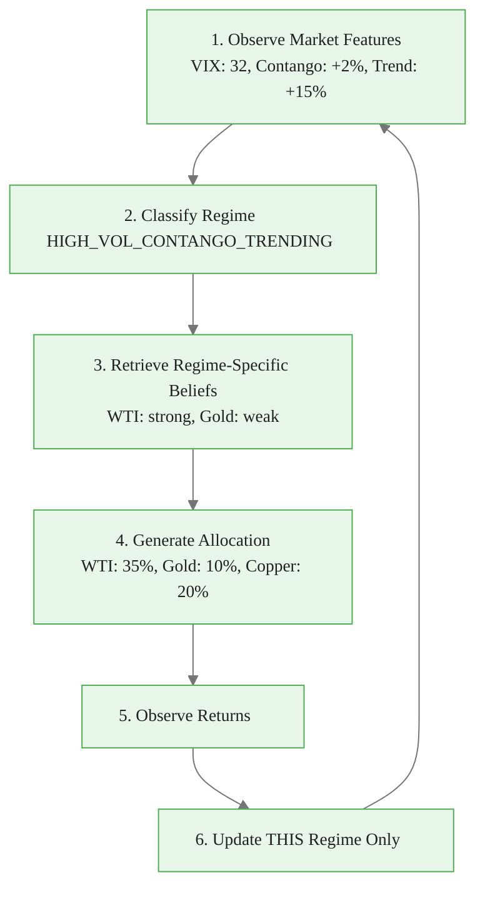
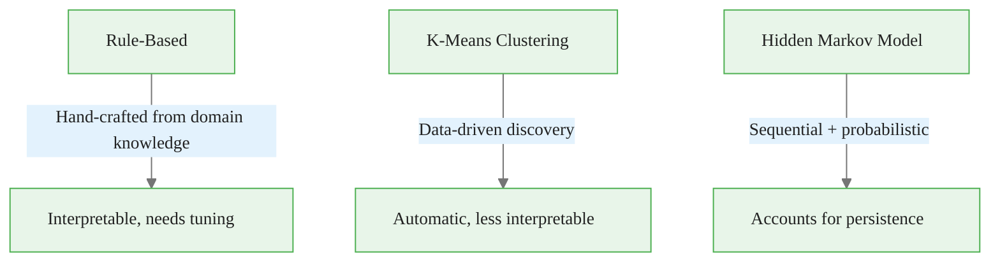
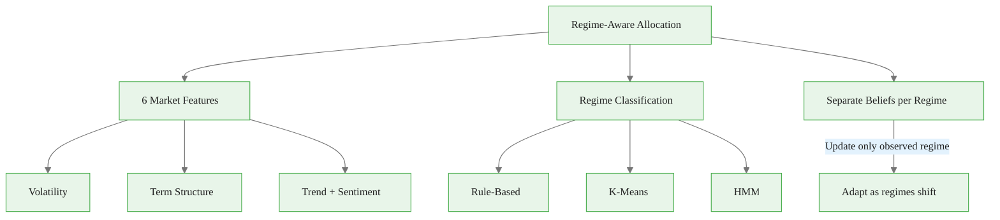

<!-- _class: lead -->

# Regime-Aware Allocation

## Module 5: Commodity Trading Bandits
### Multi-Armed Bandits for Commodity Trading

<!-- Speaker notes: This deck covers Regime-Aware Allocation. Set the context for the audience and explain how this topic fits into the broader course on multi-armed bandits for commodity trading. -->
---

## In Brief

Market regimes change. A bandit optimized for trending markets fails in mean-reverting regimes.

> **Market regimes are contexts. Contextual bandits learn regime-dependent strategies.**

Instead of one universal allocation:
- Allocation for high-volatility regimes
- Allocation for contango vs backwardation
- Allocation for risk-on vs risk-off

<!-- Speaker notes: This opening summary sets the context for the entire deck. Read the key quote aloud and pause to let it sink in. The goal is to establish the core problem or concept before diving into details. -->

<div class="callout-key">

Bandits learn AND earn simultaneously -- the core advantage over traditional A/B testing.

</div>

---

## Regime-Aware Bandit Flow



<!-- Speaker notes: The diagram on Regime-Aware Bandit Flow illustrates the key relationships visually. Walk through the flow step by step, pointing out decision points and outcomes. Visual representations like this help students build mental models of the concepts. -->

<div class="callout-insight">

**Insight:** The exploration-exploitation tradeoff is not a fixed ratio -- it should adapt as uncertainty decreases over time.

</div>

---

## Context Vector: 6 Regime Features

| Feature | Computation | Regimes |
|---------|------------|---------|
| Realized Volatility | 20-day rolling std * sqrt(252) | Low/Med/High |
| Term Structure | (back - front) / front | Contango/Backwardation |
| Trend Strength | (fast MA - slow MA) / slow MA | Up/Neutral/Down |
| Risk Sentiment | S&P returns - (VIX-20)/100 | Risk-on/Risk-off |
| Seasonality | Month-based patterns | Commodity-specific |
| Inventory | Percentile of historical | Low/Normal/High |

<!-- Speaker notes: This comparison table on Context Vector: 6 Regime Features is a key reference. Walk through each row, highlighting the most important distinctions. Students should understand when to use each option based on the criteria shown. -->

<div class="callout-warning">

**Warning:** Non-stationary reward distributions violate bandit assumptions. Always implement change detection in production systems.

</div>

---

## Feature Engineering Recipes

<div class="code-window">
<div class="code-header">
<div class="dots"><span class="dot-red"></span><span class="dot-yellow"></span><span class="dot-green"></span></div>
<span class="filename">example.py</span>
</div>

```python
# 1. Realized Volatility
vol = returns.rolling(20).std() * np.sqrt(252)

# 2. Term Structure Slope
ts_slope = (back_month - front_month) / front_month

# 3. Trend Strength
trend = (prices.rolling(20).mean() - prices.rolling(50).mean()) \
        / prices.rolling(50).mean()

# 4. Risk Sentiment
sentiment = sp500.rolling(5).mean() - (vix - 20) / 100

# 5. Seasonal Indicator
seasonal = seasonal_patterns[commodity][date.month]
```

</div>

<!-- Speaker notes: This code example for Feature Engineering Recipes is production-ready. Walk through the implementation, noting any important design patterns or potential modifications for different use cases. -->

<div class="callout-info">

**Info:** The regret of the best bandit algorithms grows logarithmically with time, compared to linearly for A/B testing.

</div>

---

## Formal Definition

At each time $t$:

1. Observe context $x_t \in \mathcal{X}$ (market regime features)
2. Choose allocation $a_t$ from arms $\{1, \ldots, K\}$
3. Receive reward $r_t(a_t, x_t)$
4. Update beliefs $\theta(x_t)$ for observed context **only**

**Contextual Thompson Sampling:**

$$\tilde{\theta}_k \sim N(\mu_k(x_t), \sigma_k(x_t)^2)$$
$$a_t = \arg\max_k \tilde{\theta}_k$$

> Different regime = different posterior = different allocation.

<!-- Speaker notes: This is the formal mathematical treatment. Walk through each symbol and equation carefully, connecting back to the intuitive explanation from the previous slides. Do not rush this slide -- pause after each equation to ensure comprehension. -->
---

## Regime Classification Strategies



<!-- Speaker notes: The diagram on Regime Classification Strategies illustrates the key relationships visually. Walk through the flow step by step, pointing out decision points and outcomes. Visual representations like this help students build mental models of the concepts. -->
---

## Simple Rule-Based Classifier

<div class="code-window">
<div class="code-header">
<div class="dots"><span class="dot-red"></span><span class="dot-yellow"></span><span class="dot-green"></span></div>
<span class="filename">example.py</span>
</div>

```python
def classify_regime(features):
    vol = features['volatility']
    trend = features['trend']

    if vol > 0.25:
        vol_state = 'HIGH_VOL'
    elif vol < 0.15:
        vol_state = 'LOW_VOL'
    else:
        vol_state = 'MED_VOL'
```

</div>

<!-- Speaker notes: Code continues on the next slide. This first part sets up the structure. -->

---

## Simple Rule-Based Classifier (continued)

```python
    if trend > 0.10:
        trend_state = 'UPTREND'
    elif trend < -0.10:
        trend_state = 'DOWNTREND'
    else:
        trend_state = 'NEUTRAL'

    return f"{vol_state}_{trend_state}"
```

<!-- Speaker notes: This code example for Simple Rule-Based Classifier is production-ready. Walk through the implementation, noting any important design patterns or potential modifications for different use cases. -->
---

## Code: Regime-Aware Bandit

```python
class RegimeAwareBandit:
    def __init__(self, arms, classifier, prior_mean=0.001, prior_std=0.02):
        self.arms = arms
        self.K = len(arms)
        self.classifier = classifier
        self.regime_beliefs = defaultdict(
            lambda: {i: {'mean': prior_mean, 'std': prior_std, 'count': 0}
                     for i in range(self.K)}
        )
```

<!-- Speaker notes: Code continues on the next slide. This first part sets up the structure. -->

---

## Code: Regime-Aware Bandit (continued)

```python
    def get_allocation(self, features):
        regime = self.classifier(features)
        beliefs = self.regime_beliefs[regime]
        samples = np.array([
            np.random.normal(beliefs[i]['mean'], beliefs[i]['std'])
            for i in range(self.K)
        ])
        exp_samples = np.exp(samples - samples.max())
        weights = exp_samples / exp_samples.sum()
        return weights, regime
```

<!-- Speaker notes: Walk through the code line by line. Highlight the key design decisions and explain why each parameter or function call matters. This code is copy-paste ready -- students can use it directly in their own projects. -->
---

## Regime-Dependent Commodity Performance

<div class="columns">
<div>

### LOW_VOL_UPTREND (2017-18)
- Best: WTI (momentum), Copper (growth)
- Worst: Gold (no fear demand)

### HIGH_VOL_DOWNTREND (COVID 2020)
- Best: Gold (safe haven), Grains
- Worst: WTI (-37$/barrel)

</div>
<div>

### BACKWARDATION (2021 reopening)
- Best: WTI (positive roll), Copper
- Worst: NatGas (storage glut)

### STEEP_CONTANGO
- Best: Gold (low roll cost)
- Worst: Energy (negative roll)

</div>
</div>

<!-- Speaker notes: The mathematical treatment of Regime-Dependent Commodity Performance formalizes what we discussed intuitively. Walk through each variable and equation, relating them back to the commodity trading context. Ensure the audience follows the notation before moving on. -->
---

<!-- _class: lead -->

# Common Pitfalls

<!-- Speaker notes: Transition slide for the Common Pitfalls section. Pause briefly to let the audience absorb the previous content before moving into this new topic area. -->
---

## Four Key Pitfalls

| Pitfall | Problem | Fix |
|---------|---------|-----|
| Too many regimes | Each regime undersampled | Start with 3-5 regimes |
| Regime overfitting | Defined by outcomes, not features | Use observable features BEFORE returns |
| Ignoring persistence | Regimes last 4-8 weeks, not 1 | Use HMM or add history feature |
| No fallback | Novel regime = no beliefs | Keep non-contextual bandit as fallback |

<!-- Speaker notes: Walk through Four Key Pitfalls carefully. Emphasize why this mistake is common and how to recognize it in practice. The commodity trading example makes it concrete -- ask if anyone has encountered this in their own work. -->
---

## Connections

<div class="columns">
<div>

### Builds On
- **Module 3:** Contextual bandits (general framework)
- **Module 1:** Thompson Sampling (per-regime)

</div>
<div>

### Leads To
- **HMM course:** Advanced regime detection
- **Bayesian Forecasting:** Enhanced feature engineering
- **State-space models:** Latent dynamics

</div>
</div>

<!-- Speaker notes: The connections section shows how this topic links to the rest of the course. Highlight the 'Builds On' prerequisites to remind students of what they should already know, and use 'Leads To' to create anticipation for upcoming modules. -->
---

## Visual Summary



<!-- Speaker notes: This visual summary captures the key relationships from the entire deck. Walk through each branch of the diagram, connecting back to the main concepts covered. This slide works well as a reference -- encourage students to screenshot it for later review. -->