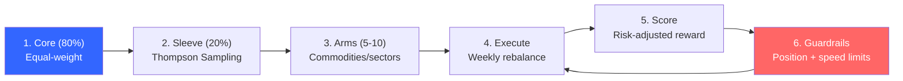
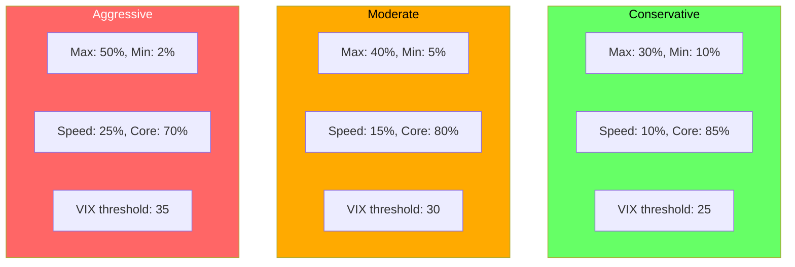
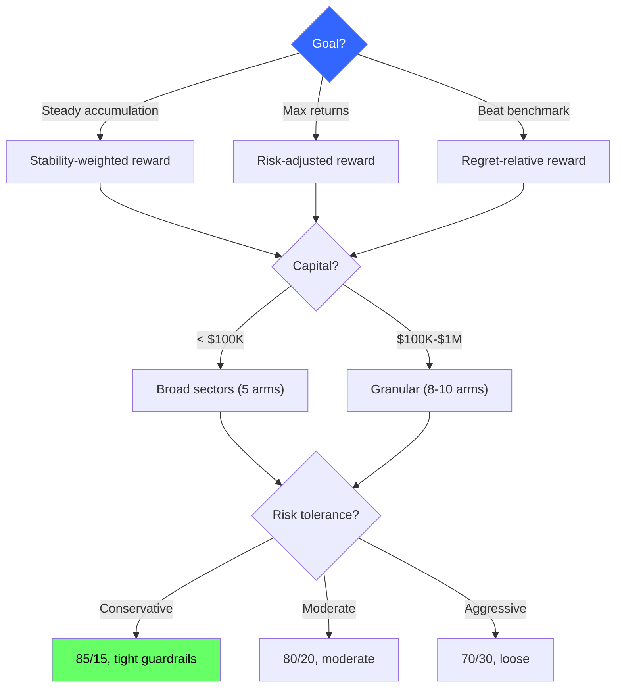
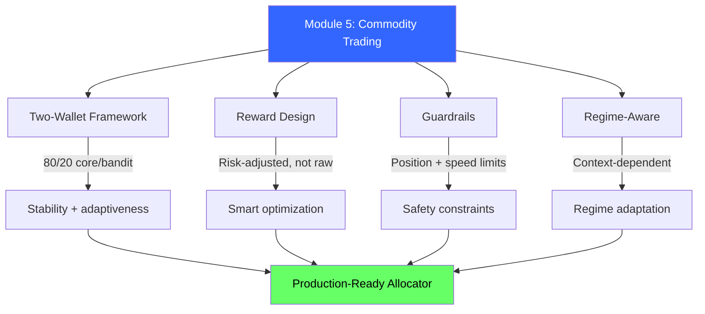

<!-- _class: lead -->

# Commodity Trading Bandits Cheatsheet

## Module 5 Quick Reference
### Multi-Armed Bandits for Commodity Trading

<!-- Speaker notes: This deck covers Commodity Trading Bandits Cheatsheet. Set the context for the audience and explain how this topic fits into the broader course on multi-armed bandits for commodity trading. -->
---

## 6-Step Accumulator Bandit Playbook



<!-- Speaker notes: The diagram on 6-Step Accumulator Bandit Playbook illustrates the key relationships visually. Walk through the flow step by step, pointing out decision points and outcomes. Visual representations like this help students build mental models of the concepts. -->
---

## Two-Wallet Framework

$$w_{\text{total}}(t) = 0.8 \cdot w_{\text{core}} + 0.2 \cdot w_{\text{bandit}}(t)$$

```python
class TwoWalletBandit:
    def __init__(self, K, core_pct=0.8, bandit_pct=0.2):
        self.core = np.ones(K) / K  # Equal-weight
        self.bandit = ThompsonSamplingBandit(K)

    def get_weights(self):
        return (self.core_pct * self.core +
                self.bandit_pct * self.bandit.get_allocation())
```

<!-- Speaker notes: This slide connects theory to implementation for Two-Wallet Framework. Start with the mathematical formulation, then show how each term maps to a line of code. This bridge between theory and practice is one of the most valuable aspects of the course. -->
---

## Reward Function Comparison

| Reward | Formula | Use When |
|--------|---------|----------|
| Raw Returns | $r_t$ | **NEVER** |
| Risk-Adjusted | $r/\sigma - \lambda \cdot DD$ | General accumulation |
| Regret-Relative | $r - r_{\text{best}}$ | Relative performance |
| Stability | $r - \lambda \cdot \text{turnover}$ | Cost-sensitive |
| Thesis-Aligned | $r - \lambda \cdot \|w - w_s\|$ | Strategic overlay |
| Multi-Objective | Weighted combination | Explicit tradeoffs |

> **Your reward IS your strategy.**

<!-- Speaker notes: This comparison table on Reward Function Comparison is a key reference. Walk through each row, highlighting the most important distinctions. Students should understand when to use each option based on the criteria shown. -->
---

## Guardrail Parameters



<!-- Speaker notes: The diagram on Guardrail Parameters illustrates the key relationships visually. Walk through the flow step by step, pointing out decision points and outcomes. Visual representations like this help students build mental models of the concepts. -->
---

## Common Arms

<div class="columns">
<div>

### Broad Sectors (5 arms)
```python
arms = ['Energy', 'Metals',
        'Grains', 'Softs',
        'Livestock']
```

### Strategy Factors
```python
arms = ['Momentum',
        'Mean_Reversion',
        'Carry', 'Seasonality']
```

</div>
<div>

### Granular (8-10 arms)
```python
arms = ['WTI', 'NatGas',
        'Gold', 'Copper',
        'Corn', 'Soybeans',
        'Coffee', 'Cattle']
```

</div>
</div>

<!-- Speaker notes: This code example for Common Arms is production-ready. Walk through the implementation, noting any important design patterns or potential modifications for different use cases. -->
---

## Regime Features Quick Reference

```python
# Volatility: Low (<15%), Med (15-25%), High (>25%)
vol = returns.rolling(20).std() * np.sqrt(252)

# Term Structure: Contango (>0) vs Backwardation (<0)
ts_slope = (back_month - front_month) / front_month

# Trend: Up (>10%), Neutral (-5 to 5%), Down (<-5%)
trend = (ma_20 - ma_50) / ma_50

# Risk Sentiment: On (>0) vs Off (<0)
sentiment = sp500.rolling(5).mean() - (vix - 20) / 100
```

<!-- Speaker notes: This code example for Regime Features Quick Reference is production-ready. Walk through the implementation, noting any important design patterns or potential modifications for different use cases. -->
---

## Decision Flowchart



<!-- Speaker notes: The diagram on Decision Flowchart illustrates the key relationships visually. Walk through the flow step by step, pointing out decision points and outcomes. Visual representations like this help students build mental models of the concepts. -->
---

## Common Pitfalls Checklist

- [ ] Reward = raw returns? -> Change to risk-adjusted
- [ ] No minimum allocation? -> Add 5% min per arm
- [ ] No position limits? -> Add 40% max per arm
- [ ] No tilt speed limit? -> Add 15% max change
- [ ] Pure bandit (no core)? -> Add 60-80% core
- [ ] Too many arms (>15)? -> Reduce to 5-10
- [ ] Ignoring transaction costs? -> Add turnover penalty
- [ ] No volatility dampening? -> Add VIX-based adjustment

<!-- Speaker notes: Walk through Common Pitfalls Checklist carefully. Emphasize why this mistake is common and how to recognize it in practice. The commodity trading example makes it concrete -- ask if anyone has encountered this in their own work. -->
---

## Quick Debugging Guide

| Symptom | Cause | Fix |
|---------|-------|-----|
| Always equal-weight | Bandit % too low | Increase to 20% |
| Extreme concentration | No position limits | Add max_pos=0.40 |
| Constant churning | No speed limit | Add max_speed=0.15 |
| Underperforms benchmark | Wrong reward | Match reward to goal |
| High transaction costs | Too much turnover | Add stability penalty |
| Ignores regime changes | Non-contextual | Add regime features |

<!-- Speaker notes: This comparison table on Quick Debugging Guide is a key reference. Walk through each row, highlighting the most important distinctions. Students should understand when to use each option based on the criteria shown. -->
---

## Visual Summary



<!-- Speaker notes: This visual summary captures the key relationships from the entire deck. Walk through each branch of the diagram, connecting back to the main concepts covered. This slide works well as a reference -- encourage students to screenshot it for later review. -->