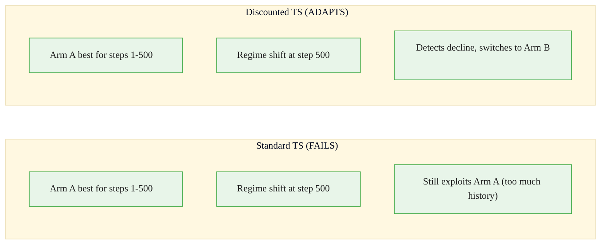
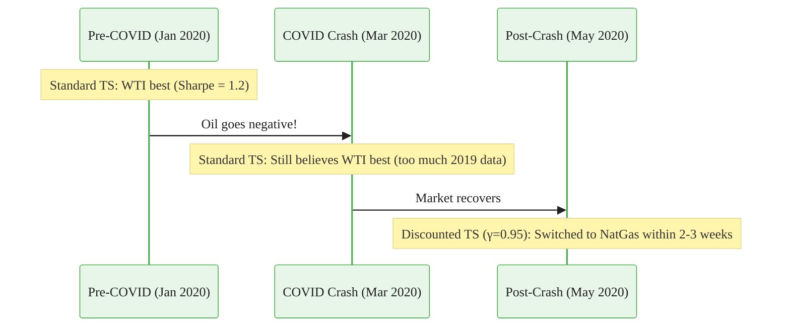
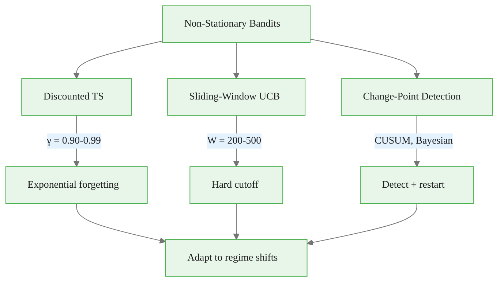

<!-- _class: lead -->

# Non-Stationary Bandits

## Module 6: Advanced Topics
### Multi-Armed Bandits for Commodity Trading

<!-- Speaker notes: This deck covers Non-Stationary Bandits. Set the context for the audience and explain how this topic fits into the broader course on multi-armed bandits for commodity trading. -->
---

## In Brief

Non-stationary bandits handle environments where reward distributions **change over time**.

> The best option today might not be best tomorrow. In commodity trading, regime shifts make non-stationarity the **norm**, not the exception.

**The fix:** Weight recent observations more heavily via discounting or sliding windows.

<!-- Speaker notes: This opening summary sets the context for the entire deck. Read the key quote aloud and pause to let it sink in. The goal is to establish the core problem or concept before diving into details. -->

<div class="callout-key">

Bandits learn AND earn simultaneously -- the core advantage over traditional A/B testing.

</div>

---

## Standard vs Non-Stationary



<!-- Speaker notes: The diagram on Standard vs Non-Stationary illustrates the key relationships visually. Walk through the flow step by step, pointing out decision points and outcomes. Visual representations like this help students build mental models of the concepts. -->

<div class="callout-insight">

**Insight:** The exploration-exploitation tradeoff is not a fixed ratio -- it should adapt as uncertainty decreases over time.

</div>

---

## Two Approaches

<div class="columns">
<div>

### Discounted Thompson Sampling
Exponential forgetting:
$$\alpha_i(t) = 1 + \sum_{s=1}^{t-1} \gamma^{t-s} \cdot r_s \cdot \mathbb{1}(a_s = i)$$

- Yesterday: weight $\gamma^1 \approx 0.95$
- Last week: $\gamma^7 \approx 0.70$
- Last month: $\gamma^{30} \approx 0.21$
- Last year: $\gamma^{365} \approx 0.00$

</div>
<div>

### Sliding-Window UCB
Hard cutoff at $W$ observations:
$$\text{UCB}_i = \hat{\mu}_{i,W} + \sqrt{\frac{2 \ln t}{T_{i,W}}}$$

Only last $W$ pulls count.
- Small $W$: fast adaptation, noisy
- Large $W$: stable, slow adaptation
- Typical: $W = 200\text{-}500$

</div>
</div>

<!-- Speaker notes: The mathematical treatment of Two Approaches formalizes what we discussed intuitively. Walk through each variable and equation, relating them back to the commodity trading context. Ensure the audience follows the notation before moving on. -->

<div class="callout-warning">

**Warning:** Non-stationary reward distributions violate bandit assumptions. Always implement change detection in production systems.

</div>

---

## Discount Factor Tuning

| Regime Duration | $\gamma$ | Half-Life |
|----------------|----------|-----------|
| 10-20 periods | 0.90 | 7 periods |
| 50-100 periods | 0.95 | 14 periods |
| 100-200 periods | 0.97 | 23 periods |
| 200-500 periods | 0.99 | 69 periods |

**Rule of thumb:** $\gamma$ such that $\frac{1}{1-\gamma} \approx$ expected regime duration.

<!-- Speaker notes: This comparison table on Discount Factor Tuning is a key reference. Walk through each row, highlighting the most important distinctions. Students should understand when to use each option based on the criteria shown. -->

<div class="callout-info">

**Info:** The regret of the best bandit algorithms grows logarithmically with time, compared to linearly for A/B testing.

</div>

---

## Code: Discounted Thompson Sampling

<div class="code-window">
<div class="code-header">
<div class="dots"><span class="dot-red"></span><span class="dot-yellow"></span><span class="dot-green"></span></div>
<span class="filename">example.py</span>
</div>

```python
from scipy.stats import beta

class DiscountedThompsonSampling:
    def __init__(self, n_arms, gamma=0.95):
        self.n_arms = n_arms
        self.gamma = gamma
        self.alpha = np.ones(n_arms)
        self.beta_params = np.ones(n_arms)
```

</div>

<!-- Speaker notes: Code continues on the next slide. This first part sets up the structure. -->

---

## Code: Discounted Thompson Sampling (continued)

<div class="code-window">
<div class="code-header">
<div class="dots"><span class="dot-red"></span><span class="dot-yellow"></span><span class="dot-green"></span></div>
<span class="filename">example.py</span>
</div>

```python
    def select_arm(self):
        samples = [beta.rvs(a, b)
                   for a, b in zip(self.alpha, self.beta_params)]
        return np.argmax(samples)

    def update(self, arm, reward):
        self.alpha *= self.gamma       # Discount ALL arms
        self.beta_params *= self.gamma
        self.alpha[arm] += reward       # Update selected arm
        self.beta_params[arm] += (1 - reward)
```

</div>

<!-- Speaker notes: Walk through the code line by line. Highlight the key design decisions and explain why each parameter or function call matters. This code is copy-paste ready -- students can use it directly in their own projects. -->
---

## Code: Sliding-Window UCB

```python
from collections import deque

class SlidingWindowUCB:
    def __init__(self, n_arms, window_size=200):
        self.n_arms = n_arms
        self.window_size = window_size
        self.history = deque(maxlen=window_size)
        self.t = 0
```

<!-- Speaker notes: Code continues on the next slide. This first part sets up the structure. -->

---

## Code: Sliding-Window UCB (continued)

```python
    def select_arm(self):
        self.t += 1
        counts = np.zeros(self.n_arms)
        sums = np.zeros(self.n_arms)
        for arm, reward in self.history:
            counts[arm] += 1
            sums[arm] += reward
        ucb = []
        for i in range(self.n_arms):
            if counts[i] == 0:
                ucb.append(float('inf'))
            else:
                ucb.append(sums[i]/counts[i] +
                          np.sqrt(2*np.log(self.t)/counts[i]))
        return np.argmax(ucb)
```

<!-- Speaker notes: Walk through the code line by line. Highlight the key design decisions and explain why each parameter or function call matters. This code is copy-paste ready -- students can use it directly in their own projects. -->
---

## Commodity Application: COVID Crash



<!-- Speaker notes: The diagram on Commodity Application: COVID Crash illustrates the key relationships visually. Walk through the flow step by step, pointing out decision points and outcomes. Visual representations like this help students build mental models of the concepts. -->
---

<!-- _class: lead -->

# Common Pitfalls

<!-- Speaker notes: Transition slide for the Common Pitfalls section. Pause briefly to let the audience absorb the previous content before moving into this new topic area. -->
---

## Four Key Pitfalls

| Pitfall | What Happens | Fix |
|---------|-------------|-----|
| $\gamma$ too high (~1.0) | Nearly stationary, slow adaptation | Lower $\gamma$ based on regime duration |
| Window too small | Noisy estimates, arm thrashing | Min 50-100 observations per arm |
| No change-point detection | Slow adaptation to abrupt shifts | Combine with CUSUM or Bayesian CPD |
| Over-adapting to noise | Random fluctuations treated as regime changes | Longer windows, higher $\gamma$ |

<!-- Speaker notes: Walk through Four Key Pitfalls carefully. Emphasize why this mistake is common and how to recognize it in practice. The commodity trading example makes it concrete -- ask if anyone has encountered this in their own work. -->
---

## Connections

<div class="columns">
<div>

### Builds On
- **Module 2:** Thompson Sampling (with decay)
- **Module 2:** UCB (with sliding window)
- **Bayesian inference:** Prioritize recent data

</div>
<div>

### Leads To
- **Restless Bandits:** Arms evolve without selection
- **Contextual Non-Stationary:** Context + time-varying
- **Change-Point Detection:** Explicit regime boundaries

</div>
</div>

<!-- Speaker notes: The connections section shows how this topic links to the rest of the course. Highlight the 'Builds On' prerequisites to remind students of what they should already know, and use 'Leads To' to create anticipation for upcoming modules. -->
---

## Visual Summary



<!-- Speaker notes: This visual summary captures the key relationships from the entire deck. Walk through each branch of the diagram, connecting back to the main concepts covered. This slide works well as a reference -- encourage students to screenshot it for later review. -->