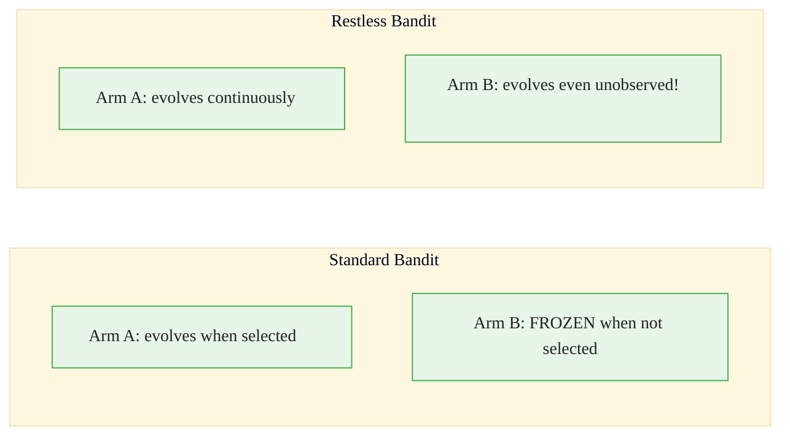
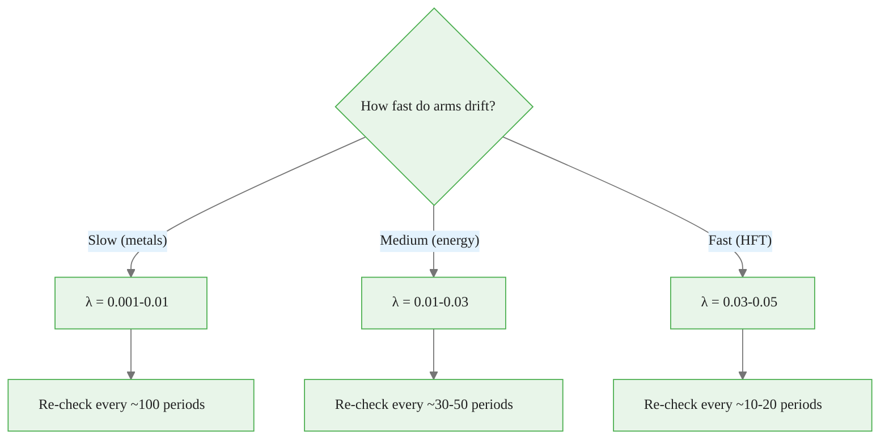
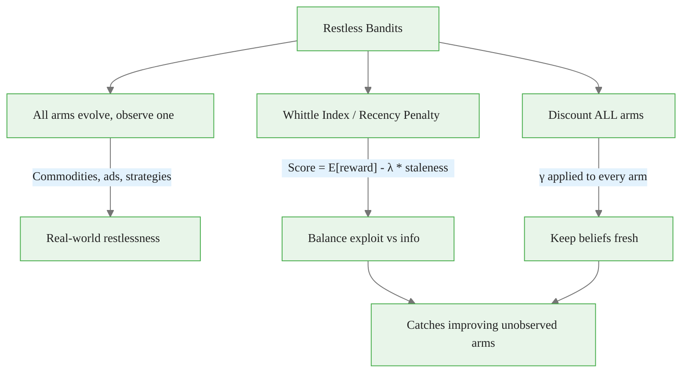

<!-- _class: lead -->

# Restless Bandits

## Module 6: Advanced Topics
### Multi-Armed Bandits for Commodity Trading

<!-- Speaker notes: This deck covers Restless Bandits. Set the context for the audience and explain how this topic fits into the broader course on multi-armed bandits for commodity trading. -->
---

## In Brief

Restless bandits are arms that evolve over time **even when you don't select them**.

> Unlike standard bandits where unselected arms stay frozen, restless arms change on their own -- like commodities whose volatility shifts whether you're invested or not.

**The challenge:** You can only observe one arm per period, but ALL arms are evolving.

<!-- Speaker notes: This opening summary sets the context for the entire deck. Read the key quote aloud and pause to let it sink in. The goal is to establish the core problem or concept before diving into details. -->

<div class="callout-key">

Bandits learn AND earn simultaneously -- the core advantage over traditional A/B testing.

</div>

---

## Standard vs Restless



**Commodity example:** You hold WTI for 6 months. Meanwhile, NatGas volatility dropped from 25% to 16%. You missed it because you weren't watching.

<!-- Speaker notes: The diagram on Standard vs Restless illustrates the key relationships visually. Walk through the flow step by step, pointing out decision points and outcomes. Visual representations like this help students build mental models of the concepts. -->

<div class="callout-insight">

**Insight:** The exploration-exploitation tradeoff is not a fixed ratio -- it should adapt as uncertainty decreases over time.

</div>

---

## Formal Definition

Each arm $i$ has hidden state $s_i(t) \in \mathcal{S}_i$:

$$s_i(t+1) \sim P_i(\cdot \mid s_i(t), a_t)$$

**Key:** Transitions happen for **ALL** arms, not just the selected one.

- Reward: $r_i(t) \sim R_i(s_i(t))$
- You only observe $r_{a_t}(t)$
- Objective: $\max \sum_t r_{a_t}(t)$

> Restless bandits are **PSPACE-hard** in general, but practical approximations exist.

<!-- Speaker notes: This is the formal mathematical treatment. Walk through each symbol and equation carefully, connecting back to the intuitive explanation from the previous slides. Do not rush this slide -- pause after each equation to ensure comprehension. -->

<div class="callout-warning">

**Warning:** Non-stationary reward distributions violate bandit assumptions. Always implement change detection in production systems.

</div>

---

## Whittle Index Policy

The Whittle index assigns each arm a priority score:

$$W_i(s_i(t)) = \text{``subsidy to make you indifferent''}$$

Higher index = more urgent to select.

**Simplified practical approach:**

$$\text{Score}_i(t) = \mathbb{E}[\text{reward} \mid \text{belief}_i] - \lambda \cdot (t - \text{last\_observed}_i)$$

> Balances exploitation (high expected reward) with information gathering (check neglected arms).

<!-- Speaker notes: The mathematical treatment of Whittle Index Policy formalizes what we discussed intuitively. Walk through each variable and equation, relating them back to the commodity trading context. Ensure the audience follows the notation before moving on. -->

<div class="callout-info">

**Info:** The regret of the best bandit algorithms grows logarithmically with time, compared to linearly for A/B testing.

</div>

---

## Code: Greedy Restless Bandit

<div class="code-window">
<div class="code-header">
<div class="dots"><span class="dot-red"></span><span class="dot-yellow"></span><span class="dot-green"></span></div>
<span class="filename">example.py</span>
</div>

```python
class GreedyRestlessBandit:
    def __init__(self, n_arms, recency_penalty=0.01):
        self.n_arms = n_arms
        self.recency_penalty = recency_penalty
        self.counts = np.zeros(n_arms)
        self.sums = np.zeros(n_arms)
        self.last_observed = np.zeros(n_arms)
        self.t = 0
```

</div>

<!-- Speaker notes: Code continues on the next slide. This first part sets up the structure. -->

---

## Code: Greedy Restless Bandit (continued)

<div class="code-window">
<div class="code-header">
<div class="dots"><span class="dot-red"></span><span class="dot-yellow"></span><span class="dot-green"></span></div>
<span class="filename">example.py</span>
</div>

```python
    def select_arm(self):
        self.t += 1
        scores = []
        for i in range(self.n_arms):
            if self.counts[i] == 0:
                scores.append(float('inf'))
            else:
                expected = self.sums[i] / self.counts[i]
                staleness = self.t - self.last_observed[i]
                scores.append(expected -
                            self.recency_penalty * staleness)
        return np.argmax(scores)
```

</div>

<!-- Speaker notes: Walk through the code line by line. Highlight the key design decisions and explain why each parameter or function call matters. This code is copy-paste ready -- students can use it directly in their own projects. -->
---

## Recency Penalty Calibration



**Formula:** $\lambda = \frac{\text{reward\_difference}}{\text{acceptable\_lag}}$

<!-- Speaker notes: The diagram on Recency Penalty Calibration illustrates the key relationships visually. Walk through the flow step by step, pointing out decision points and outcomes. Visual representations like this help students build mental models of the concepts. -->
---

## Discounted Restless Bandit

Combine recency penalty with exponential discounting:

```python
class DiscountedRestlessBandit:
    def __init__(self, n_arms, gamma=0.95, recency_penalty=0.01):
        self.gamma = gamma
        self.recency_penalty = recency_penalty
        self.alpha = np.ones(n_arms)
        self.beta = np.ones(n_arms)

    def select_arm(self):
        self.alpha *= self.gamma  # Discount ALL arms
        self.beta *= self.gamma
        scores = []
        for i in range(self.n_arms):
            theta_i = np.random.beta(self.alpha[i], self.beta[i])
            staleness = self.t - self.last_observed[i]
            scores.append(theta_i - self.recency_penalty * staleness)
        return np.argmax(scores)
```

<!-- Speaker notes: This code example for Discounted Restless Bandit is production-ready. Walk through the implementation, noting any important design patterns or potential modifications for different use cases. -->
---

<!-- _class: lead -->

# Common Pitfalls

<!-- Speaker notes: Transition slide for the Common Pitfalls section. Pause briefly to let the audience absorb the previous content before moving into this new topic area. -->
---

## Four Key Pitfalls

| Pitfall | Problem | Fix |
|---------|---------|-----|
| Ignoring restlessness | Stay with best arm, miss that others improved | Periodic sampling of ALL arms |
| Penalty too high | Perpetual exploration, never exploit | Calibrate $\lambda$ to drift speed |
| Treating as standard non-stationary | Only update selected arm, stale beliefs for rest | Discount ALL arms, not just selected |
| Applying to passive arms | Unnecessary exploration overhead | Ask: "Do unselected options evolve?" |

<!-- Speaker notes: Walk through Four Key Pitfalls carefully. Emphasize why this mistake is common and how to recognize it in practice. The commodity trading example makes it concrete -- ask if anyone has encountered this in their own work. -->
---

## When to Use Restless Bandits

<div class="columns">
<div>

### YES (arms evolve)
- Commodity volatility changes daily
- Ad channel effectiveness decays
- Soil quality changes over time
- Market conditions shift

</div>
<div>

### NO (arms are passive)
- Static website A/B test variants
- Fixed drug dosages
- Immutable product features
- Use standard bandits instead

</div>
</div>

<!-- Speaker notes: This two-column comparison for When to Use Restless Bandits highlights important trade-offs. Walk through both sides, noting when each approach is preferred. The contrast format helps students make informed decisions in their own work. -->
---

## Connections

<div class="columns">
<div>

### Builds On
- **Non-Stationary Bandits:** Extends to all arms
- **Thompson Sampling:** Modified for unobserved evolution
- **Markov Decision Processes:** Restless bandits are constrained MDPs

</div>
<div>

### Leads To
- **Multi-Agent Systems:** Multiple learners + restless environments
- **Resource Allocation:** Scheduling under constraints
- **Kalman Filtering:** Track hidden states of all arms

</div>
</div>

<!-- Speaker notes: The connections section shows how this topic links to the rest of the course. Highlight the 'Builds On' prerequisites to remind students of what they should already know, and use 'Leads To' to create anticipation for upcoming modules. -->
---

## Visual Summary



<!-- Speaker notes: This visual summary captures the key relationships from the entire deck. Walk through each branch of the diagram, connecting back to the main concepts covered. This slide works well as a reference -- encourage students to screenshot it for later review. -->