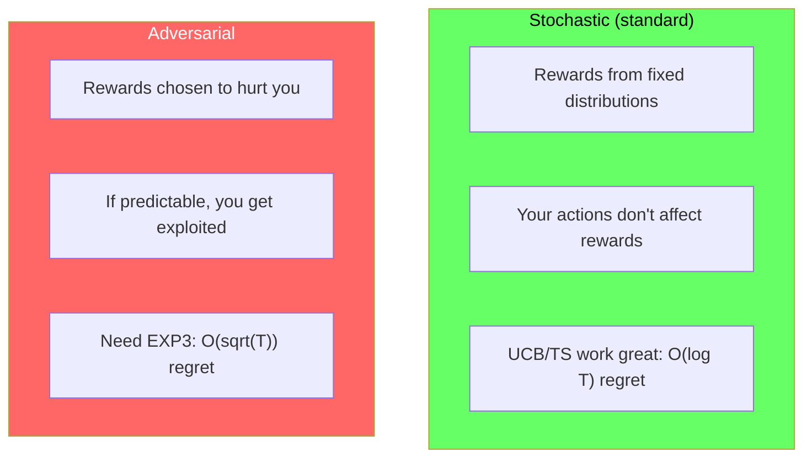
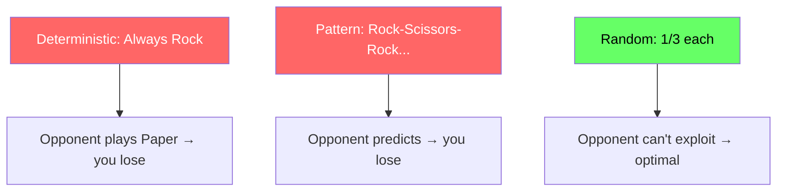
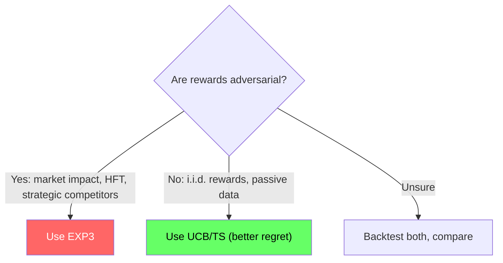
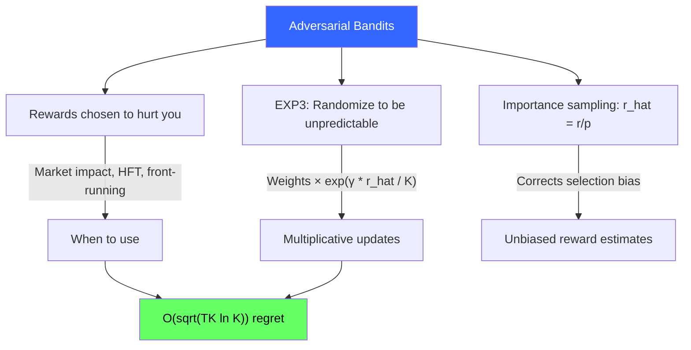

<!-- _class: lead -->

# Adversarial Bandits

## Module 6: Advanced Topics
### Multi-Armed Bandits for Commodity Trading

<!-- Speaker notes: This deck covers Adversarial Bandits. Set the context for the audience and explain how this topic fits into the broader course on multi-armed bandits for commodity trading. -->
---

## In Brief

Adversarial bandits assume rewards are chosen by an adversary who knows your algorithm.

> If your algorithm is **predictable**, an adversary (or adaptive market) can **exploit** it.

**Example:** You deploy a profitable strategy. Other traders notice and front-run you. Your arm becomes worse *because you're selecting it*.

**Solution:** Randomize using **EXP3** to be unpredictable.

<!-- Speaker notes: This opening summary sets the context for the entire deck. Read the key quote aloud and pause to let it sink in. The goal is to establish the core problem or concept before diving into details. -->
---

## Stochastic vs Adversarial



<!-- Speaker notes: The diagram on Stochastic vs Adversarial illustrates the key relationships visually. Walk through the flow step by step, pointing out decision points and outcomes. Visual representations like this help students build mental models of the concepts. -->
---

## Market Impact Example

```
Day 1-5:   You buy WTI at open every day
           → Spread: $70.00 / $70.05 (tight)

Day 6-10:  Market makers notice your pattern
           → Spread: $70.00 / $70.20 (wider!)
           → You pay 15 cents more per barrel

Your predictable strategy became exploitable.
```

> EXP3 solution: Randomize buy times, mix in other commodities, be unpredictable.

<!-- Speaker notes: This slide connects theory to implementation for Market Impact Example. Start with the mathematical formulation, then show how each term maps to a line of code. This bridge between theory and practice is one of the most valuable aspects of the course. -->
---

## EXP3 Algorithm

**Each round $t$:**

1. **Probabilities:** $p_i(t) = (1-\gamma) \cdot \frac{w_i(t)}{\sum_j w_j(t)} + \frac{\gamma}{K}$

2. **Sample:** $i_t \sim p(t)$ (randomly!)

3. **Observe:** $r_{i_t}(t)$

4. **Importance weight:** $\hat{r}_i(t) = \frac{r_i(t)}{p_i(t)}$ (corrects selection bias)

5. **Update:** $w_i(t+1) = w_i(t) \cdot \exp\left(\frac{\gamma \cdot \hat{r}_i(t)}{K}\right)$

**Optimal $\gamma$:** $\sqrt{\frac{K \ln K}{T}}$ gives regret $\leq 2\sqrt{TK\ln K}$

<!-- Speaker notes: The mathematical treatment of EXP3 Algorithm formalizes what we discussed intuitively. Walk through each variable and equation, relating them back to the commodity trading context. Ensure the audience follows the notation before moving on. -->
---

## Why Randomize? Rock-Paper-Scissors



> EXP3 does this for bandits: weight arms by performance, but always randomize.

<!-- Speaker notes: The diagram on Why Randomize? Rock-Paper-Scissors illustrates the key relationships visually. Walk through the flow step by step, pointing out decision points and outcomes. Visual representations like this help students build mental models of the concepts. -->
---

## Code: EXP3

```python
class EXP3:
    def __init__(self, n_arms, gamma=None):
        self.n_arms = n_arms
        self.gamma = gamma
        self.weights = np.ones(n_arms)
        self.t = 0

    def set_horizon(self, T):
        if self.gamma is None:
            K = self.n_arms
            self.gamma = min(1.0, np.sqrt(K * np.log(K) / T))
```

<!-- Speaker notes: Code continues on the next slide. This first part sets up the structure. -->

---

## Code: EXP3 (continued)

```python
    def get_probabilities(self):
        K = self.n_arms
        gamma = self.gamma or 0.1
        total = np.sum(self.weights)
        return (1 - gamma) * (self.weights / total) + gamma / K

    def select_arm(self):
        self.t += 1
        probs = self.get_probabilities()
        return np.random.choice(self.n_arms, p=probs)

    def update(self, arm, reward):
        probs = self.get_probabilities()
        estimated_reward = reward / probs[arm]  # IPW
        gamma = self.gamma or 0.1
        self.weights[arm] *= np.exp(gamma * estimated_reward / self.n_arms)
```

<!-- Speaker notes: Walk through the code line by line. Highlight the key design decisions and explain why each parameter or function call matters. This code is copy-paste ready -- students can use it directly in their own projects. -->
---

## Importance Sampling: Why $\hat{r} = r/p$

You only observe the selected arm. To correct selection bias:

| Selection probability $p$ | Observation weight $1/p$ | Intuition |
|--------------------------|-------------------------|-----------|
| $p = 0.1$ (rarely selected) | $10\times$ | Single observation is very informative |
| $p = 0.5$ (often selected) | $2\times$ | Moderate information |
| $p = 0.9$ (almost always) | $1.1\times$ | Not surprising, low info |

> Dividing by $p$ produces an unbiased estimate of the true expected reward.

<!-- Speaker notes: This comparison table on Importance Sampling: Why $\hat{r} = r/p$ is a key reference. Walk through each row, highlighting the most important distinctions. Students should understand when to use each option based on the criteria shown. -->
---

## Regret Comparison

| Algorithm | Setting | Regret Bound |
|-----------|---------|-------------|
| UCB/TS | Stochastic | $O(\log T)$ |
| EXP3 | Adversarial | $O(\sqrt{T K \ln K})$ |
| EXP3 | Stochastic (overkill) | $O(\sqrt{T})$ (worse than UCB) |



<!-- Speaker notes: The diagram on Regret Comparison illustrates the key relationships visually. Walk through the flow step by step, pointing out decision points and outcomes. Visual representations like this help students build mental models of the concepts. -->
---

## Commodity Application: Exchange Arbitrage

```python
bandit = EXP3(n_arms=3)
bandit.set_horizon(T=1000)
exchanges = ['CME', 'ICE', 'LME']

for t in range(1000):
    arm = bandit.select_arm()  # Random selection
    exchange = exchanges[arm]
    spread, filled = execute_trade(exchange)
    reward = 1 - (spread / max_spread)
    bandit.update(arm, reward)
    # Market makers can't predict which exchange you'll use
```

> Randomization prevents systematic exploitation of predictable patterns.

<!-- Speaker notes: This code example for Commodity Application: Exchange Arbitrage is production-ready. Walk through the implementation, noting any important design patterns or potential modifications for different use cases. -->
---

<!-- _class: lead -->

# Common Pitfalls

<!-- Speaker notes: Transition slide for the Common Pitfalls section. Pause briefly to let the audience absorb the previous content before moving into this new topic area. -->
---

## Five Key Pitfalls

| Pitfall | Problem | Fix |
|---------|---------|-----|
| Stochastic algo in adversarial setting | Deterministic UCB gets front-run | Use EXP3 |
| $\gamma$ too small | No exploration, stuck on first arm | Use $\gamma = \sqrt{K \ln K / T}$ |
| $\gamma$ too large | Almost uniform random, no exploitation | Don't exceed $\gamma = 0.5$ |
| EXP3 on stochastic problem | $O(\sqrt{T})$ instead of $O(\log T)$ | Use UCB/TS for i.i.d. rewards |
| Confusing market impact with adversarial | Unnecessary complexity | Model impact explicitly if small |

<!-- Speaker notes: Walk through Five Key Pitfalls carefully. Emphasize why this mistake is common and how to recognize it in practice. The commodity trading example makes it concrete -- ask if anyone has encountered this in their own work. -->
---

## Connections

<div class="columns">
<div>

### Builds On
- **Stochastic Bandits:** EXP3 generalizes to worst-case
- **Regret Bounds:** $O(\sqrt{T})$ vs $O(\log T)$
- **Game Theory:** Randomized strategies

</div>
<div>

### Leads To
- **EXP4:** Contextual adversarial bandits
- **Online Convex Optimization:** General framework
- **Robust Portfolio Optimization:** Worst-case scenarios

</div>
</div>

<!-- Speaker notes: The connections section shows how this topic links to the rest of the course. Highlight the 'Builds On' prerequisites to remind students of what they should already know, and use 'Leads To' to create anticipation for upcoming modules. -->
---

## Visual Summary



<!-- Speaker notes: This visual summary captures the key relationships from the entire deck. Walk through each branch of the diagram, connecting back to the main concepts covered. This slide works well as a reference -- encourage students to screenshot it for later review. -->