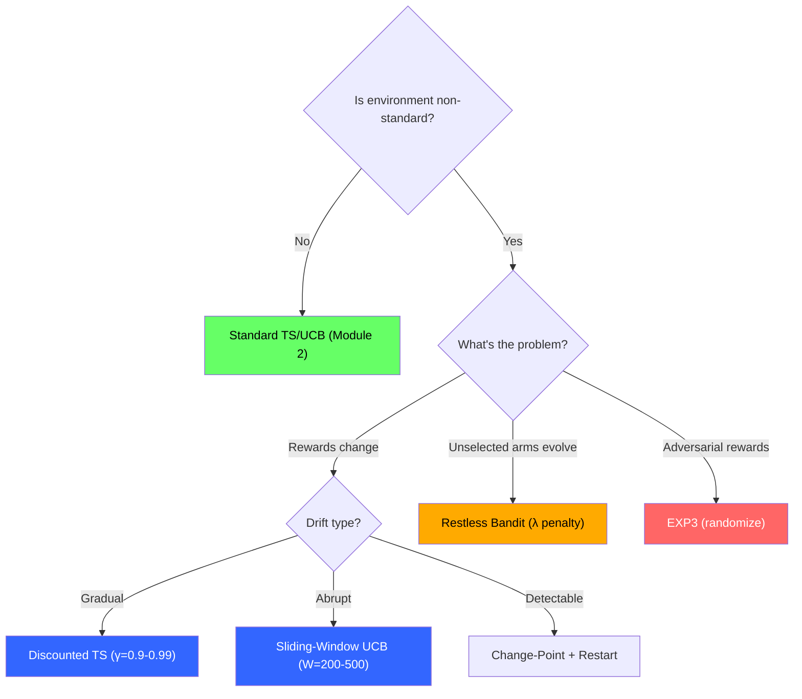
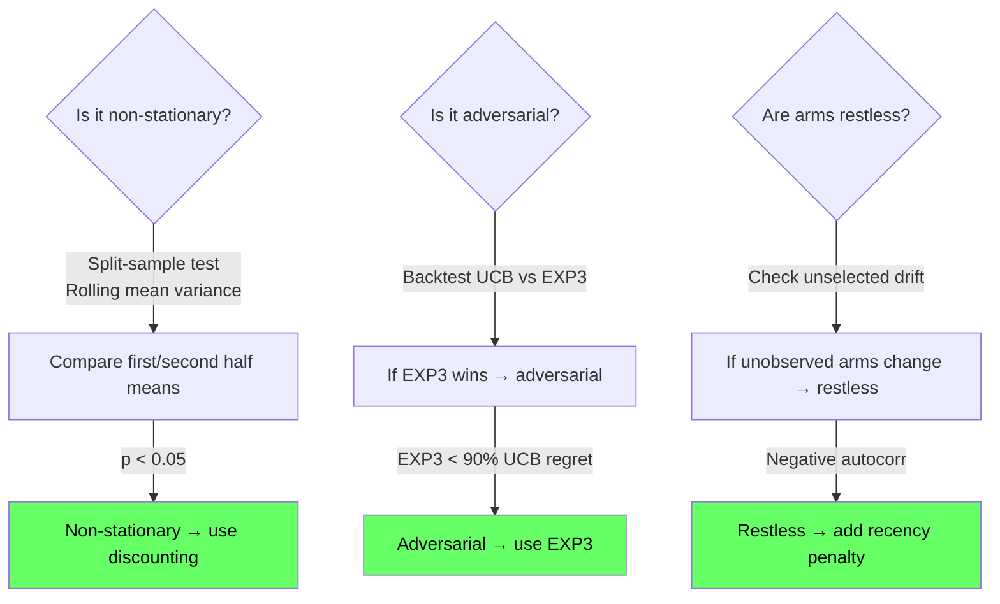
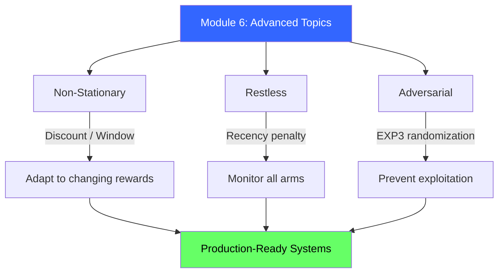

<!-- _class: lead -->

# Advanced Topics Cheatsheet

## Module 6 Quick Reference
### Multi-Armed Bandits for Commodity Trading

<!-- Speaker notes: This deck covers Advanced Topics Cheatsheet. Set the context for the audience and explain how this topic fits into the broader course on multi-armed bandits for commodity trading. -->
---

## Algorithm Selection Decision Tree



<!-- Speaker notes: The diagram on Algorithm Selection Decision Tree illustrates the key relationships visually. Walk through the flow step by step, pointing out decision points and outcomes. Visual representations like this help students build mental models of the concepts. -->
---

## Algorithm Comparison

| Algorithm | Best For | Key Param | Regret |
|-----------|----------|-----------|--------|
| Discounted TS | Gradual drift | $\gamma \in (0.9, 0.99)$ | $O(\sqrt{T})$ |
| Sliding-Window UCB | Abrupt changes | $W = 200\text{-}500$ | $O(\sqrt{T})$ |
| Change-Point + Restart | Detectable shifts | Threshold $\delta$ | $O(K \log T)$ per regime |
| Restless Greedy | All arms evolve | $\lambda = 0.001\text{-}0.05$ | Approx |
| EXP3 | Adversarial | $\gamma = \sqrt{K \ln K / T}$ | $O(\sqrt{TK\ln K})$ |

<!-- Speaker notes: This comparison table on Algorithm Comparison is a key reference. Walk through each row, highlighting the most important distinctions. Students should understand when to use each option based on the criteria shown. -->
---

## Key Formulas

**Discounted TS:**
$$\alpha_i \leftarrow \gamma \cdot \alpha_i + r_t \cdot \mathbb{1}(a_t=i), \quad \text{sample } \theta_i \sim \text{Beta}(\alpha_i, \beta_i)$$

**Sliding-Window UCB:**
$$\text{UCB}_i = \hat{\mu}_{i,W} + \sqrt{\frac{2 \ln t}{T_{i,W}}}$$

**EXP3:**
$$p_i = (1-\gamma)\frac{w_i}{\sum w_j} + \frac{\gamma}{K}, \quad w_i \leftarrow w_i \cdot \exp\left(\frac{\gamma \hat{r}_i}{K}\right)$$

**Restless Greedy:**
$$\text{Score}_i = \hat{\mu}_i - \lambda \cdot (t - \text{last\_observed}_i)$$

<!-- Speaker notes: The mathematical treatment of Key Formulas formalizes what we discussed intuitively. Walk through each variable and equation, relating them back to the commodity trading context. Ensure the audience follows the notation before moving on. -->
---

## Hyperparameter Tuning

<div class="columns">
<div>

### Discount Factor ($\gamma$)
| Regime Duration | $\gamma$ | Half-Life |
|----------------|----------|-----------|
| 10-20 | 0.90 | 7 |
| 50-100 | 0.95 | 14 |
| 100-200 | 0.97 | 23 |
| 200-500 | 0.99 | 69 |

</div>
<div>

### Window Size ($W$)
$$W = \alpha \cdot K \cdot \text{regime\_duration}$$

Safety factor $\alpha = 2\text{-}5$

### Recency Penalty ($\lambda$)
$$\lambda = \frac{\text{reward\_diff}}{\text{acceptable\_lag}}$$

</div>
</div>

<!-- Speaker notes: This comparison table on Hyperparameter Tuning is a key reference. Walk through each row, highlighting the most important distinctions. Students should understand when to use each option based on the criteria shown. -->
---

## 3-Line Code Snippets

```python
# Discounted TS
self.alpha *= gamma; self.beta *= gamma
self.alpha[arm] += reward; self.beta[arm] += (1-reward)
arm = np.argmax([beta.rvs(a, b) for a, b in zip(self.alpha, self.beta)])
```

```python
# EXP3
probs = (1-gamma)*(weights/weights.sum()) + gamma/K
arm = np.random.choice(K, p=probs)
weights[arm] *= np.exp(gamma * reward/probs[arm] / K)
```

```python
# Restless Greedy
staleness = t - last_observed
scores = means - lambda_penalty * staleness
arm = np.argmax(scores)
```

<!-- Speaker notes: Walk through the code line by line. Highlight the key design decisions and explain why each parameter or function call matters. This code is copy-paste ready -- students can use it directly in their own projects. -->
---

## Commodity-Specific Guidelines

| Commodity | Volatility | Recommended | Parameters |
|-----------|-----------|-------------|------------|
| Energy (Oil, Gas) | High, frequent shocks | $\gamma=0.90\text{-}0.95$, $W=100\text{-}200$ | + Change-point detection |
| Metals (Gold, Copper) | Slower changes | $\gamma=0.97\text{-}0.99$, $W=300\text{-}500$ | + Contextual features |
| Agriculture | Strong seasonality | Seasonal adjustment, not non-stationary | Restart between seasons |
| HFT | Market impact | EXP3 for large positions | $\gamma=0.90\text{-}0.92$ |

<!-- Speaker notes: This comparison table on Commodity-Specific Guidelines is a key reference. Walk through each row, highlighting the most important distinctions. Students should understand when to use each option based on the criteria shown. -->
---

## Diagnostic Tests



<!-- Speaker notes: The diagram on Diagnostic Tests illustrates the key relationships visually. Walk through the flow step by step, pointing out decision points and outcomes. Visual representations like this help students build mental models of the concepts. -->
---

## Common Pitfalls

| Pitfall | Symptom | Fix |
|---------|---------|-----|
| Discount too high | Slow adaptation | Lower $\gamma$ |
| Discount too low | Thrashing, high variance | Raise $\gamma$ |
| Window too small | Noisy, unstable | Increase $W$ to 2-5x |
| Recency penalty too high | Perpetual exploration | Lower $\lambda$ by 10x |
| EXP3 on stochastic | Poor regret vs UCB | Switch to stochastic algo |
| UCB on adversarial | Getting exploited | Switch to EXP3 |

<!-- Speaker notes: Walk through Common Pitfalls carefully. Emphasize why this mistake is common and how to recognize it in practice. The commodity trading example makes it concrete -- ask if anyone has encountered this in their own work. -->
---

## When NOT to Use Advanced Algorithms

| Scenario | Use Instead | Reason |
|----------|-------------|--------|
| Static A/B test variants | Standard TS | No non-stationarity |
| Small samples ($T < 100$) | $\epsilon$-greedy or UCB | Not enough data to adapt |
| No regime changes observed | Standard algorithms | Over-engineering |
| Academic baseline | Standard first | Establish baseline before complexity |

<!-- Speaker notes: This comparison table on When NOT to Use Advanced Algorithms is a key reference. Walk through each row, highlighting the most important distinctions. Students should understand when to use each option based on the criteria shown. -->
---

## Visual Summary



<!-- Speaker notes: This visual summary captures the key relationships from the entire deck. Walk through each branch of the diagram, connecting back to the main concepts covered. This slide works well as a reference -- encourage students to screenshot it for later review. -->