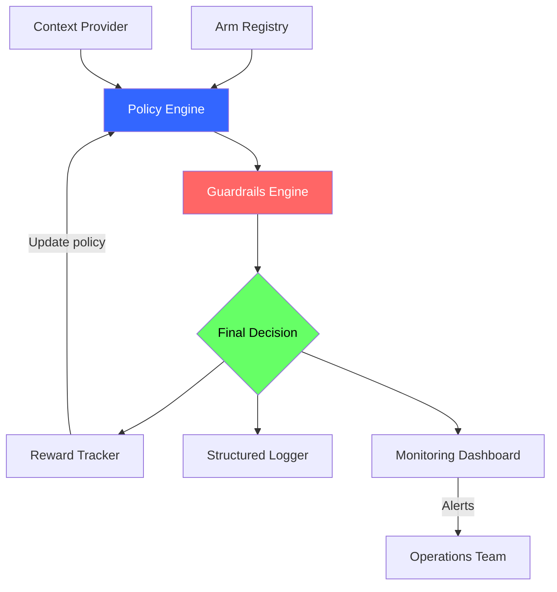
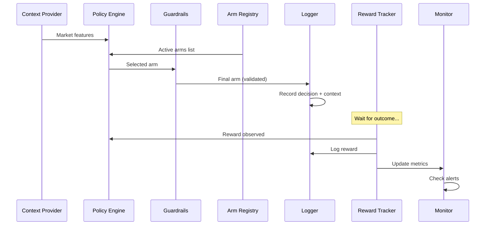
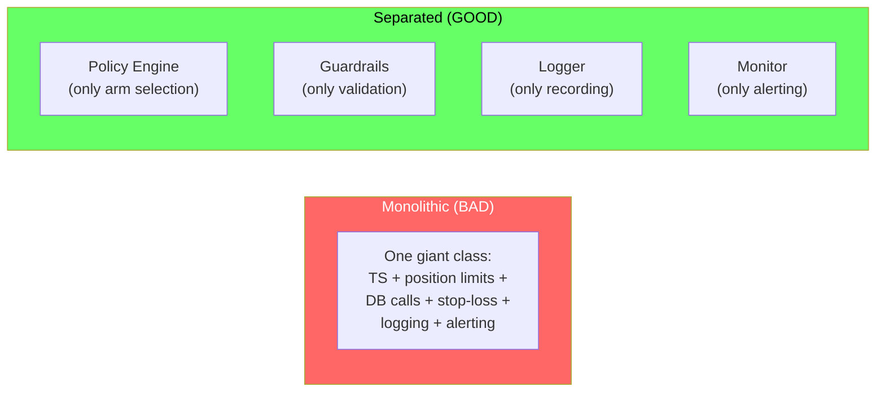
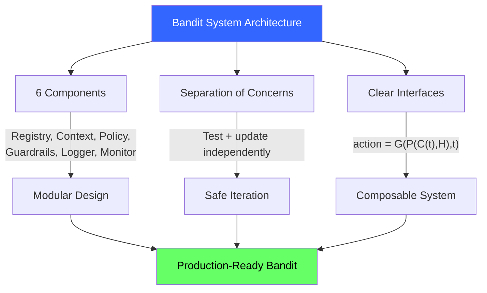

<!-- _class: lead -->

# Bandit System Architecture

## Module 7: Production Systems
### Multi-Armed Bandits for Commodity Trading

<!-- Speaker notes: This deck covers Bandit System Architecture. Set the context for the audience and explain how this topic fits into the broader course on multi-armed bandits for commodity trading. -->
---

## In Brief

A production bandit system separates **policy logic**, **data management**, and **business logic** into distinct components.

> The biggest mistake is coupling ML policy too tightly with business logic. When Thompson Sampling is tangled with position limits and stop-loss checks, you can't update one without breaking the other.

**Goal:** Clean architecture with clear interfaces enables safe iteration and reliable monitoring.

<!-- Speaker notes: This opening summary sets the context for the entire deck. Read the key quote aloud and pause to let it sink in. The goal is to establish the core problem or concept before diving into details. -->
---

## System Architecture Overview



<!-- Speaker notes: The diagram on System Architecture Overview illustrates the key relationships visually. Walk through the flow step by step, pointing out decision points and outcomes. Visual representations like this help students build mental models of the concepts. -->
---

## Six Components

| Component | Role | Trading Analogy |
|-----------|------|-----------------|
| **Arm Registry** | Manage tradable assets | Asset universe |
| **Context Provider** | Extract market features | Market data analysts |
| **Policy Engine** | Select arms | Portfolio manager |
| **Guardrails** | Validate/override | Risk management team |
| **Logger** | Record every decision | Compliance department |
| **Monitor** | Detect anomalies | Surveillance system |

<!-- Speaker notes: This comparison table on Six Components is a key reference. Walk through each row, highlighting the most important distinctions. Students should understand when to use each option based on the criteria shown. -->
---

## Data Flow



<!-- Speaker notes: The diagram on Data Flow illustrates the key relationships visually. Walk through the flow step by step, pointing out decision points and outcomes. Visual representations like this help students build mental models of the concepts. -->
---

## Formal Definition

A production bandit system is a tuple $(R, C, P, G, L, M)$:

- $R$ = **Arm Registry:** maps arm IDs to configurations
- $C$ = **Context Provider:** $c: t \to \mathbb{R}^d$
- $P$ = **Policy Engine:** $\pi: (c, H) \to a$
- $G$ = **Guardrails:** $g: a \to \{\text{accept}, \text{reject}, \text{override}\}$
- $L$ = **Logger:** records $(t, c_t, a_t, r_t, \text{metadata})$
- $M$ = **Monitor:** evaluates $m: H \to \mathbb{R}^k$

$$\text{action} = G(P(C(t), H), t)$$

<!-- Speaker notes: This is the formal mathematical treatment. Walk through each symbol and equation carefully, connecting back to the intuitive explanation from the previous slides. Do not rush this slide -- pause after each equation to ensure comprehension. -->
---

## Code: Core System

```python
class ProductionBanditSystem:
    def __init__(self, policy, guardrails=None):
        self.registry = ArmRegistry()
        self.policy = policy
        self.guardrails = guardrails or (lambda x, c: x)
        self.logger = []

    def make_decision(self, context):
        active_arms = self.registry.get_active_arms()
        selected_arm = self.policy.select_arm(context, active_arms)
        validated_arm = self.guardrails(selected_arm, context)
```

<!-- Speaker notes: Code continues on the next slide. This first part sets up the structure. -->

---

## Code: Core System (continued)

```python
        decision = {
            "timestamp": datetime.now().isoformat(),
            "context": context,
            "selected_arm": selected_arm,
            "final_arm": validated_arm,
            "active_arms": active_arms
        }
        self.logger.append(json.dumps(decision))
        return validated_arm
```

<!-- Speaker notes: Walk through the code line by line. Highlight the key design decisions and explain why each parameter or function call matters. This code is copy-paste ready -- students can use it directly in their own projects. -->
---

## Code: Commodity Guardrails

```python
def commodity_guardrails(arm, context):
    """Validate commodity selection before execution."""
    # Don't allocate to commodities in backwardation > 5%
    if context.get(f"{arm}_term_structure", 0) < -0.05:
        return "CASH"  # Override to cash

    # Don't allocate if volatility > 40% annualized
    if context.get(f"{arm}_volatility", 0) > 0.40:
        return "CASH"

    return arm  # Accept policy decision

system = ProductionBanditSystem(
    policy=ThompsonSamplingPolicy(),
    guardrails=commodity_guardrails
)
for commodity in ["GOLD", "OIL", "NATGAS", "COPPER"]:
    system.registry.register(Arm(commodity, metadata={"sector": "energy"}))
```

<!-- Speaker notes: Walk through the code line by line. Highlight the key design decisions and explain why each parameter or function call matters. This code is copy-paste ready -- students can use it directly in their own projects. -->
---

## Separation of Concerns



> Each component can be developed, tested, and monitored independently.

<!-- Speaker notes: The diagram on Separation of Concerns illustrates the key relationships visually. Walk through the flow step by step, pointing out decision points and outcomes. Visual representations like this help students build mental models of the concepts. -->
---

<!-- _class: lead -->

# Common Pitfalls

<!-- Speaker notes: Transition slide for the Common Pitfalls section. Pause briefly to let the audience absorb the previous content before moving into this new topic area. -->
---

## Four Key Pitfalls

| Pitfall | Problem | Fix |
|---------|---------|-----|
| Monolithic design | Can't test TS if tangled with DB + limits | Separate concerns into modules |
| Synchronous rewards | Waiting for outcome blocks decisions | Decouple `make_decision()` from `record_reward()` |
| No versioning | Can't reproduce past behavior | Log policy version + hyperparams every decision |
| Missing arm metadata | Can't debug poor performance | Store rich metadata in Arm Registry |

<!-- Speaker notes: Walk through Four Key Pitfalls carefully. Emphasize why this mistake is common and how to recognize it in practice. The commodity trading example makes it concrete -- ask if anyone has encountered this in their own work. -->
---

## Connections

<div class="columns">
<div>

### Builds On
- **Module 1:** Core bandit algorithms
- **Module 3:** Contextual bandits (LinUCB)
- **Module 5:** Commodity trading applications

</div>
<div>

### Leads To
- **Logging and Monitoring:** observability
- **Offline Evaluation:** test policies on logs
- **Multi-environment:** paper trading to production
- **MLOps:** versioning, feature stores, monitoring

</div>
</div>

<!-- Speaker notes: The connections section shows how this topic links to the rest of the course. Highlight the 'Builds On' prerequisites to remind students of what they should already know, and use 'Leads To' to create anticipation for upcoming modules. -->
---

## Visual Summary



<!-- Speaker notes: This visual summary captures the key relationships from the entire deck. Walk through each branch of the diagram, connecting back to the main concepts covered. This slide works well as a reference -- encourage students to screenshot it for later review. -->