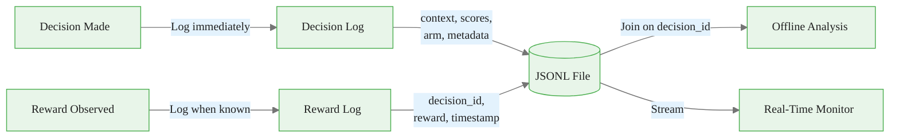
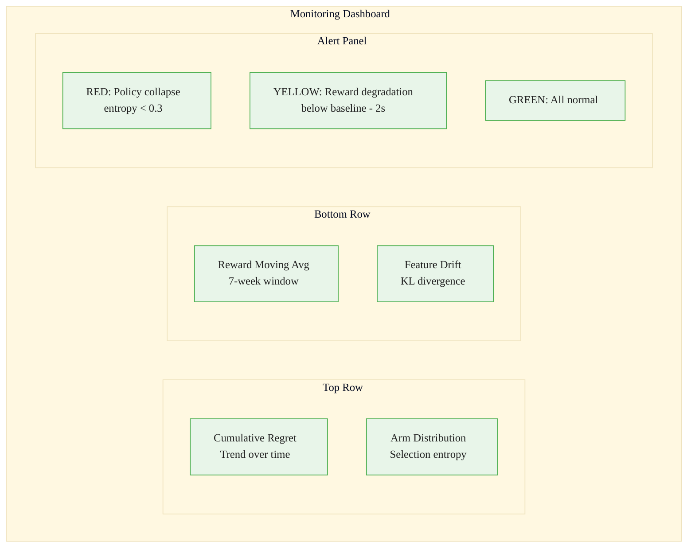
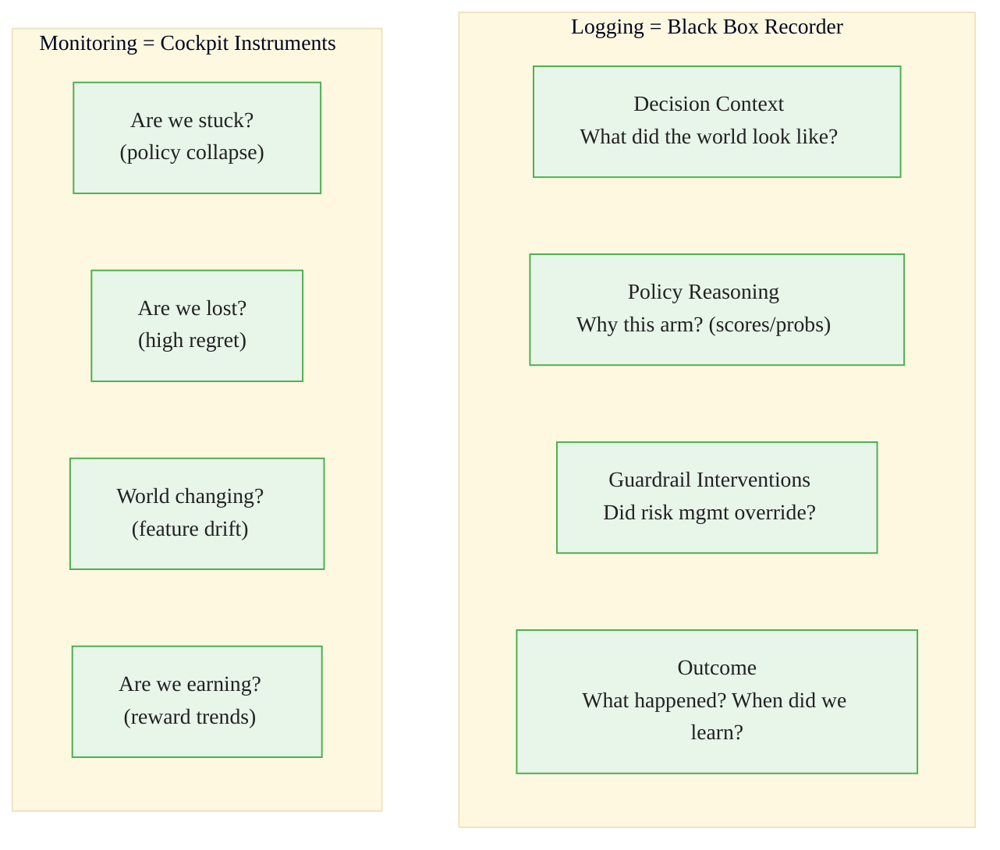
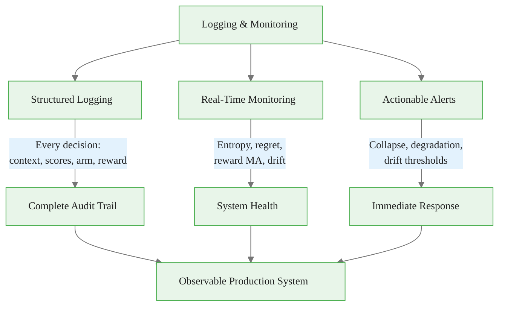

<!-- _class: lead -->

# Logging and Monitoring

## Module 7: Production Systems
### Multi-Armed Bandits for Commodity Trading

<!-- Speaker notes: This deck covers Logging and Monitoring. Set the context for the audience and explain how this topic fits into the broader course on multi-armed bandits for commodity trading. -->
---

## In Brief

Production bandit systems require **comprehensive logging** of every decision and **real-time monitoring** of key metrics to detect failures before they cause significant losses.

> The difference between a research notebook and a production system is **observability**. Without structured logging and monitoring, you're flying blind.

<!-- Speaker notes: This opening summary sets the context for the entire deck. Read the key quote aloud and pause to let it sink in. The goal is to establish the core problem or concept before diving into details. -->

<div class="callout-key">

Bandits learn AND earn simultaneously -- the core advantage over traditional A/B testing.

</div>

---

## What to Log (Per Decision)

```json
{
  "timestamp": "2026-02-12T10:30:00Z",
  "decision_id": "uuid-1234",
  "policy_version": "thompson_v2.1",
  "context": {"vix": 18.5, "regime": "high_volatility"},
  "active_arms": ["GOLD", "OIL", "NATGAS", "COPPER"],
  "policy_scores": {"GOLD": 0.45, "OIL": 0.30, ...},
  "selected_arm": "GOLD",
  "guardrail_override": false,
  "final_arm": "GOLD"
}
```

**When reward observed:**
```json
{"decision_id": "uuid-1234", "reward": 0.023, "latency_days": 7}
```

<!-- Speaker notes: This code example for What to Log (Per Decision) is production-ready. Walk through the implementation, noting any important design patterns or potential modifications for different use cases. -->

<div class="callout-insight">

**Insight:** The exploration-exploitation tradeoff is not a fixed ratio -- it should adapt as uncertainty decreases over time.

</div>

---

## Logging Data Flow



<!-- Speaker notes: The diagram on Logging Data Flow illustrates the key relationships visually. Walk through the flow step by step, pointing out decision points and outcomes. Visual representations like this help students build mental models of the concepts. -->

<div class="callout-warning">

**Warning:** Non-stationary reward distributions violate bandit assumptions. Always implement change detection in production systems.

</div>

---

## Monitoring Metrics

| Metric | Formula | Alert Threshold | Meaning |
|--------|---------|----------------|---------|
| **Cumulative Regret** | $\sum_t (\hat{\mu}^* - \hat{\mu}_{a_t})$ | Growing linearly | Picking suboptimal arms |
| **Selection Entropy** | $H = -\sum_a p_a \log p_a$ | < 0.5 or > 1.5 | Collapse or no learning |
| **Reward Moving Avg** | $\text{MA}(r, w=20)$ | < baseline $- 2\sigma$ | Performance degradation |
| **Feature Drift** | $D_{KL}(P_{\text{recent}} \|\| P_{\text{hist}})$ | > threshold | Regime change |

<!-- Speaker notes: This comparison table on Monitoring Metrics is a key reference. Walk through each row, highlighting the most important distinctions. Students should understand when to use each option based on the criteria shown. -->

<div class="callout-info">

**Info:** The regret of the best bandit algorithms grows logarithmically with time, compared to linearly for A/B testing.

</div>

---

## Monitoring Dashboard Layout



<!-- Speaker notes: The diagram on Monitoring Dashboard Layout illustrates the key relationships visually. Walk through the flow step by step, pointing out decision points and outcomes. Visual representations like this help students build mental models of the concepts. -->
---

## Five Actionable Alerts

| Alert | Condition | Action |
|-------|-----------|--------|
| **Policy Collapse** | Entropy < 0.5 | Increase exploration, check for bugs |
| **Reward Degradation** | $\text{MA} < \text{baseline} - 2\sigma$ | Investigate market shift, retrain |
| **Feature Drift** | $D_{KL} > \tau$ | Check data pipeline, update regime |
| **Arm Imbalance** | max/min pulls > 10x | Verify exploration is working |
| **High Override Rate** | Guardrails > 50% | Policy misaligned with constraints |

<!-- Speaker notes: This comparison table on Five Actionable Alerts is a key reference. Walk through each row, highlighting the most important distinctions. Students should understand when to use each option based on the criteria shown. -->
---

## Code: BanditLogger

<div class="code-window">
<div class="code-header">
<div class="dots"><span class="dot-red"></span><span class="dot-yellow"></span><span class="dot-green"></span></div>
<span class="filename">example.py</span>
</div>

```python
class BanditLogger:
    def __init__(self, log_file="bandit_decisions.jsonl"):
        self.log_file = log_file
```

</div>

<!-- Speaker notes: Code continues on the next slide. This first part sets up the structure. -->

---

## Code: BanditLogger (continued)

<div class="code-window">
<div class="code-header">
<div class="dots"><span class="dot-red"></span><span class="dot-yellow"></span><span class="dot-green"></span></div>
<span class="filename">example.py</span>
</div>

```python
    def log_decision(self, decision_id, policy_version,
                    context, arms, scores, selected, final, meta):
        log_entry = {
            "timestamp": datetime.now().isoformat(),
            "decision_id": decision_id,
            "policy_version": policy_version,
            "context": context, "active_arms": arms,
            "policy_scores": scores,
            "selected_arm": selected, "final_arm": final,
            "metadata": meta
        }
        with open(self.log_file, "a") as f:
            f.write(json.dumps(log_entry) + "\n")
```

</div>

<!-- Speaker notes: Walk through the code line by line. Highlight the key design decisions and explain why each parameter or function call matters. This code is copy-paste ready -- students can use it directly in their own projects. -->
---

## Code: BanditMonitor

```python
class BanditMonitor:
    def __init__(self, window_size=20):
        self.recent_arms = deque(maxlen=window_size)
        self.recent_rewards = deque(maxlen=window_size)

    def check_policy_collapse(self, threshold=0.5):
        counts = Counter(self.recent_arms)
        probs = np.array(list(counts.values())) / len(self.recent_arms)
        entropy = -np.sum(probs * np.log(probs + 1e-10))
        return entropy < threshold
```

<!-- Speaker notes: Code continues on the next slide. The BanditMonitor tracks recent decisions in a sliding window and provides two key health checks. -->

---

## Code: BanditMonitor (continued)

```python
    def check_reward_degradation(self, baseline, threshold=0.02):
        recent_mean = np.mean(self.recent_rewards)
        return (baseline - recent_mean) > threshold
```

<!-- Speaker notes: Walk through the code line by line. Highlight the key design decisions and explain why each parameter or function call matters. This code is copy-paste ready -- students can use it directly in their own projects. -->
---

## Commodity Application

```python
logger = BanditLogger("commodity_decisions.jsonl")
monitor = BanditMonitor(window_size=12)  # 12 weeks

for week in range(52):
    context = get_market_context(week)
    arm = bandit.select_arm(context)
```

<!-- Speaker notes: Code continues on the next slide. This first part sets up the structure. -->

---

## Commodity Application (continued)

```python
    # Log decision with full context
    logger.log_decision(
        decision_id=f"week_{week}",
        policy_version="thompson_v1.0",
        context=context,
        active_arms=["GOLD", "OIL", "NATGAS", "COPPER"],
        policy_scores=bandit.get_arm_scores(),
        selected_arm=arm, final_arm=arm,
        metadata={"week": week}
    )

    reward = execute_and_observe(arm)
    logger.log_reward(f"week_{week}", reward)
    monitor.update(arm, reward)
```

<!-- Speaker notes: This code example for Commodity Application is production-ready. Walk through the implementation, noting any important design patterns or potential modifications for different use cases. -->
---

## Black Box Analogy



<!-- Speaker notes: The diagram on Black Box Analogy illustrates the key relationships visually. Walk through the flow step by step, pointing out decision points and outcomes. Visual representations like this help students build mental models of the concepts. -->
---

<!-- _class: lead -->

# Common Pitfalls

<!-- Speaker notes: Transition slide for the Common Pitfalls section. Pause briefly to let the audience absorb the previous content before moving into this new topic area. -->
---

## Four Key Pitfalls

| Pitfall | Problem | Fix |
|---------|---------|-----|
| Logging only successes | Can't debug failures | Log every decision path including rejections |
| Monitoring vanity metrics | "Uptime" says nothing about policy | Track regret, returns, Sharpe, entropy |
| Alert fatigue | Too sensitive = noise | Calibrate thresholds using historical data |
| No baseline comparison | "0.8% reward" -- good or bad? | Always log baseline alongside bandit |

<!-- Speaker notes: Walk through Four Key Pitfalls carefully. Emphasize why this mistake is common and how to recognize it in practice. The commodity trading example makes it concrete -- ask if anyone has encountered this in their own work. -->
---

## Connections

<div class="columns">
<div>

### Builds On
- **Module 0:** Regret definitions
- **Architecture guide:** What to log where
- **Contextual bandits:** Policy probabilities

</div>
<div>

### Leads To
- **Offline Evaluation:** Using logged data
- **A/B Testing Integration:** Compare bandit to fixed
- **Post-Deployment:** Debugging and analysis
- **Statistical Process Control:** Anomaly detection

</div>
</div>

<!-- Speaker notes: The connections section shows how this topic links to the rest of the course. Highlight the 'Builds On' prerequisites to remind students of what they should already know, and use 'Leads To' to create anticipation for upcoming modules. -->
---

## Visual Summary



<!-- Speaker notes: This visual summary captures the key relationships from the entire deck. Walk through each branch of the diagram, connecting back to the main concepts covered. This slide works well as a reference -- encourage students to screenshot it for later review. -->