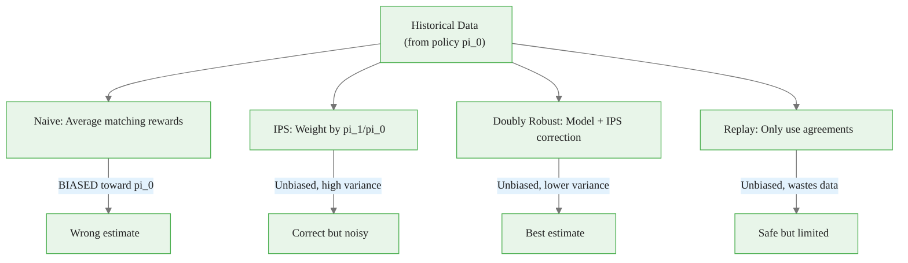
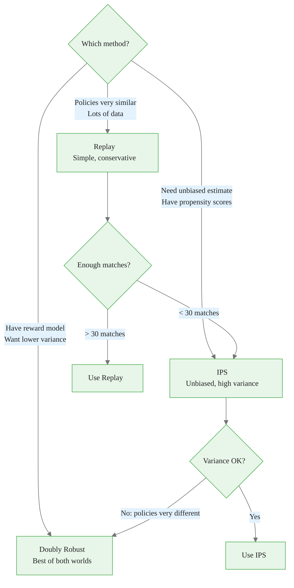
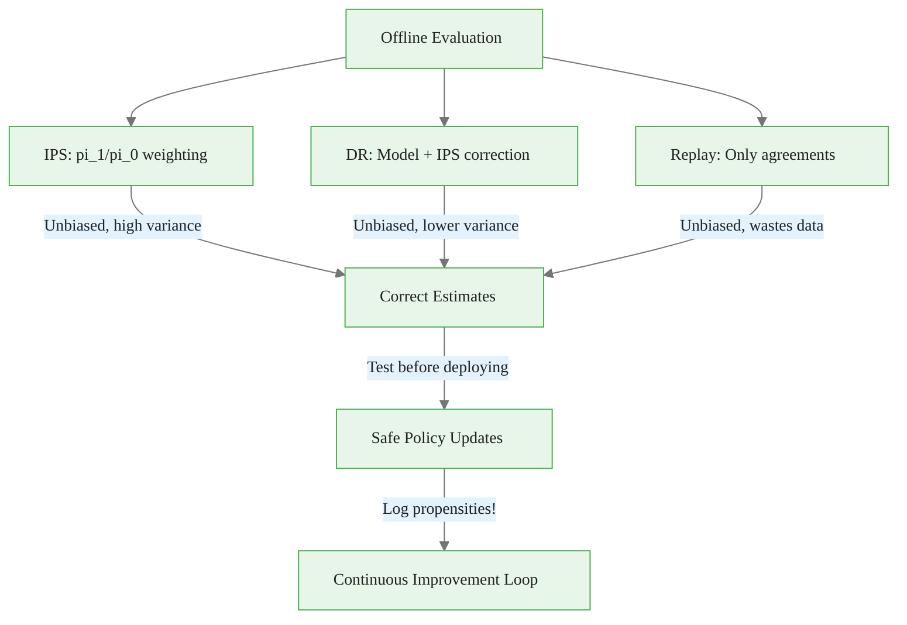

<!-- _class: lead -->

# Offline Evaluation

## Module 7: Production Systems
### Multi-Armed Bandits for Commodity Trading

<!-- Speaker notes: This deck covers Offline Evaluation. Set the context for the audience and explain how this topic fits into the broader course on multi-armed bandits for commodity trading. -->
---

## In Brief

Offline evaluation lets you test new bandit policies on **historical data** without deploying them to production.

> You can't just replay logged decisions with a new policy and compare rewards -- the historical policy chose those arms **for a reason**. This creates **selection bias**.

**Solution:** Use inverse propensity scoring and doubly-robust estimation to correct for bias.

<!-- Speaker notes: This opening summary sets the context for the entire deck. Read the key quote aloud and pause to let it sink in. The goal is to establish the core problem or concept before diving into details. -->

<div class="callout-key">

Bandits learn AND earn simultaneously -- the core advantage over traditional A/B testing.

</div>

---

## The Offline Evaluation Problem



<!-- Speaker notes: The diagram on The Offline Evaluation Problem illustrates the key relationships visually. Walk through the flow step by step, pointing out decision points and outcomes. Visual representations like this help students build mental models of the concepts. -->

<div class="callout-insight">

**Insight:** The exploration-exploitation tradeoff is not a fixed ratio -- it should adapt as uncertainty decreases over time.

</div>

---

## Why Naive Evaluation Fails

| Week | Context | Old Policy Chose | Prob $\pi_0$ | Reward |
|------|---------|-----------------|-------------|--------|
| 1 | VIX=20 | GOLD | 0.7 | 0.02 |
| 2 | VIX=25 | GOLD | 0.8 | 0.01 |
| 3 | VIX=18 | OIL | 0.3 | 0.03 |
| 4 | VIX=22 | GOLD | 0.75 | 0.015 |

New policy $\pi_1$ prefers OIL. But we only have **1 OIL sample**!

> Averaging only matching decisions biases toward $\pi_0$'s preferences.

<!-- Speaker notes: This comparison table on Why Naive Evaluation Fails is a key reference. Walk through each row, highlighting the most important distinctions. Students should understand when to use each option based on the criteria shown. -->

<div class="callout-warning">

**Warning:** Non-stationary reward distributions violate bandit assumptions. Always implement change detection in production systems.

</div>

---

## Three Evaluation Methods

<div class="columns">
<div>

### IPS (Inverse Propensity Scoring)
$$\hat{V}_{IPS}(\pi_1) = \frac{1}{n} \sum_{i=1}^n \frac{\pi_1(a_i|c_i)}{\pi_0(a_i|c_i)} r_i$$

Weight rare decisions that $\pi_1$ prefers more heavily.

### Replay Method
$$\hat{V}_{Replay} = \text{mean}(r_i : \pi_1(c_i) = a_i)$$

Only use samples where policies agree.

</div>
<div>

### Doubly Robust (DR)
$$\hat{V}_{DR} = \frac{1}{n} \sum_i \left[ \sum_a \pi_1(a|c_i)\hat{r}(c_i,a) + \frac{\pi_1(a_i|c_i)}{\pi_0(a_i|c_i)}(r_i - \hat{r}(c_i,a_i)) \right]$$

Use reward model as baseline, correct with IPS.

</div>
</div>

<!-- Speaker notes: The mathematical treatment of Three Evaluation Methods formalizes what we discussed intuitively. Walk through each variable and equation, relating them back to the commodity trading context. Ensure the audience follows the notation before moving on. -->

<div class="callout-info">

**Info:** The regret of the best bandit algorithms grows logarithmically with time, compared to linearly for A/B testing.

</div>

---

## Method Comparison



<!-- Speaker notes: The diagram on Method Comparison illustrates the key relationships visually. Walk through the flow step by step, pointing out decision points and outcomes. Visual representations like this help students build mental models of the concepts. -->
---

## Intuition: New Portfolio Manager

| Approach | Analogy |
|----------|---------|
| **Naive** | "Look at trades where I agree" -- biased! |
| **IPS** | "Weight by how much I like it vs how much they did. OIL trade: 50%/10% = 5x weight" |
| **DR** | "Build a returns model as baseline, correct with IPS for differences" |
| **Replay** | "Only count trades where we agree. Smaller sample, no tricks" |

<!-- Speaker notes: This comparison table on Intuition: New Portfolio Manager is a key reference. Walk through each row, highlighting the most important distinctions. Students should understand when to use each option based on the criteria shown. -->
---

## Code: IPS Estimator

<div class="code-window">
<div class="code-header">
<div class="dots"><span class="dot-red"></span><span class="dot-yellow"></span><span class="dot-green"></span></div>
<span class="filename">example.py</span>
</div>

```python
class OfflineEvaluator:
    def __init__(self, logged_data):
        self.data = logged_data  # context, action, reward, propensity

    def ips_estimate(self, new_policy):
        total = 0.0
        for record in self.data:
            context = record['context']
            action = record['action']
            reward = record['reward']
            old_prob = record['propensity']

            new_prob = new_policy.get_probability(context, action)
            weight = new_prob / (old_prob + 1e-10)  # IPS weight
            total += weight * reward

        return total / len(self.data)
```

</div>

<!-- Speaker notes: Walk through the code line by line. Highlight the key design decisions and explain why each parameter or function call matters. This code is copy-paste ready -- students can use it directly in their own projects. -->
---

## Code: Replay and Doubly Robust

<div class="code-window">
<div class="code-header">
<div class="dots"><span class="dot-red"></span><span class="dot-yellow"></span><span class="dot-green"></span></div>
<span class="filename">example.py</span>
</div>

```python
    def replay_estimate(self, new_policy):
        matching = [r['reward'] for r in self.data
                    if new_policy.select_arm(r['context']) == r['action']]
        return np.mean(matching) if len(matching) >= 30 else np.nan
```

</div>

<!-- Speaker notes: Code continues on the next slide. This first part sets up the structure. -->

---

## Code: Replay and Doubly Robust (continued)

```python
    def doubly_robust_estimate(self, new_policy, reward_model):
        total = 0.0
        for record in self.data:
            # Direct method: reward model predictions
            direct = sum(new_policy.get_probability(record['context'], a)
                        * reward_model.predict(record['context'], a)
                        for a in new_policy.get_arms())
            # IPS correction
            w = new_policy.get_probability(record['context'], record['action']) \
                / (record['propensity'] + 1e-10)
            correction = w * (record['reward'] -
                            reward_model.predict(record['context'], record['action']))
            total += direct + correction
        return total / len(self.data)
```

<!-- Speaker notes: Walk through the code line by line. Highlight the key design decisions and explain why each parameter or function call matters. This code is copy-paste ready -- students can use it directly in their own projects. -->
---

## Commodity Application

```python
# Historical data from Thompson Sampling policy
logged_data = [
    {'context': {'vix': 20, 'momentum': 0.05},
     'action': 'GOLD', 'reward': 0.02, 'propensity': 0.7},
    {'context': {'vix': 25, 'momentum': -0.02},
     'action': 'GOLD', 'reward': 0.01, 'propensity': 0.8},
    {'context': {'vix': 18, 'momentum': 0.08},
     'action': 'OIL', 'reward': 0.03, 'propensity': 0.3},
]

# Evaluate new LinUCB policy
evaluator = OfflineEvaluator(logged_data)
ips_value = evaluator.ips_estimate(new_linucb_policy)
dr_value = evaluator.doubly_robust_estimate(new_linucb_policy, reward_model)
print(f"IPS: {ips_value:.4f}, DR: {dr_value:.4f}")
```

<!-- Speaker notes: This code example for Commodity Application is production-ready. Walk through the implementation, noting any important design patterns or potential modifications for different use cases. -->
---

<!-- _class: lead -->

# Common Pitfalls

<!-- Speaker notes: Transition slide for the Common Pitfalls section. Pause briefly to let the audience absorb the previous content before moving into this new topic area. -->
---

## Four Key Pitfalls

| Pitfall | Problem | Fix |
|---------|---------|-----|
| Missing propensities | Can't compute IPS weights | Always log $\pi_0(a|c)$ with decisions |
| Zero propensities | $\pi_0(a|c) = 0$ makes IPS weight infinite | Use $\epsilon$-greedy logging, clip propensities |
| High variance IPS | Policies very different, huge weights | Switch to doubly robust estimator |
| Small replay overlap | $< 30$ matching samples | Don't trust replay, use IPS or DR instead |

<!-- Speaker notes: Walk through Four Key Pitfalls carefully. Emphasize why this mistake is common and how to recognize it in practice. The commodity trading example makes it concrete -- ask if anyone has encountered this in their own work. -->
---

## Connections

<div class="columns">
<div>

### Builds On
- **Module 0:** Expected value, regret
- **Logging guide:** Need logged propensities
- **Contextual bandits:** Policy probabilities

</div>
<div>

### Leads To
- **Safe deployment:** Validate offline before deploying
- **Continuous improvement:** eval, deploy, log, repeat
- **Counterfactual reasoning:** What if we had chosen differently?
- **Causal inference:** Propensity score matching

</div>
</div>

<!-- Speaker notes: The connections section shows how this topic links to the rest of the course. Highlight the 'Builds On' prerequisites to remind students of what they should already know, and use 'Leads To' to create anticipation for upcoming modules. -->
---

## Visual Summary



<!-- Speaker notes: This visual summary captures the key relationships from the entire deck. Walk through each branch of the diagram, connecting back to the main concepts covered. This slide works well as a reference -- encourage students to screenshot it for later review. -->