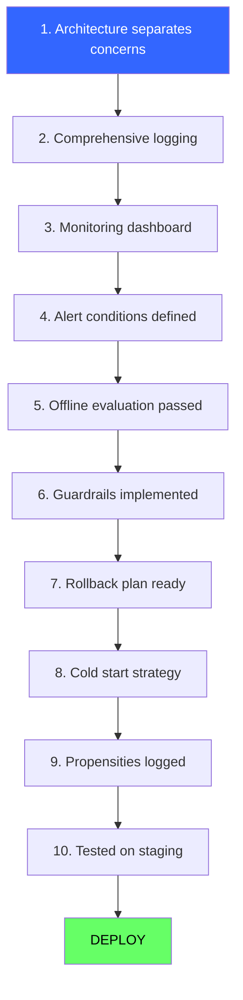
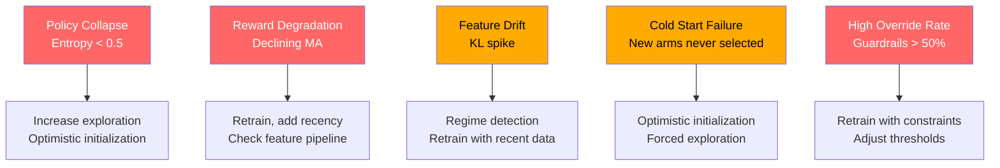
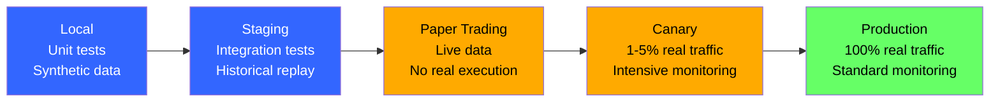
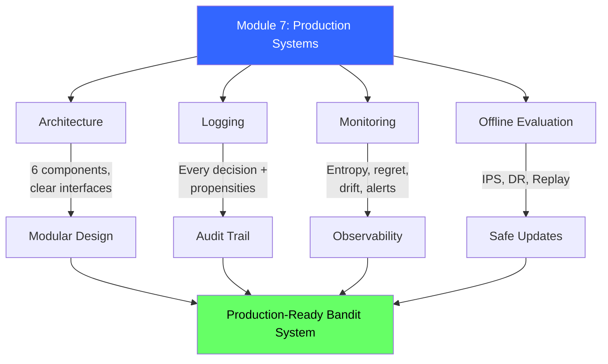

<!-- _class: lead -->

# Production Systems Cheatsheet

## Module 7 Quick Reference
### Multi-Armed Bandits for Commodity Trading

<!-- Speaker notes: This deck covers Production Systems Cheatsheet. Set the context for the audience and explain how this topic fits into the broader course on multi-armed bandits for commodity trading. -->
---

## Pre-Deployment Checklist



<!-- Speaker notes: This checklist is a practical tool for real-world application. Suggest students save or print this for reference when implementing their own systems. Walk through each item briefly, explaining why it matters. -->
---

## System Architecture Quick Reference

| Component | Interface | Purpose |
|-----------|-----------|---------|
| **Arm Registry** | `get_active_arms()` | Manage tradable assets |
| **Policy Engine** | `select_arm(context, arms)` | Choose allocation |
| **Guardrails** | `validate(arm, context)` | Risk management |
| **Logger** | `log_decision(...)` | Audit trail |
| **Reward Tracker** | `log_reward(id, reward)` | Track outcomes |
| **Monitor** | `check_alerts()` | Detect failures |

<!-- Speaker notes: This comparison table on System Architecture Quick Reference is a key reference. Walk through each row, highlighting the most important distinctions. Students should understand when to use each option based on the criteria shown. -->
---

## What to Log (Per Decision)

<div class="columns">
<div>

### Decision (immediate)
```json
{
  "timestamp": "ISO-8601",
  "decision_id": "unique-id",
  "policy_version": "v2.1",
  "context": {"vix": 18.5},
  "active_arms": ["GOLD", "OIL"],
  "policy_scores": {"GOLD": 0.7},
  "selected_arm": "GOLD",
  "guardrail_override": false,
  "final_arm": "GOLD"
}
```

</div>
<div>

### Reward (when observed)
```json
{
  "decision_id": "unique-id",
  "reward": 0.023,
  "reward_timestamp": "ISO-8601"
}
```

> Always log **propensity scores** $\pi(a|c)$ to enable future offline evaluation.

</div>
</div>

<!-- Speaker notes: This slide connects theory to implementation for What to Log (Per Decision). Start with the mathematical formulation, then show how each term maps to a line of code. This bridge between theory and practice is one of the most valuable aspects of the course. -->
---

## Monitoring Metrics

| Metric | Formula | Alert | Meaning |
|--------|---------|-------|---------|
| Cumulative Regret | $\sum_t (\hat{\mu}^* - \hat{\mu}_{a_t})$ | Growing linearly | Suboptimal picks |
| Selection Entropy | $-\sum_a p_a \log p_a$ | < 0.5 or > 1.5 | Collapse or no learning |
| Reward Moving Avg | $\text{MA}(r, w=20)$ | < baseline $- 2\sigma$ | Degradation |
| Feature Drift | $D_{KL}(P_{\text{recent}} \|\| P_{\text{hist}})$ | > threshold | Regime change |
| Arm Pull Balance | max/min counts | > 10x | Extreme imbalance |

<!-- Speaker notes: This comparison table on Monitoring Metrics is a key reference. Walk through each row, highlighting the most important distinctions. Students should understand when to use each option based on the criteria shown. -->
---

## Offline Evaluation Formulas

<div class="columns">
<div>

### IPS
$$\hat{V}_{IPS} = \frac{1}{n} \sum_i \frac{\pi_1(a_i|c_i)}{\pi_0(a_i|c_i)} r_i$$

- Unbiased if propensities correct
- High variance if policies differ

### Replay
$$\hat{V}_{Replay} = \text{mean}(r_i : \pi_1(c_i) = a_i)$$

- Simple, no corrections
- Throws away most data

</div>
<div>

### Doubly Robust
$$\hat{V}_{DR} = \frac{1}{n} \sum_i \left[ \sum_a \pi_1 \hat{r} + \frac{\pi_1}{\pi_0}(r_i - \hat{r}) \right]$$

- Lower variance
- Correct if either model OR propensities right

</div>
</div>

<!-- Speaker notes: The mathematical treatment of Offline Evaluation Formulas formalizes what we discussed intuitively. Walk through each variable and equation, relating them back to the commodity trading context. Ensure the audience follows the notation before moving on. -->
---

## Common Failure Modes



<!-- Speaker notes: The diagram on Common Failure Modes illustrates the key relationships visually. Walk through the flow step by step, pointing out decision points and outcomes. Visual representations like this help students build mental models of the concepts. -->
---

## A/B to Bandit Migration

| Phase | Duration | Traffic | What to Do |
|-------|----------|---------|------------|
| **1. Parallel Logging** | Week 1-2 | 100% A/B | Simulate bandit offline, log everything |
| **2. Hybrid Mode** | Week 3-6 | 50/50 | Run both, monitor, ensure stat power |
| **3. Burn-In** | Week 7-10 | 100% bandit | Forced exploration $\epsilon=0.3$ then reduce |
| **4. Full Deploy** | Week 11+ | 100% bandit | Normal exploration, continuous monitoring |

<!-- Speaker notes: This comparison table on A/B to Bandit Migration is a key reference. Walk through each row, highlighting the most important distinctions. Students should understand when to use each option based on the criteria shown. -->
---

## Production Code Template

```python
class ProductionBanditSystem:
    def __init__(self, policy, guardrails, logger, monitor):
        self.registry = ArmRegistry()
        self.policy = policy
        self.guardrails = guardrails
        self.logger = logger
        self.monitor = monitor
```

<!-- Speaker notes: Code continues on the next slide. This first part sets up the structure. -->

---

## Production Code Template (continued)

```python
    def make_decision(self, context):
        arms = self.registry.get_active_arms()
        selected = self.policy.select_arm(context, arms)
        final = self.guardrails.validate(selected, context)
        decision_id = self.logger.log_decision(
            context=context,
            policy_scores=self.policy.get_scores(context, arms),
            selected_arm=selected, final_arm=final)
        return final, decision_id

    def record_reward(self, decision_id, arm, reward):
        self.logger.log_reward(decision_id, reward)
        self.policy.update(arm, reward)
        self.monitor.update(arm, reward)
```

<!-- Speaker notes: Walk through the code line by line. Highlight the key design decisions and explain why each parameter or function call matters. This code is copy-paste ready -- students can use it directly in their own projects. -->
---

## Deployment Environments



<!-- Speaker notes: The diagram on Deployment Environments illustrates the key relationships visually. Walk through the flow step by step, pointing out decision points and outcomes. Visual representations like this help students build mental models of the concepts. -->
---

## Alert Urgency Guide

| Urgency | Condition | Action |
|---------|-----------|--------|
| **Immediate** | Entropy < 0.3, reward < baseline $- 3\sigma$, all overrides | Stop, investigate, rollback |
| **24-hour** | Entropy < 0.5, reward < baseline $- 2\sigma$, drift detected | Investigate root cause |
| **Weekly** | All other metrics, performance review, arm distribution | Review and tune |

<!-- Speaker notes: This comparison table on Alert Urgency Guide is a key reference. Walk through each row, highlighting the most important distinctions. Students should understand when to use each option based on the criteria shown. -->
---

## Algorithm Quick Reference

<div class="columns">
<div>

### Policy Selection
- **$\epsilon$-greedy:** Simple, explainable
- **Thompson Sampling:** Probabilistic, multi-modal
- **UCB:** Theoretical bounds, deterministic
- **LinUCB:** Contextual, linear rewards
- **Neural:** Non-linear, lots of data

</div>
<div>

### Offline Evaluation
- **IPS:** Moderate policy differences
- **DR:** Have reward model
- **Replay:** Policies similar, abundant data

</div>
</div>

<!-- Speaker notes: The mathematical treatment of Algorithm Quick Reference formalizes what we discussed intuitively. Walk through each variable and equation, relating them back to the commodity trading context. Ensure the audience follows the notation before moving on. -->
---

## Visual Summary



<!-- Speaker notes: This visual summary captures the key relationships from the entire deck. Walk through each branch of the diagram, connecting back to the main concepts covered. This slide works well as a reference -- encourage students to screenshot it for later review. -->