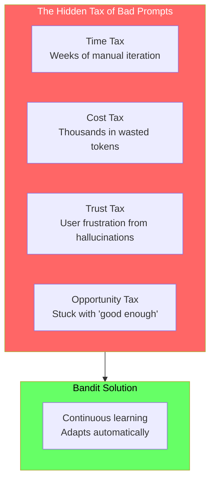
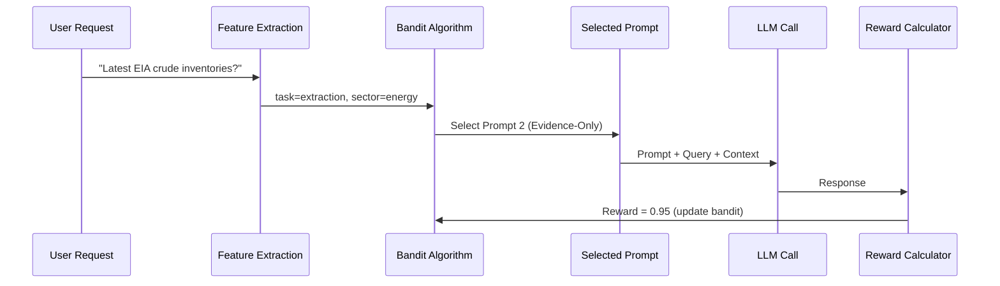
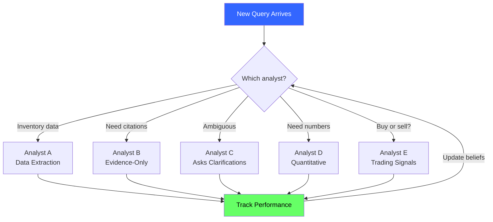
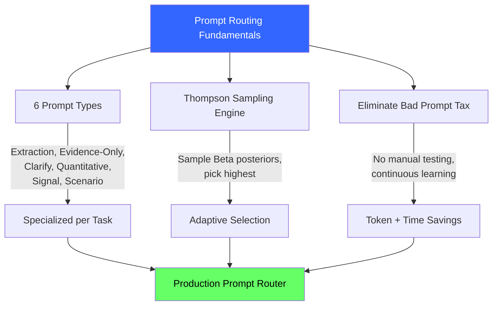

<!-- _class: lead -->

# Prompt Routing Fundamentals

## Module 8: Prompt Routing Bandits
### Multi-Armed Bandits for Commodity Trading

<!-- Speaker notes: This deck covers Prompt Routing Fundamentals. Set the context for the audience and explain how this topic fits into the broader course on multi-armed bandits for commodity trading. -->
---

## In Brief

Prompt routing bandits treat each **prompt template** as an "arm." The system learns which prompt works best for each request type by balancing exploration and exploitation.

> Prompts are a **perfect bandit problem**: sequential decisions, fast feedback, changing environment, expensive exploration.

**Eliminates the "Bad Prompt Tax"** -- the cost of using suboptimal prompts while you manually iterate.

<!-- Speaker notes: This opening summary sets the context for the entire deck. Read the key quote aloud and pause to let it sink in. The goal is to establish the core problem or concept before diving into details. -->
---

## The Bad Prompt Tax



<!-- Speaker notes: The diagram on The Bad Prompt Tax illustrates the key relationships visually. Walk through the flow step by step, pointing out decision points and outcomes. Visual representations like this help students build mental models of the concepts. -->
---

## Prompt Routing Architecture



<!-- Speaker notes: The diagram on Prompt Routing Architecture illustrates the key relationships visually. Walk through the flow step by step, pointing out decision points and outcomes. Visual representations like this help students build mental models of the concepts. -->
---

## Six Prompt Arms for Commodity Trading

| Prompt Type | Purpose | Best For |
|-------------|---------|----------|
| **Structured Extraction** | Pull data into schema | EIA tables, USDA data |
| **Evidence-Only (RAG-safe)** | Require citations | Accuracy-critical queries |
| **Clarify-First** | Ask before answering | Ambiguous requests |
| **Quantitative Analysis** | Stats and trends | Fundamental analysis |
| **Trading Signal** | Buy/sell/hold | Decision support |
| **Scenario Analysis** | Bull/base/bear | Risk assessment |

<!-- Speaker notes: This comparison table on Six Prompt Arms for Commodity Trading is a key reference. Walk through each row, highlighting the most important distinctions. Students should understand when to use each option based on the criteria shown. -->
---

## Formal Definition

A **prompt routing bandit**:

- **Arms $K$:** Set of prompt templates $\{p_1, p_2, \ldots, p_K\}$
- **Context $x_t$:** Features of request at time $t$
- **Action $a_t$:** Selected prompt $p_j \in K$
- **Reward $r_t$:** Quality score of LLM response
- **Policy $\pi$:** Mapping from context to prompt selection

**Objective:** Maximize cumulative reward (minimize regret):

$$\max \sum_{t=1}^T \mathbb{E}[r_t \mid x_t, a_t = \pi(x_t)]$$

<!-- Speaker notes: This is the formal mathematical treatment. Walk through each symbol and equation carefully, connecting back to the intuitive explanation from the previous slides. Do not rush this slide -- pause after each equation to ensure comprehension. -->
---

## Code: Minimal Prompt Router

```python
class PromptRouter:
    def __init__(self, prompts):
        self.prompts = prompts
        self.successes = np.ones(len(prompts))  # Beta prior alpha
        self.failures = np.ones(len(prompts))   # Beta prior beta

    def select_prompt(self):
        """Thompson Sampling: sample from Beta posterior."""
        samples = [np.random.beta(s, f)
                   for s, f in zip(self.successes, self.failures)]
        return np.argmax(samples)

    def update(self, prompt_idx, reward):
        if reward > 0.7:  # Success threshold
            self.successes[prompt_idx] += 1
        else:
            self.failures[prompt_idx] += 1
```

<!-- Speaker notes: Walk through the code line by line. Highlight the key design decisions and explain why each parameter or function call matters. This code is copy-paste ready -- students can use it directly in their own projects. -->
---

## Usage Loop

```python
prompts = [
    "Structured extraction prompt...",
    "Evidence-only prompt...",
    "Quantitative analysis prompt...",
]
router = PromptRouter(prompts)

for request in requests:
    # Select prompt using Thompson Sampling
    idx = router.select_prompt()
    prompt = prompts[idx]
```

<!-- Speaker notes: Code continues on the next slide. This first part sets up the structure. -->

---

## Usage Loop (continued)

```python
    # Generate response
    response = llm_call(prompt, request)

    # Calculate reward (quality score)
    reward = evaluate_response(response, request)

    # Update bandit
    router.update(idx, reward)
```

<!-- Speaker notes: This code example for Usage Loop is production-ready. Walk through the implementation, noting any important design patterns or potential modifications for different use cases. -->
---

## Analyst Analogy



> Like learning which analyst to trust for each market -- but with prompts.

<!-- Speaker notes: The diagram on Analyst Analogy illustrates the key relationships visually. Walk through the flow step by step, pointing out decision points and outcomes. Visual representations like this help students build mental models of the concepts. -->
---

<!-- _class: lead -->

# Common Pitfalls

<!-- Speaker notes: Transition slide for the Common Pitfalls section. Pause briefly to let the audience absorb the previous content before moving into this new topic area. -->
---

## Five Key Pitfalls

| Pitfall | Why It Fails | Bandit Solution |
|---------|-------------|-----------------|
| "I'll pick the best prompt manually" | What works today changes tomorrow | Continuous learning adapts |
| "I need 20 prompts" | Too many arms = slow convergence | Start with 5-8, use context |
| "User thumbs-up = good reward" | Users like confident hallucinations | Composite rewards + guardrails |
| "One prompt to rule them all" | Mediocre at everything | Specialized prompts per task |
| "Reward based on output length" | Trains verbose rambling | Reward task completion, not words |

<!-- Speaker notes: Walk through Five Key Pitfalls carefully. Emphasize why this mistake is common and how to recognize it in practice. The commodity trading example makes it concrete -- ask if anyone has encountered this in their own work. -->
---

## Connections

<div class="columns">
<div>

### Builds On
- **Module 0:** Explore-exploit tradeoff
- **Module 2:** Thompson Sampling engine
- **Module 3:** Contextual bandits for routing

</div>
<div>

### Leads To
- **Reward design:** Measuring prompt quality
- **Contextual routing:** Adapting to request features
- **Case studies:** Real commodity systems
- **GenAI for Commodities:** Production RAG architecture

</div>
</div>

<!-- Speaker notes: The connections section shows how this topic links to the rest of the course. Highlight the 'Builds On' prerequisites to remind students of what they should already know, and use 'Leads To' to create anticipation for upcoming modules. -->
---

## Visual Summary



<!-- Speaker notes: This visual summary captures the key relationships from the entire deck. Walk through each branch of the diagram, connecting back to the main concepts covered. This slide works well as a reference -- encourage students to screenshot it for later review. -->