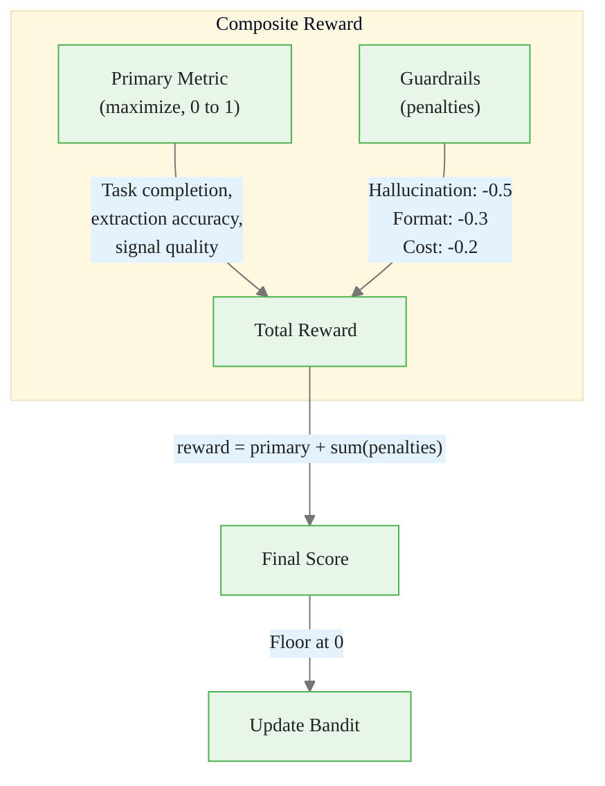
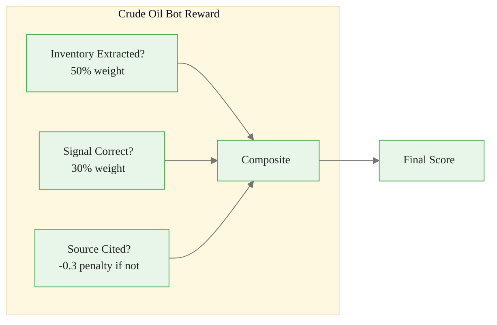
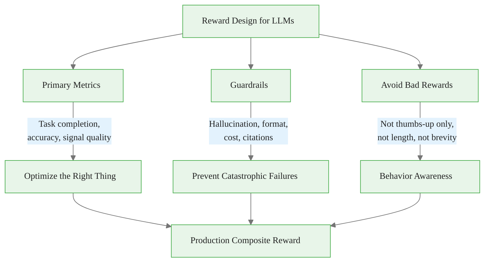

<!-- _class: lead -->

# Reward Function Design for LLM Systems

## Module 8: Prompt Routing Bandits
### Multi-Armed Bandits for Commodity Trading

<!-- Speaker notes: This deck covers Reward Function Design for LLM Systems. Set the context for the audience and explain how this topic fits into the broader course on multi-armed bandits for commodity trading. -->
---

## In Brief

The reward function is the **MOST IMPORTANT** design decision in prompt routing bandits.

> Bad rewards produce bad behavior -- in subtle ways. If you reward only user satisfaction, you train a system that tells users what they want to hear (even if it's wrong).

**Solution:** Primary metric + guardrails. Optimize for task completion, penalize hallucinations.

<!-- Speaker notes: This opening summary sets the context for the entire deck. Read the key quote aloud and pause to let it sink in. The goal is to establish the core problem or concept before diving into details. -->

<div class="callout-key">

Bandits learn AND earn simultaneously -- the core advantage over traditional A/B testing.

</div>

---

## Bad Rewards and What They Produce

| Bad Reward | What It Trains | Real Example |
|------------|---------------|--------------|
| **Thumbs-up only** | Confident hallucinations | "Oil will hit $100 by March" (no evidence) |
| **Brevity only** | Useless one-word answers | "Bearish." (no analysis) |
| **No follow-ups** | Confident guessing | Guesses Dec corn futures, makes up 8% |
| **Output length** | Verbose token-wasting | 200 words, still hasn't answered the question |

<!-- Speaker notes: This comparison table on Bad Rewards and What They Produce is a key reference. Walk through each row, highlighting the most important distinctions. Students should understand when to use each option based on the criteria shown. -->

<div class="callout-insight">

**Insight:** The exploration-exploitation tradeoff is not a fixed ratio -- it should adapt as uncertainty decreases over time.

</div>

---

## The Operator Trick



$$\text{reward} = \text{primary\_metric} + \sum(\text{guardrail\_penalties})$$

<!-- Speaker notes: The diagram on The Operator Trick illustrates the key relationships visually. Walk through the flow step by step, pointing out decision points and outcomes. Visual representations like this help students build mental models of the concepts. -->

<div class="callout-warning">

**Warning:** Non-stationary reward distributions violate bandit assumptions. Always implement change detection in production systems.

</div>

---

## Four Primary Metrics

<div class="columns">
<div>

### Task Completion
Did it answer what was asked?
<div class="code-window">
<div class="code-header">
<div class="dots"><span class="dot-red"></span><span class="dot-yellow"></span><span class="dot-green"></span></div>
<span class="filename">example.py</span>
</div>

```python
# Automated: check required fields
# LLM-as-judge: "Did this answer?"
# Human labels: sample 5%
```

</div>

### Extraction Accuracy
Are the numbers right?
```python
# Compare to ground truth
# Schema compliance check
# Spot-check samples
```

</div>
<div>

### Signal Quality
Was the signal directionally correct?
```python
# Backtest against outcomes
# Conviction calibration
# Consistency check
```

### Research Completeness
Did it cover all dimensions?
```python
# supply, demand, inventory, price
# Source diversity
# Uncertainty flagging
```

</div>
</div>

<!-- Speaker notes: This code example for Four Primary Metrics is production-ready. Walk through the implementation, noting any important design patterns or potential modifications for different use cases. -->

<div class="callout-info">

**Info:** The regret of the best bandit algorithms grows logarithmically with time, compared to linearly for A/B testing.

</div>

---

## Four Guardrails

| Guardrail | Penalty | What It Catches |
|-----------|---------|-----------------|
| **Hallucination Detection** | -0.3 to -0.5 per claim | Unsupported factual claims |
| **Format Compliance** | -0.3 to -0.5 | Invalid JSON, missing fields |
| **Cost/Latency Budget** | -0.1 to -0.2 | Excessive tokens or response time |
| **Citation Verification** | -0.2 | Missing or invalid source references |

> **Hallucination penalty must be severe** -- otherwise the bandit learns to hallucinate confidently.

<!-- Speaker notes: This comparison table on Four Guardrails is a key reference. Walk through each row, highlighting the most important distinctions. Students should understand when to use each option based on the criteria shown. -->
---

## Code: Hallucination Detection

<div class="code-window">
<div class="code-header">
<div class="dots"><span class="dot-red"></span><span class="dot-yellow"></span><span class="dot-green"></span></div>
<span class="filename">example.py</span>
</div>

```python
def hallucination_penalty(response, retrieved_docs):
    """Penalize claims not supported by sources."""
    claims = extract_factual_claims(response)

    unsupported_claims = 0
    for claim in claims:
        if not any(claim_in_doc(claim, doc) for doc in retrieved_docs):
            unsupported_claims += 1

    return -0.3 * unsupported_claims  # Heavy penalty
```

</div>

```python
def format_compliance_score(response, expected_format):
    if expected_format == "json":
        try:
            json.loads(response)
            return 0.0   # No penalty
        except:
            return -0.5  # Major penalty
    return 0.0
```

<!-- Speaker notes: Walk through the code line by line. Highlight the key design decisions and explain why each parameter or function call matters. This code is copy-paste ready -- students can use it directly in their own projects. -->
---

## Code: Composite Reward

```python
def compute_reward(query, response, retrieved_docs,
                   ground_truth=None, actual_outcome=None):
    # Primary metric: task completion (required)
    primary = task_completion_score(query, response)

    # Secondary metrics (if applicable)
    if ground_truth:
        primary += 0.3 * extraction_accuracy(response, ground_truth)
    if actual_outcome:
        primary += 0.3 * signal_quality(response, actual_outcome)
```

<!-- Speaker notes: Code continues on the next slide. This first part sets up the structure. -->

---

## Code: Composite Reward (continued)

```python
    primary = min(primary, 1.0)  # Normalize to [0, 1]

    # Guardrails (penalties)
    hallucination_pen = hallucination_penalty(response, retrieved_docs)
    format_pen = format_compliance_score(response, "auto")
    citation_pen = citation_score(response, retrieved_docs)

    reward = primary + hallucination_pen + format_pen + citation_pen
    return max(reward, 0.0)  # Floor at 0
```

<!-- Speaker notes: Walk through the code line by line. Highlight the key design decisions and explain why each parameter or function call matters. This code is copy-paste ready -- students can use it directly in their own projects. -->
---

## Commodity Example: Crude Oil Bot



```python
def crude_oil_bot_reward(query, response, eia_report, price_outcome=None):
    inventory_extracted = 1.0 if correct_number else 0.5 if has_number else 0.0
    hallucination_pen = -0.3 if no_source_cited else 0.0
    signal_reward = signal_quality(response, price_outcome) if price_outcome else 0.0
    return max(0, 0.5 * inventory_extracted + 0.3 * signal_reward + hallucination_pen)
```

<!-- Speaker notes: The diagram on Commodity Example: Crude Oil Bot illustrates the key relationships visually. Walk through the flow step by step, pointing out decision points and outcomes. Visual representations like this help students build mental models of the concepts. -->
---

## Junior Analyst Analogy

Think of reward design like evaluating a junior analyst:

| What You Evaluate | Prompt Routing Equivalent |
|-------------------|--------------------------|
| Did they answer the research question? | **Task completion** (primary) |
| Did they make up any numbers? | **Hallucination penalty** (guardrail) |
| Did they format the report properly? | **Format compliance** (guardrail) |
| Did they spend 10 hours on a 1-hour task? | **Cost penalty** (guardrail) |

> Reward what you actually care about. Penalize behaviors that cause long-term problems.

<!-- Speaker notes: This comparison table on Junior Analyst Analogy is a key reference. Walk through each row, highlighting the most important distinctions. Students should understand when to use each option based on the criteria shown. -->
---

<!-- _class: lead -->

# Common Pitfalls

<!-- Speaker notes: Transition slide for the Common Pitfalls section. Pause briefly to let the audience absorb the previous content before moving into this new topic area. -->
---

## Four Key Pitfalls

| Pitfall | What Happens | Fix |
|---------|-------------|-----|
| Reward only user satisfaction | Trains confident hallucinations | Add hallucination guardrail with heavy penalty |
| Binary rewards (1 or 0) | Can't distinguish "close" from "terrible" | Use continuous rewards: 0.7, 0.4, 0.0 |
| LLM-as-judge for everything | Expensive, slow, biased | Automated checks where possible |
| One reward for all tasks | Extraction reward fails for signals | Task-specific or contextual rewards |

<!-- Speaker notes: Walk through Four Key Pitfalls carefully. Emphasize why this mistake is common and how to recognize it in practice. The commodity trading example makes it concrete -- ask if anyone has encountered this in their own work. -->
---

## Connections

<div class="columns">
<div>

### Builds On
- **Module 2:** Thompson Sampling (reward = Beta update)
- **Module 5:** Same reward design principles (primary + risk guardrails)

</div>
<div>

### Leads To
- **Contextual routing:** Reward as optimization target
- **Case studies:** Real commodity reward functions
- **Production systems:** Monitoring reward trends

</div>
</div>

<!-- Speaker notes: The connections section shows how this topic links to the rest of the course. Highlight the 'Builds On' prerequisites to remind students of what they should already know, and use 'Leads To' to create anticipation for upcoming modules. -->
---

## Visual Summary



<!-- Speaker notes: This visual summary captures the key relationships from the entire deck. Walk through each branch of the diagram, connecting back to the main concepts covered. This slide works well as a reference -- encourage students to screenshot it for later review. -->