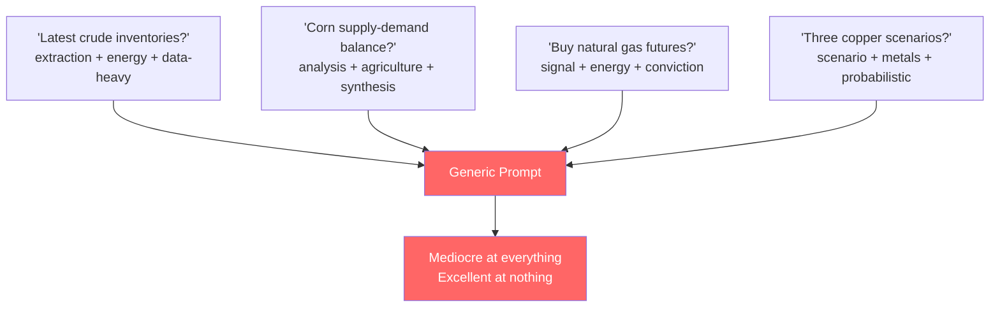
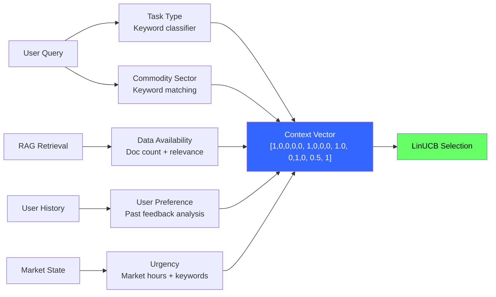
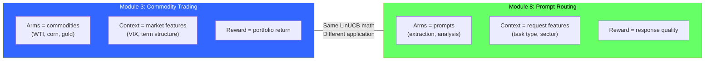
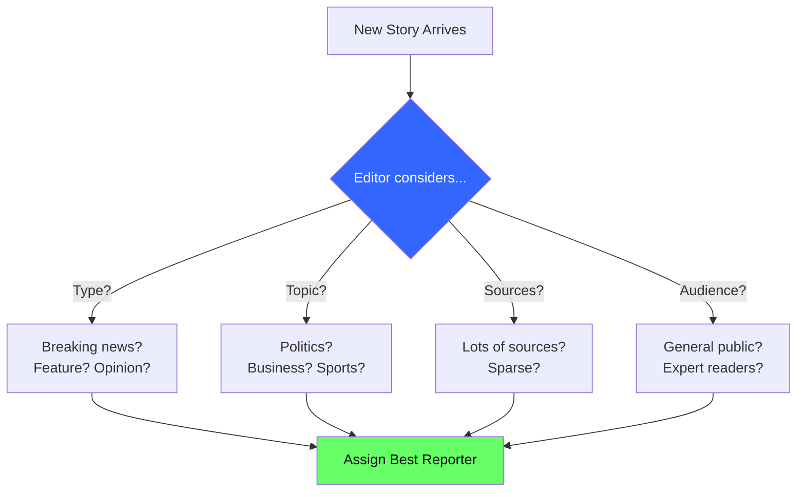
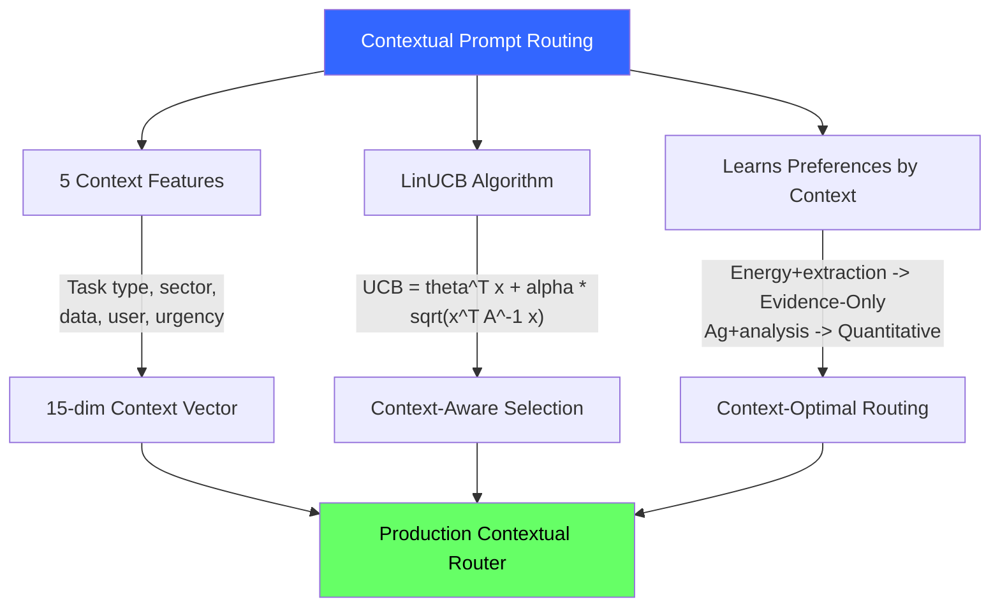

<!-- _class: lead -->

# Contextual Prompt Routing

## Module 8: Prompt Routing Bandits
### Multi-Armed Bandits for Commodity Trading

<!-- Speaker notes: This deck covers Contextual Prompt Routing. Set the context for the audience and explain how this topic fits into the broader course on multi-armed bandits for commodity trading. -->
---

## In Brief

One prompt cannot serve all requests. Contextual bandits route based on **request features** -- task type, commodity sector, data availability, urgency -- to select the best prompt for each context.

> Non-contextual: "Prompt B is best on average."
> Contextual: "Prompt B is best for **energy extraction when data is available**; Prompt D is best for **agriculture analysis when data is sparse**."

<!-- Speaker notes: This opening summary sets the context for the entire deck. Read the key quote aloud and pause to let it sink in. The goal is to establish the core problem or concept before diving into details. -->
---

## Why One Prompt Fails



> The same task type (extraction) may need different prompts for different sectors.

<!-- Speaker notes: The diagram on Why One Prompt Fails illustrates the key relationships visually. Walk through the flow step by step, pointing out decision points and outcomes. Visual representations like this help students build mental models of the concepts. -->
---

## Five Context Features

| Feature | Values | Why It Matters |
|---------|--------|---------------|
| **Task Type** | extraction, analysis, signal, scenario | Different prompts for different jobs |
| **Commodity Sector** | energy, agriculture, metals | Different data characteristics |
| **Data Availability** | high, medium, low | Evidence-only works only with rich retrieval |
| **User Preference** | concise, balanced, detailed | Match output style to user |
| **Urgency** | high, medium, low | Trading hours need fast prompts |

<!-- Speaker notes: This comparison table on Five Context Features is a key reference. Walk through each row, highlighting the most important distinctions. Students should understand when to use each option based on the criteria shown. -->
---

## Feature Extraction Pipeline



<!-- Speaker notes: The diagram on Feature Extraction Pipeline illustrates the key relationships visually. Walk through the flow step by step, pointing out decision points and outcomes. Visual representations like this help students build mental models of the concepts. -->
---

## LinUCB for Prompt Routing

Expected reward of prompt $p$ for context $x$:

$$\text{UCB}_p = \theta_p^T x + \alpha \sqrt{x^T A_p^{-1} x}$$

Where:
- $\theta_p = A_p^{-1} b_p$ = learned weights for prompt $p$
- $\alpha$ = exploration parameter
- First term = expected reward, second = uncertainty bonus

**Update after observing reward $r$:**
$$A_p \leftarrow A_p + x x^T, \quad b_p \leftarrow b_p + r \cdot x$$

<!-- Speaker notes: The mathematical treatment of LinUCB for Prompt Routing formalizes what we discussed intuitively. Walk through each variable and equation, relating them back to the commodity trading context. Ensure the audience follows the notation before moving on. -->
---

## Code: ContextualPromptRouter

```python
class ContextualPromptRouter:
    def __init__(self, num_prompts, context_dim, alpha=1.0):
        self.A = [np.identity(context_dim) for _ in range(num_prompts)]
        self.b = [np.zeros(context_dim) for _ in range(num_prompts)]
        self.alpha = alpha
```

<!-- Speaker notes: Code continues on the next slide. This first part sets up the structure. -->

---

## Code: ContextualPromptRouter (continued)

```python
    def select_prompt(self, context):
        ucb_scores = []
        for i in range(len(self.A)):
            A_inv = np.linalg.inv(self.A[i])
            theta = A_inv @ self.b[i]
            expected = theta @ context
            uncertainty = np.sqrt(context @ A_inv @ context)
            ucb_scores.append(expected + self.alpha * uncertainty)
        return np.argmax(ucb_scores)

    def update(self, prompt_idx, context, reward):
        self.A[prompt_idx] += np.outer(context, context)
        self.b[prompt_idx] += reward * context
```

<!-- Speaker notes: Walk through the code line by line. Highlight the key design decisions and explain why each parameter or function call matters. This code is copy-paste ready -- students can use it directly in their own projects. -->
---

## Building the Context Vector

```python
def build_context_vector(query, retrieved_docs, user_profile, market_state):
    features = []

    # Task type (one-hot, 5 features)
    task = classify_task_type(query)
    features.extend([1 if task == t else 0
                     for t in ['extraction','analysis','signal','scenario','general']])

    # Commodity sector (one-hot, 4 features)
    sector = classify_commodity_sector(query)
    features.extend([1 if sector == s else 0
                     for s in ['energy','agriculture','metals','unknown']])
```

<!-- Speaker notes: Code continues on the next slide. This first part sets up the structure. -->

---

## Building the Context Vector (continued)

```python
    # Data availability (continuous, 1 feature)
    features.append({'high':1.0,'medium':0.5,'low':0.0}[assess_data(retrieved_docs)])

    # User preference (one-hot, 3 features)
    # Urgency (continuous, 1 feature)
    # Intercept (1 feature)
    # ... Total: 15 features
    return np.array(features)
```

<!-- Speaker notes: This code example for Building the Context Vector is production-ready. Walk through the implementation, noting any important design patterns or potential modifications for different use cases. -->
---

## Complete Routing System

```python
class CommodityPromptRouter:
    def __init__(self, prompts):
        self.prompts = prompts
        self.router = ContextualPromptRouter(len(prompts), context_dim=15)

    def route(self, query, retrieved_docs, user_profile, market_state):
        context = build_context_vector(query, retrieved_docs,
                                       user_profile, market_state)
        idx = self.router.select_prompt(context)
        return idx, self.prompts[idx], context

    def update(self, prompt_idx, context, reward):
        self.router.update(prompt_idx, context, reward)
```

<!-- Speaker notes: This code example for Complete Routing System is production-ready. Walk through the implementation, noting any important design patterns or potential modifications for different use cases. -->
---

## What the Router Learns

After 1000 requests:

| Context | Best Prompt | Win Rate | Avg Reward |
|---------|------------|----------|------------|
| Energy + extraction + high data | Evidence-Only | 70% | 0.85 |
| Agriculture + analysis + low data | Quantitative | 65% | 0.78 |
| Any sector + signal + medium data | Trading Signal | 80% | 0.82 |
| Metals + scenario + high urgency | Scenario Analysis | 55% | 0.74 |

> The router discovers context-dependent preferences automatically.

<!-- Speaker notes: This comparison table on What the Router Learns is a key reference. Walk through each row, highlighting the most important distinctions. Students should understand when to use each option based on the criteria shown. -->
---

## Connection to Module 3



<!-- Speaker notes: The diagram on Connection to Module 3 illustrates the key relationships visually. Walk through the flow step by step, pointing out decision points and outcomes. Visual representations like this help students build mental models of the concepts. -->
---

## Newsroom Analogy



> A contextual prompt router is an automated editor assigning the right reporter.

<!-- Speaker notes: The diagram on Newsroom Analogy illustrates the key relationships visually. Walk through the flow step by step, pointing out decision points and outcomes. Visual representations like this help students build mental models of the concepts. -->
---

<!-- _class: lead -->

# Common Pitfalls

<!-- Speaker notes: Transition slide for the Common Pitfalls section. Pause briefly to let the audience absorb the previous content before moving into this new topic area. -->
---

## Four Key Pitfalls

| Pitfall | Problem | Fix |
|---------|---------|-----|
| Too many features (50+) | Slow learning, need more data | Start with 10-15 most predictive |
| Sparse features | 95% energy, no agriculture data | Force exploration of undersampled contexts |
| Irrelevant features | "Day of week" doesn't affect prompt | Feature selection -- test if removing hurts |
| Static context | Don't update in multi-turn chat | Rebuild context vector each turn |

<!-- Speaker notes: Walk through Four Key Pitfalls carefully. Emphasize why this mistake is common and how to recognize it in practice. The commodity trading example makes it concrete -- ask if anyone has encountered this in their own work. -->
---

## Connections

<div class="columns">
<div>

### Builds On
- **Module 3:** LinUCB algorithm is the engine
- **Guide 01:** Prompt arms are the actions
- **Guide 02:** Reward is the optimization target

</div>
<div>

### Leads To
- **Guide 04:** Real-world case studies
- **Production deployment:** Context-aware systems
- **Feature engineering:** Improving routing over time

</div>
</div>

<!-- Speaker notes: The connections section shows how this topic links to the rest of the course. Highlight the 'Builds On' prerequisites to remind students of what they should already know, and use 'Leads To' to create anticipation for upcoming modules. -->
---

## Visual Summary



<!-- Speaker notes: This visual summary captures the key relationships from the entire deck. Walk through each branch of the diagram, connecting back to the main concepts covered. This slide works well as a reference -- encourage students to screenshot it for later review. -->