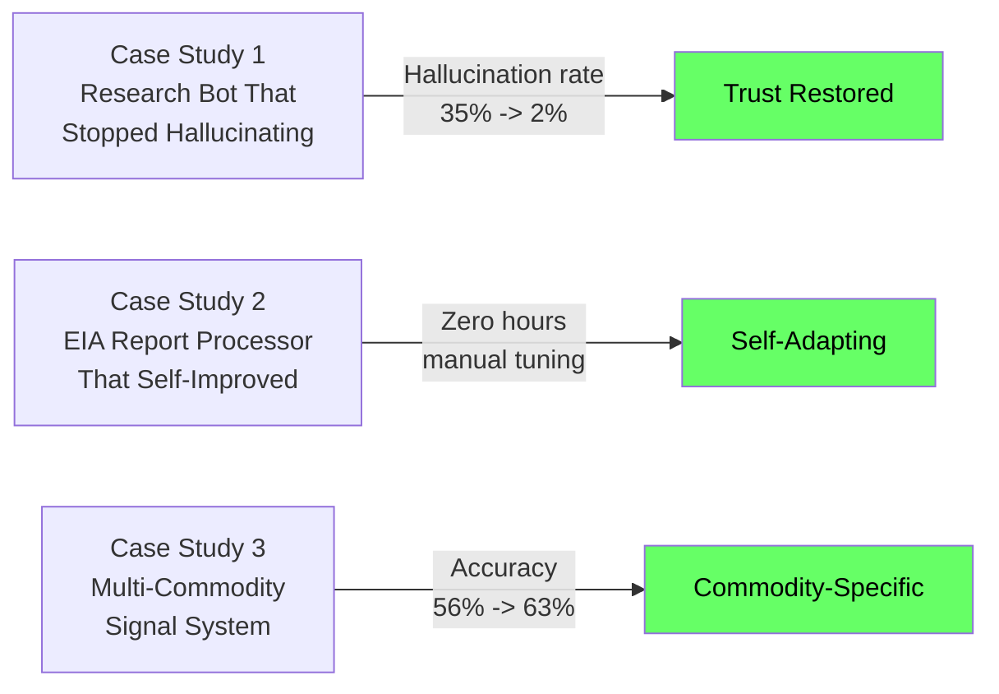
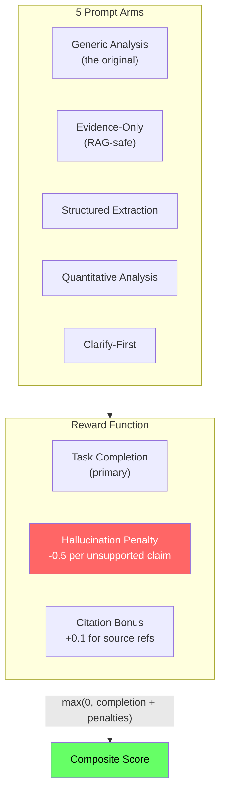
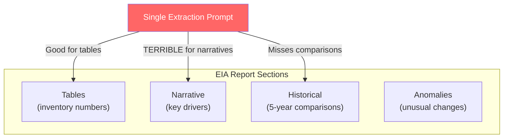
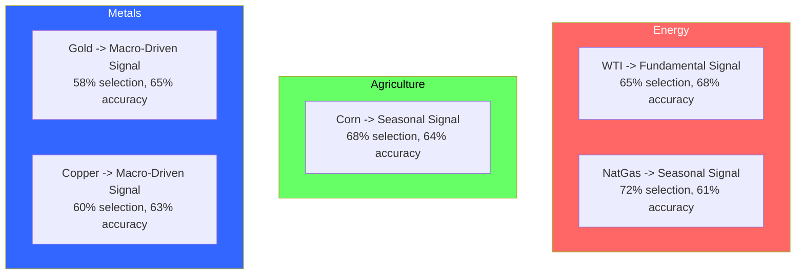
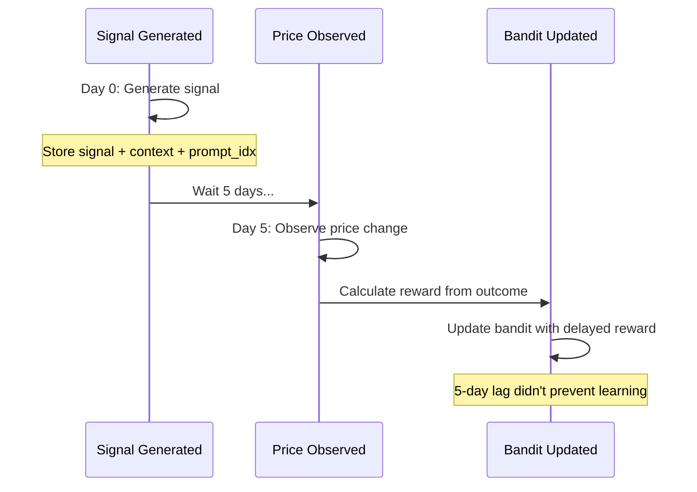
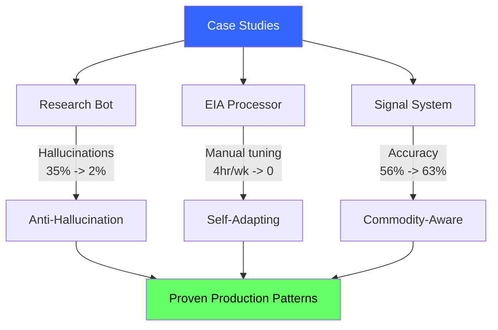

<!-- _class: lead -->

# Commodity Research Assistant
## Case Studies in Prompt Routing

## Module 8: Prompt Routing Bandits
### Multi-Armed Bandits for Commodity Trading

<!-- Speaker notes: This deck covers Commodity Research Assistant. Set the context for the audience and explain how this topic fits into the broader course on multi-armed bandits for commodity trading. -->
---

## Three Case Studies



<!-- Speaker notes: The diagram on Three Case Studies illustrates the key relationships visually. Walk through the flow step by step, pointing out decision points and outcomes. Visual representations like this help students build mental models of the concepts. -->
---

<!-- _class: lead -->

# Case Study 1: Stopping Hallucinations

<!-- Speaker notes: Transition slide for the Case Study 1: Stopping Hallucinations section. Pause briefly to let the audience absorb the previous content before moving into this new topic area. -->
---

## The Problem

Single "best prompt" for a commodity research bot:

```
You are an expert commodity analyst. Answer with detailed,
professional analysis. Be confident and thorough.
```

**Query:** "What were last week's EIA crude oil inventories?"

**Response:** "Based on recent trends, EIA inventories likely increased by 3-5 million barrels..."

> **ALL hallucinated.** System didn't have the report. "Confident and thorough" trained guessing.

<!-- Speaker notes: This code example for The Problem is production-ready. Walk through the implementation, noting any important design patterns or potential modifications for different use cases. -->
---

## The Bandit Setup



<!-- Speaker notes: The diagram on The Bandit Setup illustrates the key relationships visually. Walk through the flow step by step, pointing out decision points and outcomes. Visual representations like this help students build mental models of the concepts. -->
---

## Results After 500 Queries

<div class="columns">
<div>

### Extraction + High Data
- Evidence-Only selected **78%**
- Hallucination rate: **2%** (was 35%)
- User satisfaction: **4.2/5** (was 2.8)

### Analysis + Low Data
- Quantitative prompt: **65%**
- Generic still used 20% (open-ended)

</div>
<div>

### Ambiguous Queries
- Clarify-First: **45%**
- Reduced wasted tokens by 30%

### Cost Savings
- **25% reduction** in LLM costs
- **40% fewer** throwaway responses

</div>
</div>

<!-- Speaker notes: This two-column comparison for Results After 500 Queries highlights important trade-offs. Walk through both sides, noting when each approach is preferred. The contrast format helps students make informed decisions in their own work. -->
---

## Key Lesson

> Hallucination penalty must be **severe** (-0.5 per claim). Otherwise the bandit learns to hallucinate confidently because users like confidence.

<!-- Speaker notes: Cover Key Lesson at a steady pace. Highlight the key points and connect them to the broader course themes. Check for audience questions before moving to the next slide. -->
---

<!-- _class: lead -->

# Case Study 2: EIA Report Processor

<!-- Speaker notes: Transition slide for the Case Study 2: EIA Report Processor section. Pause briefly to let the audience absorb the previous content before moving into this new topic area. -->
---

## The Problem

Hedge fund extracting data from weekly EIA petroleum reports. One prompt for all sections:



**Manual cost:** 4 hours/week tweaking prompts after each release.

<!-- Speaker notes: The diagram on The Problem illustrates the key relationships visually. Walk through the flow step by step, pointing out decision points and outcomes. Visual representations like this help students build mental models of the concepts. -->
---

## Results After 12 Weeks

| Section Type | Best Prompt | Selection % | Improvement |
|-------------|------------|-------------|-------------|
| Tables | Structured Extraction | 95% | 92% -> **98%** accuracy |
| Narratives | Narrative Summary | 85% | 120 -> **65** words avg |
| Historical | Trend Analysis | 90% | All 3 comparisons included |
| Anomalies | Change Detection | 80% | Caught 3 missed anomalies |

**Time savings:** 4 hours/week -> **0 hours** manual tuning

> System adapted automatically when EIA changed table format in week 8.

<!-- Speaker notes: This comparison table on Results After 12 Weeks is a key reference. Walk through each row, highlighting the most important distinctions. Students should understand when to use each option based on the criteria shown. -->
---

<!-- _class: lead -->

# Case Study 3: Multi-Commodity Signals

<!-- Speaker notes: Transition slide for the Case Study 3: Multi-Commodity Signals section. Pause briefly to let the audience absorb the previous content before moving into this new topic area. -->
---

## The Problem

Same signal prompt for 12 commodities:

| Commodity | Accuracy (Before) |
|-----------|-------------------|
| WTI Crude | 62% |
| Natural Gas | **48%** (worse than random!) |
| Corn | 55% |
| Gold | 58% |

> Natural gas is seasonal. Corn needs seasonal adjustment. Gold is macro-driven. One prompt can't capture all.

<!-- Speaker notes: This comparison table on The Problem is a key reference. Walk through each row, highlighting the most important distinctions. Students should understand when to use each option based on the criteria shown. -->
---

## The Bandit Learned Commodity Preferences



<!-- Speaker notes: The diagram on The Bandit Learned Commodity Preferences illustrates the key relationships visually. Walk through the flow step by step, pointing out decision points and outcomes. Visual representations like this help students build mental models of the concepts. -->
---

## Results After 6 Months

<div class="columns">
<div>

### Accuracy Improvements
- Overall: **56% -> 63%**
- NatGas: **48% -> 61%**
- Corn: **55% -> 64%**
- Gold: **58% -> 65%**
- High-conviction: **72%** accuracy

</div>
<div>

### Automatic Discoveries
- NatGas is **seasonal** (no manual rule!)
- Agriculture benefits from **seasonal** prompts
- Metals are **macro-driven**
- Adapted when NatGas shifted regimes

### Portfolio Impact
- Sharpe ratio: **0.9 -> 1.4**

</div>
</div>

<!-- Speaker notes: This two-column comparison for Results After 6 Months highlights important trade-offs. Walk through both sides, noting when each approach is preferred. The contrast format helps students make informed decisions in their own work. -->
---

## Delayed Rewards Work



<!-- Speaker notes: The diagram on Delayed Rewards Work illustrates the key relationships visually. Walk through the flow step by step, pointing out decision points and outcomes. Visual representations like this help students build mental models of the concepts. -->
---

## When to Use Prompt Routing

<div class="columns">
<div>

### YES -- Use Bandits
- Distinct prompt strategies
- Context-dependent quality
- Measurable feedback
- Manual tuning is expensive
- Environment changes

</div>
<div>

### NO -- Don't Use Bandits
- One prompt clearly dominates
- Feedback too noisy
- Cold-start is critical
- Prompt space is infinite
- Manual tuning is fast

</div>
</div>

<!-- Speaker notes: This two-column comparison for When to Use Prompt Routing highlights important trade-offs. Walk through both sides, noting when each approach is preferred. The contrast format helps students make informed decisions in their own work. -->
---

## Connections

<div class="columns">
<div>

### Builds On
- **Module 2:** Thompson Sampling
- **Module 3:** LinUCB framework
- **Module 5:** Commodity domain
- **Module 7:** Production patterns

</div>
<div>

### Key Takeaways
1. Hallucination penalty must be severe
2. Section/task type is most predictive feature
3. Delayed rewards are fine
4. System discovers patterns (seasonality, macro)
5. Start simple: 3-5 prompts, basic features

</div>
</div>

<!-- Speaker notes: The connections section shows how this topic links to the rest of the course. Highlight the 'Builds On' prerequisites to remind students of what they should already know, and use 'Leads To' to create anticipation for upcoming modules. -->
---

## Visual Summary



<!-- Speaker notes: This visual summary captures the key relationships from the entire deck. Walk through each branch of the diagram, connecting back to the main concepts covered. This slide works well as a reference -- encourage students to screenshot it for later review. -->