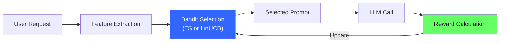
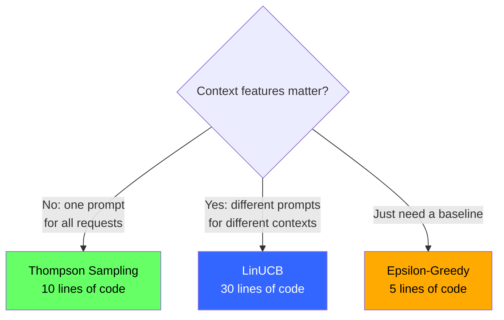
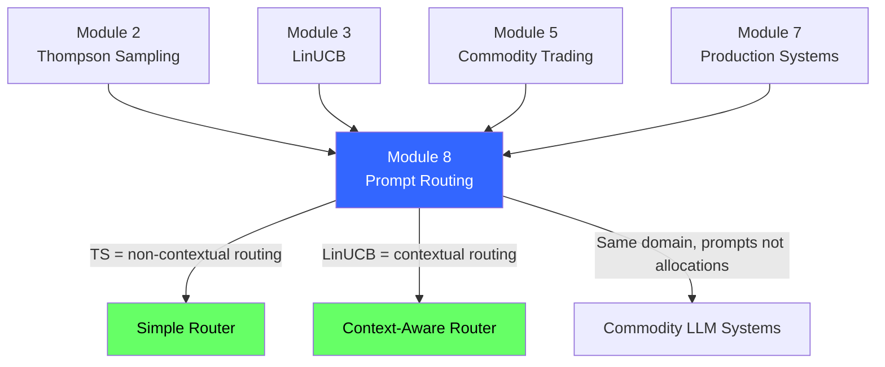
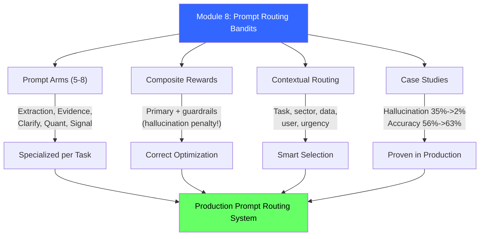

<!-- _class: lead -->

# Prompt Routing Bandits Cheatsheet

## Module 8 Quick Reference
### Multi-Armed Bandits for Commodity Trading

<!-- Speaker notes: This deck covers Prompt Routing Bandits Cheatsheet. Set the context for the audience and explain how this topic fits into the broader course on multi-armed bandits for commodity trading. -->
---

## Core Concept

**Prompt routing = multi-armed bandit where arms are prompt templates**



<!-- Speaker notes: The diagram on Core Concept illustrates the key relationships visually. Walk through the flow step by step, pointing out decision points and outcomes. Visual representations like this help students build mental models of the concepts. -->
---

## Prompt Arm Design

| Prompt Type | Use When | Prevents |
|-------------|----------|----------|
| **Structured Extraction** | Data-heavy queries, tables | Verbose responses |
| **Evidence-Only (RAG-safe)** | Accuracy critical, retrieval succeeds | Hallucinations |
| **Clarify-First** | Ambiguous requests | Confident guessing |
| **Quantitative Analysis** | Fundamental analysis | Qualitative speculation |
| **Trading Signal** | Decision support needed | Hedged non-answers |
| **Scenario Analysis** | Risk assessment | Single-point estimates |

> **5-8 prompts maximum.** Each solves ONE job.

<!-- Speaker notes: This comparison table on Prompt Arm Design is a key reference. Walk through each row, highlighting the most important distinctions. Students should understand when to use each option based on the criteria shown. -->
---

## Reward Function Template

<div class="columns">
<div>

### Primary Metrics (0 to 1)
| Metric | Measures |
|--------|----------|
| Task Completion | Did it answer? |
| Extraction Accuracy | Numbers correct? |
| Signal Quality | Direction correct? |
| Research Completeness | All dimensions? |

</div>
<div>

### Guardrails (Penalties)
| Guardrail | Penalty |
|-----------|---------|
| Hallucination | -0.3 to -0.5 |
| Format Violation | -0.3 |
| Cost/Latency | -0.1 to -0.2 |
| Missing Citations | -0.2 |

</div>
</div>

$$\text{reward} = \text{primary} + \sum(\text{guardrail\_penalties})$$

<!-- Speaker notes: This comparison table on Reward Function Template is a key reference. Walk through each row, highlighting the most important distinctions. Students should understand when to use each option based on the criteria shown. -->
---

## Context Features

| Feature | Values | Extraction |
|---------|--------|------------|
| Task Type | extraction, analysis, signal, scenario | Keyword classifier |
| Commodity Sector | energy, agriculture, metals | Keyword matching |
| Data Availability | high, medium, low | RAG retrieval score |
| User Preference | concise, balanced, detailed | History analysis |
| Urgency | high, medium, low | Market hours + keywords |

**Context vector:** 15 dimensions (one-hot + continuous + intercept)

<!-- Speaker notes: This comparison table on Context Features is a key reference. Walk through each row, highlighting the most important distinctions. Students should understand when to use each option based on the criteria shown. -->
---

## Algorithm Selection



<!-- Speaker notes: The diagram on Algorithm Selection illustrates the key relationships visually. Walk through the flow step by step, pointing out decision points and outcomes. Visual representations like this help students build mental models of the concepts. -->
---

## Thompson Sampling (No Context)

```python
class PromptRouter:
    def __init__(self, num_prompts):
        self.alpha = np.ones(num_prompts)
        self.beta = np.ones(num_prompts)

    def select(self):
        samples = [np.random.beta(a, b)
                   for a, b in zip(self.alpha, self.beta)]
        return np.argmax(samples)

    def update(self, idx, reward):
        if reward > 0.7:
            self.alpha[idx] += 1
        else:
            self.beta[idx] += 1
```

<!-- Speaker notes: This code example for Thompson Sampling (No Context) is production-ready. Walk through the implementation, noting any important design patterns or potential modifications for different use cases. -->
---

## LinUCB (With Context)

```python
class ContextualPromptRouter:
    def __init__(self, num_prompts, context_dim, alpha=1.0):
        self.A = [np.identity(context_dim) for _ in range(num_prompts)]
        self.b = [np.zeros(context_dim) for _ in range(num_prompts)]
        self.alpha = alpha
```

<!-- Speaker notes: Code continues on the next slide. This first part sets up the structure. -->

---

## LinUCB (With Context) (continued)

```python
    def select(self, context):
        ucb_scores = []
        for i in range(len(self.A)):
            A_inv = np.linalg.inv(self.A[i])
            theta = A_inv @ self.b[i]
            ucb = theta @ context + self.alpha * np.sqrt(context @ A_inv @ context)
            ucb_scores.append(ucb)
        return np.argmax(ucb_scores)

    def update(self, idx, context, reward):
        self.A[idx] += np.outer(context, context)
        self.b[idx] += reward * context
```

<!-- Speaker notes: This code example for LinUCB (With Context) is production-ready. Walk through the implementation, noting any important design patterns or potential modifications for different use cases. -->
---

## Common Failure Modes

| Failure Mode | Symptom | Fix |
|--------------|---------|-----|
| Confident hallucinations | High satisfaction, low accuracy | Heavy hallucination penalty |
| Verbose outputs | High cost, low completion | Reward brevity + completion |
| Format drift | Unparseable JSON | Format compliance penalty |
| Cold start problems | Bad prompts selected early | Warm-start with domain knowledge |
| Slow convergence | Equal selection after 100 trials | Reduce to 5-8 arms max |

<!-- Speaker notes: This comparison table on Common Failure Modes is a key reference. Walk through each row, highlighting the most important distinctions. Students should understand when to use each option based on the criteria shown. -->
---

## Case Study Results

| System | Key Metric | Before | After |
|--------|-----------|--------|-------|
| Research Bot | Hallucination rate | 35% | **2%** |
| Research Bot | User satisfaction | 2.8/5 | **4.2/5** |
| EIA Processor | Manual tuning | 4 hr/wk | **0 hr** |
| EIA Processor | Extraction accuracy | 92% | **98%** |
| Signal System | Directional accuracy | 56% | **63%** |
| Signal System | Portfolio Sharpe | 0.9 | **1.4** |

<!-- Speaker notes: This comparison table on Case Study Results is a key reference. Walk through each row, highlighting the most important distinctions. Students should understand when to use each option based on the criteria shown. -->
---

## Production Deployment Checklist

<div class="columns">
<div>

### Before Launch
- [ ] 5-8 distinct prompt templates
- [ ] Composite reward function
- [ ] 10-15 context features
- [ ] Algorithm chosen (TS or LinUCB)
- [ ] Logging setup

</div>
<div>

### During Operation
- [ ] Hallucination rate decreasing
- [ ] Cost per query decreasing
- [ ] Task completion increasing
- [ ] No single prompt > 90%
- [ ] Human-in-the-loop for high stakes

</div>
</div>

<!-- Speaker notes: This checklist is a practical tool for real-world application. Suggest students save or print this for reference when implementing their own systems. Walk through each item briefly, explaining why it matters. -->
---

## Key Metrics to Track

| Metric | Target | Red Flag |
|--------|--------|----------|
| Hallucination Rate | < 5% | > 20% |
| Task Completion | > 80% | < 50% |
| Cost per Query | Decreasing | Increasing |
| User Satisfaction | > 4.0/5 | < 3.0/5 |
| Prompt Diversity | 3+ prompts > 10% | 1 prompt > 90% |

<!-- Speaker notes: This comparison table on Key Metrics to Track is a key reference. Walk through each row, highlighting the most important distinctions. Students should understand when to use each option based on the criteria shown. -->
---

## Module Connections



<!-- Speaker notes: The connections section shows how this topic links to the rest of the course. Highlight the 'Builds On' prerequisites to remind students of what they should already know, and use 'Leads To' to create anticipation for upcoming modules. -->
---

## Visual Summary



<!-- Speaker notes: This visual summary captures the key relationships from the entire deck. Walk through each branch of the diagram, connecting back to the main concepts covered. This slide works well as a reference -- encourage students to screenshot it for later review. -->