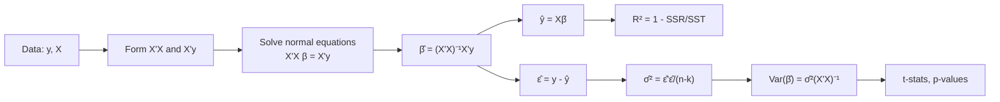
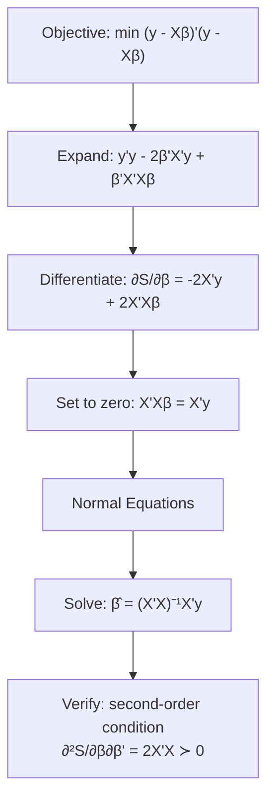
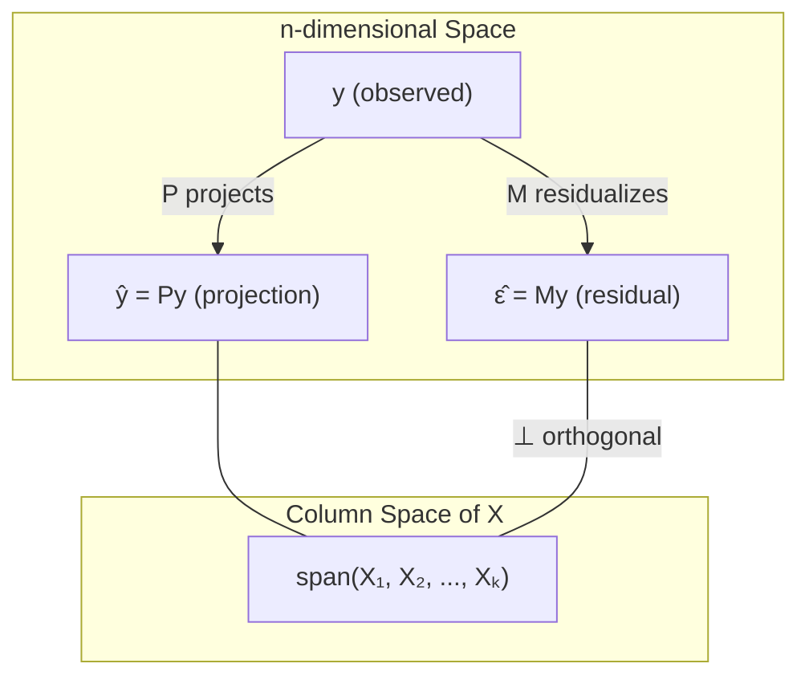
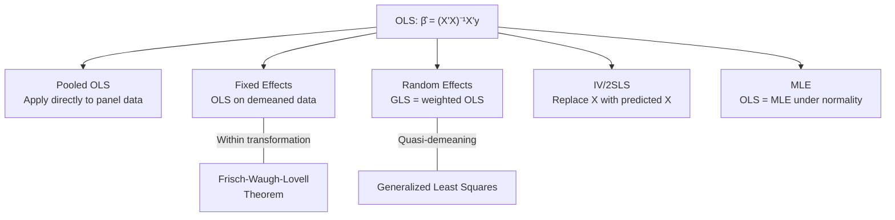

<!-- _class: lead -->

# OLS Review: Matrix Form

## Module 00 -- Foundations

<!-- Speaker notes: Transition slide. Pause briefly before moving into the ols review: matrix form section. -->
---

# In Brief

Ordinary Least Squares (OLS) in matrix notation provides the foundation for understanding panel data estimators.

> The matrix formulation reveals the geometric interpretation of regression and enables efficient computation for large datasets.

<!-- Speaker notes: Read the highlighted quote aloud. This captures the key insight of the slide. -->
---

# Key Insight

OLS finds the linear combination of predictors that minimizes the sum of squared residuals.

$$\hat{\beta} = (X'X)^{-1}X'y$$

This represents the **projection** of $y$ onto the column space of $X$.

<!-- Speaker notes: Focus on the intuition behind the formula. Explain what each term represents in plain language. -->
---

<!-- _class: lead -->

# Formal Definition

<!-- Speaker notes: Transition slide. Pause briefly before moving into the formal definition section. -->
---

# The OLS Estimator

Given data $(y, X)$ where $y$ is $n \times 1$ and $X$ is $n \times k$:

$$\hat{\beta} = \arg\min_{\beta} (y - X\beta)'(y - X\beta)$$

**Solution:**

$$\hat{\beta} = (X'X)^{-1}X'y$$

provided $(X'X)$ is invertible (full column rank).

<!-- Speaker notes: Take this slowly. Focus on intuition behind each step rather than memorizing the algebra. -->
---

# Fitted Values and Residuals

**Fitted Values:**

$$\hat{y} = X\hat{\beta} = X(X'X)^{-1}X'y = Py$$

where $P = X(X'X)^{-1}X'$ is the **projection matrix**.

**Residuals:**

$$\hat{\epsilon} = y - \hat{y} = (I - P)y = My$$

where $M = I - P$ is the **residual maker matrix**.

<!-- Speaker notes: Focus on the intuition behind the formula. Explain what each term represents in plain language. -->
---

# OLS Pipeline



<!-- Speaker notes: Walk through the diagram from top to bottom. Explain each node and decision point. -->
---

# Intuitive Explanation

Think of OLS as finding the "best fitting" hyperplane through a cloud of data points.

**Geometric Interpretation:**
- $X\beta$ = all possible linear combinations of columns of $X$
- $\hat{y}$ = point in column space closest to $y$
- $\hat{\epsilon}$ = orthogonal distance from $y$ to this subspace

<!-- Speaker notes: Explain the key concepts on this slide. Check for questions before moving on. -->
---

# Why Matrix Form Matters

| Advantage | Description |
|-----------|-------------|
| **Generality** | Handles any number of predictors |
| **Structure** | Reveals computational approach |
| **Foundation** | FE and RE are variations of this form |
| **Theory** | Enables analysis of statistical properties |

<!-- Speaker notes: Review the table row by row. Highlight the most important distinctions. -->
---

<!-- _class: lead -->

# Mathematical Formulation

<!-- Speaker notes: Transition slide. Pause briefly before moving into the mathematical formulation section. -->
---

# Derivation: Step 1 -- Expand

Starting from the minimization problem:

$$\min_{\beta} S(\beta) = (y - X\beta)'(y - X\beta)$$

Expand the quadratic form:

$$S(\beta) = y'y - 2\beta'X'y + \beta'X'X\beta$$

<!-- Speaker notes: Take this slowly. Focus on intuition behind each step rather than memorizing the algebra. -->
---

# Derivation: Step 2 -- Differentiate and Solve

Take the derivative with respect to $\beta$:

$$\frac{\partial S}{\partial \beta} = -2X'y + 2X'X\beta$$

Set equal to zero (first-order condition):

$$X'X\beta = X'y$$

These are the **normal equations**. Solving:

$$\hat{\beta} = (X'X)^{-1}X'y$$

<!-- Speaker notes: Take this slowly. Focus on intuition behind each step rather than memorizing the algebra. -->
---

# Derivation Flow



<!-- Speaker notes: Take this slowly. Focus on intuition behind each step rather than memorizing the algebra. -->
---

# Variance of OLS Estimator

Under the Gauss-Markov assumptions:

$$\text{Var}(\hat{\beta} | X) = \sigma^2(X'X)^{-1}$$

where $\sigma^2 = \text{Var}(\epsilon_i)$.

**Estimator for $\sigma^2$:**

$$\hat{\sigma}^2 = \frac{\hat{\epsilon}'\hat{\epsilon}}{n - k} = \frac{(y - X\hat{\beta})'(y - X\hat{\beta})}{n - k}$$

<!-- Speaker notes: Take this slowly. Focus on intuition behind each step rather than memorizing the algebra. -->
---

# Projection Matrix Properties

<div class="columns">
<div>

**Projection Matrix $P$:**
- $P = X(X'X)^{-1}X'$
- Symmetric: $P' = P$
- Idempotent: $P^2 = P$
- Projects onto column space of $X$

</div>
<div>

**Residual Maker $M$:**
- $M = I - P$
- Symmetric: $M' = M$
- Idempotent: $M^2 = M$
- Projects onto orthogonal complement

</div>
</div>

> Key property: $PM = 0$ (the two subspaces are orthogonal)

<!-- Speaker notes: Compare the two columns. Ask students which scenario applies to their work. -->
---

# Projection Geometry



<!-- Speaker notes: Walk through the diagram from top to bottom. Explain each node and decision point. -->
---

<!-- _class: lead -->

# Code Implementation

<!-- Speaker notes: Transition slide. Pause briefly before moving into the code implementation section. -->
---

# OLS Estimator in Python (Part 1)

```python
import numpy as np
from scipy import stats

def ols_estimator(y, X, add_constant=True):
    """Compute OLS estimates using matrix algebra."""
    y = np.asarray(y).flatten()
    X = np.asarray(X)

    if add_constant:
        X = np.column_stack([np.ones(len(y)), X])

    n, k = X.shape

    # beta_hat = (X'X)^{-1} X'y
    XtX = X.T @ X
    Xty = X.T @ y
    beta_hat = np.linalg.solve(XtX, Xty)  # More stable than inverse
```

<!-- Speaker notes: Take this slowly. Focus on intuition behind each step rather than memorizing the algebra. -->
---

# OLS Estimator in Python (Part 2: Residuals)

```python
    # Fitted values and residuals
    y_hat = X @ beta_hat
    residuals = y - y_hat

    # Residual variance: sigma^2 = e'e / (n - k)
    sigma2 = (residuals @ residuals) / (n - k)

    # Variance-covariance: Var(beta_hat) = sigma^2 * (X'X)^{-1}
    XtX_inv = np.linalg.inv(XtX)
    var_beta = sigma2 * XtX_inv
    se_beta = np.sqrt(np.diag(var_beta))
```

<!-- Speaker notes: Take this slowly. Focus on intuition behind each step rather than memorizing the algebra. -->
---

# OLS Estimator in Python (Part 3: Inference)

```python
    # t-statistics and p-values
    t_stats = beta_hat / se_beta
    p_values = 2 * (1 - stats.t.cdf(np.abs(t_stats), df=n-k))

    # R-squared
    r_squared = 1 - (residuals @ residuals) / (
        (y - y.mean()) @ (y - y.mean()))

    return {
        'beta_hat': beta_hat, 'se_beta': se_beta,
        't_stats': t_stats, 'p_values': p_values,
        'r_squared': r_squared
    }
```

<!-- Speaker notes: Take this slowly. Focus on intuition behind each step rather than memorizing the algebra. -->
---

# Example Usage

```python
np.random.seed(42)
n = 100
X = np.random.randn(n, 2)
true_beta = np.array([1.5, 2.0, -0.5])
y = true_beta[0] + X @ true_beta[1:] + np.random.randn(n) * 0.5

results = ols_estimator(y, X)

print(f"Coefficients: {results['beta_hat']}")
print(f"Std Errors:   {results['se_beta']}")
print(f"R-squared:    {results['r_squared']:.4f}")
```

<!-- Speaker notes: Walk through this example line by line. Pause after key output to discuss what it means. -->
---

<!-- _class: lead -->

# Common Pitfalls

<!-- Speaker notes: Transition slide. Pause briefly before moving into the common pitfalls section. -->
---

# Pitfall 1: Multicollinearity

- **Issue:** $(X'X)$ nearly singular -- columns of $X$ nearly linearly dependent
- **Consequence:** Large standard errors; unstable coefficients
- **Detection:** `np.linalg.cond(X.T @ X) > 30`
- **Solution:** Remove redundant variables, use regularization, or collect more data

<!-- Speaker notes: Emphasize that these are mistakes seen in practice, not just theory. Ask if anyone has encountered pitfall 1: multicollinearity. -->
---

# Pitfall 2: Forgetting the Intercept

- **Issue:** Omitting the constant term when it should be included
- **Consequence:** Forces regression through the origin; biased estimates
- **Prevention:** Always consider whether intercept makes theoretical sense

<!-- Speaker notes: Emphasize that these are mistakes seen in practice, not just theory. Ask if anyone has encountered pitfall 2: forgetting the intercept. -->
---

# Pitfall 3: Dimension Mismatches

- **Issue:** Shape mismatches in matrix multiplication
- **Prevention:** Always verify:
  - $y$: $(n,)$ or $(n, 1)$
  - $X$: $(n, k)$
  - $\beta$: $(k,)$ or $(k, 1)$

<!-- Speaker notes: Emphasize that these are mistakes seen in practice, not just theory. Ask if anyone has encountered pitfall 3: dimension mismatches. -->
---

# Pitfall 4: Using Matrix Inverse Directly

<div class="columns">
<div>

**Bad:**
```python
beta = np.linalg.inv(X.T @ X) @ X.T @ y
```
Numerically unstable.

</div>
<div>

**Good:**
```python
beta = np.linalg.solve(X.T @ X, X.T @ y)
```
Uses LU decomposition. Faster and more stable.

</div>
</div>

<!-- Speaker notes: Emphasize that these are mistakes seen in practice, not just theory. Ask if anyone has encountered pitfall 4: using matrix inverse directly. -->
---

# Pitfall 5: Assuming Homoskedasticity

- **Issue:** $\text{Var}(\hat{\beta}) = \sigma^2(X'X)^{-1}$ assumes constant variance
- **Reality:** In panel data, this almost always fails
- **Solution:** Use robust (heteroskedasticity-consistent) standard errors

<!-- Speaker notes: Emphasize that these are mistakes seen in practice, not just theory. Ask if anyone has encountered pitfall 5: assuming homoskedasticity. -->
---

<!-- _class: lead -->

# Connections

<!-- Speaker notes: Transition slide. Pause briefly before moving into the connections section. -->
---

# How OLS Connects to Panel Methods



<!-- Speaker notes: Walk through the diagram from top to bottom. Explain each node and decision point. -->
---

# Builds On / Leads To

<div class="columns">
<div>

**Builds on:**
- Linear algebra (matrix ops, inverse, rank)
- Calculus (derivatives of quadratic forms)
- Probability (expected values, variance)

</div>
<div>

**Leads to:**
- Fixed Effects (within transformation)
- Random Effects (GLS estimation)
- Pooled OLS (ignoring entity structure)
- IV/2SLS (first-stage predicted values)

</div>
</div>

<!-- Speaker notes: This slide links the current topic to the broader course. Helps students see the big picture. -->
---

# Practice Problems

1. **Geometric Interpretation:** Why is $\hat{\epsilon}$ orthogonal to every column of $X$? What does this imply about correlation between residuals and predictors?

2. **Verify Projection Properties:** Write code to verify $P$ is symmetric and idempotent, and $M = I - P$ satisfies the same properties.

3. **Partitioned Regression (FWL Theorem):** Show that the coefficient on $X_2$ from regressing $y$ on $[X_1, X_2]$ equals the coefficient from the "residualized" regression -- the foundation for the within transformation.

<!-- Speaker notes: Give students 5 minutes to attempt these. Walk around and help as needed. -->
---

# Visual Summary

| Component | Formula | Interpretation |
|-----------|---------|----------------|
| Estimator | $\hat{\beta} = (X'X)^{-1}X'y$ | Best linear unbiased (BLUE) |
| Fitted values | $\hat{y} = Py$ | Projection onto col space of $X$ |
| Residuals | $\hat{\epsilon} = My$ | Orthogonal complement |
| Variance | $\text{Var}(\hat{\beta}) = \sigma^2(X'X)^{-1}$ | Under Gauss-Markov |
| Normal equations | $X'X\beta = X'y$ | First-order conditions |

> OLS is the building block for all panel estimators: FE, RE, and beyond.

<!-- Speaker notes: This is a reference slide. Students can photograph or bookmark this for later review. -->