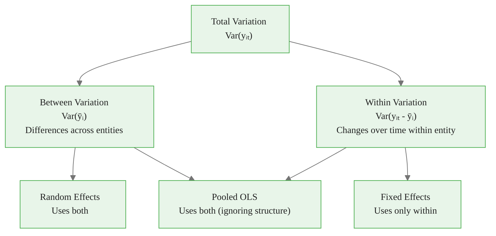
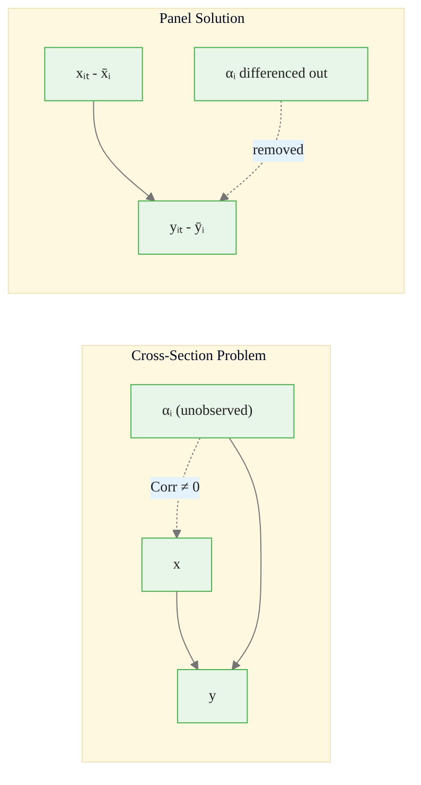
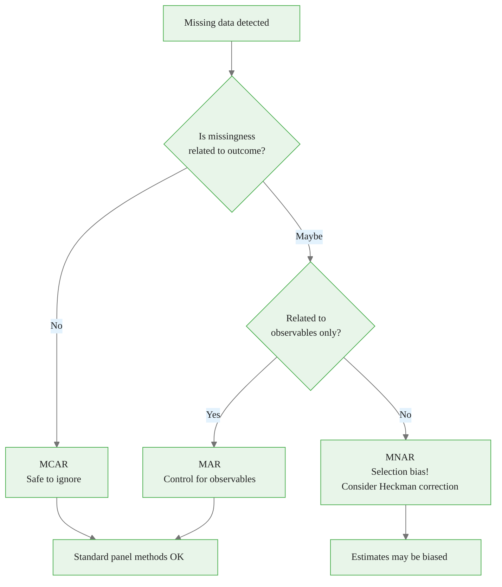
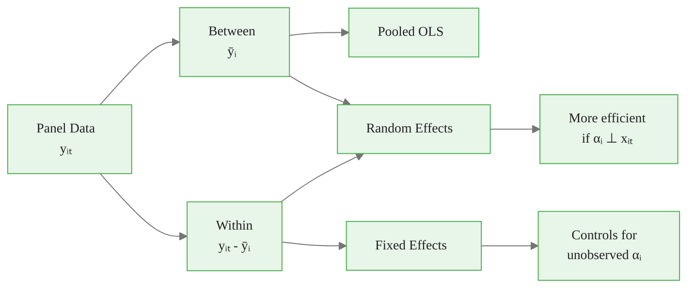

<!-- _class: lead -->

# Panel Data Concepts and Structure

## Module 00 -- Foundations

<!-- Speaker notes: Transition slide. Pause briefly before moving into the panel data concepts and structure section. -->
---

# What is Panel Data?

Panel data (longitudinal / cross-sectional time series) combines two dimensions:

$$y_{it} \text{ where } i = 1, ..., N \text{ (entities) and } t = 1, ..., T \text{ (time periods)}$$

The same entities are observed **repeatedly** over time.

<!-- Speaker notes: Focus on the intuition behind the formula. Explain what each term represents in plain language. -->

<div class="callout-key">

Panel data controls for unobserved time-invariant heterogeneity -- the key advantage over cross-sectional data.

</div>

---

# The Three Dimensions of Variation

```
                    Time (t)
                    ──────────────────────►
                    t=1    t=2    t=3    t=T
                   ┌────┬────┬────┬───┬────┐
            i=1    │y₁₁ │y₁₂ │y₁₃ │...│y₁ₜ │  Between
Entity      i=2    │y₂₁ │y₂₂ │y₂₃ │...│y₂ₜ │  Variation
(i)         i=3    │y₃₁ │y₃₂ │y₃₃ │...│y₃ₜ │     ▲
  │         ...    │... │... │... │...│... │     │
  ▼         i=N    │yₙ₁ │yₙ₂ │yₙ₃ │...│yₙₜ │     ▼
                   └────┴────┴────┴───┴────┘
                        ◄────────────────►
                         Within Variation
```

> **Total Variation** = **Between Variation** + **Within Variation**

<!-- Speaker notes: Read the highlighted quote aloud. This captures the key insight of the slide. -->

<div class="callout-insight">

**Insight:** The within-transformation eliminates time-invariant confounders, which is the most powerful tool in the panel econometrician's toolkit.

</div>

---

# Variation Decomposition



<!-- Speaker notes: Walk through the diagram from top to bottom. Explain each node and decision point. -->

<div class="callout-warning">

**Warning:** Standard errors from pooled OLS ignore within-entity correlation and are almost always too small. Use clustered standard errors.

</div>

---

# Panel Data vs Other Data Structures

| Structure | Cross-Sectional | Time Series | Example |
|-----------|:-:|:-:|---------|
| Cross-sectional | Yes | No | Survey of firms at one point |
| Time series | No | Yes | GDP over 50 years |
| Pooled cross-section | Yes | Yes (different units) | CPS each year |
| **Panel data** | **Yes** | **Yes (same units)** | **Same firms over 10 years** |

<!-- Speaker notes: Highlight the key differences. Ask students when they would choose one approach over the other. -->

<div class="callout-info">

**Info:** With N entities and T periods, panel data gives N*T observations, dramatically increasing statistical power over pure cross-sections.

</div>

---

<!-- _class: lead -->

# Why Panel Data Matters

<!-- Speaker notes: Transition slide. Pause briefly before moving into the why panel data matters section. -->
---

# Advantage 1: Control for Unobserved Heterogeneity

**Cross-sectional regression problem:**

$$y_i = \beta_0 + \beta_1 x_i + \underbrace{\alpha_i}_{\text{unobserved}} + \epsilon_i$$

If $\text{Corr}(\alpha_i, x_i) \neq 0$, OLS is **biased**.

**Panel solution (fixed effects):**

$$y_{it} - \bar{y}_i = \beta_1(x_{it} - \bar{x}_i) + (\epsilon_{it} - \bar{\epsilon}_i)$$

The entity-specific $\alpha_i$ is **differenced out**.

<!-- Speaker notes: Focus on the intuition behind the formula. Explain what each term represents in plain language. -->
---

# How Fixed Effects Remove Bias



<!-- Speaker notes: Walk through the diagram from top to bottom. Explain each node and decision point. -->
---

# Advantage 2: More Data, Better Precision

With $N$ entities and $T$ periods:

- **Total observations:** $N \times T$
- More variation to exploit
- Tighter confidence intervals

<!-- Speaker notes: Explain the key concepts on this slide. Check for questions before moving on. -->
---

# Advantage 3: Study Dynamics

Panel data enables analysis of:

| Dynamic Feature | Question Addressed |
|---|---|
| **State dependence** | Does $y_{t-1}$ affect $y_t$? |
| **Duration effects** | How long do shocks persist? |
| **Adjustment processes** | How fast do entities converge? |

<!-- Speaker notes: Review the table row by row. Highlight the most important distinctions. -->
---

<!-- _class: lead -->

# Balanced vs Unbalanced Panels

<!-- Speaker notes: Transition slide. Pause briefly before moving into the balanced vs unbalanced panels section. -->
---

# Balanced Panel

Every entity observed in every period:

<div class="code-window">
<div class="code-header">
<div class="dots"><span class="dot-red"></span><span class="dot-yellow"></span><span class="dot-green"></span></div>
<span class="filename">example.py</span>
</div>

```python
balanced = pd.DataFrame({
    'entity': ['A', 'A', 'A', 'B', 'B', 'B', 'C', 'C', 'C'],
    'year':   [2020, 2021, 2022, 2020, 2021, 2022, 2020, 2021, 2022],
    'y':      [10,   12,   14,   20,   22,   21,   15,   17,   19]
})

# Check balance
print(balanced.groupby('entity').size())
# A    3
# B    3
# C    3
```

</div>

<!-- Speaker notes: Walk through the code step by step. Highlight the key function calls and explain what each does. -->
---

# Unbalanced Panel

Some entity-period combinations missing:

<div class="code-window">
<div class="code-header">
<div class="dots"><span class="dot-red"></span><span class="dot-yellow"></span><span class="dot-green"></span></div>
<span class="filename">example.py</span>
</div>

```python
# Firm C missing 2021
unbalanced = pd.DataFrame({
    'entity': ['A', 'A', 'A', 'B', 'B', 'B', 'C', 'C'],
    'year':   [2020, 2021, 2022, 2020, 2021, 2022, 2020, 2022],
    'y':      [10,   12,   14,   20,   22,   21,   15,   19]
})
```

</div>

**Missing data mechanisms matter:**
- MCAR: Missing completely at random
- MAR: Missing at random (related to observables)
- MNAR: Missing not at random -- **selection bias risk**

<!-- Speaker notes: Walk through the code step by step. Highlight the key function calls and explain what each does. -->
---

# Missing Data Decision Tree



<!-- Speaker notes: Walk through the decision tree step by step. Ask students to apply it to a concrete example. -->
---

<!-- _class: lead -->

# Panel Data Notation

<!-- Speaker notes: Transition slide. Pause briefly before moving into the panel data notation section. -->
---

# The General Model

$$y_{it} = \alpha + x_{it}'\beta + u_{it}$$

where:
- $y_{it}$: outcome for entity $i$ at time $t$
- $x_{it}$: $K \times 1$ vector of regressors
- $\beta$: $K \times 1$ parameter vector
- $u_{it}$: composite error term

<!-- Speaker notes: Focus on the intuition behind the formula. Explain what each term represents in plain language. -->
---

# Error Component Decomposition

$$u_{it} = \alpha_i + \lambda_t + \epsilon_{it}$$

| Component | Name | Interpretation |
|-----------|------|----------------|
| $\alpha_i$ | Entity effect | Time-invariant entity characteristics |
| $\lambda_t$ | Time effect | Entity-invariant time shocks |
| $\epsilon_{it}$ | Idiosyncratic error | Random variation |

<!-- Speaker notes: Focus on the intuition behind the formula. Explain what each term represents in plain language. -->
---

<!-- _class: lead -->

# Setting Up Panel Data in Python

<!-- Speaker notes: Transition slide. Pause briefly before moving into the setting up panel data in python section. -->
---

# Creating Panel Data with pandas

```python
import pandas as pd
import numpy as np

np.random.seed(42)
N, T = 100, 10

data = pd.DataFrame({
    'entity': np.repeat(range(N), T),
    'time': np.tile(range(T), N),
    'x': np.random.randn(N * T),
    'y': np.random.randn(N * T)
})

panel = data.set_index(['entity', 'time'])
```

<!-- Speaker notes: Walk through the code step by step. Highlight the key function calls and explain what each does. -->
---

# Accessing Panel Data via MultiIndex

```python
# Access specific entity
print(panel.loc[0])          # All periods for entity 0

# Access specific time
print(panel.xs(5, level='time').head())  # Period 5, all entities
```

<!-- Speaker notes: Walk through the code step by step. Highlight the key function calls and explain what each does. -->
---

# Using linearmodels PanelData

```python
from linearmodels.panel import PanelData

panel_data = PanelData(panel)

print(f"Entities: {panel_data.nentity}")
print(f"Time periods: {panel_data.nobs / panel_data.nentity}")
print(f"Balanced: {panel_data.balanced}")
```

<!-- Speaker notes: Walk through the code step by step. Highlight the key function calls and explain what each does. -->
---

# Computing Panel Variation

```python
def panel_variation(panel_df, var, entity_col='entity'):
    """Decompose variation into between and within."""

    total_var = panel_df[var].var()

    entity_means = panel_df.groupby(entity_col)[var].transform('mean')
    between_var = entity_means.var()
    within_var = (panel_df[var] - entity_means).var()

    return {
        'total': total_var,
        'between': between_var,
        'within': within_var,
        'between_share': between_var / total_var,
        'within_share': within_var / total_var
    }
```

<!-- Speaker notes: Walk through the code step by step. Highlight the key function calls and explain what each does. -->
---

# Key Takeaways

1. **Panel data** combines cross-sectional and time dimensions with the **same entities** observed repeatedly

2. **Variation decomposition** (between vs within) is fundamental to choosing panel methods

3. **Unobserved heterogeneity** ($\alpha_i$) can be controlled, addressing omitted variable bias

4. **Balance matters:** Unbalanced panels require attention to selection mechanisms

5. **Proper data structure** (MultiIndex / PanelData) is essential

<!-- Speaker notes: Summarize the main points. Ask students which takeaway surprised them most. -->
---

# Visual Summary



> The decomposition of variation into between and within components drives every panel estimation decision.

<!-- Speaker notes: This is a reference slide. Students can photograph or bookmark this for later review. -->