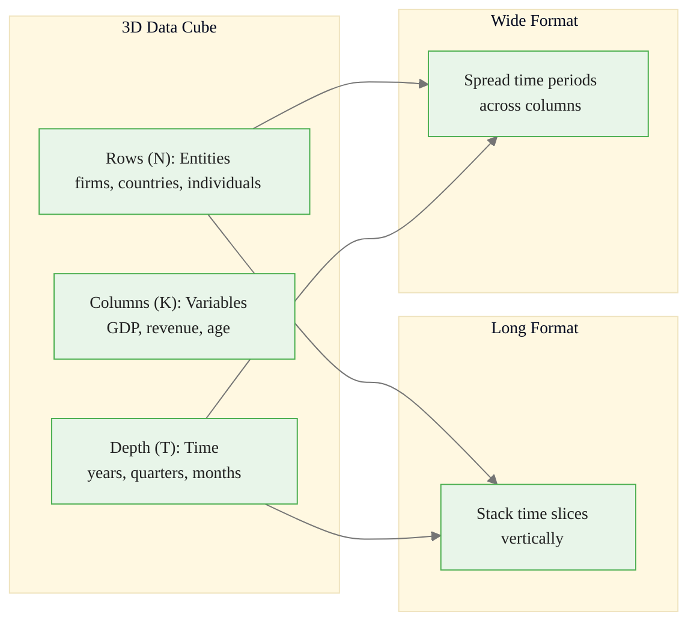
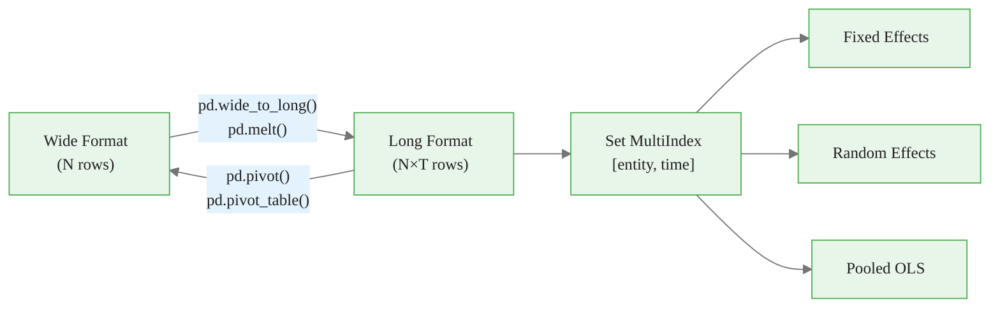
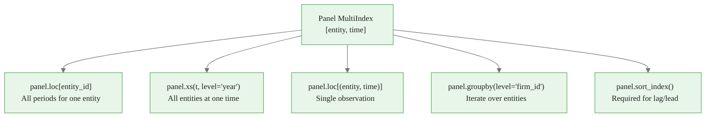
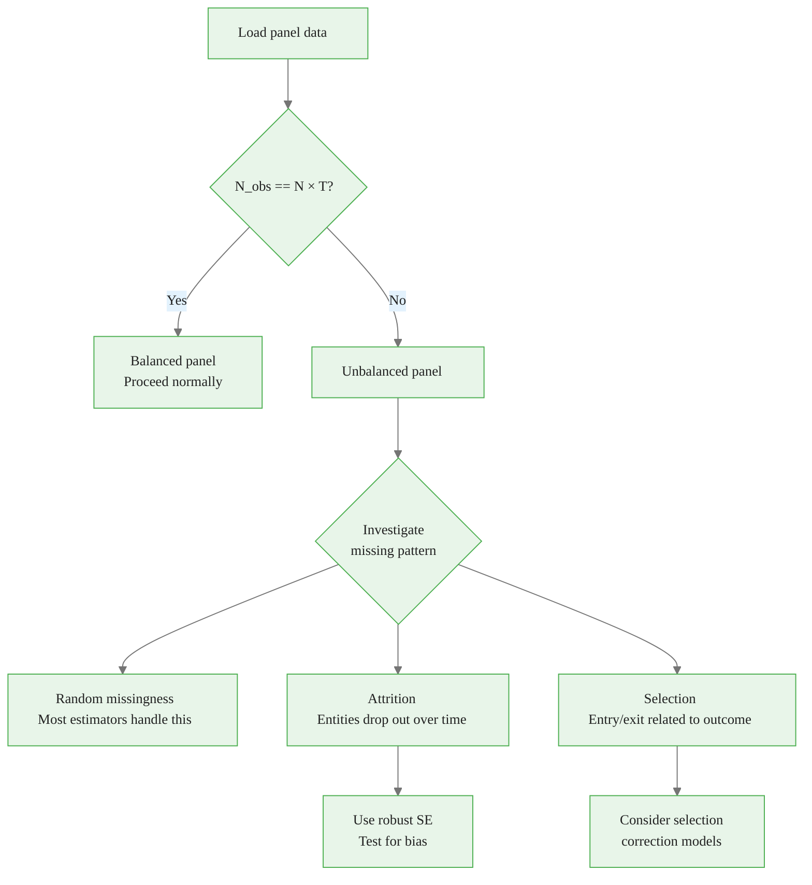
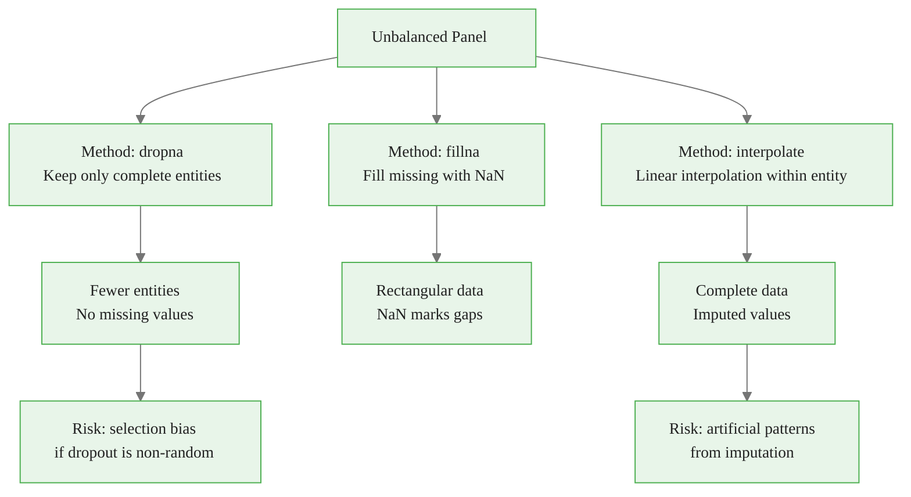
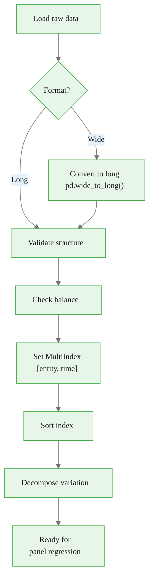

<!-- _class: lead -->

# Panel Data Structures in Python

## Module 00 -- Foundations

<!-- Speaker notes: This deck covers how panel data is organized, how to convert between formats, and how to prepare data for panel regression in Python. Expect ~25 minutes. -->

---

# In Brief

Panel data combines cross-sectional and time-series dimensions. Proper organization -- long vs wide format -- is critical for analysis and determines which estimation methods are accessible.

> Long format is required for panel regression. Wide format is useful for visualization and entity-level calculations.

<!-- Speaker notes: Emphasize that getting the data structure right is a prerequisite for everything that follows. Students who skip this step waste hours debugging later. -->

<div class="callout-key">

Panel data controls for unobserved time-invariant heterogeneity -- the key advantage over cross-sectional data.

</div>

---

# Key Insight

The same panel dataset can be represented in multiple formats:

- **Long format** (one row per entity-time observation) -- preferred for regression
- **Wide format** (one row per entity, time columns) -- useful for summaries

Understanding how to transform between them is essential.

<!-- Speaker notes: Ask the class: "Who has received data in wide format from a colleague or data provider?" Most hands should go up. That's why conversion is so important. -->

<div class="callout-insight">

**Insight:** The within-transformation eliminates time-invariant confounders, which is the most powerful tool in the panel econometrician's toolkit.

</div>

---

# Formal Definition

**Panel Data:**
$$\{(y_{it}, X_{it}) : i = 1, ..., N; \; t = 1, ..., T\}$$

| Format | Rows | Columns | Use Case |
|--------|------|---------|----------|
| **Long** | $N \times T$ | `[entity, time, y, X...]` | Regression |
| **Wide** | $N$ | `[entity, y_t1, y_t2, ..., X1_t1, ...]` | Summaries |

<!-- Speaker notes: The formal notation i for entity and t for time will be used throughout the entire course. Make sure students are comfortable with subscript notation before proceeding. -->

<div class="callout-warning">

**Warning:** Standard errors from pooled OLS ignore within-entity correlation and are almost always too small. Use clustered standard errors.

</div>

---

# The Panel Data Cube



<!-- Speaker notes: The 3D cube metaphor helps students visualize why there are two natural ways to flatten the data. Long stacks along the time axis; wide spreads along it. -->

<div class="callout-info">

**Info:** With N entities and T periods, panel data gives N*T observations, dramatically increasing statistical power over pure cross-sections.

</div>

---

# When to Use Each Format

<div class="columns">
<div>

**Long Format Best For:**
- Regression analysis
- Groupby operations
- Unbalanced panels
- Adding covariates
- Filtering by conditions

</div>
<div>

**Wide Format Best For:**
- Time series plots
- Entity correlation matrices
- Vectorized time operations
- Fixed effects demeaning
- Exporting to Excel

</div>
</div>

<!-- Speaker notes: The rule of thumb is simple: store in long format, convert to wide temporarily when needed. Long format is the source of truth. -->

---

<!-- _class: lead -->

# Code: Long and Wide Formats

<!-- Speaker notes: Transition to hands-on code. Students should have their notebooks open. -->

---

# Long Format Example

<div class="code-window">
<div class="code-header">
<div class="dots"><span class="dot-red"></span><span class="dot-yellow"></span><span class="dot-green"></span></div>
<span class="filename">example.py</span>
</div>

```python
long_data = pd.DataFrame({
    'firm_id':    [1, 1, 1, 2, 2, 2, 3, 3, 3],
    'year':       [2020, 2021, 2022, 2020, 2021, 2022,
                   2020, 2021, 2022],
    'revenue':    [100, 110, 115, 200, 220, 210,
                   150, 160, 180],
    'employees':  [10, 12, 11, 25, 28, 27, 15, 16, 18]
})
```

</div>

One row = one entity at one time period.

<!-- Speaker notes: Point out the structure: firm_id and year together uniquely identify each row. This is the entity-time key that panel methods require. -->

---

# Wide Format Example

| firm_id | rev_2020 | rev_2021 | rev_2022 | emp_2020 | emp_2021 | emp_2022 |
|:-:|:-:|:-:|:-:|:-:|:-:|:-:|
| 1 | 100 | 110 | 115 | 10 | 12 | 11 |
| 2 | 200 | 220 | 210 | 25 | 28 | 27 |
| 3 | 150 | 160 | 180 | 15 | 16 | 18 |

One row per entity, time spread across columns.

<!-- Speaker notes: This is what you get from many data providers (World Bank, FRED, Bloomberg). The first task is always to reshape it. -->

---

# Format Conversion Pipeline



<!-- Speaker notes: This pipeline is the workflow you'll follow for every panel dataset. Load, reshape to long if needed, set the MultiIndex, then run models. -->

---

# Converting: Wide to Long

<div class="code-window">
<div class="code-header">
<div class="dots"><span class="dot-red"></span><span class="dot-yellow"></span><span class="dot-green"></span></div>
<span class="filename">example.py</span>
</div>

```python
long_converted = pd.wide_to_long(
    wide_data,
    stubnames=['revenue', 'employees'],
    i='firm_id',
    j='year',
    sep='_'
).reset_index()
```

</div>

| firm_id | year | revenue | employees |
|:-:|:-:|:-:|:-:|
| 1 | 2020 | 100 | 10 |
| 1 | 2021 | 110 | 12 |
| 1 | 2022 | 115 | 11 |

<!-- Speaker notes: wide_to_long requires stub names (the variable prefixes) and a separator. The j parameter names the new time column. -->

---

# Converting: Long to Wide

```python
data_wide = long_data.pivot(
    index='firm_id',
    columns='year',
    values='revenue'
)
```

For multiple variables, use `pivot_table()` or pivot each separately.

<!-- Speaker notes: pivot() only works for a single value column. For multiple variables, you get a MultiIndex in the columns which needs flattening. Show this gotcha if time allows. -->

---

<!-- _class: lead -->

# MultiIndex Panel Structure

<!-- Speaker notes: MultiIndex is the bridge between raw data and panel regression libraries. This is the most important pandas skill for panel data. -->

---

# Creating a Proper Panel Index

```python
panel_data = long_data.set_index(['firm_id', 'year'])

print(panel_data.index.names)    # ['firm_id', 'year']
print(panel_data.index.nlevels)  # 2
```

<!-- Speaker notes: The set_index call is what tells pandas and linearmodels that this is panel data. Entity must be the first level, time the second. -->

---

# Access Patterns



<!-- Speaker notes: These five access patterns cover 95% of what you need. Drill each one with students. The sort_index() step is often forgotten and causes subtle lag/lead bugs. -->

---

# Access Examples

<div class="columns">
<div>

**By entity:**
```python
# All periods for firm 1
panel_data.loc[1]
```

**By time:**
```python
# Year 2021, all firms
panel_data.xs(2021, level='year')
```

</div>
<div>

**Specific observation:**
```python
# Firm 2, Year 2021
panel_data.loc[(2, 2021)]
```

**Entity-level means:**
```python
entity_means = panel_data.groupby(
    level='firm_id').mean()
```

</div>
</div>

<!-- Speaker notes: Have students try each of these in their notebooks. Common mistake: forgetting the tuple for multi-level loc access. -->

---

<!-- _class: lead -->

# Checking Panel Balance

<!-- Speaker notes: Balanced vs unbalanced is one of the first diagnostic checks. It affects which estimators are valid and how missing data should be handled. -->

---

# Balance Diagnostics

```python
def check_panel_balance(df, entity_col, time_col):
    n_entities = df[entity_col].nunique()
    n_periods = df[time_col].nunique()
    expected_obs = n_entities * n_periods
    actual_obs = len(df)
    obs_per_entity = df.groupby(entity_col).size()

    return {
        'is_balanced': actual_obs == expected_obs,
        'n_entities': n_entities,
        'n_periods': n_periods,
        'completeness': actual_obs / expected_obs,
        'min_obs_per_entity': obs_per_entity.min(),
        'max_obs_per_entity': obs_per_entity.max(),
    }
```

<!-- Speaker notes: This function is your first-line diagnostic. Run it on every new dataset before doing anything else. Completeness below 0.8 warrants investigation. -->

---

# Detecting Unbalancedness



<!-- Speaker notes: The critical distinction is whether missingness is random or systematic. Random missingness is manageable; selection-based missingness can invalidate your results entirely. -->

---

# Balancing Methods



<!-- Speaker notes: dropna is the safest option if you can afford to lose entities. interpolate is risky -- it manufactures data. Always report which method you used. -->

---

# Memory Considerations

| Panel Type | Long Format | Wide Format |
|------------|-------------|-------------|
| **Balanced** | $N \times T \times (2+K)$ cells | $N \times T \times K$ cells |
| **50% missing** | $0.5 \times N \times T \times (2+K)$ | $N \times T \times K$ (with NaN) |
| **Sparse panels** | **Efficient** (no NaN rows) | Wastes memory on NaN |

> For unbalanced panels, keep data in long format.

<!-- Speaker notes: This matters at scale. A panel of 100K firms over 20 years with 50% missingness: long format uses half the memory of wide. -->

---

<!-- _class: lead -->

# Variation Decomposition

<!-- Speaker notes: Understanding within vs between variation is essential for choosing between FE and RE later. This is a preview of a concept we'll formalize in Module 01. -->

---

# Within vs Between Variation

```python
def decompose_variation(df, entity_col, variable):
    total_var = df[variable].var()
    entity_means = df.groupby(entity_col)[variable] \
        .transform('mean')
    between_var = entity_means.var()
    within_var = (df[variable] - entity_means).var()

    return {
        'total_variance': total_var,
        'between_variance': between_var,
        'within_variance': within_var,
        'between_share': between_var / total_var,
        'within_share': within_var / total_var,
    }
```

> Between + Within approximately equals Total (exact under balanced panels)

<!-- Speaker notes: This decomposition is the conceptual foundation for everything in Modules 02 and 03. Fixed effects use within variation only; random effects use both. -->

---

# Using linearmodels PanelData

```python
from linearmodels.panel import PanelData

panel = PanelData(panel_data)

print(f"Entities: {panel.nentity}")
print(f"Time periods: {panel.nobs / panel.nentity:.0f}")
print(f"Total observations: {panel.nobs}")
print(f"Variables: {list(panel.vars)}")
print(f"Balanced: {panel.balanced}")
```

<!-- Speaker notes: linearmodels' PanelData wrapper automates many checks and transformations. It requires the MultiIndex to be set correctly first. -->

---

<!-- _class: lead -->

# Common Pitfalls

<!-- Speaker notes: These are the most common mistakes students make. Walk through each one with examples if time allows. -->

---

# Pitfall 1: Wrong Format for Regression

- **Issue:** Running panel regression on wide-format data
- **Symptom:** Missing entity/time index errors
- **Solution:** Always convert to long format first

<!-- Speaker notes: This is the most common error. linearmodels will raise a cryptic error about index levels if you pass wide-format data. -->

---

# Pitfall 2: Duplicate Entity-Time Pairs

```python
# Detection
df.duplicated(subset=['entity_id', 'time']).sum()
# Should be 0
```

- **Symptom:** Errors when setting MultiIndex
- **Solution:** Investigate and aggregate or remove

<!-- Speaker notes: Duplicates often come from merging datasets incorrectly. Always check before set_index. -->

---

# Pitfall 3: Unsorted Panel Data

- **Issue:** Data not sorted by entity then time
- **Consequence:** Lag/lead operations produce wrong results

```python
# Always sort after loading
df = df.sort_values(['entity_id', 'time']) \
    .reset_index(drop=True)
```

<!-- Speaker notes: groupby().shift() assumes data is sorted within each group. If it isn't, your lagged variable will be wrong and your results meaningless. -->

---

# Pitfalls 4-5: Format and Structure Issues

| Pitfall | Symptom | Solution |
|---------|---------|----------|
| Mixed time formats | Inconsistent grouping | Standardize with `pd.to_datetime()` or `.astype(int)` |
| Implicit vs explicit panel | Wrong entity counts | Verify same entities appear across periods |
| Integer column names | Can't use `df.2020` | Use `.loc[:, 2020]` or string names |
| Memory explosion | OOM with sparse wide | Keep unbalanced panels in long format |

<!-- Speaker notes: These are less common but can be frustrating. The integer column names issue trips up students who pivot and then try to access columns with dot notation. -->

---

# Connections

<div class="columns">
<div>

**Builds on:**
- pandas DataFrame operations
- Relational databases (keys, joins)
- Tidy data principles

</div>
<div>

**Leads to:**
- Within transformation (entity demeaning)
- First-differencing (time-ordered lags)
- Balanced vs unbalanced handling

</div>
</div>

<!-- Speaker notes: If students are weak on pandas fundamentals, recommend the pandas documentation on MultiIndex and reshaping before proceeding to Module 01. -->

---

# Practice Problems

1. **Balanced vs Unbalanced:** 100 firms over 10 years, some enter late / exit early. What are the implications for estimation?

2. **Panel Diagnostics:** Write a function returning: number of entities, periods, balance status, min/max observations per entity.

3. **Lagged Variables:** Create a function that adds lags to a panel dataset, correctly handling entity boundaries.

<!-- Speaker notes: Problem 2 is essentially the check_panel_balance function from this deck. Problem 3 requires groupby().shift() with proper sorting -- a common interview question. -->

---

# Workflow Summary



> Get the data structure right first -- everything else depends on it.

<!-- Speaker notes: This is the complete data preparation pipeline. Bookmark this slide for reference. Every analysis in this course starts from step F onward. -->
