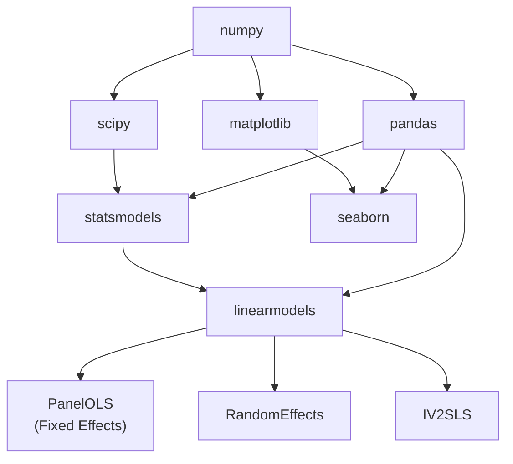
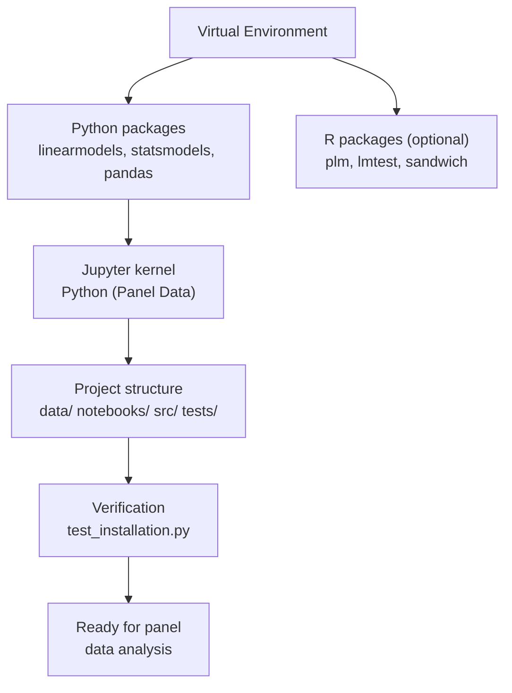

<!-- _class: lead -->

# Environment Setup for Panel Data Analysis

## Module 00 -- Foundations

<!-- Speaker notes: Transition slide. Pause briefly before moving into the environment setup for panel data analysis section. -->
---

# In Brief

Proper environment setup ensures reproducible panel data analysis with the right tools and versions.

> Panel data econometrics requires specialized libraries beyond standard data science tools.

<!-- Speaker notes: Read the highlighted quote aloud. This captures the key insight of the slide. -->
---

# Key Libraries

| Library | Purpose | Language |
|---------|---------|---------|
| **linearmodels** | Panel regression (FE, RE, IV) | Python |
| **statsmodels** | General statistics and diagnostics | Python |
| **pandas** | Data manipulation and MultiIndex | Python |
| **plm** | Panel linear models | R |
| **lmtest** | Diagnostic testing | R |

<!-- Speaker notes: Review the table row by row. Highlight the most important distinctions. -->
---

# Setup Pipeline


<!-- Speaker notes: Walk through the diagram from top to bottom. Explain each node and decision point. -->
---

<!-- _class: lead -->

# Python Setup

<!-- Speaker notes: Transition slide. Pause briefly before moving into the python setup section. -->
---

# Step 1: Create Virtual Environment

<div class="columns">
<div>

**Using venv:**
```bash
cd /path/to/your/project

python3 -m venv panel_env

# macOS/Linux
source panel_env/bin/activate

# Windows
panel_env\Scripts\activate
```

</div>
<div>

**Using conda:**
```bash
conda create -n panel_env python=3.10

conda activate panel_env
```

</div>
</div>

<!-- Speaker notes: Walk through the code step by step. Highlight the key function calls and explain what each does. -->
---

# Step 2: Install Core Packages

```bash
# Upgrade pip
pip install --upgrade pip

# Core data science stack
pip install numpy pandas matplotlib seaborn jupyter

# Statistical packages
pip install scipy statsmodels

# Panel data econometrics
pip install linearmodels

# Optional extras
pip install scikit-learn plotly

# Development tools
pip install pytest black isort mypy
```

<!-- Speaker notes: Walk through the code step by step. Highlight the key function calls and explain what each does. -->
---

# Step 3: Verify Imports

```python
def test_imports():
    """Test that all packages can be imported."""
    import numpy as np
    import pandas as pd
    import matplotlib.pyplot as plt
    import statsmodels.api as sm
    from linearmodels.panel import PanelOLS, RandomEffects
    from linearmodels.datasets import wage_panel
    print("All imports successful!")
```

<!-- Speaker notes: Walk through the code step by step. Highlight the key function calls and explain what each does. -->
---

# Step 3b: Test Basic Functionality

```python
def test_basic_functionality():
    from linearmodels.datasets import wage_panel
    from linearmodels.panel import PanelOLS

    data = wage_panel.load()
    data = data.set_index(['nr', 'year'])

    model = PanelOLS.from_formula(
        'lwage ~ expersq + union + married + EntityEffects',
        data=data
    )
    result = model.fit()
    print(f"R-squared: {result.rsquared:.4f}")
```

<!-- Speaker notes: Walk through the code step by step. Highlight the key function calls and explain what each does. -->
---

# Step 4: Jupyter Setup

```bash
# Install Jupyter
pip install jupyter jupyterlab

# Create IPython kernel for this environment
python -m ipykernel install --user \
    --name=panel_env \
    --display-name="Python (Panel Data)"

# Launch Jupyter Lab
jupyter lab
```

Verify in a notebook:
```python
import sys
print(f"Python path: {sys.executable}")

import linearmodels
print(f"Linearmodels version: {linearmodels.__version__}")
```

<!-- Speaker notes: Walk through the code step by step. Highlight the key function calls and explain what each does. -->
---

# Package Dependency Map



<!-- Speaker notes: Walk through the diagram from top to bottom. Explain each node and decision point. -->
---

<!-- _class: lead -->

# R Setup

<!-- Speaker notes: Transition slide. Pause briefly before moving into the r setup section. -->
---

# R Package Installation

```r
# Core panel data package
install.packages("plm")

# Testing and diagnostics
install.packages("lmtest")
install.packages("sandwich")

# Data manipulation
install.packages("tidyverse")
install.packages("haven")        # Stata/SPSS files

# Table formatting
install.packages("stargazer")
install.packages("texreg")

# Additional econometrics
install.packages("AER")
install.packages("clubSandwich")  # Cluster-robust inference
```

<!-- Speaker notes: Walk through the code step by step. Highlight the key function calls and explain what each does. -->
---

# R Verification

```r
library(plm)

# Load Grunfeld investment data
data("Grunfeld", package = "plm")

# Estimate fixed effects model
fe_model <- plm(inv ~ value + capital,
                data = Grunfeld,
                index = c("firm", "year"),
                model = "within")

summary(fe_model)
```

<!-- Speaker notes: Walk through the code step by step. Highlight the key function calls and explain what each does. -->
---

<!-- _class: lead -->

# Common Installation Issues

<!-- Speaker notes: Transition slide. Pause briefly before moving into the common installation issues section. -->
---

# Troubleshooting Guide

| Issue | Symptom | Solution |
|-------|---------|----------|
| Compiler missing | `gcc failed` or `MSVC required` | Install build tools (Xcode / MSVC) |
| linearmodels fails | pip error | `conda install -c conda-forge linearmodels` |
| R dependencies | `dependencies not available` | Install missing packages individually |
| Kernel not found | Not in Jupyter menu | Reinstall with `--force` flag |
| Version conflicts | Dependency resolver error | Use `requirements.txt` with pinned versions |

<!-- Speaker notes: Review the table row by row. Highlight the most important distinctions. -->
---

# Fixing Compiler Issues

<div class="columns">
<div>

**macOS:**
```bash
xcode-select --install
```

**Linux:**
```bash
# Ubuntu/Debian
sudo apt-get install \
    build-essential python3-dev
```

</div>
<div>

**Windows:**
Install Microsoft C++ Build Tools from Visual Studio.

**Alternative (all platforms):**
```bash
conda install -c conda-forge \
    linearmodels
```

</div>
</div>

<!-- Speaker notes: Walk through the code step by step. Highlight the key function calls and explain what each does. -->
---

# Pinned Requirements File

```
numpy>=1.22.0,<2.0.0
pandas>=1.4.0,<3.0.0
scipy>=1.8.0,<2.0.0
statsmodels>=0.13.0,<0.15.0
linearmodels>=5.0,<6.0
jupyter>=1.0.0
matplotlib>=3.5.0
seaborn>=0.12.0
```

```bash
pip install -r requirements.txt
```

<!-- Speaker notes: Walk through the code step by step. Highlight the key function calls and explain what each does. -->
---

<!-- _class: lead -->

# Project Structure

<!-- Speaker notes: Transition slide. Pause briefly before moving into the project structure section. -->
---

# Recommended Directory Layout

```
panel_regression_project/
├── panel_env/          # Virtual environment (gitignored)
├── data/
│   ├── raw/            # Original data files
│   ├── processed/      # Cleaned panel data
│   └── README.md
├── notebooks/
│   ├── 01_data_preparation.ipynb
│   ├── 02_exploratory_analysis.ipynb
│   ├── 03_fixed_effects.ipynb
│   └── 04_model_selection.ipynb
├── src/
│   ├── data_utils.py
│   ├── panel_utils.py
│   └── visualization.py
├── tests/
├── results/
├── requirements.txt
└── README.md
```

<!-- Speaker notes: Explain the key concepts on this slide. Check for questions before moving on. -->
---

# Verification Checklist

- [ ] Python 3.8+ installed
- [ ] Virtual environment created and activated
- [ ] All packages installed (linearmodels, statsmodels, pandas)
- [ ] Test script runs successfully
- [ ] Jupyter kernel configured
- [ ] Can import linearmodels in notebook
- [ ] (Optional) R plm package working
- [ ] Project directory structure created

<!-- Speaker notes: Explain the key concepts on this slide. Check for questions before moving on. -->
---

# Quick Reference Commands

<div class="columns">
<div>

**Activate:**
```bash
# venv
source panel_env/bin/activate
# conda
conda activate panel_env
```

**Update:**
```bash
pip install --upgrade \
    linearmodels statsmodels pandas
```

</div>
<div>

**Export:**
```bash
# pip
pip freeze > requirements.txt
# conda
conda env export > environment.yml
```

**Recreate:**
```bash
pip install -r requirements.txt
conda env create -f environment.yml
```

</div>
</div>

<!-- Speaker notes: Walk through the code step by step. Highlight the key function calls and explain what each does. -->
---

# Visual Summary



> A clean, reproducible environment is the foundation for reliable results.

<!-- Speaker notes: This is a reference slide. Students can photograph or bookmark this for later review. -->