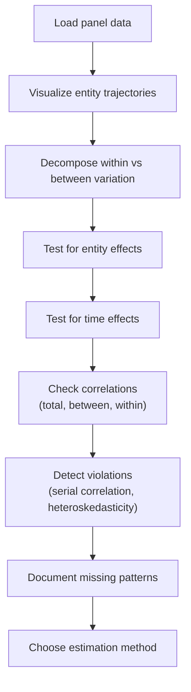
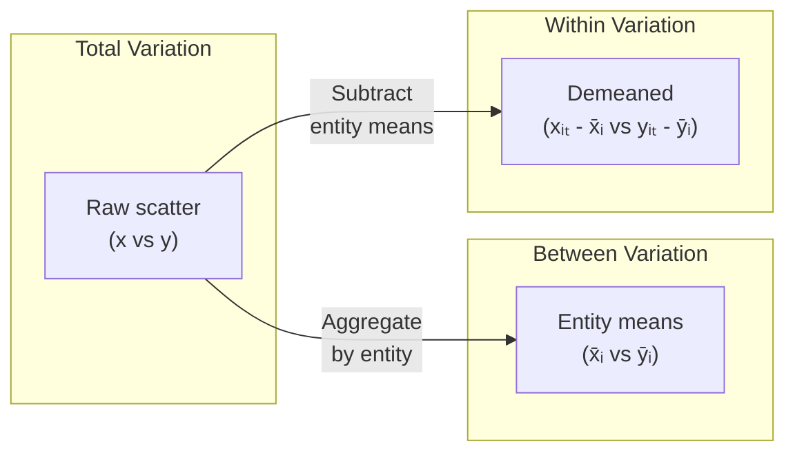
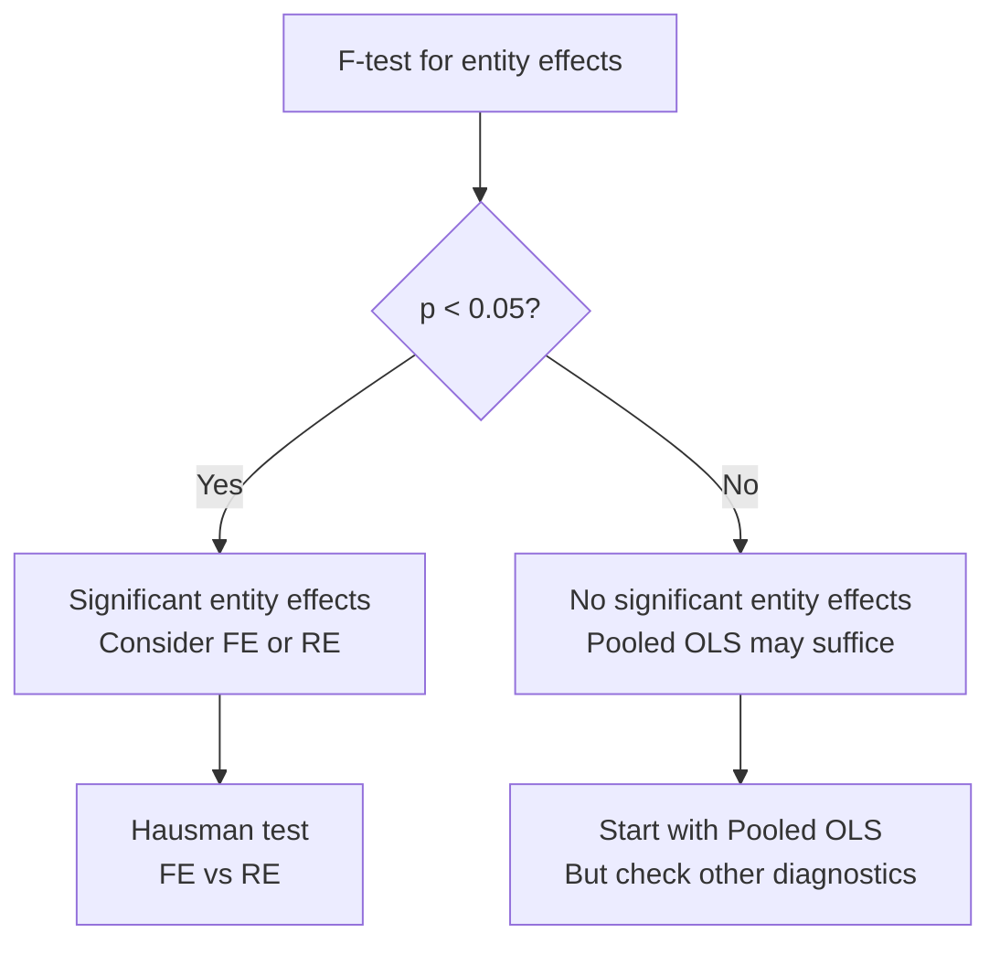
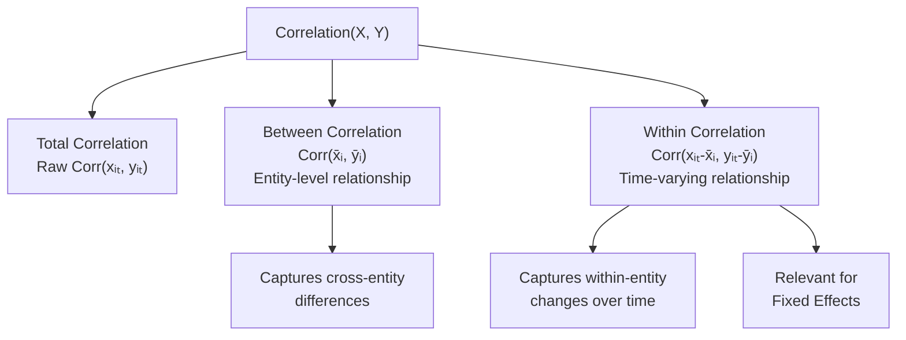
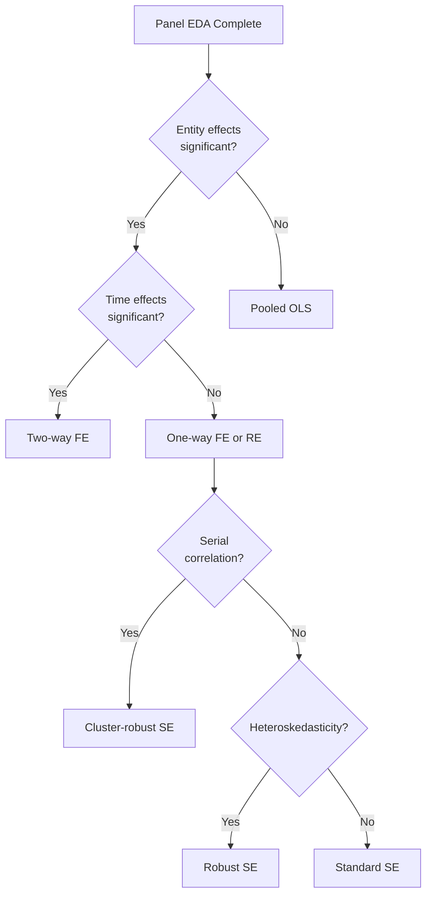

<!-- _class: lead -->

# Exploratory Panel Data Analysis

## Module 00 -- Foundations

<!-- Speaker notes: Transition slide. Pause briefly before moving into the exploratory panel data analysis section. -->
---

# Introduction

Before running panel regressions, thorough exploratory analysis helps you:

- Understand data structure
- Identify potential issues
- Choose appropriate methods

> Always visualize before you model.

<!-- Speaker notes: Read the highlighted quote aloud. This captures the key insight of the slide. -->
---

# EDA Pipeline for Panel Data



<!-- Speaker notes: Walk through the diagram from top to bottom. Explain each node and decision point. -->
---

<!-- _class: lead -->

# Visualizing Panel Data

<!-- Speaker notes: Transition slide. Pause briefly before moving into the visualizing panel data section. -->
---

# Individual Time Series Plots

```python
fig, axes = plt.subplots(2, 2, figsize=(14, 10))

# Y trajectories by entity
for entity in df['entity'].unique():
    entity_data = df[df['entity'] == entity]
    axes[0,0].plot(entity_data['time'],
                   entity_data['y'], alpha=0.7)
axes[0,0].set_title('Y Trajectories by Entity')
```

<!-- Speaker notes: Walk through the code step by step. Highlight the key function calls and explain what each does. -->
---

# Scatter Plots: Pooled vs By Entity

```python
# Scatter: pooled (ignores entity structure)
axes[1,0].scatter(df['x'], df['y'], alpha=0.5)
axes[1,0].set_title('Pooled Scatter Plot')

# Scatter: colored by entity (reveals structure)
scatter = axes[1,1].scatter(
    df['x'], df['y'], c=df['entity'], cmap='tab10')
axes[1,1].set_title('Scatter by Entity')
```

<!-- Speaker notes: Highlight the key differences. Ask students when they would choose one approach over the other. -->
---

# What to Look For in Trajectories

| Pattern | Implication |
|---------|-------------|
| Parallel trajectories | Entity effects likely constant -- FE appropriate |
| Diverging paths | Interaction between entity and time effects |
| Common shocks | Time effects present -- consider two-way FE |
| Distinct clusters | Between variation dominates -- RE may help |
| Outlier entities | Investigate; may drive results |

<!-- Speaker notes: Review the table row by row. Highlight the most important distinctions. -->
---

# Within vs Between Variation Plot



<!-- Speaker notes: Highlight the key differences. Ask students when they would choose one approach over the other. -->
---

# Within vs Between Code (Part 1: Total and Between)

```python
def plot_within_between(df, entity_col, x_col, y_col):
    fig, axes = plt.subplots(1, 3, figsize=(15, 5))

    # 1. Total variation (pooled)
    axes[0].scatter(df[x_col], df[y_col], alpha=0.5)
    axes[0].set_title('Total Variation (Pooled OLS)')

    # 2. Between variation (entity means)
    means = df.groupby(entity_col)[[x_col, y_col]].mean()
    axes[1].scatter(means[x_col], means[y_col], s=100)
    axes[1].set_title('Between Variation')
```

<!-- Speaker notes: Highlight the key differences. Ask students when they would choose one approach over the other. -->
---

# Within vs Between Code (Part 2: Within)

```python
    # 3. Within variation (demeaned)
    df_w = df.copy()
    for col in [x_col, y_col]:
        df_w[f'{col}_dm'] = df[col] - df.groupby(
            entity_col)[col].transform('mean')

    axes[2].scatter(df_w[f'{x_col}_dm'],
                    df_w[f'{y_col}_dm'], alpha=0.5)
    axes[2].set_title('Within Variation (FE)')
```

<!-- Speaker notes: Highlight the key differences. Ask students when they would choose one approach over the other. -->
---

# Interpreting Slope Differences

| Scenario | Pooled | Between | Within | Implication |
|----------|:------:|:-------:|:------:|-------------|
| All similar | 0.5 | 0.5 | 0.5 | No entity confounding |
| Between != Within | 0.7 | 1.2 | 0.3 | Entity effects correlated with X |
| Within near zero | 0.8 | 1.5 | 0.1 | X varies mostly between entities |

> When between and within slopes differ substantially, fixed effects is critical.

<!-- Speaker notes: Review the table row by row. Highlight the most important distinctions. -->
---

<!-- _class: lead -->

# Testing for Entity Effects

<!-- Speaker notes: Transition slide. Pause briefly before moving into the testing for entity effects section. -->
---

# Entity Mean Differences (Part 1: Compute)

```python
def plot_entity_effects(df, entity_col, y_col):
    stats = df.groupby(entity_col)[y_col].agg(
        ['mean', 'std', 'count'])
    stats['se'] = stats['std'] / np.sqrt(stats['count'])
    stats['ci_lower'] = stats['mean'] - 1.96 * stats['se']
    stats['ci_upper'] = stats['mean'] + 1.96 * stats['se']
    stats = stats.sort_values('mean')
    grand_mean = df[y_col].mean()
```

<!-- Speaker notes: Walk through the code step by step. Highlight the key function calls and explain what each does. -->
---

# Entity Mean Differences (Part 2: Plot)

```python
    fig, ax = plt.subplots(figsize=(12, 6))
    ax.errorbar(
        range(len(stats)), stats['mean'],
        yerr=[stats['mean'] - stats['ci_lower'],
              stats['ci_upper'] - stats['mean']],
        fmt='o', capsize=3)
    ax.axhline(grand_mean, color='red', linestyle='--')
    ax.set_title('Entity-Specific Means with 95% CI')
```

<!-- Speaker notes: Walk through the code step by step. Highlight the key function calls and explain what each does. -->
---

# F-Test for Entity Effects

$$F = \frac{SS_{\text{between}} / (N - 1)}{SS_{\text{within}} / (NT - N)}$$

```python
from scipy import stats

entity_means = df.groupby(entity_col)[y_col].transform('mean')
grand_mean = df[y_col].mean()

ss_between = ((entity_means - grand_mean) ** 2).sum()
df_between = df[entity_col].nunique() - 1

ss_within = ((df[y_col] - entity_means) ** 2).sum()
df_within = len(df) - df[entity_col].nunique()

f_stat = (ss_between / df_between) / (ss_within / df_within)
p_value = 1 - stats.f.cdf(f_stat, df_between, df_within)
```

<!-- Speaker notes: This slide connects the math to implementation. Walk through how the formula maps to code. -->
---

# Entity Effects Decision



<!-- Speaker notes: Walk through the decision tree step by step. Ask students to apply it to a concrete example. -->
---

# Testing for Time Effects (Part 1: Plot)

```python
def test_time_effects(df, time_col, y_col):
    time_means = df.groupby(time_col)[y_col].mean()
    grand_mean = df[y_col].mean()

    fig, ax = plt.subplots(figsize=(12, 5))
    ax.plot(time_means.index, time_means.values, 'o-')
    ax.axhline(grand_mean, color='red', linestyle='--')
    ax.set_title('Time-Specific Means')
```

<!-- Speaker notes: Walk through the code step by step. Highlight the key function calls and explain what each does. -->
---

# Testing for Time Effects (Part 2: F-test)

```python
    # F-test for time effects
    time_means_all = df.groupby(time_col)[y_col] \
        .transform('mean')
    ss_time = ((time_means_all - grand_mean) ** 2).sum()
    df_time = df[time_col].nunique() - 1
    ss_resid = ((df[y_col] - time_means_all) ** 2).sum()
    df_resid = len(df) - df[time_col].nunique()

    f_stat = (ss_time / df_time) / (ss_resid / df_resid)
```

<!-- Speaker notes: Walk through the code step by step. Highlight the key function calls and explain what each does. -->
---

<!-- _class: lead -->

# Correlation Analysis

<!-- Speaker notes: Transition slide. Pause briefly before moving into the correlation analysis section. -->
---

# Three Types of Panel Correlation

```python
def within_correlation(df, entity_col, var1, var2):
    total_corr = df[var1].corr(df[var2])

    means = df.groupby(entity_col)[[var1, var2]].mean()
    between_corr = means[var1].corr(means[var2])

    demean = lambda v: df[v] - df.groupby(
        entity_col)[v].transform('mean')
    within_corr = demean(var1).corr(demean(var2))

    return {'total': total_corr,
            'between': between_corr,
            'within': within_corr}
```

<!-- Speaker notes: Walk through the code step by step. Highlight the key function calls and explain what each does. -->
---

# Correlation Decomposition



<!-- Speaker notes: Walk through the diagram from top to bottom. Explain each node and decision point. -->
---

<!-- _class: lead -->

# Detecting Panel Data Issues

<!-- Speaker notes: Transition slide. Pause briefly before moving into the detecting panel data issues section. -->
---

# Serial Correlation in Residuals

```python
def test_serial_correlation(df, entity_col, time_col, resid_col):
    df_sorted = df.sort_values([entity_col, time_col])
    df_sorted['resid_lag'] = df_sorted.groupby(entity_col)[resid_col].shift(1)
    df_complete = df_sorted.dropna(subset=['resid_lag'])

    rho = df_complete[resid_col].corr(df_complete['resid_lag'])

    n = len(df_complete)
    se_rho = 1 / np.sqrt(n)
    t_stat = rho / se_rho
    p_value = 2 * (1 - stats.t.cdf(abs(t_stat), n - 1))

    return rho, p_value
```

> If serial correlation detected, use clustered standard errors.

<!-- Speaker notes: Walk through the code step by step. Highlight the key function calls and explain what each does. -->
---

# Heteroskedasticity Across Entities

```python
def test_heteroskedasticity(df, entity_col, resid_col):
    entity_vars = df.groupby(entity_col)[resid_col].var()

    # Bartlett's test for equal variances
    groups = [g[resid_col].values for _, g in df.groupby(entity_col)]
    stat, p_value = stats.bartlett(*groups)

    return stat, p_value
```

| Result | Action |
|--------|--------|
| p < 0.05 | Use heteroskedasticity-robust SE |
| p >= 0.05 | Standard SE may be acceptable |

<!-- Speaker notes: Walk through the code step by step. Highlight the key function calls and explain what each does. -->
---

# Diagnostic Decision Tree



<!-- Speaker notes: Walk through the decision tree step by step. Ask students to apply it to a concrete example. -->
---

# Missing Data Patterns

```python
def analyze_missing_patterns(df, entity_col, time_col, value_cols):
    entities = df[entity_col].unique()
    times = df[time_col].unique()
    complete_idx = pd.MultiIndex.from_product(
        [entities, times], names=[entity_col, time_col]
    )
    df_idx = df.set_index([entity_col, time_col])
    missing = set(complete_idx) - set(df_idx.index)

    print(f"Missing entity-time combinations: {len(missing)}")

    for col in value_cols:
        n_miss = df[col].isna().sum()
        pct = n_miss / len(df) * 100
        print(f"  {col}: {n_miss} ({pct:.2f}%)")
```

<!-- Speaker notes: Walk through the code step by step. Highlight the key function calls and explain what each does. -->
---

<!-- _class: lead -->

# Summary Statistics Report

<!-- Speaker notes: Transition slide. Pause briefly before moving into the summary statistics report section. -->
---

# EDA Report: Structure and Variation

```python
def panel_eda_report(df, entity_col, time_col,
                     outcome, predictors):
    print("1. DATA STRUCTURE")
    N = df[entity_col].nunique()
    T = df[time_col].nunique()
    print(f"   N={N}, T={T}, Total obs: {len(df)}")

    print("\n2. VARIATION DECOMPOSITION")
    for var in [outcome] + predictors:
        d = decompose_variation(df, entity_col, var)
        print(f"   {var}: between={d['between_share']:.1%}"
              f", within={d['within_share']:.1%}")
```

<!-- Speaker notes: Walk through the code step by step. Highlight the key function calls and explain what each does. -->
---

# EDA Report: Correlations

```python
    print("\n3. CORRELATIONS WITH OUTCOME")
    for pred in predictors:
        c = within_correlation(
            df, entity_col, pred, outcome)
        print(f"   {pred}: total={c['total']:.3f}, "
              f"between={c['between']:.3f}, "
              f"within={c['within']:.3f}")
```

<!-- Speaker notes: Walk through the code step by step. Highlight the key function calls and explain what each does. -->
---

# Key Takeaways

1. **Always visualize trajectories** -- plot entity paths to understand heterogeneity

2. **Decompose variation** -- within vs between guides model choice

3. **Test for effects** -- formal tests help justify FE/RE specification

4. **Check for violations** -- serial correlation and heteroskedasticity require robust SE

5. **Document missing patterns** -- non-random missingness can bias estimates

<!-- Speaker notes: Summarize the main points. Ask students which takeaway surprised them most. -->
---

# Visual Summary

| EDA Step | Tool | Informs |
|----------|------|---------|
| Trajectory plots | Entity time series | Presence of entity effects |
| Variation decomposition | Within/between split | FE vs RE vs pooled |
| F-tests | Entity and time effects | Model specification |
| Correlation decomposition | Total/between/within | Confounding assessment |
| Serial correlation test | Lag-residual correlation | Standard error choice |
| Missing data analysis | Availability matrix | Selection bias risk |

> Thorough EDA prevents specification errors and builds confidence in results.

<!-- Speaker notes: This is a reference slide. Students can photograph or bookmark this for later review. -->