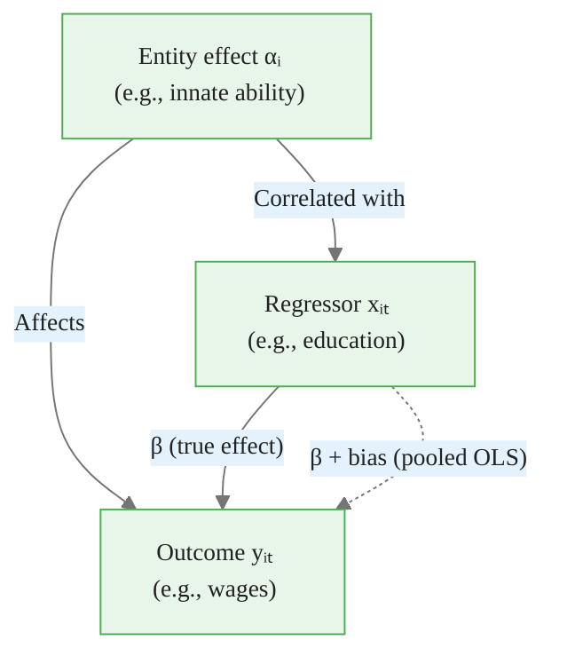
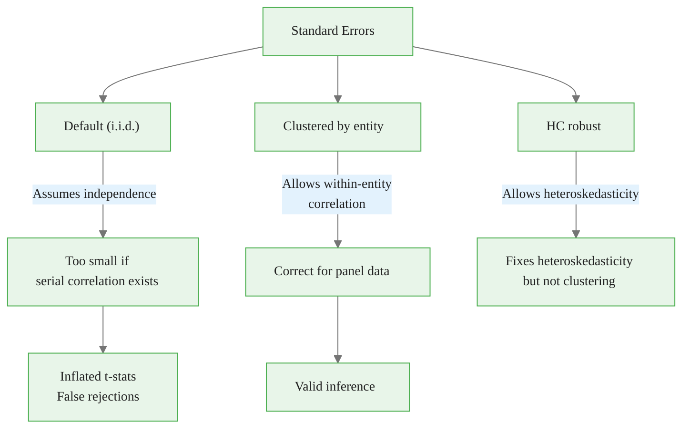
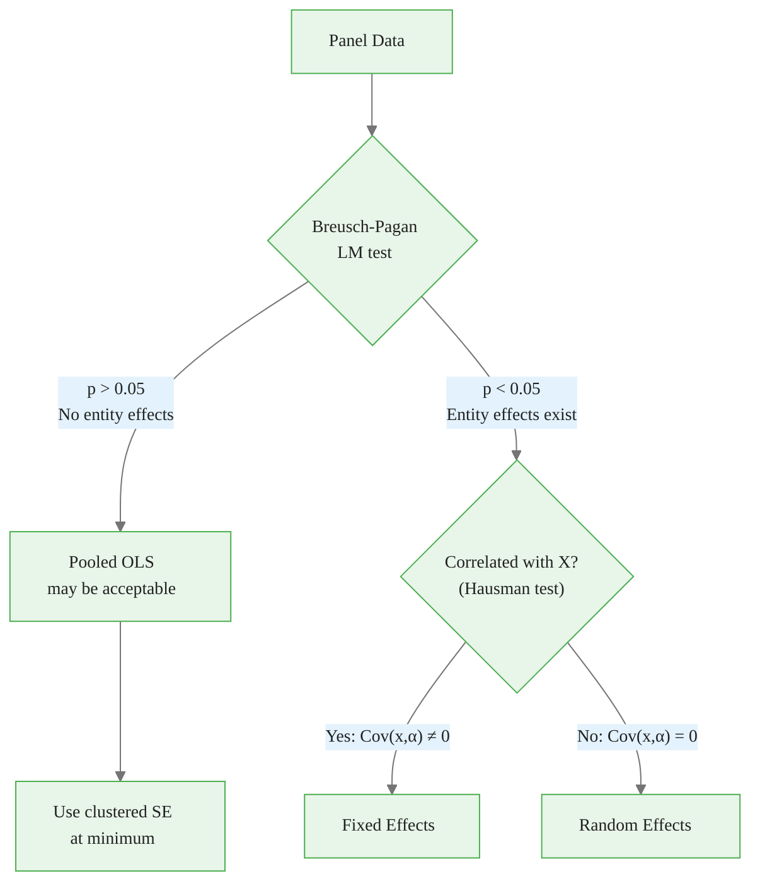

<!-- _class: lead -->

# Pooled OLS and Its Limitations

## Module 01 -- Panel Structure

<!-- Speaker notes: Transition slide. Pause briefly before moving into the pooled ols and its limitations section. -->
---

# The Pooled OLS Approach

Pooled OLS ignores the panel structure entirely:

$$y_{it} = \beta_0 + x_{it}'\beta + \epsilon_{it}$$

Treats all $N \times T$ observations as independent draws.

> Simple but potentially misleading when entity heterogeneity exists.

<!-- Speaker notes: Focus on the intuition behind the formula. Explain what each term represents in plain language. -->

<div class="callout-key">

Panel data controls for unobserved time-invariant heterogeneity -- the key advantage over cross-sectional data.

</div>

---

# Implementation

<div class="code-window">
<div class="code-header">
<div class="dots"><span class="dot-red"></span><span class="dot-yellow"></span><span class="dot-green"></span></div>
<span class="filename">example.py</span>
</div>

```python
from linearmodels.panel import PooledOLS
import statsmodels.api as sm

# Method 1: statsmodels (ignores panel)
X_pooled = sm.add_constant(data['x'])
pooled_sm = sm.OLS(data['y'], X_pooled).fit()

# Method 2: linearmodels PooledOLS
pooled_lm = PooledOLS(data['y'], sm.add_constant(data['x'])).fit()

print(f"x coefficient: {pooled_sm.params['x']:.4f}")
print(f"True value: 1.5")
```

</div>

<!-- Speaker notes: Walk through the code step by step. Highlight the key function calls and explain what each does. -->

<div class="callout-insight">

**Insight:** The within-transformation eliminates time-invariant confounders, which is the most powerful tool in the panel econometrician's toolkit.

</div>

---

# What Pooled OLS Assumes

For consistency, pooled OLS requires **strict exogeneity**:

$$E[\epsilon_{it} | x_{i1}, x_{i2}, ..., x_{iT}] = 0$$

All regressors uncorrelated with all errors -- past, present, and future.

<!-- Speaker notes: Focus on the intuition behind the formula. Explain what each term represents in plain language. -->

<div class="callout-warning">

**Warning:** Standard errors from pooled OLS ignore within-entity correlation and are almost always too small. Use clustered standard errors.

</div>

---

<!-- _class: lead -->

# The Omitted Variable Problem

<!-- Speaker notes: Transition slide. Pause briefly before moving into the the omitted variable problem section. -->
---

# The Composite Error

When entity effects exist:

$$y_{it} = \beta_0 + x_{it}'\beta + \underbrace{\alpha_i + \epsilon_{it}}_{u_{it}}$$

| Component | Nature | Problem |
|-----------|--------|---------|
| $\alpha_i$ | Entity-specific, time-invariant | Absorbed into error |
| $\epsilon_{it}$ | Idiosyncratic, random | No problem |

<!-- Speaker notes: Focus on the intuition behind the formula. Explain what each term represents in plain language. -->

<div class="callout-info">

**Info:** With N entities and T periods, panel data gives N*T observations, dramatically increasing statistical power over pure cross-sections.

</div>

---

# Correlation Creates Bias

If $\text{Cov}(x_{it}, \alpha_i) \neq 0$:

$$\hat{\beta}_{pooled} \xrightarrow{p} \beta + \underbrace{\frac{\text{Cov}(x_{it}, \alpha_i)}{\text{Var}(x_{it})}}_{\text{Omitted Variable Bias}}$$

<!-- Speaker notes: Focus on the intuition behind the formula. Explain what each term represents in plain language. -->
---

# Bias Mechanism



> Pooled OLS attributes some of the effect of $\alpha_i$ to $x_{it}$, inflating the coefficient.

<!-- Speaker notes: Walk through the diagram from top to bottom. Explain each node and decision point. -->
---

# Example: Returns to Education

| Variable | Interpretation |
|----------|----------------|
| $y_{it}$ | Log wages |
| $x_{it}$ | Years of education |
| $\alpha_i$ | Innate ability (unobserved) |

Ability correlates with both education and wages.

Pooled OLS **overestimates** returns to education.

<!-- Speaker notes: Walk through this example line by line. Pause after key output to discuss what it means. -->
---

<!-- _class: lead -->

# Serial Correlation in Errors

<!-- Speaker notes: Transition slide. Pause briefly before moving into the serial correlation in errors section. -->
---

# Error Covariance Structure

Within the same entity ($i = j$, $t \neq s$):

$$\text{Cov}(u_{it}, u_{is}) = \text{Cov}(\alpha_i + \epsilon_{it}, \alpha_i + \epsilon_{is}) = \sigma_\alpha^2$$

Across entities ($i \neq j$):

$$\text{Cov}(u_{it}, u_{js}) = 0$$

<!-- Speaker notes: Focus on the intuition behind the formula. Explain what each term represents in plain language. -->
---

# Intraclass Correlation (ICC)

$$\rho = \frac{\sigma_\alpha^2}{\sigma_\alpha^2 + \sigma_\epsilon^2}$$

Measures the proportion of variance due to entity effects.

<div class="code-window">
<div class="code-header">
<div class="dots"><span class="dot-red"></span><span class="dot-yellow"></span><span class="dot-green"></span></div>
<span class="filename">example.py</span>
</div>

```python
def estimate_icc(data, y_col, entity_col):
    between_var = data.groupby(entity_col)[y_col].mean().var()
    within_var = data.groupby(entity_col)[y_col].var().mean()
    return between_var / (between_var + within_var)
```

</div>

<!-- Speaker notes: This slide connects the math to implementation. Walk through how the formula maps to code. -->
---

# Impact on Standard Errors

With serial correlation:

$$\text{True } SE(\hat{\beta}) > \text{Reported } SE(\hat{\beta})$$

This leads to:
- **Overstated t-statistics**
- **False rejections** of null hypotheses
- **Invalid confidence intervals**

<!-- Speaker notes: Focus on the intuition behind the formula. Explain what each term represents in plain language. -->
---

# Standard Error Comparison Flow



<!-- Speaker notes: Highlight the key differences. Ask students when they would choose one approach over the other. -->
---

# Clustered Standard Errors

```python
# Cluster at entity level
pooled_clustered = PooledOLS(
    data['y'], sm.add_constant(data['x'])
).fit(cov_type='clustered', cluster_entity=True)

print(f"Homoskedastic SE: {pooled_lm.std_errors['x']:.4f}")
print(f"Clustered SE:     {pooled_clustered.std_errors['x']:.4f}")
```

**Sandwich estimator:**

$$\hat{V}(\hat{\beta}) = (X'X)^{-1} \left( \sum_{i=1}^N X_i' \hat{u}_i \hat{u}_i' X_i \right) (X'X)^{-1}$$

<!-- Speaker notes: This slide connects the math to implementation. Walk through how the formula maps to code. -->
---

<!-- _class: lead -->

# When Is Pooled OLS Appropriate?

<!-- Speaker notes: Transition slide. Pause briefly before moving into the when is pooled ols appropriate? section. -->
---

# Valid Use Cases

1. **No entity effects:** $\sigma_\alpha^2 = 0$
2. **Uncorrelated effects:** $\text{Cov}(x_{it}, \alpha_i) = 0$
3. **Baseline comparison:** Show bias relative to FE/RE
4. **Random assignment:** Experimental settings

<!-- Speaker notes: Explain the key concepts on this slide. Check for questions before moving on. -->
---

# Breusch-Pagan LM Test

$$H_0: \sigma_\alpha^2 = 0 \quad \text{(Pooled OLS is fine)}$$

$$H_1: \sigma_\alpha^2 > 0 \quad \text{(Entity effects exist)}$$

```python
# LM statistic
sum_T_resid = resid_panel.sum(axis=1)
LM = (N * T / (2 * (T - 1))) * \
     (sum_T_resid @ sum_T_resid / (resid @ resid) - 1)**2

p_value = 1 - stats.chi2.cdf(LM, 1)
```

<!-- Speaker notes: This slide connects the math to implementation. Walk through how the formula maps to code. -->
---

# Decision Flowchart



<!-- Speaker notes: Walk through the decision tree step by step. Ask students to apply it to a concrete example. -->
---

# Summary: Pooled OLS Limitations

| Issue | Consequence | Solution |
|-------|-------------|----------|
| Omitted entity effects | Biased coefficients | Fixed Effects |
| Correlated entity effects | Biased coefficients | Fixed Effects |
| Serial correlation | Wrong standard errors | Clustered SE |
| Heteroskedasticity | Wrong standard errors | Robust SE |

<!-- Speaker notes: This is a reference slide. Students can photograph or bookmark this for later review. -->
---

# Key Takeaways

1. **Pooled OLS ignores panel structure** -- treats all observations as independent

2. **Entity effects create bias** when correlated with regressors

3. **Serial correlation** invalidates standard errors even without bias

4. **Clustered SE** fix inference but not bias

5. **Testing is essential** -- use LM tests before accepting pooled OLS

> Pooled OLS is the starting point, not the destination.

<!-- Speaker notes: Summarize the main points. Ask students which takeaway surprised them most. -->