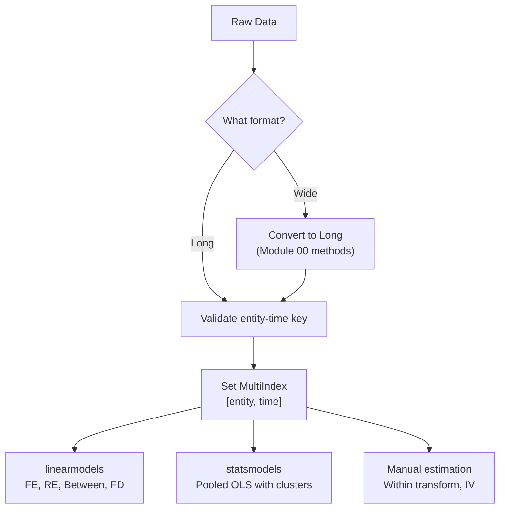
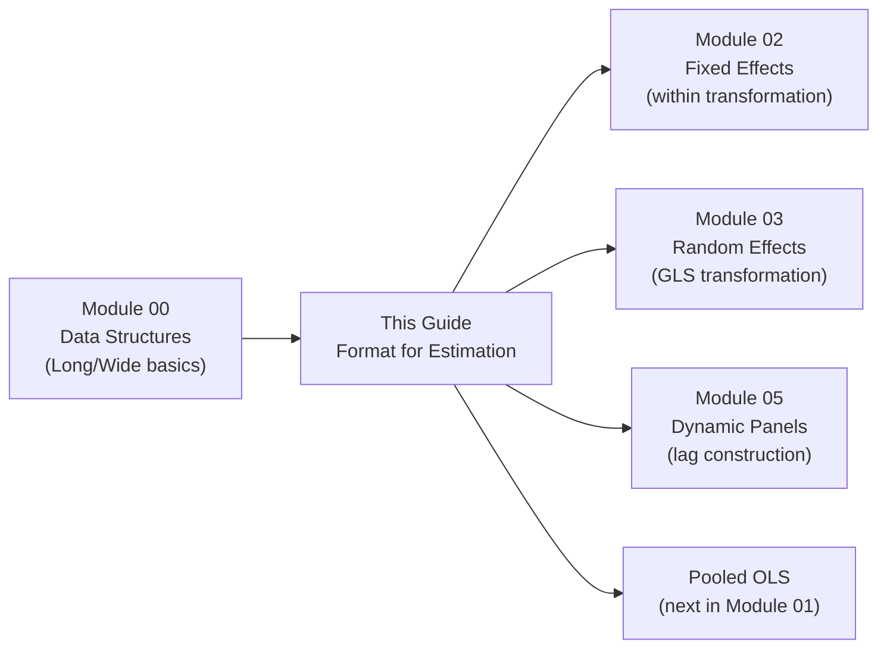

<!-- _class: lead -->

# Data Formats for Panel Estimation
## From Structure to Regression-Ready Data

### Module 01 -- Panel Structure

<!-- Speaker notes: This deck builds on Module 00's data structures introduction. Here we focus on how format choices affect panel regression estimation specifically. Students should already know long vs wide and MultiIndex basics. -->

---

# In Brief

Module 00 covered long vs wide formats. This deck focuses on **how format choices affect estimation**: which libraries expect which format, how to prepare data for different estimators, and format-related pitfalls that produce wrong results.

> Knowing the format is step 1. Knowing what your estimator expects is step 2.

<!-- Speaker notes: Frame this as the practical "next step" from Module 00. Students who skipped Module 00 may need to go back for the basics. -->

---

# Estimator Format Requirements

| Estimator | Library | Required Format | Index |
|-----------|---------|-----------------|-------|
| Pooled OLS | statsmodels | Long | Optional |
| Fixed Effects | linearmodels | Long | MultiIndex required |
| Random Effects | linearmodels | Long | MultiIndex required |
| First Difference | manual | Long, sorted | Entity-time sorted |
| Between Estimator | linearmodels | Long | MultiIndex required |

<!-- Speaker notes: The key insight is that linearmodels always requires a properly set MultiIndex. statsmodels is more flexible but you lose panel-specific functionality. -->

---

# Format Requirements Flow



<!-- Speaker notes: This pipeline applies to every analysis in the course. The validate step checks for duplicates, sorts, and confirms the entity-time key is unique. -->

---

<!-- _class: lead -->

# Library-Specific Preparation

<!-- Speaker notes: Each library has slightly different expectations. Getting this wrong produces confusing errors. -->

---

# linearmodels: Strict Requirements

```python
from linearmodels.panel import PanelOLS, RandomEffects

# REQUIRED: MultiIndex with entity first, time second
df = df.set_index(['entity_id', 'year'])

# Fixed Effects
fe_model = PanelOLS(df['y'], df[['x1', 'x2']],
                    entity_effects=True)
fe_result = fe_model.fit()

# Random Effects
re_model = RandomEffects(df['y'], df[['x1', 'x2']])
re_result = re_model.fit()
```

<!-- Speaker notes: The entity must be the first level and time the second. Reversing them produces wrong entity effects. This is a common mistake. -->

---

# statsmodels: More Flexible

```python
import statsmodels.api as sm

# Does not require MultiIndex
# But you must handle clustering manually
X = sm.add_constant(df[['x1', 'x2']])
ols_model = sm.OLS(df['y'], X).fit(
    cov_type='cluster',
    cov_kwds={'groups': df['entity_id']}
)
```

<!-- Speaker notes: statsmodels treats panel data like any other regression. You gain flexibility but lose panel-specific diagnostics. Use linearmodels for panel work whenever possible. -->

---

<!-- _class: lead -->

# Preparing Lags and Differences

<!-- Speaker notes: Lag and difference operations are where format errors cause the most damage. Wrong lags produce wrong estimates that look plausible. -->

---

# Safe Lag Construction

```python
# CORRECT: groupby entity, then shift within groups
df = df.sort_values(['entity_id', 'year'])
df['y_lag1'] = df.groupby('entity_id')['y'].shift(1)

# WRONG: shift without groupby (crosses entity boundaries)
# df['y_lag1'] = df['y'].shift(1)  # DO NOT DO THIS
```

<!-- Speaker notes: The wrong approach silently assigns the last observation of entity i as the first lag of entity i+1. This introduces cross-entity contamination that biases dynamic panel estimates. -->

---

# First-Differencing Setup

```python
# Sort is critical for correct differences
df = df.sort_values(['entity_id', 'year'])

# First difference within each entity
for col in ['y', 'x1', 'x2']:
    df[f'd_{col}'] = df.groupby('entity_id')[col].diff()

# Drop the first period (NaN from differencing)
df_fd = df.dropna(subset=['d_y'])
```

<!-- Speaker notes: First differencing eliminates entity fixed effects just like within transformation, but uses T-1 observations instead of T. The dropna step is essential -- the first period has no valid difference. -->

---

# Gap-Aware Differences

For unbalanced panels, simple `.diff()` can be wrong:

```python
# If entity 1 has years [2020, 2022] (2021 missing),
# diff() gives 2022 - 2020 (two-year gap!)

# Solution: check time gaps
df['time_gap'] = df.groupby('entity_id')['year'].diff()
df.loc[df['time_gap'] != 1, 'd_y'] = np.nan
```

<!-- Speaker notes: This is a subtle but critical issue with unbalanced panels. A two-year difference masquerading as a one-year difference will bias your estimates. Always check for gaps. -->

---

<!-- _class: lead -->

# Format Pitfalls in Estimation

<!-- Speaker notes: These pitfalls produce results that look correct but are actually wrong. They are hard to detect without careful validation. -->

---

# Pitfall: Wrong Index Level Order

```python
# WRONG: time first, entity second
df_wrong = df.set_index(['year', 'entity_id'])

# linearmodels interprets first level as entity
# → treats years as entities, entities as time periods
# → regression runs without error but results are WRONG
```

**Detection:**
```python
panel = PanelData(df_wrong)
print(f"Entities: {panel.nentity}")  # Shows 10 (years!)
print(f"Time: {panel.nobs / panel.nentity}")  # Shows 100
```

<!-- Speaker notes: This is the single most dangerous format error. linearmodels will not warn you -- it runs the regression with swapped dimensions. Always verify nentity and time periods match your expectations. -->

---

# Pitfall: Unsorted Data for Dynamic Models

```python
# Arellano-Bond requires sorted data for instrument construction
# Instruments are lags of the dependent variable

# If data is unsorted, instruments come from wrong periods
df = df.sort_index()  # Always sort MultiIndex
```

| Scenario | Consequence |
|----------|-------------|
| Unsorted within entity | Wrong lags → invalid instruments |
| Gaps in time index | Missing instruments → reduced sample |
| Duplicate entity-time | Ambiguous lags → error or wrong results |

<!-- Speaker notes: Dynamic panel models (Module 05) are especially sensitive to sorting. Build the habit now of always sorting immediately after setting the index. -->

---

# Connections



<!-- Speaker notes: This deck bridges the gap between knowing data structures and running panel regressions. Every module that follows assumes your data is properly formatted. -->

---

# Key Takeaways

1. **linearmodels requires MultiIndex** with entity first, time second

2. **Lag construction must respect entity boundaries** -- always groupby before shift

3. **First differencing requires sorted data** and gap-aware logic for unbalanced panels

4. **Wrong index order silently produces wrong results** -- always verify dimensions

5. **Validate before estimating**: check nentity, nobs, and balance

> Format errors produce results that look right but are wrong. Validate obsessively.

<!-- Speaker notes: The theme of this deck is defensive programming. Panel regression libraries are powerful but unforgiving with format errors. Build validation into your workflow. -->
