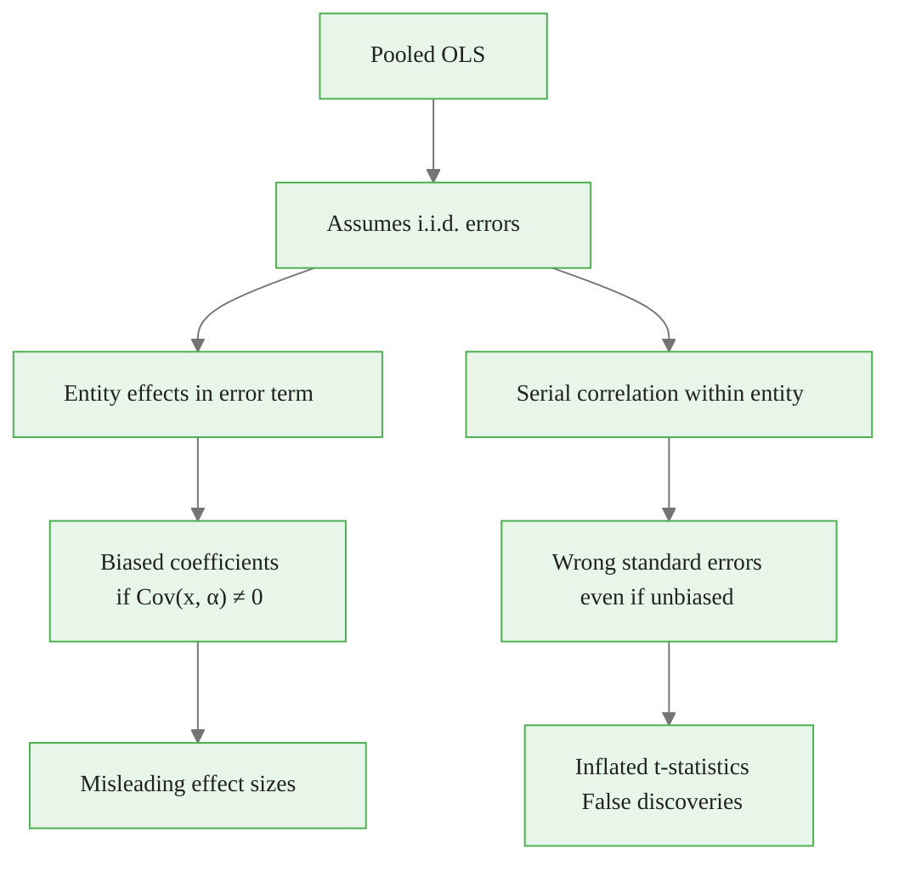
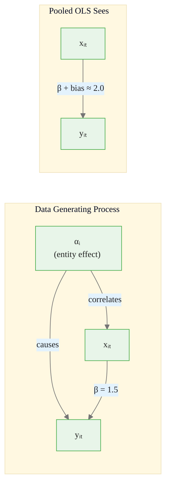
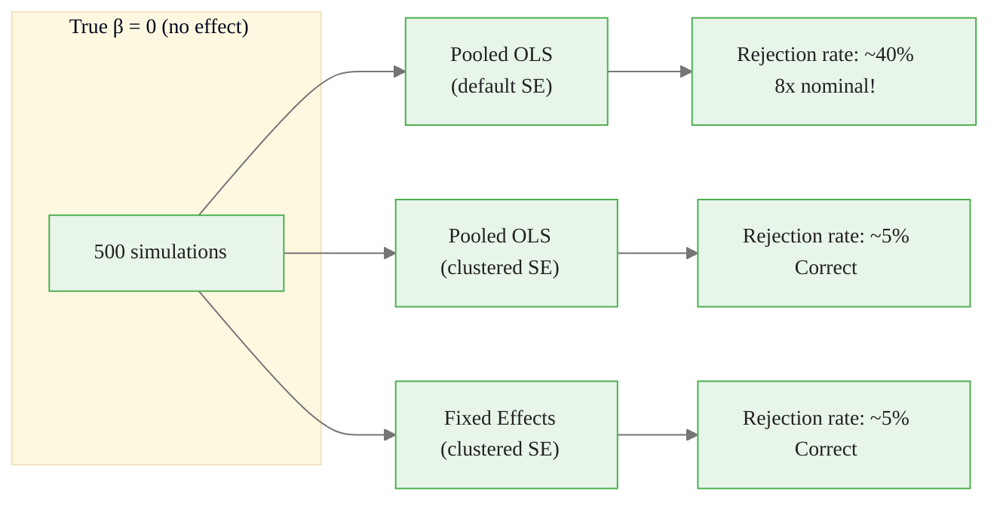
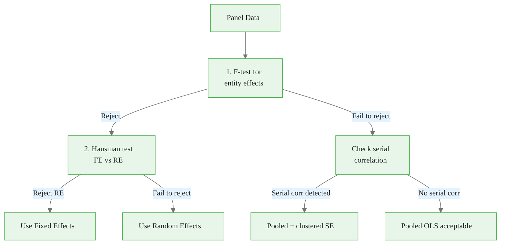

<!-- _class: lead -->

# Limitations of Pooled OLS
## When Simple Models Fail

### Module 01 -- Panel Structure

<!-- Speaker notes: Transition slide. Pause briefly before moving into the limitations of pooled ols section. -->
---

# The Pooled OLS Assumption

$$y_{it} = \alpha + X_{it}\beta + \epsilon_{it}$$

where $\epsilon_{it}$ is i.i.d. across **all** observations.

This ignores:
- **Entity heterogeneity:** Unobserved differences between units
- **Time dependence:** Correlation within entities over time

<!-- Speaker notes: Focus on the intuition behind the formula. Explain what each term represents in plain language. -->

<div class="callout-key">

Panel data controls for unobserved time-invariant heterogeneity -- the key advantage over cross-sectional data.

</div>

---

# What Goes Wrong



<!-- Speaker notes: Walk through the diagram from top to bottom. Explain each node and decision point. -->

<div class="callout-insight">

**Insight:** The within-transformation eliminates time-invariant confounders, which is the most powerful tool in the panel econometrician's toolkit.

</div>

---

<!-- _class: lead -->

# Demonstrating Bias

<!-- Speaker notes: Transition slide. Pause briefly before moving into the demonstrating bias section. -->
---

# Simulation Setup

<div class="code-window">
<div class="code-header">
<div class="dots"><span class="dot-red"></span><span class="dot-yellow"></span><span class="dot-green"></span></div>
<span class="filename">example.py</span>
</div>

```python
np.random.seed(42)
n_entities, n_periods = 100, 20
true_beta = 1.5

entity_effects = np.random.normal(0, 2, n_entities)

for i in range(n_entities):
    for t in range(n_periods):
        # X correlated with entity effect (endogeneity!)
        x = 3 + 0.5 * entity_effects[i] + np.random.normal(0, 1)
        # True DGP
        y = 2 + true_beta * x + entity_effects[i] + np.random.normal(0, 0.5)
```

</div>

<!-- Speaker notes: Walk through the code step by step. Highlight the key function calls and explain what each does. -->

<div class="callout-warning">

**Warning:** Standard errors from pooled OLS ignore within-entity correlation and are almost always too small. Use clustered standard errors.

</div>

---

# Bias Results

<div class="code-window">
<div class="code-header">
<div class="dots"><span class="dot-red"></span><span class="dot-yellow"></span><span class="dot-green"></span></div>
<span class="filename">example.py</span>
</div>

```python
print(f"True beta:        {true_beta:.4f}")
print(f"Pooled OLS beta:  {pooled.params['x']:.4f}  (Biased!)")
print(f"Fixed Effects:    {fe.params['x']:.4f}")
print(f"Pooled OLS Bias:  {pooled.params['x'] - true_beta:.4f}")
```

</div>

| Method | Estimate | Bias |
|--------|:--------:|:----:|
| True value | 1.5000 | -- |
| Pooled OLS | ~2.0+ | +0.5+ |
| Fixed Effects | ~1.50 | ~0.00 |

<!-- Speaker notes: Walk through the code step by step. Highlight the key function calls and explain what each does. -->

<div class="callout-info">

**Info:** With N entities and T periods, panel data gives N*T observations, dramatically increasing statistical power over pure cross-sections.

</div>

---

# Why Bias Occurs

$$E[\hat{\beta}_{OLS}] = \beta + \frac{\text{Cov}(X_{it}, \alpha_i)}{\text{Var}(X_{it})}$$



<!-- Speaker notes: Walk through the diagram from top to bottom. Explain each node and decision point. -->
---

<!-- _class: lead -->

# Serial Correlation Problem

<!-- Speaker notes: Transition slide. Pause briefly before moving into the serial correlation problem section. -->
---

# Within-Entity Autocorrelation

```python
def demonstrate_serial_correlation(df, entity_col, time_col, y_col, x_cols):
    pooled = smf.ols(f"{y_col} ~ {' + '.join(x_cols)}", data=df).fit()
    df['residual'] = pooled.resid

    autocorrs = []
    for entity in df[entity_col].unique():
        resid = df[df[entity_col] == entity]['residual'].values
        if len(resid) > 1:
            autocorr = np.corrcoef(resid[:-1], resid[1:])[0, 1]
            autocorrs.append(autocorr)

    print(f"Mean autocorrelation: {np.mean(autocorrs):.4f}")
```

> Entity effects create persistent correlation in pooled OLS residuals.

<!-- Speaker notes: Walk through the code step by step. Highlight the key function calls and explain what each does. -->
---

# Consequences for Inference

```python
print(f"{'Method':<35} {'SE(beta)':<10} {'t-stat':<10}")
print(f"{'Pooled OLS (default SE)':<35} {0.0043:<10.4f} {465:<10.2f}")
print(f"{'Pooled OLS (clustered SE)':<35} {0.0312:<10.4f} {64:<10.2f}")
print(f"{'Fixed Effects (clustered SE)':<35} {0.0115:<10.4f} {130:<10.2f}")
```

Default SE **underestimates** uncertainty by a factor of 5-10x.

<!-- Speaker notes: Walk through the code step by step. Highlight the key function calls and explain what each does. -->
---

# Type I Error Inflation



<!-- Speaker notes: Walk through the diagram from top to bottom. Explain each node and decision point. -->
---

<!-- _class: lead -->

# When Pooled OLS Is Acceptable

<!-- Speaker notes: Transition slide. Pause briefly before moving into the when pooled ols is acceptable section. -->
---

# Testing for Entity Effects

**F-test for entity fixed effects:**

```python
def test_for_entity_effects(df, y_col, x_cols, entity_col):
    # Restricted: Pooled OLS
    restricted = smf.ols(f"{y_col} ~ {' + '.join(x_cols)}", data=df).fit()
    # Unrestricted: LSDV (with entity dummies)
    unrestricted = smf.ols(
        f"{y_col} ~ {' + '.join(x_cols)} + C({entity_col})", data=df
    ).fit()

    f_stat = ((restricted.ssr - unrestricted.ssr) / (N - 1)) / \
             (unrestricted.ssr / (n_obs - N - k))
```

<!-- Speaker notes: Walk through the code step by step. Highlight the key function calls and explain what each does. -->
---

# Complete Diagnostic Pipeline



<!-- Speaker notes: Walk through the diagram from top to bottom. Explain each node and decision point. -->
---

# Diagnostic Checklist

| Check | Method | Action if Failed |
|-------|--------|------------------|
| Entity heterogeneity | F-test | Use Fixed Effects |
| Serial correlation | DW test / autocorrelation | Cluster SE or FE |
| Heteroskedasticity | Breusch-Pagan test | Robust SE |
| Endogeneity | Hausman test | Use Fixed Effects |

<!-- Speaker notes: Review the table row by row. Highlight the most important distinctions. -->
---

# Key Takeaways

1. **Pooled OLS ignores panel structure** -- biased if X correlates with entity effects

2. **Serial correlation** inflates t-statistics by 5-10x with default SE

3. **Type I error** can reach 40% instead of nominal 5%

4. **Always test** for entity effects before accepting pooled OLS

5. **At minimum**, use clustered standard errors with panel data

> Pooled OLS is a diagnostic baseline, not an endpoint.

<!-- Speaker notes: Summarize the main points. Ask students which takeaway surprised them most. -->