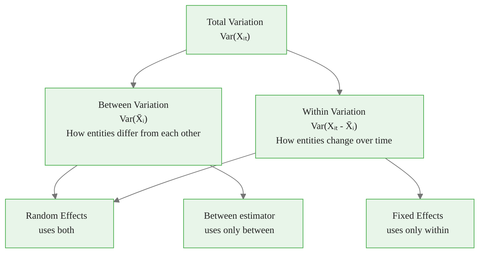
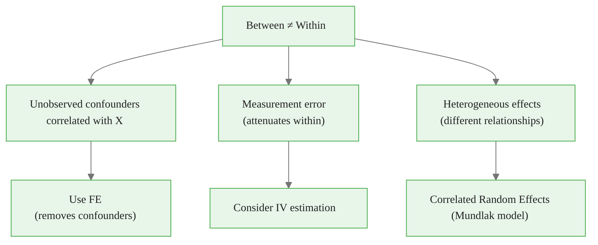
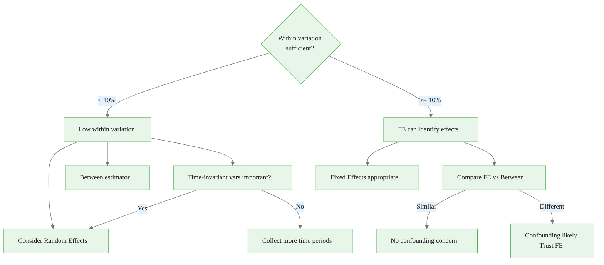
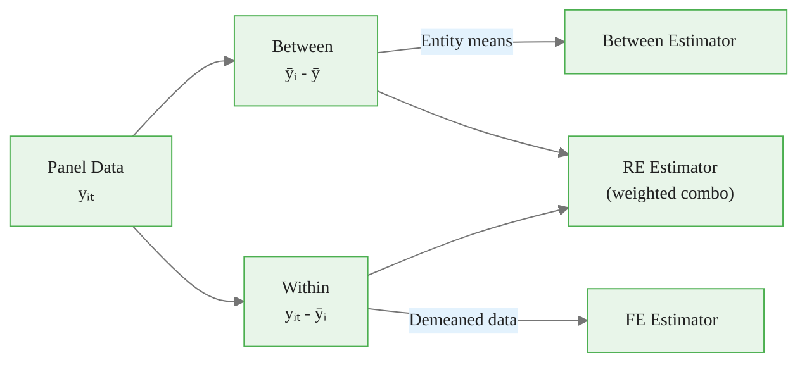

<!-- _class: lead -->

# Between and Within Variation
## The Heart of Panel Data

### Module 01 -- Panel Structure

<!-- Speaker notes: Transition slide. Pause briefly before moving into the between and within variation section. -->
---

# Two Sources of Variation

Panel data contains:

- **Between variation:** Differences *across* entities (cross-sectional)
- **Within variation:** Changes *over time* for each entity (longitudinal)

> Understanding this decomposition is fundamental to choosing the right estimator.

<!-- Speaker notes: Read the highlighted quote aloud. This captures the key insight of the slide. -->

<div class="callout-key">

Panel data controls for unobserved time-invariant heterogeneity -- the key advantage over cross-sectional data.

</div>

---

# Mathematical Decomposition

For any variable $X_{it}$:

$$X_{it} = \underbrace{\bar{X}}_{\text{grand mean}} + \underbrace{(\bar{X}_i - \bar{X})}_{\text{between}} + \underbrace{(X_{it} - \bar{X}_i)}_{\text{within}}$$

### Variance Decomposition

$$\text{Var}(X) = \text{Var}_{\text{between}}(\bar{X}_i) + \text{Var}_{\text{within}}(X_{it} - \bar{X}_i)$$

<!-- Speaker notes: Focus on the intuition behind the formula. Explain what each term represents in plain language. -->

<div class="callout-insight">

**Insight:** The within-transformation eliminates time-invariant confounders, which is the most powerful tool in the panel econometrician's toolkit.

</div>

---

# Visual: The Decomposition



<!-- Speaker notes: Walk through the diagram from top to bottom. Explain each node and decision point. -->

<div class="callout-warning">

**Warning:** Standard errors from pooled OLS ignore within-entity correlation and are almost always too small. Use clustered standard errors.

</div>

---

# Spaghetti Plot: Raw Data

```
   Y │    ╱─── Entity 1 (high level)
     │   ╱
     │──╱────── Grand Mean
     │ ╱
     │╱ ─── Entity 2 (low level)       } Between
     │                                    variation
     │
     │  ↕ Within variation for each entity
     └──────────────────── Time
```

Each line shows **within** variation; the **gap** between lines shows **between** variation.

<!-- Speaker notes: Explain the key concepts on this slide. Check for questions before moving on. -->

<div class="callout-info">

**Info:** With N entities and T periods, panel data gives N*T observations, dramatically increasing statistical power over pure cross-sections.

</div>

---

# Code: Variance Decomposition

<div class="code-window">
<div class="code-header">
<div class="dots"><span class="dot-red"></span><span class="dot-yellow"></span><span class="dot-green"></span></div>
<span class="filename">example.py</span>
</div>

```python
def variance_decomposition(df, entity_col, variable):
    grand_mean = df[variable].mean()
    entity_means = df.groupby(entity_col)[variable] \
        .transform('mean')

    between = entity_means - grand_mean
    within = df[variable] - entity_means

    var_total = df[variable].var()
    var_between = between.var()
    var_within = within.var()

    return {'total': var_total,
            'between': var_between, 'within': var_within,
            'between_pct': var_between / var_total * 100,
            'within_pct': var_within / var_total * 100}
```

</div>

<!-- Speaker notes: Walk through the code step by step. Highlight the key function calls and explain what each does. -->
---

<!-- _class: lead -->

# Implications for Estimation

<!-- Speaker notes: Transition slide. Pause briefly before moving into the implications for estimation section. -->
---

# Fixed Effects Uses Only Within Variation

The within transformation:

$$\tilde{y}_{it} = y_{it} - \bar{y}_i$$

FE uses **only** within-entity changes over time.

**Advantage:** Removes all time-invariant confounders.

**Limitation:** Cannot estimate effects of time-invariant variables (e.g., gender, country).

<!-- Speaker notes: Focus on the intuition behind the formula. Explain what each term represents in plain language. -->
---

# FE = Within Estimator

<div class="code-window">
<div class="code-header">
<div class="dots"><span class="dot-red"></span><span class="dot-yellow"></span><span class="dot-green"></span></div>
<span class="filename">example.py</span>
</div>

```python
# These produce identical coefficients:

# 1. linearmodels Fixed Effects
fe = PanelOLS(data['y'], data[['x']], entity_effects=True).fit()

# 2. Manual demeaning (within transformation)
df['y_demean'] = df['y'] - df.groupby('entity')['y'].transform('mean')
df['x_demean'] = df['x'] - df.groupby('entity')['x'].transform('mean')
within = smf.ols('y_demean ~ x_demean - 1', data=df).fit()

# 3. Between estimator (entity means only)
means = df.groupby('entity')[['y', 'x']].mean()
between = smf.ols('y ~ x', data=means).fit()
```

</div>

<!-- Speaker notes: Take this slowly. Focus on intuition behind each step rather than memorizing the algebra. -->
---

# When Between and Within Differ



> A large gap between and within estimates is a red flag for confounding.

<!-- Speaker notes: Walk through the diagram from top to bottom. Explain each node and decision point. -->
---

# Visualization: Between vs Within

<div class="columns">
<div>

**Between Relationship:**
- Plot entity means: $(\bar{x}_i, \bar{y}_i)$
- Captures cross-entity differences
- May reflect confounders

</div>
<div>

**Within Relationship:**
- Plot demeaned: $(x_{it} - \bar{x}_i, y_{it} - \bar{y}_i)$
- Captures within-entity changes
- Free of time-invariant confounders

</div>
</div>

<!-- Speaker notes: Highlight the key differences. Ask students when they would choose one approach over the other. -->
---

<!-- _class: lead -->

# Practical Applications

<!-- Speaker notes: Transition slide. Pause briefly before moving into the practical applications section. -->
---

# Choosing Estimator Based on Variation

```python
def recommend_estimator(df, entity_col, y_col, x_cols):
    for var in [y_col] + x_cols:
        decomp = variance_decomposition(df, entity_col, var)
        print(f"{var}: between={decomp['between_pct']:.1f}%, "
              f"within={decomp['within_pct']:.1f}%")

        if decomp['within_pct'] < 10:
            print("  WARNING: Very low within variation!")
```

<!-- Speaker notes: Take this slowly. Focus on intuition behind each step rather than memorizing the algebra. -->
---

# Estimator Selection Decision Tree



<!-- Speaker notes: Walk through the decision tree step by step. Ask students to apply it to a concrete example. -->
---

# Measurement Error Implications

Within variation is **more susceptible** to measurement error attenuation:

| Aspect | Between | Within |
|--------|---------|--------|
| Signal-to-noise | Higher (averaged over time) | Lower (individual deviations) |
| Attenuation bias | Smaller | Larger |
| Why | Averaging reduces noise | Demeaning amplifies noise |

> If within estimate is much smaller than between, measurement error could be the cause.

<!-- Speaker notes: Review the table row by row. Highlight the most important distinctions. -->
---

# Summary Table

| Aspect | Between Variation | Within Variation |
|--------|:-:|:-:|
| Source | Cross-sectional differences | Longitudinal changes |
| Captures | Permanent entity differences | Time-varying changes |
| FE uses | Eliminated | All |
| RE uses | Weighted | Weighted |
| Measurement error sensitivity | Lower | Higher |
| Time-invariant effects | Identifiable | Not identifiable |

<!-- Speaker notes: This is a reference slide. Students can photograph or bookmark this for later review. -->
---

# Key Takeaways

1. **Panel data = Between + Within** -- understand both before modeling

2. **Fixed Effects uses only within** -- requires sufficient time variation

3. **Between and within estimates can differ** due to confounders, measurement error, or heterogeneous effects

4. **Low within variation** is a red flag for FE -- may need alternatives

5. **Visualize the decomposition** before estimation

<!-- Speaker notes: Summarize the main points. Ask students which takeaway surprised them most. -->
---

# Visual Summary



> The decomposition of variation into between and within components drives every panel estimation decision.

<!-- Speaker notes: This is a reference slide. Students can photograph or bookmark this for later review. -->