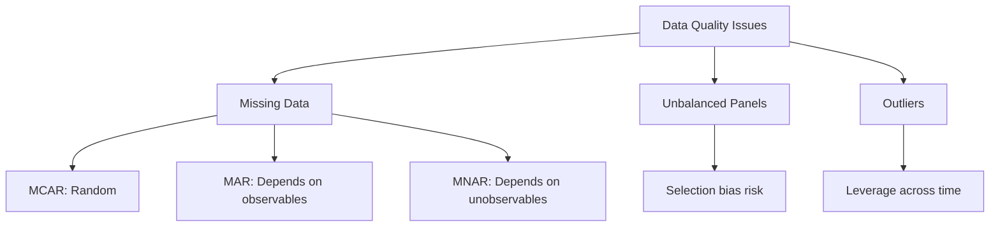
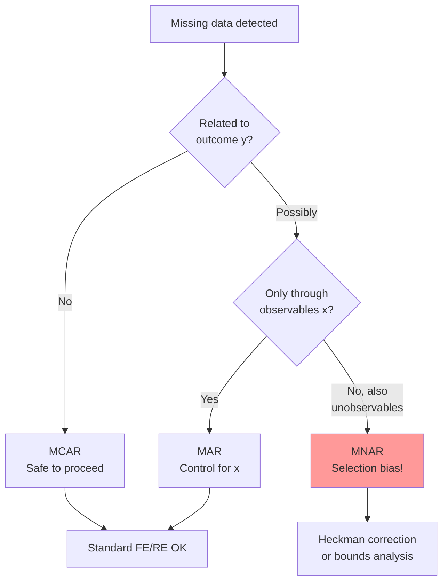
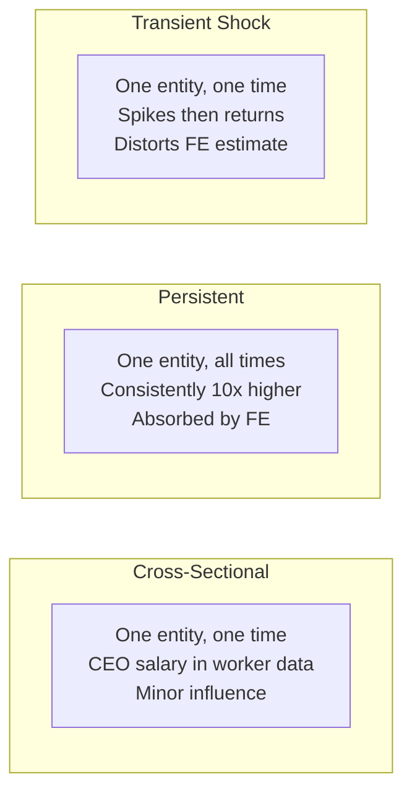
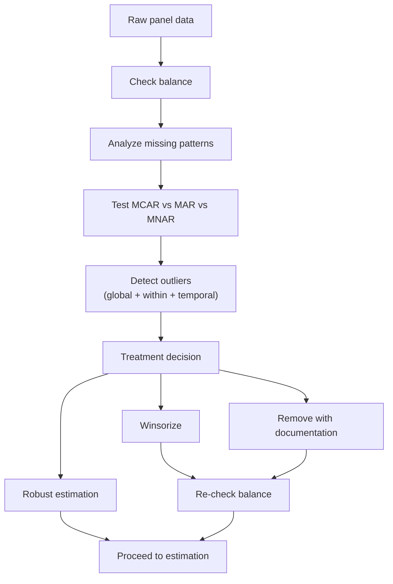

<!-- _class: lead -->

# Panel Data Quality
## Missing Data, Unbalanced Panels, and Outliers

### Module 01 -- Panel Structure

<!-- Speaker notes: Transition slide. Pause briefly before moving into the panel data quality section. -->
---

# In Brief

Panel data quality issues -- missing observations, unbalanced panels, and outliers -- directly affect estimation consistency and inference.

> Fixed effects is robust to MCAR missingness but biased under MNAR. Outliers have "leverage across time" -- one bad observation affects all time periods for that entity.

<!-- Speaker notes: Read the highlighted quote aloud. This captures the key insight of the slide. -->
---

# Three Quality Dimensions



<!-- Speaker notes: Walk through the diagram from top to bottom. Explain each node and decision point. -->
---

<!-- _class: lead -->

# Types of Missing Data

<!-- Speaker notes: Transition slide. Pause briefly before moving into the types of missing data section. -->
---

# MCAR: Missing Completely at Random

$$P(\text{Missing}_{it} | y_{it}, x_{it}, \alpha_i) = P(\text{Missing}_{it})$$

```
Entity 1: [obs, obs, MISS, obs, obs]  → Random server crash
Entity 2: [obs, MISS, obs, obs, obs]  → No pattern
Entity 3: [obs, obs, obs, MISS, obs]
```

**Impact:** FE consistent. Lose efficiency, not bias.

<!-- Speaker notes: Focus on the intuition behind the formula. Explain what each term represents in plain language. -->
---

# MAR: Missing at Random

$$P(\text{Missing}_{it} | y_{it}, x_{it}, \alpha_i) = P(\text{Missing}_{it} | x_{it})$$

```
Entity 1 (High income): [obs, obs, obs, obs, obs]  → Always reports
Entity 2 (Low income):  [obs, MISS, MISS, obs, obs] → Less reporting
```

**Impact:** If income is controlled for, no bias.

<!-- Speaker notes: Focus on the intuition behind the formula. Explain what each term represents in plain language. -->
---

# MNAR: Missing Not at Random

$$P(\text{Missing}_{it} | y_{it}, x_{it}, \alpha_i) = P(\text{Missing}_{it} | y_{it}, \alpha_i)$$

```
Entity 1 (Good performance): [obs, obs, obs, obs, obs]
Entity 2 (Bad performance):  [obs, obs, MISS, MISS, MISS] → Hides bad years
```

**Impact:** Selection bias! Sample overrepresents good outcomes.

<!-- Speaker notes: Focus on the intuition behind the formula. Explain what each term represents in plain language. -->
---

# Missing Data Decision Flowchart



<!-- Speaker notes: Walk through the decision tree step by step. Ask students to apply it to a concrete example. -->
---

<!-- _class: lead -->

# Outliers in Panel Data

<!-- Speaker notes: Transition slide. Pause briefly before moving into the outliers in panel data section. -->
---

# Why Panel Outliers Are Worse

FE demeaning propagates one bad observation across all time periods:

$$\tilde{y}_{it} = y_{it} - \bar{y}_i$$

**Example -- Entity 5:**
| Year | $y_{5t}$ | $\bar{y}_5 = 90.2$ | $\tilde{y}_{5t}$ |
|:----:|:--------:|:-------------------:|:-----------------:|
| 1 | 50 | 90.2 | -40.2 |
| 2 | 52 | 90.2 | -38.2 |
| **3** | **250** | **90.2** | **+159.8** |
| 4 | 48 | 90.2 | -42.2 |
| 5 | 51 | 90.2 | -39.2 |

One outlier year distorts **all** demeaned values for that entity.

<!-- Speaker notes: Focus on the intuition behind the formula. Explain what each term represents in plain language. -->
---

# Three Types of Panel Outliers



<!-- Speaker notes: Walk through the diagram from top to bottom. Explain each node and decision point. -->
---

# Outlier Detection: Three Z-Scores

```python
def detect_panel_outliers(data, value_col,
                          entity_col, threshold=3):
    data = data.copy()

    # 1. Global Z-score
    data['z_global'] = zscore(data[value_col].dropna())

    # 2. Within-entity Z-score
    data['z_within'] = data.groupby(
        entity_col)[value_col].transform(
        lambda x: zscore(x.dropna())
                  if len(x.dropna()) > 2 else 0)
```

<!-- Speaker notes: Walk through the code step by step. Highlight the key function calls and explain what each does. -->
---

# Outlier Detection: Temporal and Flag

```python
    # 3. Temporal Z-score (across entities at each time)
    data['z_temporal'] = data.groupby(
        time_col)[value_col].transform(
        lambda x: zscore(x.dropna())
                  if len(x.dropna()) > 2 else 0)

    # Flag outliers on any dimension
    data['outlier'] = (
        (abs(data['z_global']) > threshold) |
        (abs(data['z_within']) > threshold) |
        (abs(data['z_temporal']) > threshold))
    return data
```

<!-- Speaker notes: Walk through the code step by step. Highlight the key function calls and explain what each does. -->
---

# Outlier Treatment Options

| Method | Approach | Pro | Con |
|--------|----------|-----|-----|
| **Remove** | Drop flagged rows | Clean data | May bias if systematic |
| **Winsorize** | Cap at percentiles | Preserves sample size | Arbitrary cutoff |
| **Robust SE** | Sandwich estimator | No data modification | Doesn't fix bias |
| **Robust regression** | M-estimation | Down-weights outliers | Complex |

<!-- Speaker notes: Review the table row by row. Highlight the most important distinctions. -->
---

# Winsorization

$$y_{it}^{\text{wins}} = \begin{cases}
P_{0.01} & \text{if } y_{it} < P_{0.01} \\
y_{it} & \text{if } P_{0.01} \leq y_{it} \leq P_{0.99} \\
P_{0.99} & \text{if } y_{it} > P_{0.99}
\end{cases}$$

```python
def winsorize_panel(data, value_col, lower=0.01, upper=0.99):
    p_lower = data[value_col].quantile(lower)
    p_upper = data[value_col].quantile(upper)
    data_wins = data.copy()
    data_wins[value_col] = data_wins[value_col].clip(
        lower=p_lower, upper=p_upper
    )
    return data_wins
```

<!-- Speaker notes: This slide connects the math to implementation. Walk through how the formula maps to code. -->
---

<!-- _class: lead -->

# Handling Unbalanced Panels

<!-- Speaker notes: Transition slide. Pause briefly before moving into the handling unbalanced panels section. -->
---

# Unbalanced Panel Diagnostics

```python
obs_per_entity = data.groupby('entity').size()
print(f"Total obs: {len(data)}")
print(f"Mean obs/entity: {obs_per_entity.mean():.1f}")
print(f"Min: {obs_per_entity.min()}")
print(f"Max: {obs_per_entity.max()}")

# Entities with complete data
complete = obs_per_entity[obs_per_entity == T].index
print(f"Complete entities: {len(complete)}")
```

<!-- Speaker notes: Walk through the code step by step. Highlight the key function calls and explain what each does. -->
---

# Testing for Selection Bias

```python
def test_missing_bias(data_full, data_missing):
    # FE on full data
    model_full = PanelOLS(
        full['y'], full[['x']], entity_effects=True
    ).fit()

    # FE on data with missingness
    model_miss = PanelOLS(
        miss['y'], miss[['x']], entity_effects=True
    ).fit()

    bias = model_miss.params['x'] - model_full.params['x']
    print(f"Full data:    {model_full.params['x']:.4f}")
    print(f"Missing data: {model_miss.params['x']:.4f}")
    print(f"Bias:         {bias:.4f}")
```

<!-- Speaker notes: Walk through the code step by step. Highlight the key function calls and explain what each does. -->
---

# Bias by Missing Data Type

| Type | FE Consistent? | SE Valid? | Action |
|------|:-:|:-:|--------|
| **MCAR** | Yes | With clustering | Proceed normally |
| **MAR** | Yes (if controls included) | With clustering | Include controls |
| **MNAR** | **No** | **No** | Selection correction |

<!-- Speaker notes: Review the table row by row. Highlight the most important distinctions. -->
---

<!-- _class: lead -->

# Common Pitfalls

<!-- Speaker notes: Transition slide. Pause briefly before moving into the common pitfalls section. -->
---

# Pitfalls Summary

| Pitfall | Problem | Solution |
|---------|---------|----------|
| Assume all missing is MCAR | May hide MNAR bias | Test missingness patterns |
| Listwise deletion | Massive sample loss | Use all available obs |
| Only global outlier check | Misses entity shocks | Check within-entity z-scores |
| Over-aggressive removal | Artificial R-squared | Use objective criteria, document |
| Skip post-cleaning balance | Confusion about N, T | Always report balance after cleaning |

<!-- Speaker notes: This is a reference slide. Students can photograph or bookmark this for later review. -->
---

# Data Quality Pipeline



<!-- Speaker notes: Walk through the diagram from top to bottom. Explain each node and decision point. -->
---

# Connections

<div class="columns">
<div>

**Builds on:**
- Data formats (long vs wide)
- Statistical foundations
- pandas data wrangling

</div>
<div>

**Leads to:**
- Fixed effects (FE handles unbalanced)
- Random effects (stricter assumptions)
- Dynamic panels (lags amplify missing)

</div>
</div>

<!-- Speaker notes: This slide links the current topic to the broader course. Helps students see the big picture. -->
---

# Key Takeaways

1. **Missing data type matters:** MCAR is safe; MNAR causes bias

2. **Panel outliers propagate** through demeaning -- one bad observation distorts all periods

3. **Check within-entity** deviations, not just global outliers

4. **FE handles unbalanced panels** under MCAR/MAR assumptions

5. **Document every cleaning step** and re-check balance afterward

> Clean data is not the data you have -- it is the data you prepare.

<!-- Speaker notes: Summarize the main points. Ask students which takeaway surprised them most. -->