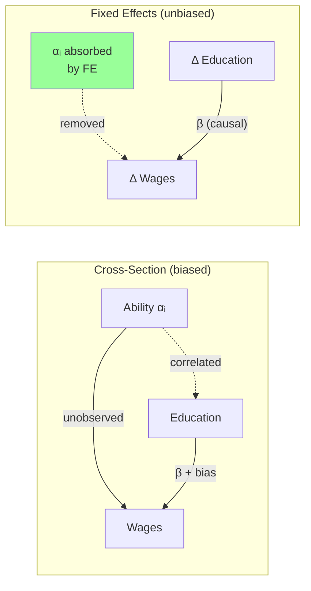
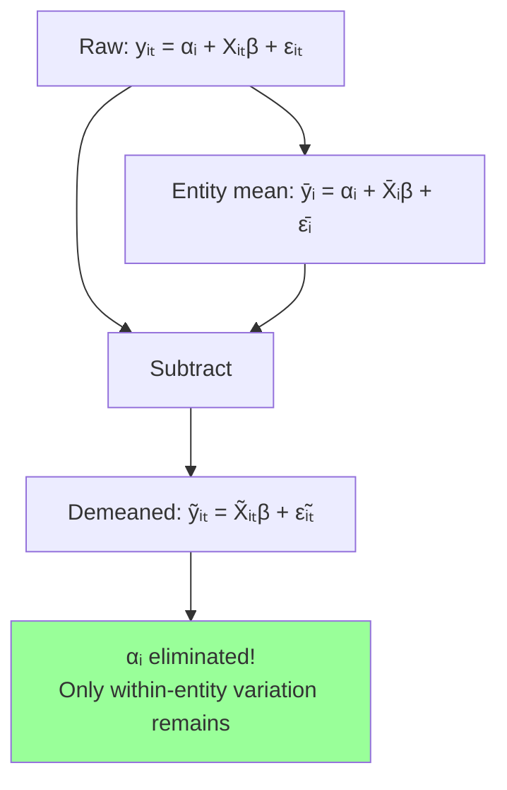
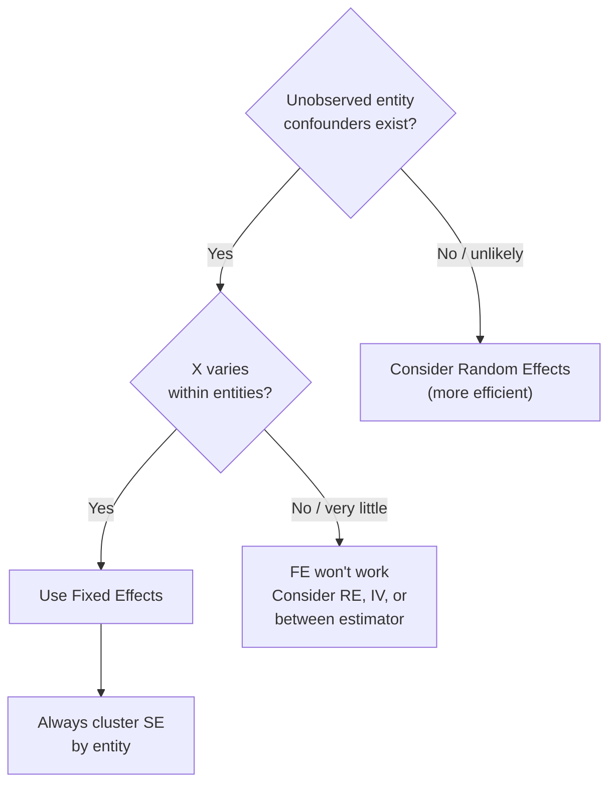

<!-- _class: lead -->

# Fixed Effects Intuition
## Why and When to Use FE

### Module 02 -- Fixed Effects

<!-- Speaker notes: Transition slide. Pause briefly before moving into the fixed effects intuition section. -->
---

# In Brief

Fixed effects regression controls for **all time-invariant differences** between entities -- whether observed or not.

> FE uses each entity as its own control. By comparing an entity to itself over time, we eliminate all stable differences.

<!-- Speaker notes: Read the highlighted quote aloud. This captures the key insight of the slide. -->
---

# The Omitted Variable Problem

**Cross-sectional regression:**

$$wage_i = \alpha + \beta \cdot education_i + \gamma \cdot \underbrace{ability_i}_{\text{unobserved}} + \epsilon_i$$

If $\text{Cov}(education, ability) > 0$, OLS **overestimates** $\beta$.

**Panel data solution:**

$$wage_{it} = \alpha_i + \beta \cdot education_{it} + \epsilon_{it}$$

The fixed effect $\alpha_i$ captures all stable characteristics -- including ability.

<!-- Speaker notes: Focus on the intuition behind the formula. Explain what each term represents in plain language. -->
---

# FE Eliminates Confounders



<!-- Speaker notes: Walk through the diagram from top to bottom. Explain each node and decision point. -->
---

<!-- _class: lead -->

# The Within Transformation

<!-- Speaker notes: Transition slide. Pause briefly before moving into the the within transformation section. -->
---

# Step-by-Step Demeaning

**Step 1:** Take entity average:
$$\bar{y}_i = \alpha_i + \bar{X}_i\beta + \bar{\epsilon}_i$$

**Step 2:** Subtract from original:
$$(y_{it} - \bar{y}_i) = (X_{it} - \bar{X}_i)\beta + (\epsilon_{it} - \bar{\epsilon}_i)$$

**Result:** The $\alpha_i$ terms cancel!
$$\tilde{y}_{it} = \tilde{X}_{it}\beta + \tilde{\epsilon}_{it}$$

<!-- Speaker notes: Focus on the intuition behind the formula. Explain what each term represents in plain language. -->
---

# What the Within Transformation Does



<!-- Speaker notes: Walk through the diagram from top to bottom. Explain each node and decision point. -->
---

# Visual: Pooled OLS vs Fixed Effects

<div class="columns">
<div>

**Pooled OLS:**
- Uses ALL variation
- Confounded by entity differences
- Slope reflects between + within

</div>
<div>

**Fixed Effects:**
- Uses only WITHIN variation
- Each entity compared to itself
- Slope reflects within-entity changes

</div>
</div>

> FE averages the within-entity slopes across all entities.

<!-- Speaker notes: Highlight the key differences. Ask students when they would choose one approach over the other. -->
---

<!-- _class: lead -->

# When to Use Fixed Effects

<!-- Speaker notes: Transition slide. Pause briefly before moving into the when to use fixed effects section. -->
---

# FE Is Appropriate When

1. **Entity-specific confounders exist**
   - Unobserved characteristics correlate with X
   - Example: Firm culture affects investment and growth

2. **Sufficient within-entity variation**
   - X must change over time within entities
   - More time periods = more within variation

3. **Interest is in within-entity effects**
   - "What happens when X changes?"
   - Not: "Why do high-X entities have high Y?"

<!-- Speaker notes: Explain the key concepts on this slide. Check for questions before moving on. -->
---

# FE Is NOT Appropriate When

1. **X does not vary within entities**
   - Gender, race, industry classification
   - FE cannot estimate these coefficients

2. **Between-entity variation is the interest**
   - Why some countries grow faster
   - Cross-sectional comparisons

3. **Random effects assumptions hold**
   - Entity effects uncorrelated with X
   - RE is more efficient

<!-- Speaker notes: Explain the key concepts on this slide. Check for questions before moving on. -->
---

# FE Decision Flowchart



<!-- Speaker notes: Walk through the decision tree step by step. Ask students to apply it to a concrete example. -->
---

<!-- _class: lead -->

# Implementation

<!-- Speaker notes: Transition slide. Pause briefly before moving into the implementation section. -->
---

# Python: linearmodels

```python
import pandas as pd
from linearmodels.panel import PanelOLS

df = df.set_index(['entity_id', 'year'])

# Entity fixed effects
model_fe = PanelOLS.from_formula(
    'y ~ x1 + x2 + EntityEffects', data=df
)
results = model_fe.fit(cov_type='clustered', cluster_entity=True)

# Two-way fixed effects
model_twfe = PanelOLS.from_formula(
    'y ~ x1 + x2 + EntityEffects + TimeEffects', data=df
)
results_twfe = model_twfe.fit(cov_type='clustered', cluster_entity=True)
```

<!-- Speaker notes: Walk through the code step by step. Highlight the key function calls and explain what each does. -->
---

# R: plm

```r
library(plm)

pdata <- pdata.frame(df, index = c("entity_id", "year"))

# Entity fixed effects
fe_model <- plm(y ~ x1 + x2,
                data = pdata, model = "within",
                effect = "individual")

# Two-way fixed effects
twfe_model <- plm(y ~ x1 + x2,
                  data = pdata, model = "within",
                  effect = "twoways")

# View fixed effects
fixef(fe_model)
```

<!-- Speaker notes: Walk through the code step by step. Highlight the key function calls and explain what each does. -->
---

# Interpretation

The FE coefficient $\beta$ means:

> "The expected change in Y when X increases by 1, **within the same entity over time**, controlling for all time-invariant entity characteristics."

**Example:** "A one-unit increase in R&D spending (within a firm) is associated with a 0.15 unit increase in patents."

**You CANNOT conclude:**
- Comparisons across entities
- Effects of time-invariant variables
- Between-entity predictions

<!-- Speaker notes: This is critical for applied work. Make sure students can articulate the interpretation in plain language. -->
---

<!-- _class: lead -->

# Common Mistakes

<!-- Speaker notes: Transition slide. Pause briefly before moving into the common mistakes section. -->
---

# Mistake 1: Forgetting to Cluster SE

```python
# CORRECT
results = model.fit(cov_type='clustered', cluster_entity=True)

# WRONG (SE too small)
results = model.fit()
```

<!-- Speaker notes: Emphasize that these are mistakes seen in practice, not just theory. Ask if anyone has encountered mistake 1: forgetting to cluster se. -->
---

# Mistake 2: Misinterpreting R-squared

FE R-squared is the **within R-squared** -- variation explained within entities.

It is typically **lower** than pooled OLS R-squared because between-entity variation is absorbed by the dummies.

<!-- Speaker notes: Emphasize that these are mistakes seen in practice, not just theory. Ask if anyone has encountered mistake 2: misinterpreting r-squared. -->
---

# Mistake 3: Time-Invariant Variables

```python
# This will FAIL or produce unexpected results
model = PanelOLS.from_formula(
    'y ~ x1 + gender + EntityEffects',  # gender is time-invariant!
    data=df
)
```

FE eliminates time-invariant variables via demeaning.

<!-- Speaker notes: Emphasize that these are mistakes seen in practice, not just theory. Ask if anyone has encountered mistake 3: time-invariant variables. -->
---

# Testing the FE Assumption

**F-test for entity effects:**
$$H_0: \alpha_1 = \alpha_2 = ... = \alpha_N$$

Reject $\rightarrow$ Entity effects significant $\rightarrow$ FE warranted.

**Hausman test (FE vs RE):**
$$H_0: \text{Random effects is consistent}$$

Reject $\rightarrow$ Use Fixed Effects.

<!-- Speaker notes: Focus on the intuition behind the formula. Explain what each term represents in plain language. -->
---

# Key Takeaways

1. **FE uses each entity as its own control** -- eliminates time-invariant confounders

2. **Within transformation** subtracts entity means, canceling $\alpha_i$

3. **Cannot estimate** effects of time-invariant variables

4. **Requires within-entity variation** in X

5. **Always cluster** standard errors by entity

> Fixed effects turns confounders into allies -- by demeaning, we eliminate what we cannot measure but know exists.

<!-- Speaker notes: Summarize the main points. Ask students which takeaway surprised them most. -->