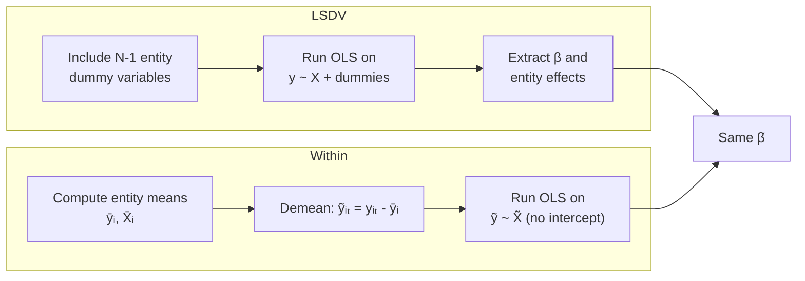
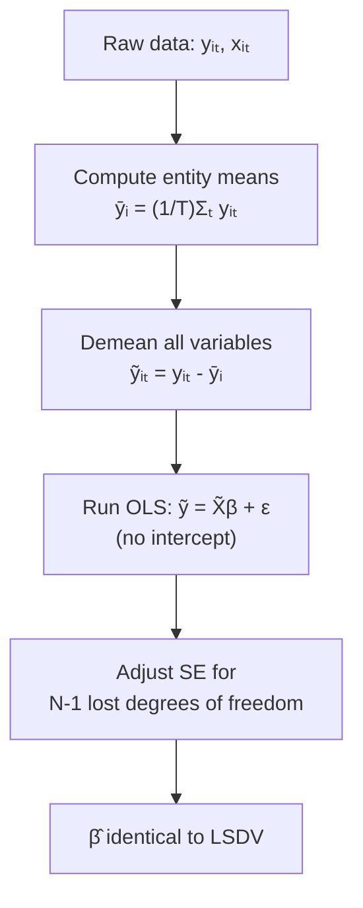
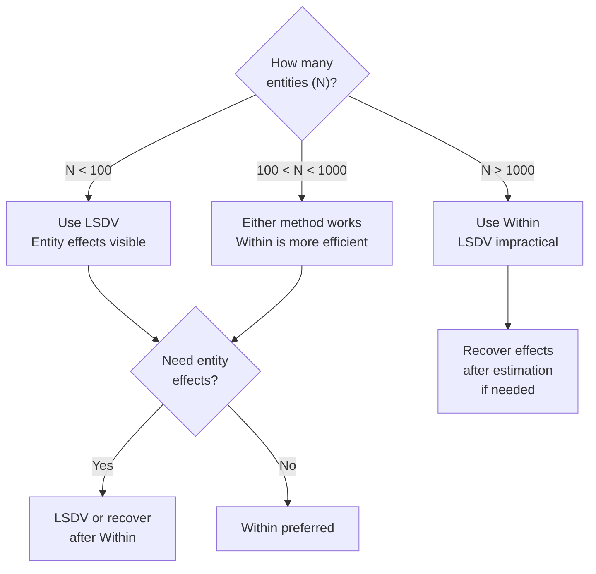

<!-- _class: lead -->

# LSDV vs Within Transformation
## Two Approaches to Fixed Effects

### Module 02 -- Fixed Effects

<!-- Speaker notes: Transition slide. Pause briefly before moving into the lsdv vs within transformation section. -->
---

# Two Equivalent Methods

Fixed effects can be estimated two ways:

1. **LSDV** (Least Squares Dummy Variables): Include entity dummies explicitly
2. **Within Transformation**: Demean data to remove entity effects

> Both give **identical** coefficient estimates but differ in computation.

<!-- Speaker notes: Read the highlighted quote aloud. This captures the key insight of the slide. -->
---

# Method Comparison



<!-- Speaker notes: Highlight the key differences. Ask students when they would choose one approach over the other. -->
---

<!-- _class: lead -->

# The LSDV Approach

<!-- Speaker notes: Transition slide. Pause briefly before moving into the the lsdv approach section. -->
---

# LSDV: Concept

Include dummy variables for each entity (minus one reference):

$$y_{it} = \alpha + \sum_{j=2}^{N} \delta_j D_{ij} + X_{it}\beta + \epsilon_{it}$$

where $D_{ij} = 1$ if $i = j$, else 0.

<!-- Speaker notes: Focus on the intuition behind the formula. Explain what each term represents in plain language. -->
---

# LSDV: Implementation

```python
import statsmodels.formula.api as smf

# Include entity dummies explicitly
lsdv_model = smf.ols('y ~ x + C(entity)', data=df).fit()

print(f"x coefficient: {lsdv_model.params['x']:.4f}")
print(f"Number of parameters: {len(lsdv_model.params)}")
# For N=50 entities: 51 parameters (1 intercept + 49 dummies + 1 x)
```

<!-- Speaker notes: Walk through the code step by step. Highlight the key function calls and explain what each does. -->
---

# Extracting Entity Effects

```python
# Entity effects from LSDV
entity_dummies = [c for c in lsdv_model.params.index if 'entity' in c]
entity_effects = lsdv_model.params[entity_dummies]

# Reference category effect = intercept
reference_effect = lsdv_model.params['Intercept']
```

<!-- Speaker notes: Walk through the code step by step. Highlight the key function calls and explain what each does. -->
---

<!-- _class: lead -->

# The Within Transformation

<!-- Speaker notes: Transition slide. Pause briefly before moving into the the within transformation section. -->
---

# Within: Concept

Subtract entity means from all variables:

$$\tilde{y}_{it} = y_{it} - \bar{y}_i$$
$$\tilde{X}_{it} = X_{it} - \bar{X}_i$$

Then estimate: $\tilde{y}_{it} = \tilde{X}_{it}\beta + \tilde{\epsilon}_{it}$

<!-- Speaker notes: Focus on the intuition behind the formula. Explain what each term represents in plain language. -->
---

# Within: Implementation

<div class="columns">
<div>

**Manual:**
```python
df['y_demean'] = df['y'] - df.groupby(
    'entity')['y'].transform('mean')
df['x_demean'] = df['x'] - df.groupby(
    'entity')['x'].transform('mean')

within = smf.ols(
    'y_demean ~ x_demean - 1', data=df
).fit()  # No intercept!
```

</div>
<div>

**linearmodels:**
```python
df_panel = df.set_index(
    ['entity', 'time'])

fe = PanelOLS(
    df_panel['y'], df_panel[['x']],
    entity_effects=True
).fit()
```

</div>
</div>

<!-- Speaker notes: Walk through the code step by step. Highlight the key function calls and explain what each does. -->
---

<!-- _class: lead -->

# Why They Are Identical

<!-- Speaker notes: Transition slide. Pause briefly before moving into the why they are identical section. -->
---

# Coefficient Equivalence

```python
print(f"LSDV coefficient:   {lsdv_model.params['x']:.6f}")
print(f"Within coefficient: {within.params['x_demean']:.6f}")
print(f"Difference:         {abs(lsdv - within):.10f}")
# Difference: 0.0000000000
```

**Mathematical proof:** LSDV partitioned regression = demeaning within entities.

By the Frisch-Waugh-Lovell theorem: partialling out dummies is equivalent to the within transformation.

<!-- Speaker notes: Walk through the code step by step. Highlight the key function calls and explain what each does. -->
---

# Standard Error Differences

```python
print(f"LSDV SE:                {lsdv_se:.6f}")
print(f"Within SE (unadjusted): {within_se:.6f}")  # Too small!
print(f"Within SE (corrected):  {fe_se:.6f}")       # Correct
```

The within transformation loses $N-1$ degrees of freedom:

$$SE_{\text{adjusted}} = SE_{\text{unadjusted}} \times \sqrt{\frac{NT - K}{NT - N - K}}$$

> linearmodels handles this correction automatically.

<!-- Speaker notes: This slide connects the math to implementation. Walk through how the formula maps to code. -->
---

# Demeaning Step-by-Step



<!-- Speaker notes: Walk through the diagram from top to bottom. Explain each node and decision point. -->
---

<!-- _class: lead -->

# Advantages and Disadvantages

<!-- Speaker notes: Transition slide. Pause briefly before moving into the advantages and disadvantages section. -->
---

# LSDV: Pros and Cons

| Advantage | Disadvantage |
|-----------|--------------|
| Entity effects visible | Computationally expensive (large N) |
| Standard OLS output | Memory intensive (full dummy matrix) |
| Can add entity interactions | Incidental parameters problem |
| Easy to interpret | Impractical for N > 1000 |

<!-- Speaker notes: Review the table row by row. Highlight the most important distinctions. -->
---

# Within: Pros and Cons

| Advantage | Disadvantage |
|-----------|--------------|
| Only K parameters | Entity effects not directly estimated |
| Scales to millions of entities | DF adjustment needed |
| Clean, focused output | Less flexible for interactions |
| Computationally efficient | Harder to add entity-specific slopes |

<!-- Speaker notes: Review the table row by row. Highlight the most important distinctions. -->
---

# Decision Guide



<!-- Speaker notes: Walk through the decision tree step by step. Ask students to apply it to a concrete example. -->
---

# Recovering Entity Effects

After within estimation:

$$\hat{\alpha}_i = \bar{y}_i - \bar{X}_i \hat{\beta}$$

```python
def recover_entity_effects(df, entity_col, y_col, x_cols, beta):
    effects = {}
    for entity in df[entity_col].unique():
        ed = df[df[entity_col] == entity]
        effects[entity] = ed[y_col].mean() - (ed[x_cols].mean() @ beta)
    return pd.Series(effects)
```

<!-- Speaker notes: This slide connects the math to implementation. Walk through how the formula maps to code. -->
---

# Practical Recommendations

1. **For most analysis:** Use `linearmodels.PanelOLS` with `entity_effects=True`
2. **When you need entity effects:** LSDV (small N) or recover after within
3. **For very large panels:** Always within transformation
4. **For standard errors:** Always cluster by entity

```python
# Recommended approach
model = PanelOLS(
    df_panel['y'], df_panel[['x']],
    entity_effects=True
).fit(cov_type='clustered', cluster_entity=True)
```

<!-- Speaker notes: Walk through the code step by step. Highlight the key function calls and explain what each does. -->
---

# Key Takeaways

1. **LSDV and within give identical coefficients** -- same problem, different approach

2. **Standard errors differ** due to degrees of freedom correction

3. **Use within for large N** -- LSDV becomes impractical

4. **Entity effects can be recovered** after within estimation

5. **Always cluster** standard errors regardless of method

> Choose the method that fits your panel size and whether you need entity effects.

<!-- Speaker notes: Summarize the main points. Ask students which takeaway surprised them most. -->