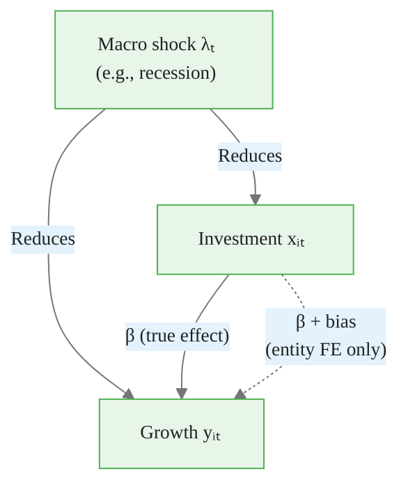
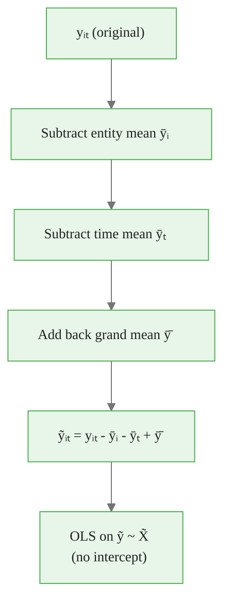
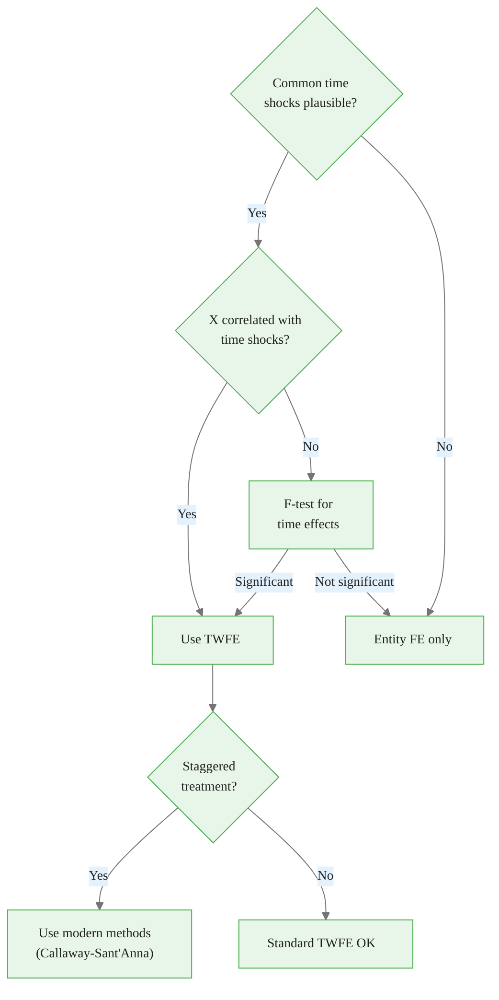
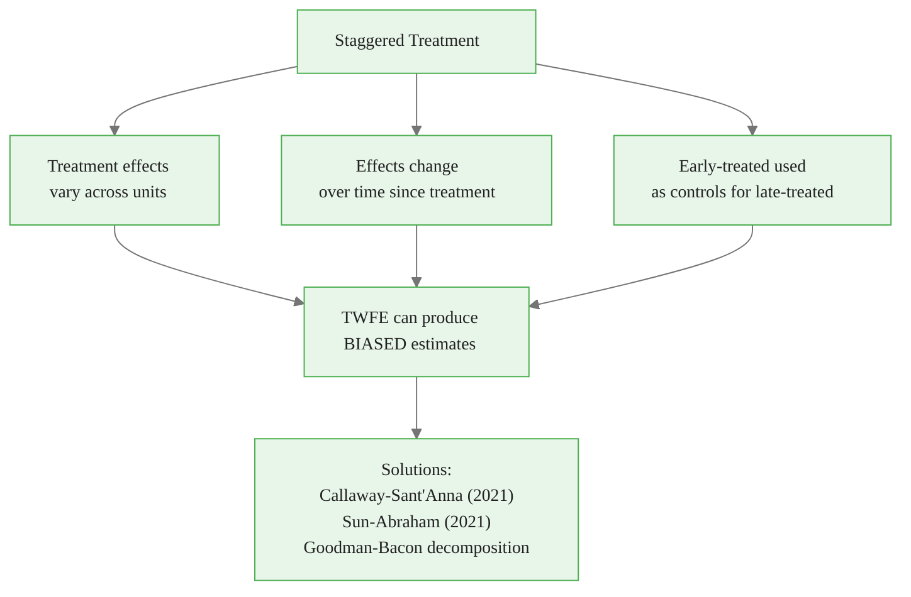

<!-- _class: lead -->

# Two-Way Fixed Effects
## Entity and Time

### Module 02 -- Fixed Effects

<!-- Speaker notes: Transition slide. Pause briefly before moving into the two-way fixed effects section. -->
---

# The TWFE Model

Two-way fixed effects controls for both:

$$y_{it} = \alpha_i + \lambda_t + X_{it}\beta + \epsilon_{it}$$

| Effect | Captures | Example |
|--------|----------|---------|
| $\alpha_i$ | Time-invariant entity characteristics | Firm culture, geography |
| $\lambda_t$ | Entity-invariant time shocks | Recessions, policy changes |

<!-- Speaker notes: Focus on the intuition behind the formula. Explain what each term represents in plain language. -->

<div class="callout-key">

Panel data controls for unobserved time-invariant heterogeneity -- the key advantage over cross-sectional data.

</div>

---

# Why Add Time Fixed Effects?

Common shocks affect all entities simultaneously:

- Macroeconomic conditions
- Regulatory changes
- Market-wide trends
- Seasonal patterns

Without time FE, these **confound** the X-Y relationship.

<!-- Speaker notes: Explain the key concepts on this slide. Check for questions before moving on. -->

<div class="callout-insight">

**Insight:** The within-transformation eliminates time-invariant confounders, which is the most powerful tool in the panel econometrician's toolkit.

</div>

---

# The Confounding Problem



> Without time FE, the investment coefficient captures both the true effect and the spurious correlation through macro shocks.

<!-- Speaker notes: Walk through the diagram from top to bottom. Explain each node and decision point. -->

<div class="callout-warning">

**Warning:** Standard errors from pooled OLS ignore within-entity correlation and are almost always too small. Use clustered standard errors.

</div>

---

# Simulation: The Bias

<div class="code-window">
<div class="code-header">
<div class="dots"><span class="dot-red"></span><span class="dot-yellow"></span><span class="dot-green"></span></div>
<span class="filename">example.py</span>
</div>

```python
# Entity FE only (biased by common shocks)
fe_entity = PanelOLS(df_panel['growth'], df_panel[['investment']],
                     entity_effects=True).fit()

# Two-way FE (unbiased)
fe_twoway = PanelOLS(df_panel['growth'], df_panel[['investment']],
                      entity_effects=True, time_effects=True).fit()

print(f"Entity FE: {fe_entity.params['investment']:.4f}  (biased)")
print(f"Two-way FE: {fe_twoway.params['investment']:.4f}  (true ≈ 0.80)")
```

</div>

<!-- Speaker notes: Walk through the code step by step. Highlight the key function calls and explain what each does. -->

<div class="callout-info">

**Info:** With N entities and T periods, panel data gives N*T observations, dramatically increasing statistical power over pure cross-sections.

</div>

---

<!-- _class: lead -->

# The Two-Way Transformation

<!-- Speaker notes: Transition slide. Pause briefly before moving into the the two-way transformation section. -->
---

# Double Demeaning

$$\tilde{y}_{it} = y_{it} - \bar{y}_i - \bar{y}_t + \bar{\bar{y}}$$

| Component | Description |
|-----------|-------------|
| $y_{it}$ | Original observation |
| $\bar{y}_i$ | Entity mean (over time) |
| $\bar{y}_t$ | Time mean (over entities) |
| $\bar{\bar{y}}$ | Grand mean (added back to avoid double-subtraction) |

<!-- Speaker notes: Focus on the intuition behind the formula. Explain what each term represents in plain language. -->
---

# Double Demeaning Pipeline



<!-- Speaker notes: Walk through the diagram from top to bottom. Explain each node and decision point. -->
---

# Manual Implementation

<div class="code-window">
<div class="code-header">
<div class="dots"><span class="dot-red"></span><span class="dot-yellow"></span><span class="dot-green"></span></div>
<span class="filename">example.py</span>
</div>

```python
def double_demean(df, entity_col, time_col, variables):
    df_out = df.copy()
    for var in variables:
        entity_mean = df.groupby(entity_col)[var].transform('mean')
        time_mean = df.groupby(time_col)[var].transform('mean')
        grand_mean = df[var].mean()

        df_out[f'{var}_dd'] = df[var] - entity_mean - time_mean + grand_mean
    return df_out

df_dd = double_demean(df, 'firm', 'year', ['growth', 'investment'])
manual_twfe = smf.ols('growth_dd ~ investment_dd - 1', data=df_dd).fit()
```

</div>

<!-- Speaker notes: Walk through the code step by step. Highlight the key function calls and explain what each does. -->
---

<!-- _class: lead -->

# When to Use TWFE

<!-- Speaker notes: Transition slide. Pause briefly before moving into the when to use twfe section. -->
---

# Use TWFE When

1. **Common time trends exist** -- business cycles, industry shocks
2. **X varies with aggregate conditions** -- investment tied to economic climate
3. **Time effects are nuisance parameters** -- interest is in X effect only

<!-- Speaker notes: Explain the key concepts on this slide. Check for questions before moving on. -->
---

# Do NOT Use TWFE When

1. **Time variation is the interest** -- studying a policy that varies only by time
2. **Limited time periods** -- few periods = imprecise time effects
3. **Treatment varies only by time** -- time dummies absorb the effect

<!-- Speaker notes: Explain the key concepts on this slide. Check for questions before moving on. -->
---

# TWFE Decision Tree



<!-- Speaker notes: Walk through the decision tree step by step. Ask students to apply it to a concrete example. -->
---

# F-Test for Time Effects

```python
def test_time_effects(df, entity_col, time_col, y_col, x_cols):
    df_panel = df.set_index([entity_col, time_col])

    restricted = PanelOLS(df_panel[y_col], df_panel[x_cols],
                          entity_effects=True).fit()
    unrestricted = PanelOLS(df_panel[y_col], df_panel[x_cols],
                            entity_effects=True, time_effects=True).fit()

    n_time = df[time_col].nunique() - 1
    f_stat = ((restricted.resid_ss - unrestricted.resid_ss) / n_time) / \
             (unrestricted.resid_ss / (len(df) - unrestricted.df_model))

    p_value = 1 - stats.f.cdf(f_stat, n_time, len(df) - unrestricted.df_model)
```

<!-- Speaker notes: Walk through the code step by step. Highlight the key function calls and explain what each does. -->
---

<!-- _class: lead -->

# Alternatives to Full Time FE

<!-- Speaker notes: Transition slide. Pause briefly before moving into the alternatives to full time fe section. -->
---

# Linear Time Trend

$$y_{it} = \alpha_i + \gamma t + X_{it}\beta + \epsilon_{it}$$

Less flexible than time FE but uses fewer degrees of freedom.

```python
df['trend'] = df['year'] - df['year'].min()
df_panel = df.set_index(['firm', 'year'])

fe_trend = PanelOLS(
    df_panel['growth'],
    df_panel[['investment', 'trend']],
    entity_effects=True
).fit()
```

<!-- Speaker notes: This slide connects the math to implementation. Walk through how the formula maps to code. -->
---

# Entity-Specific Trends

$$y_{it} = \alpha_i + \gamma_i t + X_{it}\beta + \epsilon_{it}$$

Each entity has its own trend -- very demanding on the data.

```python
fe_entity_trend = smf.ols(
    'growth ~ investment + C(firm) + C(firm):trend',
    data=df
).fit()
```

<!-- Speaker notes: This slide connects the math to implementation. Walk through how the formula maps to code. -->
---

# Trend Comparison

| Specification | Controls For | DF Cost |
|--------------|-------------|---------|
| Entity FE only | Entity levels | N - 1 |
| Entity FE + linear trend | Entity levels + common trend | N |
| Entity FE + time FE | Entity levels + flexible time | N + T - 2 |
| Entity FE + entity trends | Entity levels + entity trends | 2N - 1 |

<!-- Speaker notes: Highlight the key differences. Ask students when they would choose one approach over the other. -->
---

<!-- _class: lead -->

# TWFE Caution: Staggered Treatment

<!-- Speaker notes: Transition slide. Pause briefly before moving into the twfe caution: staggered treatment section. -->
---

# The Staggered Treatment Problem

TWFE has **known problems** when treatment is adopted at different times:



<!-- Speaker notes: Walk through the diagram from top to bottom. Explain each node and decision point. -->
---

# Recommended Implementation

```python
# Full two-way FE with clustered SE
final_twfe = PanelOLS(
    df_panel['growth'],
    df_panel[['investment']],
    entity_effects=True,
    time_effects=True
).fit(cov_type='clustered', cluster_entity=True)
```

<!-- Speaker notes: Walk through the code step by step. Highlight the key function calls and explain what each does. -->
---

# Reporting: Model Comparison

```python
from linearmodels.panel import compare

models = {
    'Pooled OLS': PanelOLS(df_panel['growth'],
                            df_panel[['investment']]).fit(),
    'Entity FE': PanelOLS(df_panel['growth'], df_panel[['investment']],
                          entity_effects=True).fit(),
    'Two-Way FE': PanelOLS(df_panel['growth'], df_panel[['investment']],
                           entity_effects=True, time_effects=True).fit()
}

comparison = compare(models)
```

<!-- Speaker notes: Highlight the key differences. Ask students when they would choose one approach over the other. -->
---

# Key Takeaways

1. **TWFE controls for common shocks** affecting all entities in a time period

2. **Use when X correlates with aggregate conditions**

3. **Test whether time effects are significant** before including

4. **Consider simpler alternatives** (linear trend) when time FE overfits

5. **Be cautious with staggered treatment** -- TWFE may be biased

6. **Always cluster** standard errors by entity

> TWFE = entity FE (who you are) + time FE (when it happened).

<!-- Speaker notes: Summarize the main points. Ask students which takeaway surprised them most. -->