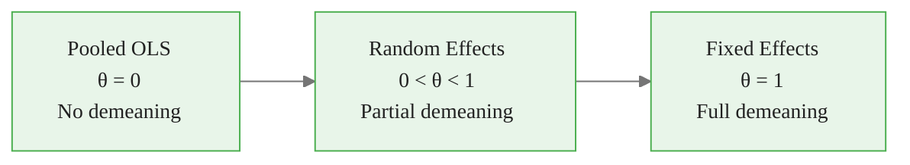
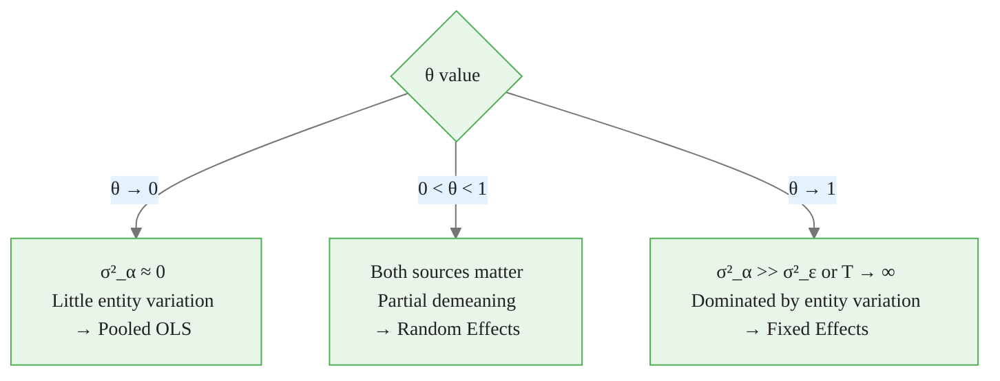
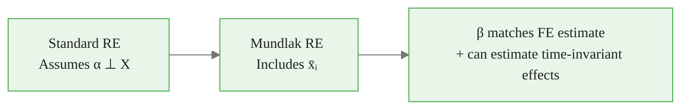
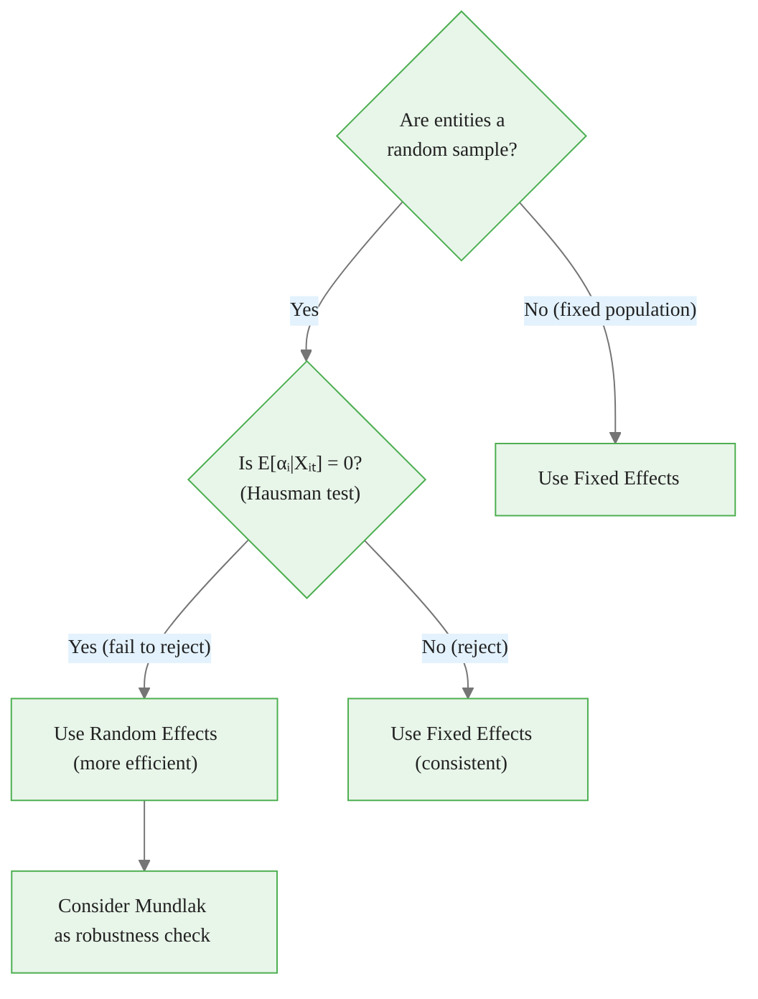

<!-- _class: lead -->

# Random Effects Model
## GLS Estimation and Quasi-Demeaning

### Module 03 -- Random Effects

<!-- Speaker notes: Transition slide. Pause briefly before moving into the random effects model section. -->
---

# In Brief

Random Effects treats entity effects as **random draws from a distribution**, enabling efficient estimation when effects are uncorrelated with regressors.

> RE is a weighted average of between and within estimators -- it uses ALL available variation.

<!-- Speaker notes: Read the highlighted quote aloud. This captures the key insight of the slide. -->

<div class="callout-key">

Panel data controls for unobserved time-invariant heterogeneity -- the key advantage over cross-sectional data.

</div>

---

# The RE Model

$$y_{it} = \beta_0 + x_{it}'\beta + \alpha_i + \epsilon_{it}$$

where:
- $\alpha_i \sim (0, \sigma_\alpha^2)$ -- random entity effects
- $\epsilon_{it} \sim (0, \sigma_\epsilon^2)$ -- idiosyncratic errors
- $\alpha_i \perp \epsilon_{it}$ -- effects independent of errors

**The critical assumption:**

$$E[\alpha_i | x_{i1}, x_{i2}, ..., x_{iT}] = 0$$

Entity effects must be **uncorrelated with all regressors**.

<!-- Speaker notes: Focus on the intuition behind the formula. Explain what each term represents in plain language. -->

<div class="callout-insight">

**Insight:** The within-transformation eliminates time-invariant confounders, which is the most powerful tool in the panel econometrician's toolkit.

</div>

---

# FE vs RE at a Glance

| Aspect | Fixed Effects | Random Effects |
|--------|--------------|----------------|
| Entity effects | Parameters to estimate | Random variables |
| Time-invariant vars | Cannot estimate | Can estimate |
| Efficiency | Less efficient | More efficient |
| Key assumption | None on $\alpha_i, x_{it}$ correlation | $\alpha_i \perp x_{it}$ |
| Degrees of freedom | Loses $N-1$ df | Doesn't lose df |

<!-- Speaker notes: Highlight the key differences. Ask students when they would choose one approach over the other. -->

<div class="callout-warning">

**Warning:** Standard errors from pooled OLS ignore within-entity correlation and are almost always too small. Use clustered standard errors.

</div>

---

# RE as a Spectrum Between Pooled OLS and FE



The quasi-demeaning parameter $\theta$ controls how much entity variation is removed.

<!-- Speaker notes: Walk through the diagram from top to bottom. Explain each node and decision point. -->

<div class="callout-info">

**Info:** With N entities and T periods, panel data gives N*T observations, dramatically increasing statistical power over pure cross-sections.

</div>

---

<!-- _class: lead -->

# The GLS Transformation

<!-- Speaker notes: Transition slide. Pause briefly before moving into the the gls transformation section. -->
---

# Composite Error Structure

The composite error $u_{it} = \alpha_i + \epsilon_{it}$ has covariance:

$$\Omega_i = \sigma_\epsilon^2 I_T + \sigma_\alpha^2 \mathbf{1}_T \mathbf{1}_T'$$

**Properties:**
- $\text{Var}(u_{it}) = \sigma_\alpha^2 + \sigma_\epsilon^2$
- $\text{Cov}(u_{it}, u_{is}) = \sigma_\alpha^2$ for $t \neq s$
- $\text{Cov}(u_{it}, u_{jt}) = 0$ for $i \neq j$

> Errors within the same entity are correlated -- OLS ignores this and loses efficiency.

<!-- Speaker notes: Focus on the intuition behind the formula. Explain what each term represents in plain language. -->
---

# The Quasi-Demeaning Transformation

RE uses **partial** demeaning:

$$y_{it} - \theta\bar{y}_i = \beta_0(1-\theta) + (x_{it} - \theta\bar{x}_i)'\beta + (u_{it} - \theta\bar{u}_i)$$

where:

$$\theta = 1 - \sqrt{\frac{\sigma_\epsilon^2}{\sigma_\epsilon^2 + T\sigma_\alpha^2}}$$

<!-- Speaker notes: Focus on the intuition behind the formula. Explain what each term represents in plain language. -->
---

# What Theta Controls



As $\sigma_\alpha^2 \to \infty$ or $T \to \infty$, RE converges to FE.

<!-- Speaker notes: Walk through the diagram from top to bottom. Explain each node and decision point. -->
---

<!-- _class: lead -->

# Variance Components

<!-- Speaker notes: Transition slide. Pause briefly before moving into the variance components section. -->
---

# Estimating Variance Components

**Method of Moments approach:**

1. Fit FE to get $\hat{\sigma}_\epsilon^2$ from within residuals
2. Fit Between model to get $\hat{\sigma}_{between}^2$
3. Extract: $\hat{\sigma}_\alpha^2 = \hat{\sigma}_{between}^2 - \hat{\sigma}_\epsilon^2 / T$
4. Compute: $\hat{\theta} = 1 - \sqrt{\hat{\sigma}_\epsilon^2 / (\hat{\sigma}_\epsilon^2 + T\hat{\sigma}_\alpha^2)}$

**Intraclass Correlation (ICC):**

$$\rho = \frac{\sigma_\alpha^2}{\sigma_\alpha^2 + \sigma_\epsilon^2}$$

High ICC = entity effects dominate = more demeaning needed.

<!-- Speaker notes: Focus on the intuition behind the formula. Explain what each term represents in plain language. -->
---

# Variance Decomposition

```
Total Error Variance: σ²_α + σ²_ε
├── Entity component (σ²_α)
│   ├── Captured by: entity means (between variation)
│   ├── High → θ closer to 1 (more demeaning)
│   └── If correlated with X → RE is biased
│
└── Idiosyncratic component (σ²_ε)
    ├── Captured by: within-entity deviations
    ├── High → θ closer to 0 (less demeaning)
    └── Standard i.i.d. assumption
```

<!-- Speaker notes: Explain the key concepts on this slide. Check for questions before moving on. -->
---

<!-- _class: lead -->

# Implementation

<!-- Speaker notes: Transition slide. Pause briefly before moving into the implementation section. -->
---

# Python: linearmodels

<div class="code-window">
<div class="code-header">
<div class="dots"><span class="dot-red"></span><span class="dot-yellow"></span><span class="dot-green"></span></div>
<span class="filename">example.py</span>
</div>

```python
from linearmodels.panel import RandomEffects, PanelOLS
import statsmodels.api as sm

df = df.set_index(['entity_id', 'year'])

# Fit Random Effects
re_model = RandomEffects(df['y'], sm.add_constant(df[['x1', 'x2']]))
re_results = re_model.fit()

print(re_results.summary)
print(f"Theta: {re_results.theta.iloc[0]:.4f}")

# Compare with FE
fe_model = PanelOLS(df['y'], sm.add_constant(df[['x1', 'x2']]),
                    entity_effects=True)
fe_results = fe_model.fit()
```

</div>

<!-- Speaker notes: Walk through the code step by step. Highlight the key function calls and explain what each does. -->
---

# Time-Invariant Variables: RE Advantage

<div class="code-window">
<div class="code-header">
<div class="dots"><span class="dot-red"></span><span class="dot-yellow"></span><span class="dot-green"></span></div>
<span class="filename">example.py</span>
</div>

```python
# FE CANNOT estimate gender effect (it's time-invariant)
# RE CAN!

re_with_invariant = RandomEffects(
    df['y'],
    sm.add_constant(df[['x', 'gender']])
).fit()

print("RE with time-invariant variable:")
print(re_with_invariant.summary.tables[1])
```

</div>

> This is the primary practical advantage of RE over FE.

<!-- Speaker notes: Walk through the code step by step. Highlight the key function calls and explain what each does. -->
---

<!-- _class: lead -->

# The Mundlak Approach

<!-- Speaker notes: Transition slide. Pause briefly before moving into the the mundlak approach section. -->
---

# Mundlak Correction

Add entity means to control for correlation:

$$y_{it} = \beta_0 + x_{it}'\beta + \bar{x}_i'\gamma + \alpha_i + \epsilon_{it}$$



If $\gamma \neq 0$, there IS correlation -- standard RE would be biased.

<!-- Speaker notes: Walk through the diagram from top to bottom. Explain each node and decision point. -->
---

# Mundlak in Code

```python
# Add entity means
data['x_mean'] = data.groupby('entity')['x'].transform('mean')

# Mundlak-corrected RE
re_mundlak = RandomEffects(
    data['y'],
    sm.add_constant(data[['x', 'x_mean']])
).fit()

# Beta on x should match FE if correlation exists
print(f"RE-Mundlak beta (x): {re_mundlak.params['x']:.4f}")
print(f"FE beta (x):         {fe_results.params['x']:.4f}")
```

<!-- Speaker notes: Walk through the code step by step. Highlight the key function calls and explain what each does. -->
---

<!-- _class: lead -->

# When to Use RE

<!-- Speaker notes: Transition slide. Pause briefly before moving into the when to use re section. -->
---

# RE Is Appropriate When

<div class="columns">
<div>

**Use RE:**
1. Entities are a **random sample** from larger population
2. **No correlation** between entity effects and regressors
3. **Interest in time-invariant** variable effects
4. **Efficiency matters** (small samples)

</div>
<div>

**Avoid RE:**
1. **Selection on unobservables** (ability bias)
2. Entities are **not exchangeable** (specific countries)
3. **Policy variables correlated** with unobserved heterogeneity

</div>
</div>

<!-- Speaker notes: Compare the two columns. Ask students which scenario applies to their work. -->
---

# RE Decision Flowchart



<!-- Speaker notes: Walk through the decision tree step by step. Ask students to apply it to a concrete example. -->
---

# Advantages Summary

| Advantage | Explanation |
|-----------|-------------|
| Efficiency | Uses both within and between variation |
| Time-invariant variables | Can estimate coefficients |
| Fewer parameters | Doesn't estimate $N-1$ dummies |
| Extrapolation | Can predict for new entities |

<!-- Speaker notes: This is a reference slide. Students can photograph or bookmark this for later review. -->
---

# Key Takeaways

1. **RE treats entity effects as random draws** -- uses all variation for efficiency

2. **Quasi-demeaning** with $\theta$ interpolates between pooled OLS and FE

3. **Critical assumption**: $E[\alpha_i | X_{it}] = 0$ (effects uncorrelated with regressors)

4. **Can estimate time-invariant** variable effects (unlike FE)

5. **Mundlak correction** makes RE robust to correlation

> Random Effects maximizes efficiency when its assumptions hold -- but always verify with the Hausman test.

<!-- Speaker notes: Summarize the main points. Ask students which takeaway surprised them most. -->