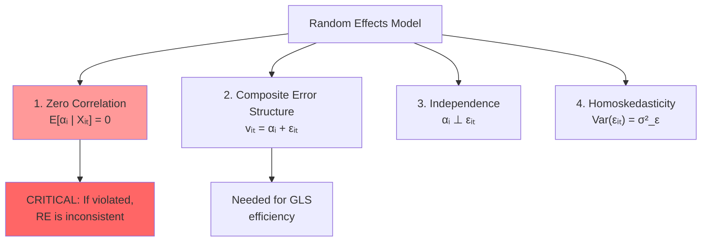
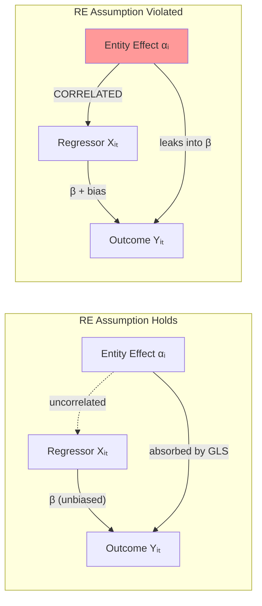
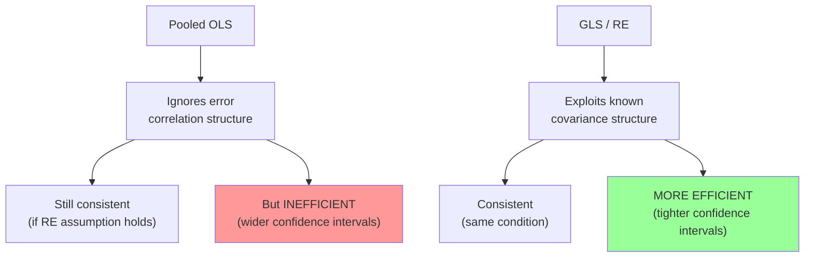
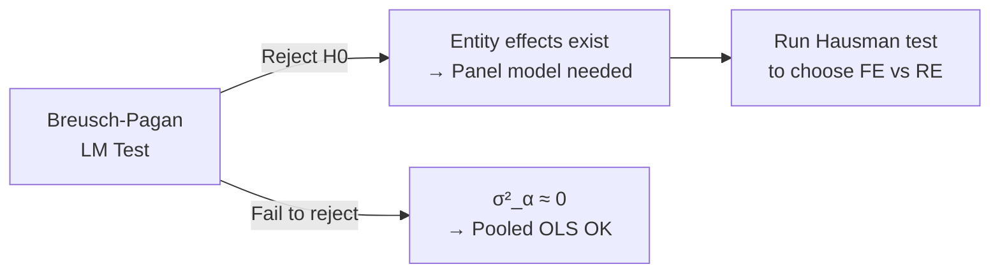

<!-- _class: lead -->

# Random Effects Assumptions
## GLS Estimation and Diagnostics

### Module 03 -- Random Effects

<!-- Speaker notes: Transition slide. Pause briefly before moving into the random effects assumptions section. -->
---

# In Brief

RE requires entity effects to be **uncorrelated with regressors**. Violating this assumption produces **biased and inconsistent** estimates.

> The RE assumption is testable -- the Hausman test compares FE and RE to detect violations.

<!-- Speaker notes: Read the highlighted quote aloud. This captures the key insight of the slide. -->
---

# The Four Key Assumptions



<!-- Speaker notes: Walk through the diagram from top to bottom. Explain each node and decision point. -->
---

<!-- _class: lead -->

# Assumption 1: Zero Correlation

<!-- Speaker notes: Transition slide. Pause briefly before moving into the assumption 1: zero correlation section. -->
---

# The Critical Assumption

$$E[\alpha_i | X_{it}] = 0 \quad \forall t$$

Entity effects must be uncorrelated with **all regressors across all time periods**.

<div class="columns">
<div>

**Valid (RE OK):**
- Random talent assigned to random jobs
- Weather shocks unrelated to firm characteristics

</div>
<div>

**Violated (use FE):**
- Ability correlated with education
- Firm culture affects both investment and growth

</div>
</div>

<!-- Speaker notes: Focus on the intuition behind the formula. Explain what each term represents in plain language. -->
---

# What Violation Looks Like



When $\alpha_i$ correlates with $X$, the entity effect "leaks" into the coefficient estimate.

<!-- Speaker notes: Walk through the diagram from top to bottom. Explain each node and decision point. -->
---

# Simulation: Violation vs Valid

```python
# Case 1: X correlated with alpha_i (VIOLATION)
x_correlated = 5 + 0.7 * alpha_i + noise  # alpha_i leaks into X
# RE estimate: BIASED (e.g., 2.3 instead of 1.5)
# FE estimate: CONSISTENT (e.g., 1.49)

# Case 2: X uncorrelated with alpha_i (VALID)
x_uncorrelated = 5 + noise  # alpha_i independent of X
# RE estimate: UNBIASED and more EFFICIENT
# FE estimate: UNBIASED but less efficient
```

> FE is always consistent. RE is only consistent when the assumption holds.

<!-- Speaker notes: Highlight the key differences. Ask students when they would choose one approach over the other. -->
---

<!-- _class: lead -->

# Assumption 2: Error Structure

<!-- Speaker notes: Transition slide. Pause briefly before moving into the assumption 2: error structure section. -->
---

# Composite Error Covariance

The total error $v_{it} = \alpha_i + \epsilon_{it}$ has structure:

$$\text{Var}(v_{it}) = \sigma_\alpha^2 + \sigma_\epsilon^2$$
$$\text{Cov}(v_{it}, v_{is}) = \sigma_\alpha^2 \quad (t \neq s)$$
$$\text{Cov}(v_{it}, v_{jt}) = 0 \quad (i \neq j)$$

```
Covariance Matrix for Entity i:

     t=1     t=2     t=3     ...
t=1 [σ²_α+σ²_ε  σ²_α     σ²_α    ...]
t=2 [σ²_α     σ²_α+σ²_ε  σ²_α    ...]
t=3 [σ²_α     σ²_α     σ²_α+σ²_ε ...]
...
```

Within-entity correlation = $\rho = \sigma_\alpha^2 / (\sigma_\alpha^2 + \sigma_\epsilon^2)$

<!-- Speaker notes: Focus on the intuition behind the formula. Explain what each term represents in plain language. -->
---

# Why OLS Is Inefficient



GLS accounts for the correlation structure, producing **smaller standard errors**.

<!-- Speaker notes: Walk through the diagram from top to bottom. Explain each node and decision point. -->
---

# Efficiency Gain

```python
# Monte Carlo: 500 simulations
# OLS standard error:  0.0832
# GLS standard error:  0.0614
# Efficiency gain:     35.5%
```

> GLS/RE gives ~35% smaller standard errors in this example -- that's meaningful statistical power.

<!-- Speaker notes: Walk through the code step by step. Highlight the key function calls and explain what each does. -->
---

<!-- _class: lead -->

# GLS Transformation

<!-- Speaker notes: Transition slide. Pause briefly before moving into the gls transformation section. -->
---

# Quasi-Differencing in Detail

RE estimation transforms data:

$$y_{it} - \theta \bar{y}_i = (1-\theta)\alpha + (X_{it} - \theta \bar{X}_i)\beta + (v_{it} - \theta \bar{v}_i)$$

where $\theta = 1 - \sqrt{\frac{\sigma_\epsilon^2}{\sigma_\epsilon^2 + T\sigma_\alpha^2}}$

```
Three Transformations Compared:
┌──────────────────────────────────────────────────┐
│ Original:  yᵢₜ         (all variation)           │
│ Within:    yᵢₜ - ȳᵢ    (only within, θ=1)       │
│ GLS:       yᵢₜ - θȳᵢ   (partial removal, 0<θ<1) │
└──────────────────────────────────────────────────┘
```

<!-- Speaker notes: Focus on the intuition behind the formula. Explain what each term represents in plain language. -->
---

# Visualizing the Transformations

<div class="columns">
<div>

**Original Data:**
- Clusters separated by entity
- Both within and between variation

**Within (FE, $\theta=1$):**
- All clusters centered at origin
- Only within-entity variation remains

</div>
<div>

**GLS (RE, $0<\theta<1$):**
- Clusters partially centered
- Retains some between variation
- Optimal weighting for efficiency

</div>
</div>

> RE's partial demeaning is optimal under its assumptions -- it uses information that FE discards.

<!-- Speaker notes: Compare the two columns. Ask students which scenario applies to their work. -->
---

<!-- _class: lead -->

# Testing Assumptions

<!-- Speaker notes: Transition slide. Pause briefly before moving into the testing assumptions section. -->
---

# Breusch-Pagan LM Test

Tests for the **presence** of random effects: $H_0: \sigma_\alpha^2 = 0$

```python
# Under H0, LM ~ chi-squared(1)
lm_stat = (nT / (2*(T-1))) * ((T * sum_sq_group / total_ss) - 1)**2

# Reject H0 → entity effects exist → use RE or FE
# Fail to reject → pooled OLS may be appropriate
```



<!-- Speaker notes: Walk through the code step by step. Highlight the key function calls and explain what each does. -->
---

# When to Use RE: Decision Table

| Condition | Use RE? |
|-----------|---------|
| Entity effect uncorrelated with X | Yes |
| Time-invariant variables important | Yes |
| Small T, need efficiency | Yes |
| Entities are random sample | Yes |
| Entity effect correlated with X | No (use FE) |
| Hausman test rejects RE | No (use FE) |

<!-- Speaker notes: Walk through the decision tree step by step. Ask students to apply it to a concrete example. -->
---

# Key Takeaways

1. **RE assumes $E[\alpha_i|X_{it}] = 0$** -- entity effects uncorrelated with regressors

2. **GLS estimation** exploits error structure for efficiency gains over OLS

3. **Theta** determines how much quasi-differencing ($\theta=0$: OLS, $\theta=1$: FE)

4. **Variance components** decompose total variance into entity and idiosyncratic parts

5. **Test assumptions** before using RE -- Breusch-Pagan and Hausman tests are essential

> RE gives you more for less -- but only if the assumptions hold. When in doubt, FE is the safer choice.

<!-- Speaker notes: Summarize the main points. Ask students which takeaway surprised them most. -->