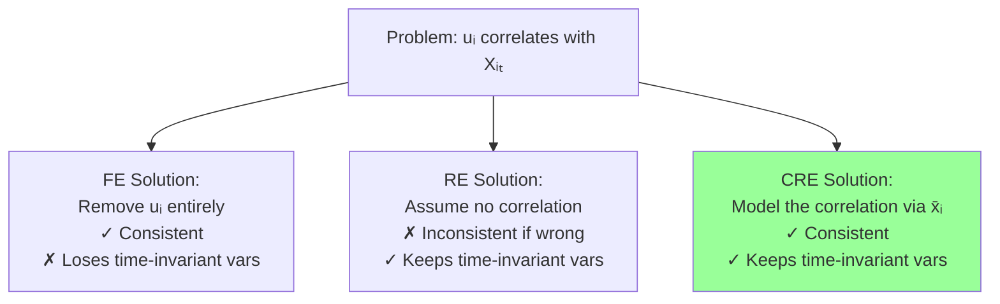
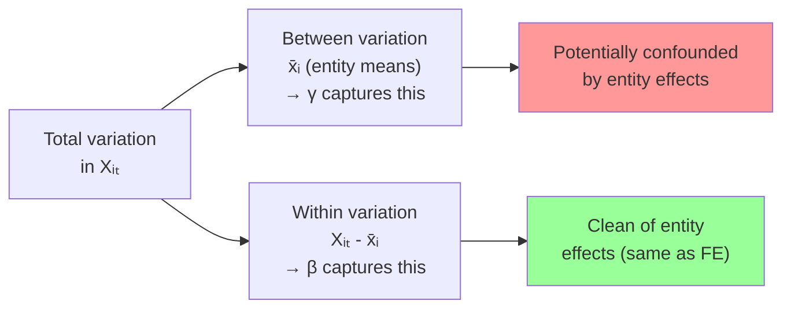
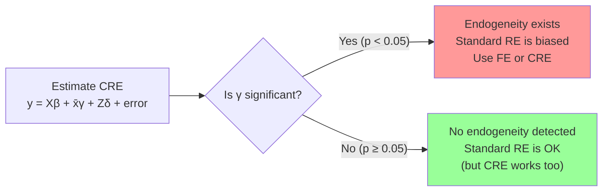
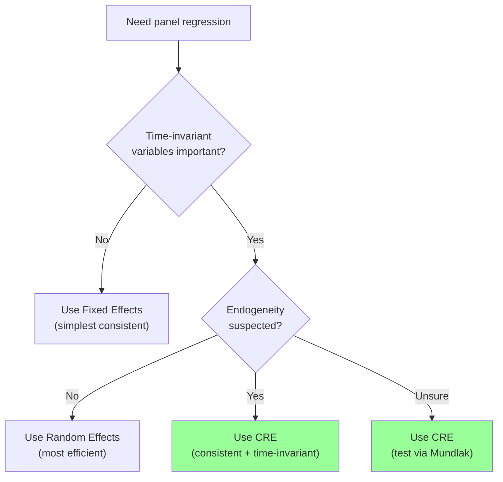

<!-- _class: lead -->

# Correlated Random Effects
## Bridging FE and RE

### Module 03 -- Random Effects

<!-- Speaker notes: Transition slide. Pause briefly before moving into the correlated random effects section. -->
---

# In Brief

Correlated Random Effects (CRE) **relaxes the RE assumption** while retaining its advantages -- it gives you FE consistency AND the ability to estimate time-invariant effects.

> CRE is the best of both worlds: consistent like FE, flexible like RE.

<!-- Speaker notes: Read the highlighted quote aloud. This captures the key insight of the slide. -->
---

# The Key Insight

Model the correlation between $u_i$ and $X_{it}$ explicitly:

$$u_i = \gamma \bar{X}_i + \omega_i$$

where $\omega_i$ is uncorrelated with $X_{it}$.

Substituting into the RE model:

$$y_{it} = \alpha + X_{it}\beta + \gamma \bar{X}_i + \omega_i + \epsilon_{it}$$

<!-- Speaker notes: Focus on the intuition behind the formula. Explain what each term represents in plain language. -->
---

# Why CRE Works



<!-- Speaker notes: Walk through the diagram from top to bottom. Explain each node and decision point. -->
---

# How CRE Partitions Variation



Including $\bar{X}_i$ absorbs the confounded between variation, leaving $\beta$ identified from within variation only.

<!-- Speaker notes: Walk through the diagram from top to bottom. Explain each node and decision point. -->
---

<!-- _class: lead -->

# Implementation

<!-- Speaker notes: Transition slide. Pause briefly before moving into the implementation section. -->
---

# Three Ways to Estimate CRE

<div class="columns">
<div>

**1. OLS with Group Means**
```python
df['x_bar'] = df.groupby('entity')['x'] \
               .transform('mean')

ols = smf.ols('y ~ x + x_bar + z',
              data=df).fit(
    cov_type='cluster',
    cov_kwds={'groups': df['entity']}
)
```

</div>
<div>

**2. Mixed Effects**
```python
cre = smf.mixedlm(
    'y ~ x + x_bar + z',
    data=df,
    groups='entity'
).fit()
```

</div>
</div>

Both give consistent estimates of $\beta$.

<!-- Speaker notes: Walk through the code step by step. Highlight the key function calls and explain what each does. -->
---

# CRE Recovers FE Estimates

```python
# Generate data with endogeneity (X correlated with u_i)

print("True β = 1.5")

# 1. Pooled OLS:     β = 2.31 (biased)
# 2. Random Effects:  β = 2.12 (biased)
# 3. Fixed Effects:   β = 1.49 (consistent)
# 4. CRE/Mundlak:    β = 1.49 (consistent!)
#    Effect of z:     γ = 0.81 (estimable!)
```

> CRE matches FE on time-varying variables AND estimates time-invariant effects that FE cannot.

<!-- Speaker notes: Walk through the code step by step. Highlight the key function calls and explain what each does. -->
---

<!-- _class: lead -->

# The Mundlak Test

<!-- Speaker notes: Transition slide. Pause briefly before moving into the the mundlak test section. -->
---

# Built-In Hausman Test

The coefficient on $\bar{X}_i$ provides a **natural test for endogeneity**:

$$H_0: \gamma = 0 \quad \text{(no correlation, RE is appropriate)}$$
$$H_1: \gamma \neq 0 \quad \text{(correlation exists, use FE)}$$



<!-- Speaker notes: Walk through the diagram from top to bottom. Explain each node and decision point. -->
---

# Mundlak Test in Code

```python
def mundlak_test(df, y_col, x_cols, entity_col):
    # Add entity means
    for x in x_cols:
        df[f'{x}_bar'] = df.groupby(entity_col)[x].transform('mean')

    # Fit CRE
    x_bar_cols = [f'{x}_bar' for x in x_cols]
    formula = f'{y_col} ~ {" + ".join(x_cols + x_bar_cols)}'
    cre = smf.ols(formula, data=df).fit()

    # Test: are x_bar coefficients significant?
    for col in x_bar_cols:
        print(f"{col}: {cre.params[col]:.4f} (p={cre.pvalues[col]:.4f})")

    # Significant → endogeneity → use FE or CRE
```

<!-- Speaker notes: Walk through the code step by step. Highlight the key function calls and explain what each does. -->
---

<!-- _class: lead -->

# CRE with Multiple Variables

<!-- Speaker notes: Transition slide. Pause briefly before moving into the cre with multiple variables section. -->
---

# Full CRE Example

```python
# Multiple time-varying X (x1, x2) and time-invariant Z (z1, z2)
# True: β1=1.5, β2=-0.8, δ1=0.6, δ2=1.2

# FE (cannot estimate z1, z2):
#   β1: 1.50, β2: -0.80

# RE (biased for x1, x2):
#   β1: 1.72, β2: -0.75, δ1: 0.45, δ2: 1.15

# CRE (consistent AND estimates z):
#   β1: 1.50 (consistent!)
#   β2: -0.80 (consistent!)
#   δ1: 0.60 (estimable!)
#   δ2: 1.20 (estimable!)
```

<!-- Speaker notes: Walk through this example line by line. Pause after key output to discuss what it means. -->
---

# Comparison: FE vs RE vs CRE

| Feature | FE | RE | CRE |
|---------|----|----|-----|
| Consistent with endogeneity | Yes | No | Yes |
| Estimates time-invariant effects | No | Yes | Yes |
| Efficient | No | Yes | Moderate |
| Built-in Hausman test | No | No | Yes |
| Flexibility | Low | Low | High |

```
CRE = FE consistency + RE flexibility
```

<!-- Speaker notes: Highlight the key differences. Ask students when they would choose one approach over the other. -->
---

# When to Use CRE



<!-- Speaker notes: Walk through the decision tree step by step. Ask students to apply it to a concrete example. -->
---

# Key Takeaways

1. **CRE bridges FE and RE** by explicitly modeling the correlation between entity effects and regressors

2. **Include entity means** ($\bar{X}_i$) of time-varying X to control for endogeneity

3. **Time-invariant effects remain estimable** unlike in pure FE

4. **Coefficient on $\bar{X}_i$** provides a natural Hausman-type test

5. **CRE is more flexible** -- can be extended to nonlinear models and multilevel structures

> When in doubt between FE and RE, CRE gives you both. The only cost is a few extra parameters.

<!-- Speaker notes: Summarize the main points. Ask students which takeaway surprised them most. -->