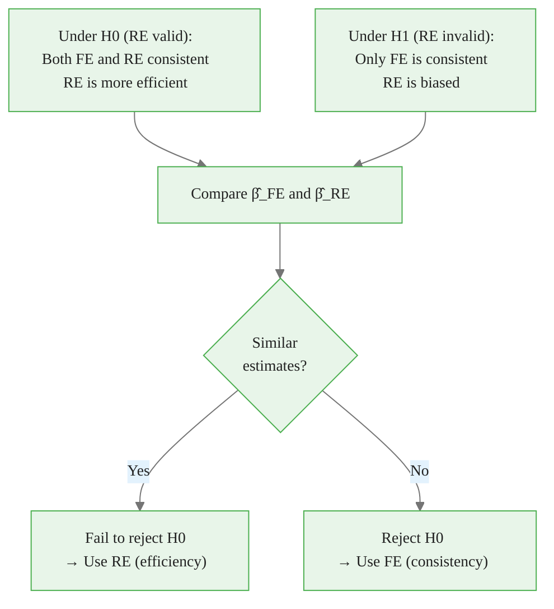
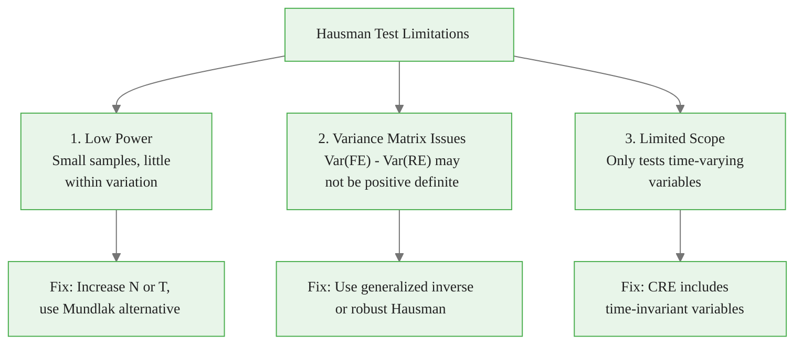
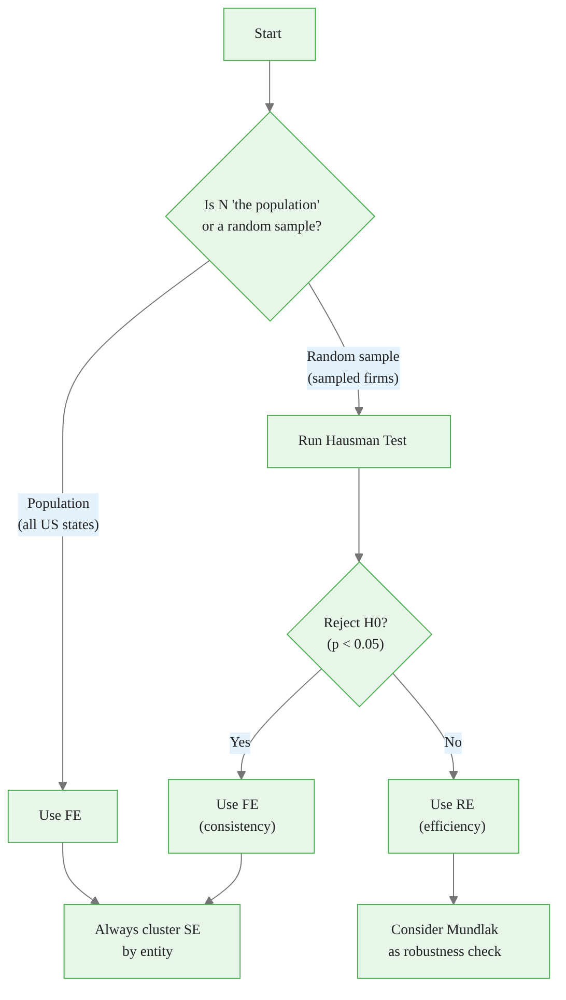

<!-- _class: lead -->

# The Hausman Test
## FE vs RE Selection

### Module 04 -- Model Selection

<!-- Speaker notes: Transition slide. Pause briefly before moving into the the hausman test section. -->
---

# In Brief

The Hausman test determines whether entity effects **correlate with regressors**. If they do, RE is inconsistent and FE is required.

> The Hausman test answers the single most important question in panel econometrics: Fixed Effects or Random Effects?

<!-- Speaker notes: Read the highlighted quote aloud. This captures the key insight of the slide. -->

<div class="callout-key">

Panel data controls for unobserved time-invariant heterogeneity -- the key advantage over cross-sectional data.

</div>

---

# The Fundamental Question

**Should we use Fixed Effects or Random Effects?**

| Scenario | FE | RE |
|----------|----|----|
| $\text{Cov}(\alpha_i, x_{it}) = 0$ | Consistent, inefficient | Consistent, **efficient** |
| $\text{Cov}(\alpha_i, x_{it}) \neq 0$ | **Consistent** | Inconsistent (biased) |

> FE is always safe but wasteful. RE is efficient but risky.

<!-- Speaker notes: Review the table row by row. Highlight the most important distinctions. -->

<div class="callout-insight">

**Insight:** The within-transformation eliminates time-invariant confounders, which is the most powerful tool in the panel econometrician's toolkit.

</div>

---

# Hausman Test Logic



<!-- Speaker notes: Walk through the diagram from top to bottom. Explain each node and decision point. -->

<div class="callout-warning">

**Warning:** Standard errors from pooled OLS ignore within-entity correlation and are almost always too small. Use clustered standard errors.

</div>

---

# The Test Statistic

$$H = (\hat{\beta}_{FE} - \hat{\beta}_{RE})'[\text{Var}(\hat{\beta}_{FE}) - \text{Var}(\hat{\beta}_{RE})]^{-1}(\hat{\beta}_{FE} - \hat{\beta}_{RE})$$

Under $H_0$: $H \sim \chi^2(K)$

where $K$ = number of time-varying regressors.

| Result | Conclusion | Action |
|--------|------------|--------|
| Fail to reject $H_0$ | No evidence of correlation | RE preferred |
| Reject $H_0$ | Effects correlated with X | FE required |

<!-- Speaker notes: Focus on the intuition behind the formula. Explain what each term represents in plain language. -->

<div class="callout-info">

**Info:** With N entities and T periods, panel data gives N*T observations, dramatically increasing statistical power over pure cross-sections.

</div>

---

<!-- _class: lead -->

# Implementation

<!-- Speaker notes: Transition slide. Pause briefly before moving into the implementation section. -->
---

# Manual Hausman Test

<div class="code-window">
<div class="code-header">
<div class="dots"><span class="dot-red"></span><span class="dot-yellow"></span><span class="dot-green"></span></div>
<span class="filename">example.py</span>
</div>

```python
from scipy import stats

# Coefficient and variance differences
beta_diff = beta_fe - beta_re
var_diff = var_fe - var_re

# Hausman statistic
H = beta_diff @ np.linalg.inv(var_diff) @ beta_diff
p_value = 1 - stats.chi2.cdf(H, df=K)

if p_value < 0.05:
    print("Reject H0 → Use Fixed Effects")
else:
    print("Cannot reject H0 → RE acceptable")
```

</div>

<!-- Speaker notes: Walk through the code step by step. Highlight the key function calls and explain what each does. -->
---

# Using linearmodels

<div class="code-window">
<div class="code-header">
<div class="dots"><span class="dot-red"></span><span class="dot-yellow"></span><span class="dot-green"></span></div>
<span class="filename">example.py</span>
</div>

```python
from linearmodels.panel import PanelOLS, RandomEffects, compare

# Fit both models
fe = PanelOLS(data['y'], exog, entity_effects=True).fit()
re = RandomEffects(data['y'], exog).fit()

# Compare
comparison = compare({'FE': fe, 'RE': re})
print(comparison)

# Result:
#   Statistic: 45.23
#   P-value: 0.0000
#   Conclusion: Use FE
```

</div>

<!-- Speaker notes: Walk through the code step by step. Highlight the key function calls and explain what each does. -->
---

<!-- _class: lead -->

# Limitations

<!-- Speaker notes: Transition slide. Pause briefly before moving into the limitations section. -->
---

# Three Key Limitations



<!-- Speaker notes: Walk through the diagram from top to bottom. Explain each node and decision point. -->
---

# Power Depends on Sample Size

```python
# Simulation: Power at different correlation levels
# Correlation = 0.0: Power = 5%   (correct size)
# Correlation = 0.3: Power = 42%  (low)
# Correlation = 0.5: Power = 78%  (moderate)
# Correlation = 0.7: Power = 96%  (good)
```

> With weak correlation and small samples, Hausman may fail to reject even when FE is needed.

<!-- Speaker notes: Walk through the code step by step. Highlight the key function calls and explain what each does. -->
---

<!-- _class: lead -->

# The Mundlak Alternative

<!-- Speaker notes: Transition slide. Pause briefly before moving into the the mundlak alternative section. -->
---

# Mundlak: A Robust Alternative

Instead of choosing between FE and RE, use Mundlak's approach:

$$y_{it} = x_{it}'\beta + \bar{x}_i'\gamma + \alpha_i + \epsilon_{it}$$

Test: $H_0: \gamma = 0$

```python
# Mundlak test
data['x_mean'] = data.groupby('entity')['x'].transform('mean')

re_mundlak = RandomEffects(
    data['y'], data[['x', 'x_mean']]
).fit()

# If x_mean is significant → correlation exists → use FE
print(f"Coefficient on x_mean: {re_mundlak.params['x_mean']:.4f}")
print(f"P-value: {re_mundlak.pvalues['x_mean']:.4f}")
```

<!-- Speaker notes: This slide connects the math to implementation. Walk through how the formula maps to code. -->
---

# Practical Decision Framework



<!-- Speaker notes: Walk through the decision tree step by step. Ask students to apply it to a concrete example. -->
---

# Beyond the Hausman Test

**Information Criteria:** Compare models using AIC/BIC

**Correlated Random Effects:** Nests FE and RE in one framework:
1. Run RE with Mundlak terms
2. Get FE coefficients on time-varying variables
3. Get RE efficiency on time-invariant variables

> CRE sidesteps the FE vs RE choice entirely.

<!-- Speaker notes: Read the highlighted quote aloud. This captures the key insight of the slide. -->
---

# Key Takeaways

1. **Hausman test** compares FE and RE to detect correlation between effects and regressors

2. **Rejection** $\to$ entity effects correlated $\to$ use FE for consistency

3. **Non-rejection** $\to$ RE acceptable $\to$ use RE for efficiency

4. **Limitations**: Low power, variance matrix issues, only tests time-varying variables

5. **Mundlak approach** provides a robust alternative that combines benefits of both

6. **Practical rule**: When in doubt, FE is safer -- it is always consistent

> The Hausman test is your first diagnostic -- but never your only one.

<!-- Speaker notes: Summarize the main points. Ask students which takeaway surprised them most. -->