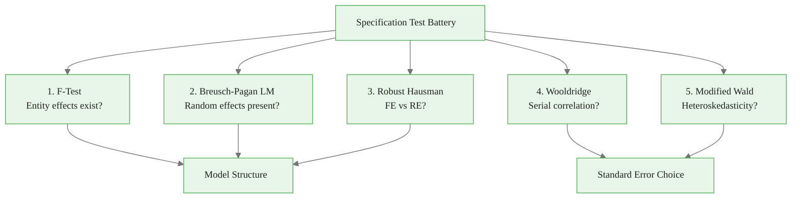
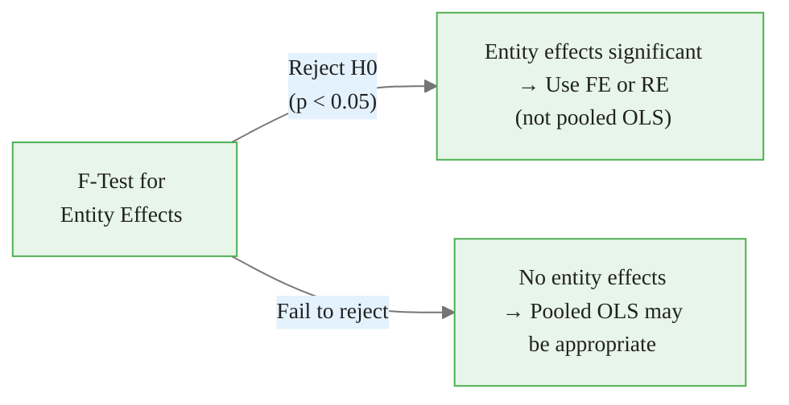
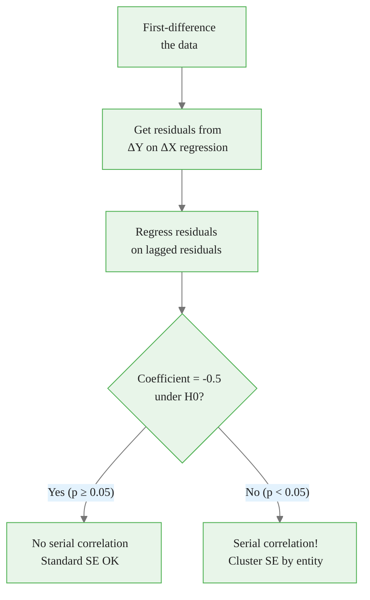
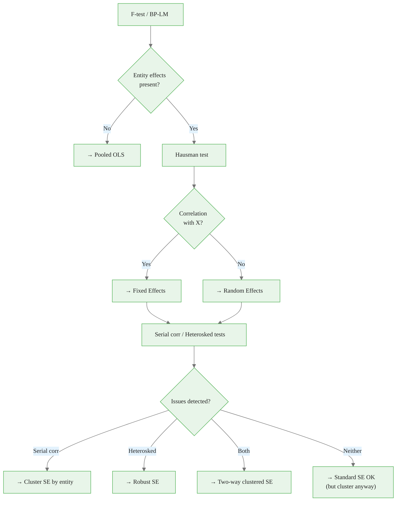

<!-- _class: lead -->

# Specification Tests
## Validating Panel Model Assumptions

### Module 04 -- Model Selection

<!-- Speaker notes: Transition slide. Pause briefly before moving into the specification tests section. -->
---

# In Brief

Beyond the Hausman test, a battery of specification tests validates your panel model: F-test, Breusch-Pagan LM, serial correlation, and heteroskedasticity tests.

> One test is never enough. Comprehensive diagnostics build credible results.

<!-- Speaker notes: Read the highlighted quote aloud. This captures the key insight of the slide. -->

<div class="callout-key">

Panel data controls for unobserved time-invariant heterogeneity -- the key advantage over cross-sectional data.

</div>

---

# The Five Essential Tests



<!-- Speaker notes: Walk through the diagram from top to bottom. Explain each node and decision point. -->

<div class="callout-insight">

**Insight:** The within-transformation eliminates time-invariant confounders, which is the most powerful tool in the panel econometrician's toolkit.

</div>

---

<!-- _class: lead -->

# Test 1: F-Test for Fixed Effects

<!-- Speaker notes: Transition slide. Pause briefly before moving into the test 1: f-test for fixed effects section. -->
---

# Do Entity Effects Exist?

$$H_0: \alpha_1 = \alpha_2 = ... = \alpha_N$$

**Compares:** Pooled OLS vs Fixed Effects

$$F = \frac{(RSS_{pooled} - RSS_{FE}) / (N-1)}{RSS_{FE} / (nT - N - K)} \sim F(N-1, nT-N-K)$$

<div class="code-window">
<div class="code-header">
<div class="dots"><span class="dot-red"></span><span class="dot-yellow"></span><span class="dot-green"></span></div>
<span class="filename">example.py</span>
</div>

```python
# Restricted: Pooled OLS
pooled = PooledOLS(y, X).fit()

# Unrestricted: Fixed Effects
fe = PanelOLS(y, X, entity_effects=True).fit()

# F-statistic
f_stat = ((rss_pooled - rss_fe) / (N-1)) / (rss_fe / (nT-N-K))
```

</div>

<!-- Speaker notes: This slide connects the math to implementation. Walk through how the formula maps to code. -->

<div class="callout-warning">

**Warning:** Standard errors from pooled OLS ignore within-entity correlation and are almost always too small. Use clustered standard errors.

</div>

---

# F-Test Decision



> Almost always rejected in practice. If not, you may not need panel methods.

<!-- Speaker notes: Walk through the decision tree step by step. Ask students to apply it to a concrete example. -->

<div class="callout-info">

**Info:** With N entities and T periods, panel data gives N*T observations, dramatically increasing statistical power over pure cross-sections.

</div>

---

<!-- _class: lead -->

# Test 2: Breusch-Pagan LM

<!-- Speaker notes: Transition slide. Pause briefly before moving into the test 2: breusch-pagan lm section. -->
---

# Are Random Effects Present?

$$H_0: \sigma_u^2 = 0 \quad \text{(no entity-specific variance)}$$

Uses pooled OLS residuals to detect within-entity correlation:

$$LM = \frac{nT}{2(T-1)}\left[\frac{T^2 \sum_i(\sum_t e_{it})^2}{\sum_i \sum_t e_{it}^2} - 1\right]^2 \sim \chi^2(1)$$

<div class="columns">
<div>

**Reject H0:** Entity effects present. Use RE or FE.

</div>
<div>

**Fail to reject:** No entity effects. Pooled OLS is fine.

</div>
</div>

<!-- Speaker notes: Focus on the intuition behind the formula. Explain what each term represents in plain language. -->
---

<!-- _class: lead -->

# Test 3: Robust Hausman

<!-- Speaker notes: Transition slide. Pause briefly before moving into the test 3: robust hausman section. -->
---

# Mundlak-Based Robust Hausman

The standard Hausman test has **size distortions** with heteroskedasticity.

**Robust alternative:** Augment RE with entity means (Mundlak terms):

$$y_{it} = X_{it}\beta + \bar{X}_i\gamma + u_i + \epsilon_{it}$$

Test: $H_0: \gamma = 0$ (all entity-mean coefficients are zero)

<div class="code-window">
<div class="code-header">
<div class="dots"><span class="dot-red"></span><span class="dot-yellow"></span><span class="dot-green"></span></div>
<span class="filename">example.py</span>
</div>

```python
# Augmented RE with entity means
for x in x_cols:
    df[f'{x}_bar'] = df.groupby(entity_col)[x].transform('mean')

aug_model = smf.mixedlm(
    f'y ~ x1 + x2 + x1_bar + x2_bar',
    data=df, groups='entity'
).fit()

# Test significance of x_bar terms
```

</div>

<!-- Speaker notes: This slide connects the math to implementation. Walk through how the formula maps to code. -->
---

<!-- _class: lead -->

# Test 4: Serial Correlation

<!-- Speaker notes: Transition slide. Pause briefly before moving into the test 4: serial correlation section. -->
---

# Wooldridge Test for AR(1)

Tests for first-order serial correlation in panel residuals.



> Serial correlation inflates t-statistics. Ignoring it leads to false confidence.

<!-- Speaker notes: Walk through the diagram from top to bottom. Explain each node and decision point. -->
---

<!-- _class: lead -->

# Test 5: Heteroskedasticity

<!-- Speaker notes: Transition slide. Pause briefly before moving into the test 5: heteroskedasticity section. -->
---

# Modified Wald Test

Tests whether error variance differs across entities:

$$H_0: \sigma_i^2 = \sigma^2 \text{ for all } i$$

```python
# Get entity-specific residual variances
entity_vars = df.groupby(entity_col)['resid_sq'].mean()

# Compare to overall variance
sigma_sq = df['resid_sq'].mean()

# Wald statistic
wald = N * sum((entity_vars - sigma_sq)**2) / (2 * sigma_sq**2)
```

**If rejected:** Use robust or clustered standard errors.

<!-- Speaker notes: This slide connects the math to implementation. Walk through how the formula maps to code. -->
---

<!-- _class: lead -->

# Comprehensive Testing

<!-- Speaker notes: Transition slide. Pause briefly before moving into the comprehensive testing section. -->
---

# Running All Tests Together

```
COMPREHENSIVE PANEL DATA SPECIFICATION TESTS
======================================================================

TEST 1: F-Test for Fixed Effects
  F-statistic: 52.34, p-value: 0.000000
  Result: REJECT H0 - Entity fixed effects significant

TEST 2: Breusch-Pagan LM Test
  LM statistic: 1847.23, p-value: 0.000000
  Result: REJECT H0 - Random effects present

TEST 3: Robust Hausman Test
  x1_bar: 1.24 (t=8.45, p=0.000)  ← Significant!
  x2_bar: 0.03 (t=0.21, p=0.834)
  Result: Use Fixed Effects

TEST 4: Wooldridge Serial Correlation
  t-statistic: 3.42, p-value: 0.000623
  Result: Serial correlation detected

TEST 5: Modified Wald Heteroskedasticity
  Wald statistic: 245.67, p-value: 0.000000
  Result: Heteroskedasticity detected
```

<!-- Speaker notes: Explain the key concepts on this slide. Check for questions before moving on. -->
---

# From Tests to Recommendations



<!-- Speaker notes: Walk through the diagram from top to bottom. Explain each node and decision point. -->
---

# Key Takeaways

1. **F-test and BP-LM** determine if panel methods are needed at all

2. **Hausman test** (robust version) guides the FE vs RE choice

3. **Serial correlation** requires clustered standard errors

4. **Heteroskedasticity** requires robust standard errors

5. **Run ALL tests** for comprehensive model validation -- one test is never enough

> A credible panel analysis reports the full battery of diagnostics, not just the Hausman test.

<!-- Speaker notes: Summarize the main points. Ask students which takeaway surprised them most. -->