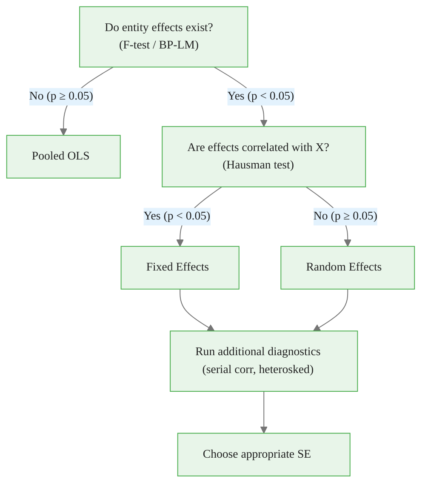
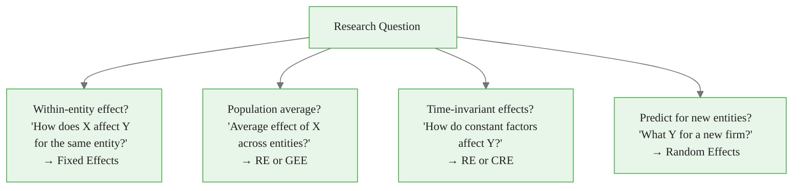
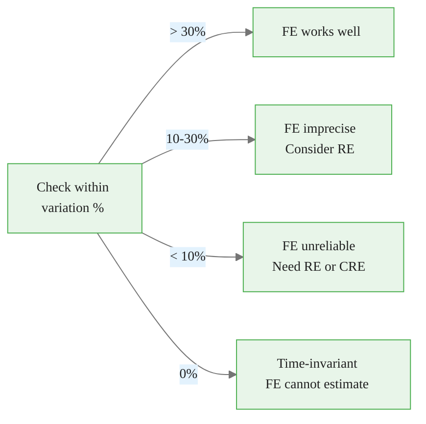
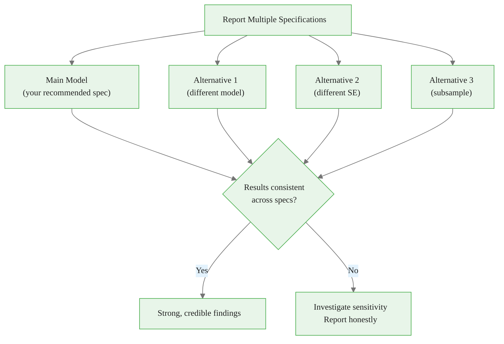

<!-- _class: lead -->

# Practical Model Choice
## Beyond Statistical Tests

### Module 04 -- Model Selection

<!-- Speaker notes: Transition slide. Pause briefly before moving into the practical model choice section. -->
---

# In Brief

Model selection involves **balancing statistical criteria with practical considerations**. Tests are necessary but not sufficient -- your research question and data structure matter equally.

> Don't be mechanical. The best model depends on what you're trying to learn.

<!-- Speaker notes: Read the highlighted quote aloud. This captures the key insight of the slide. -->

<div class="callout-key">

Panel data controls for unobserved time-invariant heterogeneity -- the key advantage over cross-sectional data.

</div>

---

# The Decision Tree



<!-- Speaker notes: Walk through the decision tree step by step. Ask students to apply it to a concrete example. -->

<div class="callout-insight">

**Insight:** The within-transformation eliminates time-invariant confounders, which is the most powerful tool in the panel econometrician's toolkit.

</div>

---

# The Automated Selection Process

<div class="code-window">
<div class="code-header">
<div class="dots"><span class="dot-red"></span><span class="dot-yellow"></span><span class="dot-green"></span></div>
<span class="filename">example.py</span>
</div>

```python
class PanelModelSelector:
    def run_selection(self):
        # Step 1: Test for entity effects (F-test)
        self._test_entity_effects()
        if not significant:
            return 'pooled_ols'

        # Step 2: Hausman test (FE vs RE)
        self._hausman_test()
        if reject_H0:
            return 'fixed_effects'
        else:
            return 'random_effects'

        # Step 3: Additional diagnostics
        self._additional_diagnostics()
```

</div>

<!-- Speaker notes: Walk through the code step by step. Highlight the key function calls and explain what each does. -->

<div class="callout-warning">

**Warning:** Standard errors from pooled OLS ignore within-entity correlation and are almost always too small. Use clustered standard errors.

</div>

---

<!-- _class: lead -->

# Research Question Matters

<!-- Speaker notes: Transition slide. Pause briefly before moving into the research question matters section. -->
---

# Different Questions Need Different Models



<!-- Speaker notes: Walk through the diagram from top to bottom. Explain each node and decision point. -->

<div class="callout-info">

**Info:** With N entities and T periods, panel data gives N*T observations, dramatically increasing statistical power over pure cross-sections.

</div>

---

# Matching Question to Model

| Research Question | Best Model | Why |
|-------------------|------------|-----|
| Effect of X change within entity | FE | Eliminates between variation |
| Average effect across population | RE or GEE | Uses all variation |
| Effect of time-constant factors | RE or CRE | FE eliminates these |
| Predict for new entities | RE | Provides entity predictions |

> The statistical test may say "RE" but your research question may require "FE".

<!-- Speaker notes: Review the table row by row. Highlight the most important distinctions. -->
---

<!-- _class: lead -->

# Data Characteristics

<!-- Speaker notes: Transition slide. Pause briefly before moving into the data characteristics section. -->
---

# Panel Dimensions Guide Choices

<div class="columns">
<div>

**Large N, Small T** (N=500, T=5)
- Typical micro panels
- FE standard choice
- Watch for Nickell bias if dynamic
- Clustering by entity essential

</div>
<div>

**Small N, Large T** (N=20, T=100)
- Macro panels
- Time-series methods relevant
- Cross-sectional dependence concern
- May need Driscoll-Kraay SE

</div>
</div>

<!-- Speaker notes: Compare the two columns. Ask students which scenario applies to their work. -->
---

# Within-Entity Variation Check

```
WITHIN-ENTITY VARIATION ASSESSMENT:
======================================================
Variable    Within %    Concern
------------------------------------------------------
x1          72.3%       Good -- FE can estimate well
x2          45.1%       Moderate -- FE less precise
x3           3.2%       LOW -- FE estimates unreliable
gender       0.0%       Time-invariant -- FE impossible
```



<!-- Speaker notes: Walk through the diagram from top to bottom. Explain each node and decision point. -->
---

# Balance and Attrition

<div class="code-window">
<div class="code-header">
<div class="dots"><span class="dot-red"></span><span class="dot-yellow"></span><span class="dot-green"></span></div>
<span class="filename">example.py</span>
</div>

```python
# Check panel structure
T_values = df.groupby('entity').size()
balance_ratio = T_values.min() / T_values.max()

# Balanced:   min/max ≈ 1.0 (no concerns)
# Unbalanced: min/max < 0.5 (check for attrition bias)
```

</div>

**Sample selection issues:**
- Fixed sample (all firms in industry) → FE appropriate
- Random sample from population → RE potentially appropriate
- Selected sample (surviving firms) → Selection bias concerns

<!-- Speaker notes: Walk through the code step by step. Highlight the key function calls and explain what each does. -->
---

<!-- _class: lead -->

# Model Comparison

<!-- Speaker notes: Transition slide. Pause briefly before moving into the model comparison section. -->
---

# Compare All Specifications

```
MODEL COMPARISON TABLE:
================================================================
Variable   Pooled OLS   Pooled(Clust)  Fixed Effects  Random Effects
----------------------------------------------------------------
x1         1.82 (0.02)  1.82 (0.11)   1.50 (0.01)   1.72 (0.02)
x2        -0.79 (0.03) -0.79 (0.04)  -0.80 (0.02)  -0.79 (0.03)
----------------------------------------------------------------
R-squared   0.78          0.78          0.45           0.72
================================================================
```

Key observations:
- x1: Pooled/RE overestimate (endogeneity), FE is consistent
- x2: All models agree (no endogeneity for x2)
- R-squared: FE is within-R-squared (lower by construction)

<!-- Speaker notes: Explain the key concepts on this slide. Check for questions before moving on. -->
---

# Reporting Strategy



<!-- Speaker notes: Walk through the diagram from top to bottom. Explain each node and decision point. -->
---

# Practical Checklist

1. **Run the decision tree** (F-test → Hausman → diagnostics)
2. **Consider your research question** (within effect? prediction? time-invariant?)
3. **Assess data characteristics** (N, T, balance, within variation)
4. **Compare multiple specifications** (pooled, FE, RE side by side)
5. **Always cluster standard errors** by entity at minimum
6. **Report transparently** (document choices and alternatives)

<!-- Speaker notes: Explain the key concepts on this slide. Check for questions before moving on. -->
---

# Key Takeaways

1. **Follow the decision tree** but don't be mechanical about it

2. **Consider your research question** -- different questions need different models

3. **Understand your data** -- N, T, balance, within variation all matter

4. **Report multiple specifications** -- robustness builds credibility

5. **Always cluster standard errors** by entity at minimum

6. **Document your choices** -- transparent reasoning is essential

> The best panel analysis is one where the reader understands WHY you chose your model, not just WHICH one.

<!-- Speaker notes: Summarize the main points. Ask students which takeaway surprised them most. -->