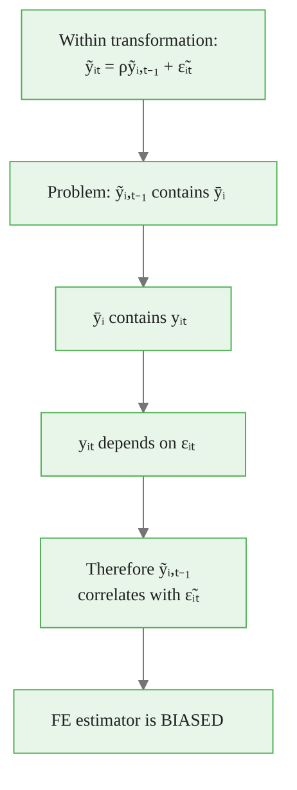
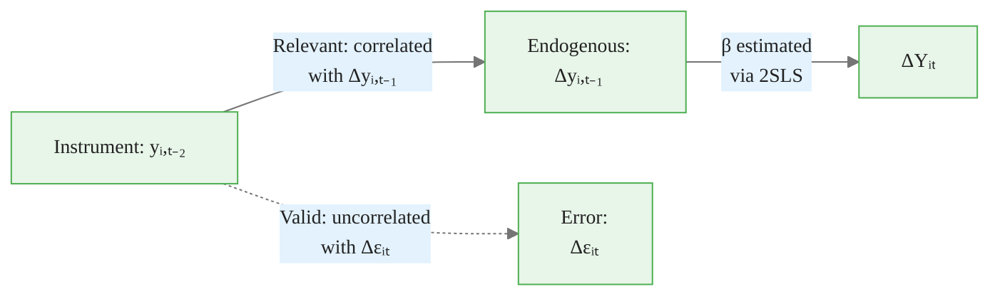
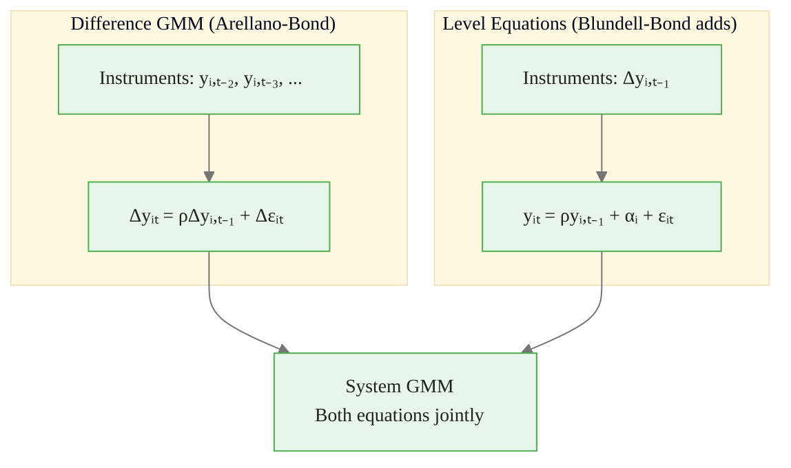
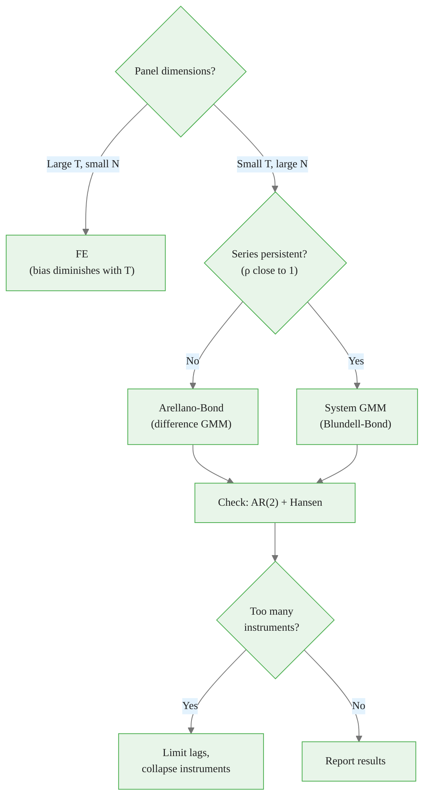

<!-- _class: lead -->

# Dynamic Panel Models
## Lagged Dependent Variables and GMM

### Module 05 -- Advanced Topics

<!-- Speaker notes: Transition slide. Pause briefly before moving into the dynamic panel models section. -->
---

# In Brief

Dynamic panels include **lagged dependent variables** as regressors. Standard FE is biased in this setting -- specialized estimators (Anderson-Hsiao, Arellano-Bond) are required.

> When the past determines the present, standard panel methods break down.

<!-- Speaker notes: Read the highlighted quote aloud. This captures the key insight of the slide. -->

<div class="callout-key">

Panel data controls for unobserved time-invariant heterogeneity -- the key advantage over cross-sectional data.

</div>

---

# The Dynamic Panel Framework

$$y_{it} = \rho y_{i,t-1} + x_{it}'\beta + \alpha_i + \epsilon_{it}$$

where $|\rho| < 1$ ensures stationarity.

**Why dynamic models?** Many relationships exhibit **state dependence**:
- Current wages depend on past wages (human capital)
- Investment depends on previous investment (adjustment costs)
- Consumption shows habit persistence
- Trade relationships are sticky

<!-- Speaker notes: Focus on the intuition behind the formula. Explain what each term represents in plain language. -->

<div class="callout-insight">

**Insight:** The within-transformation eliminates time-invariant confounders, which is the most powerful tool in the panel econometrician's toolkit.

</div>

---

# The Nickell Bias Problem

Applying FE to dynamic panels creates a **mechanical correlation**:



<!-- Speaker notes: Walk through the diagram from top to bottom. Explain each node and decision point. -->

<div class="callout-warning">

**Warning:** Standard errors from pooled OLS ignore within-entity correlation and are almost always too small. Use clustered standard errors.

</div>

---

# Bias Formula

$$\text{plim}(\hat{\rho}_{FE} - \rho) = -\frac{1 + \rho}{T - 1} + O(T^{-2})$$

**Example:** $\rho = 0.5$, $T = 5$:

$$\text{Bias} \approx -\frac{1.5}{4} = -0.375$$

```
True ρ = 0.5
FE estimate ≈ 0.125  ← Severely downward biased!
```

> FE underestimates persistence. The shorter the panel, the worse the bias.

<!-- Speaker notes: Take this slowly. Focus on intuition behind each step rather than memorizing the algebra. -->

<div class="callout-info">

**Info:** With N entities and T periods, panel data gives N*T observations, dramatically increasing statistical power over pure cross-sections.

</div>

---

# Bias Across Panel Lengths

| T | Theoretical Bias | FE Estimate (when $\rho = 0.5$) |
|---|----------------:|----------------------------------:|
| 5 | -0.375 | ~0.125 |
| 10 | -0.167 | ~0.333 |
| 20 | -0.079 | ~0.421 |
| 50 | -0.031 | ~0.469 |
| 100 | -0.015 | ~0.485 |

> Only with T > 20-30 does FE become acceptable for dynamic panels.

<!-- Speaker notes: Review the table row by row. Highlight the most important distinctions. -->
---

<!-- _class: lead -->

# Solution 1: Anderson-Hsiao

<!-- Speaker notes: Transition slide. Pause briefly before moving into the solution 1: anderson-hsiao section. -->
---

# First-Difference + IV

**Step 1:** First-difference to remove $\alpha_i$:
$$\Delta y_{it} = \rho \Delta y_{i,t-1} + \Delta x_{it}'\beta + \Delta\epsilon_{it}$$

**Step 2:** Problem remains: $\Delta y_{i,t-1}$ correlates with $\Delta\epsilon_{it}$

**Step 3:** Use $y_{i,t-2}$ as instrument for $\Delta y_{i,t-1}$:



<!-- Speaker notes: Walk through the diagram from top to bottom. Explain each node and decision point. -->
---

# Anderson-Hsiao Implementation

<div class="code-window">
<div class="code-header">
<div class="dots"><span class="dot-red"></span><span class="dot-yellow"></span><span class="dot-green"></span></div>
<span class="filename">example.py</span>
</div>

```python
from linearmodels.iv import IV2SLS

df['y_diff'] = df.groupby('entity')['y'].diff()
df['y_lag'] = df.groupby('entity')['y'].shift(1)
df['y_lag_diff'] = df.groupby('entity')['y_lag'].diff()
df['y_lag2'] = df.groupby('entity')['y'].shift(2)  # Instrument

# IV regression: Δy on Δy_{t-1}, instrumented by y_{t-2}
formula = "y_diff ~ 1 + [y_lag_diff ~ y_lag2]"
result = IV2SLS.from_formula(formula, df.dropna()).fit()

print(f"Anderson-Hsiao ρ: {result.params['y_lag_diff']:.4f}")
```

</div>

<!-- Speaker notes: Walk through the code step by step. Highlight the key function calls and explain what each does. -->
---

<!-- _class: lead -->

# Solution 2: Arellano-Bond GMM

<!-- Speaker notes: Transition slide. Pause briefly before moving into the solution 2: arellano-bond gmm section. -->
---

# More Instruments = More Efficiency

Anderson-Hsiao uses only $y_{i,t-2}$. Arellano-Bond uses **all valid lags**:

```
Period t=3: instruments = {yᵢ₁}
Period t=4: instruments = {yᵢ₁, yᵢ₂}
Period t=5: instruments = {yᵢ₁, yᵢ₂, yᵢ₃}
...
Period t=T: instruments = {yᵢ₁, ..., yᵢ,ₜ₋₂}
```

Moment conditions:
$$E[y_{i,s} \cdot \Delta\epsilon_{it}] = 0 \quad \text{for } s \leq t-2$$

> More instruments = more efficient, but beware of overfitting.

<!-- Speaker notes: Focus on the intuition behind the formula. Explain what each term represents in plain language. -->
---

# Arellano-Bond: Prepare Differences and Instruments

<div class="code-window">
<div class="code-header">
<div class="dots"><span class="dot-red"></span><span class="dot-yellow"></span><span class="dot-green"></span></div>
<span class="filename">example.py</span>
</div>

```python
def arellano_bond_simple(data, y_col, max_lags=None):
    df = data.copy().sort_values(['entity', 'time'])
    df['y_diff'] = df.groupby('entity')[y_col].diff()
    df['y_lag_diff'] = df.groupby('entity')['y_diff'] \
        .shift(1)

    # Create instrument matrix (all valid lags)
    for lag in range(2, min(max_lags + 1, T)):
        df[f'y_lag{lag}'] = df.groupby('entity')[y_col] \
            .shift(lag)
```

</div>

<!-- Speaker notes: Walk through the code step by step. Highlight the key function calls and explain what each does. -->
---

# Arellano-Bond: IV Estimation

```python
    # Build instrument formula
    inst_cols = [c for c in df.columns
                 if c.startswith('y_lag')
                 and c != 'y_lag_diff']
    instruments = ' + '.join(inst_cols)
    formula = f"y_diff ~ 1 + [y_lag_diff ~ {instruments}]"

    return IV2SLS.from_formula(
        formula, df.dropna()).fit()
```

<!-- Speaker notes: Walk through the code step by step. Highlight the key function calls and explain what each does. -->
---

<!-- _class: lead -->

# Solution 3: System GMM

<!-- Speaker notes: Transition slide. Pause briefly before moving into the solution 3: system gmm section. -->
---

# Adding Level Equations



**When System GMM helps:**
- Persistent series ($\rho$ close to 1): Difference GMM has weak instruments
- Short panels: More moment conditions improve efficiency

<!-- Speaker notes: Walk through the diagram from top to bottom. Explain each node and decision point. -->
---

# Specification Tests for GMM

<div class="columns">
<div>

**AR Tests:**
- AR(1): Expected (by construction)
- AR(2): Should NOT be present

If AR(2) significant → model misspecified

</div>
<div>

**Hansen/Sargan Test:**

Tests overidentifying restrictions:
$$J = N \cdot \bar{g}' W \bar{g} \sim \chi^2$$

Rejection → some instruments invalid

</div>
</div>

> Always report both AR(2) and Hansen tests with GMM results.

<!-- Speaker notes: Focus on the intuition behind the formula. Explain what each term represents in plain language. -->
---

# Choosing the Estimator



<!-- Speaker notes: Take this slowly. Focus on intuition behind each step rather than memorizing the algebra. -->
---

# Common Issues

| Issue | Symptom | Fix |
|-------|---------|-----|
| Too many instruments | Hansen test never rejects | Limit lag depth, collapse instruments |
| Weak instruments | Large SE, imprecise estimates | Use System GMM |
| AR(2) rejection | Model misspecification | Add more lags of Y |
| Nickell bias in FE | $\hat{\rho}$ much below prior | Switch to GMM |

<!-- Speaker notes: Emphasize that these are mistakes seen in practice, not just theory. Ask if anyone has encountered common issues. -->
---

# Key Takeaways

1. **Dynamic panels** with lagged dependent variables create endogeneity

2. **FE is biased** with fixed T (Nickell bias): $-\frac{1+\rho}{T-1}$

3. **Anderson-Hsiao** uses $y_{t-2}$ as IV for $\Delta y_{t-1}$

4. **Arellano-Bond** GMM uses all valid lags as instruments

5. **System GMM** adds level equations for persistent series

6. **Specification tests**: AR(2) and Hansen tests are essential

> When persistence matters, standard panel methods fail. GMM gives you the tools to handle it.

<!-- Speaker notes: Summarize the main points. Ask students which takeaway surprised them most. -->