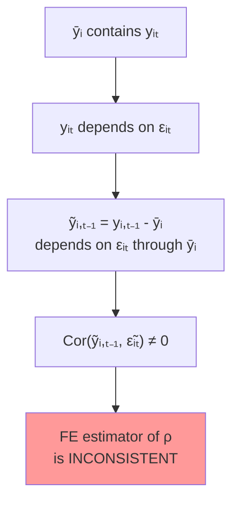
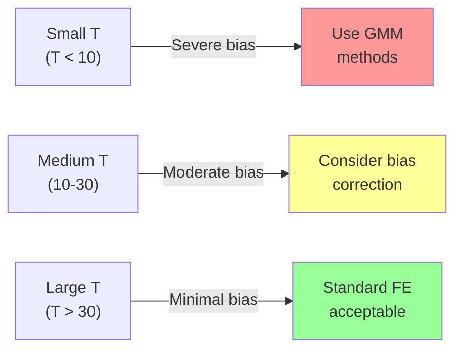
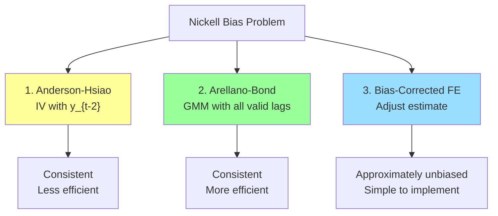
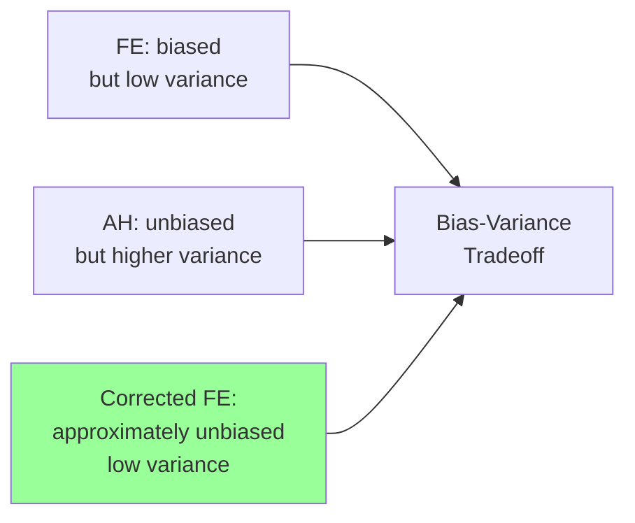

<!-- _class: lead -->

# Nickell Bias
## Dynamic Panel Bias in Fixed Effects

### Module 05 -- Advanced Topics

<!-- Speaker notes: Transition slide. Pause briefly before moving into the nickell bias section. -->
---

# In Brief

When a lagged dependent variable appears in a fixed effects model, the FE estimator is **biased downward** with magnitude $-(1+\rho)/(T-1)$. This bias is severe for short panels.

> Nickell bias is the reason we need GMM for dynamic panels with small T.

<!-- Speaker notes: Read the highlighted quote aloud. This captures the key insight of the slide. -->
---

# The Problem

$$y_{it} = \alpha_i + \rho y_{i,t-1} + X_{it}\beta + \epsilon_{it}$$

After within-transformation:

$$\tilde{y}_{it} = \rho \tilde{y}_{i,t-1} + \tilde{X}_{it}\beta + \tilde{\epsilon}_{it}$$



<!-- Speaker notes: Walk through the diagram from top to bottom. Explain each node and decision point. -->
---

# The Bias Formula

$$E[\hat{\rho}_{FE}] - \rho \approx -\frac{1+\rho}{T-1}$$

Key properties:
- **Always negative** (downward bias)
- **Decreases** as T increases
- **Larger** when true $\rho$ is larger

```
Example: True ρ = 0.5

T = 5:   Bias ≈ -0.375  → FE estimate ≈ 0.125
T = 10:  Bias ≈ -0.167  → FE estimate ≈ 0.333
T = 50:  Bias ≈ -0.031  → FE estimate ≈ 0.469
T = 100: Bias ≈ -0.015  → FE estimate ≈ 0.485
```

<!-- Speaker notes: Take this slowly. Focus on intuition behind each step rather than memorizing the algebra. -->
---

# Bias as a Function of T and $\rho$

```
Nickell Bias Magnitude:
─────────────────────────────────────────────
T     │  ρ=0.3   ρ=0.5   ρ=0.7   ρ=0.9
─────────────────────────────────────────────
  5   │ -0.325  -0.375  -0.425  -0.475
 10   │ -0.144  -0.167  -0.189  -0.211
 20   │ -0.068  -0.079  -0.089  -0.100
 50   │ -0.027  -0.031  -0.035  -0.039
─────────────────────────────────────────────
```



<!-- Speaker notes: Walk through the diagram from top to bottom. Explain each node and decision point. -->
---

# When Is Bias "Acceptable"?

Rule of thumb: bias < 10% of true parameter value.

| $\rho$ | Min T for < 10% bias |
|--------|---------------------|
| 0.3 | 45 |
| 0.5 | 31 |
| 0.7 | 25 |
| 0.9 | 22 |

> For typical micro panels (T = 5-15), Nickell bias is almost always a concern.

<!-- Speaker notes: Review the table row by row. Highlight the most important distinctions. -->
---

<!-- _class: lead -->

# Solutions

<!-- Speaker notes: Transition slide. Pause briefly before moving into the solutions section. -->
---

# Three Approaches



<!-- Speaker notes: Walk through the diagram from top to bottom. Explain each node and decision point. -->
---

# Solution 1: Anderson-Hsiao

Use deeper lags as instruments for the differenced equation.

**First-difference:**
$$\Delta y_{it} = \rho \Delta y_{i,t-1} + \Delta\epsilon_{it}$$

**Instrument:** $y_{i,t-2}$ for $\Delta y_{i,t-1}$

```python
# First stage: Δy_{t-1} on y_{t-2}
first_stage = smf.ols('y_lag_diff ~ y_lag2', data=df).fit()

# Second stage: Δy on fitted Δy_{t-1}
df['y_lag_diff_hat'] = first_stage.fittedvalues
second_stage = smf.ols('y_diff ~ y_lag_diff_hat - 1', data=df).fit()

print(f"First stage F-stat: {first_stage.fvalue:.2f}")
print(f"Estimated ρ: {second_stage.params['y_lag_diff_hat']:.4f}")
```

<!-- Speaker notes: This slide connects the math to implementation. Walk through how the formula maps to code. -->
---

# Solution 2: Arellano-Bond GMM

Uses ALL available lags as instruments (more efficient):

```python
# Create instruments: y_{t-2}, y_{t-3}, ...
for lag in range(2, 5):
    df[f'y_lag{lag}'] = df.groupby('entity')['y'].shift(lag)

# Two-stage estimation with multiple instruments
instruments = [f'y_lag{i}' for i in range(2, 5)]
first_stage = smf.ols(
    f'y_lag_diff ~ {" + ".join(instruments)}', data=df
).fit()

# More instruments → more efficient
# But too many → overfitting risk
```

<!-- Speaker notes: Walk through the code step by step. Highlight the key function calls and explain what each does. -->
---

# Solution 3: Bias-Corrected FE

For moderately large T, a simple correction:

```python
# Standard FE estimate
rho_fe = fe_results.params['y_lag']

# Bias correction (first-order)
T = df.groupby('entity').size().mean()
bias = -(1 + rho_fe) / (T - 1)

# Corrected estimate
rho_corrected = rho_fe - bias

# Example:
#   FE estimate:        0.22
#   Estimated bias:    -0.27
#   Corrected estimate: 0.49  (closer to true 0.5)
```

> Simple but only approximate. Works best for moderate T (15-30).

<!-- Speaker notes: Walk through the code step by step. Highlight the key function calls and explain what each does. -->
---

# Comparing Methods

```
COMPARISON OF ESTIMATORS (True ρ = 0.6, N=100, T=10):
============================================================
Method              Mean Est.   Bias        RMSE
------------------------------------------------------------
FE (biased)         0.425       -0.175      0.183
FE (corrected)      0.582       -0.018      0.062
Anderson-Hsiao      0.597       -0.003      0.118
------------------------------------------------------------
```



<!-- Speaker notes: Walk through the diagram from top to bottom. Explain each node and decision point. -->
---

# Decision Guide

| Scenario | Concern Level | Action |
|----------|--------------|--------|
| T < 10 | High | Use IV/GMM methods |
| 10 < T < 20 | Moderate | Consider bias correction |
| 20 < T < 50 | Low | FE often acceptable |
| T > 50 | Minimal | Standard FE is fine |

<!-- Speaker notes: Walk through the decision tree step by step. Ask students to apply it to a concrete example. -->
---

# Key Takeaways

1. **Nickell bias is always negative** -- FE underestimates persistence

2. **Bias severity depends on T** -- larger T means smaller bias

3. **Anderson-Hsiao** uses lagged levels as instruments for differenced equation

4. **Arellano-Bond GMM** is more efficient with multiple instruments

5. **Bias correction** works for moderate T but is approximate

6. **Rule of thumb**: If T > 20-30, Nickell bias is usually acceptable

> Know your T. Short panels with lagged Y demand specialized methods.

<!-- Speaker notes: Summarize the main points. Ask students which takeaway surprised them most. -->