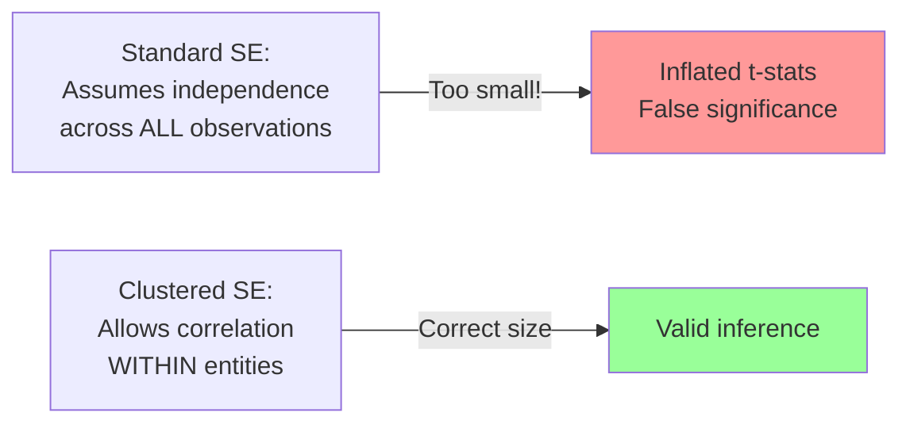
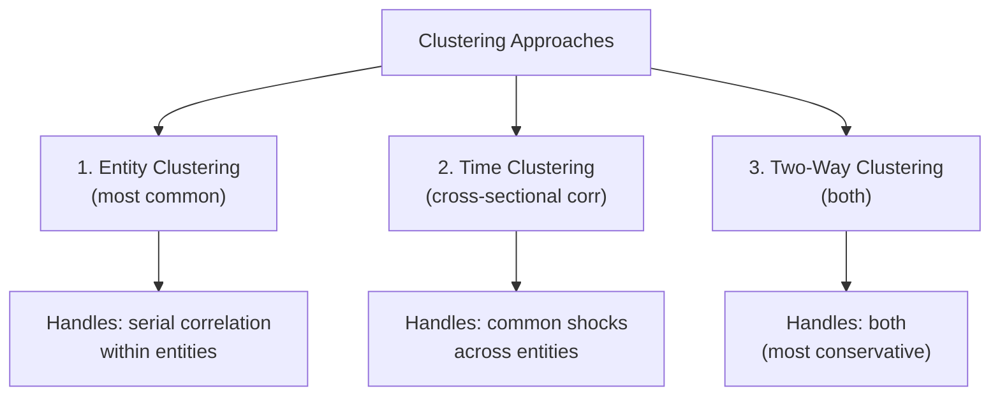
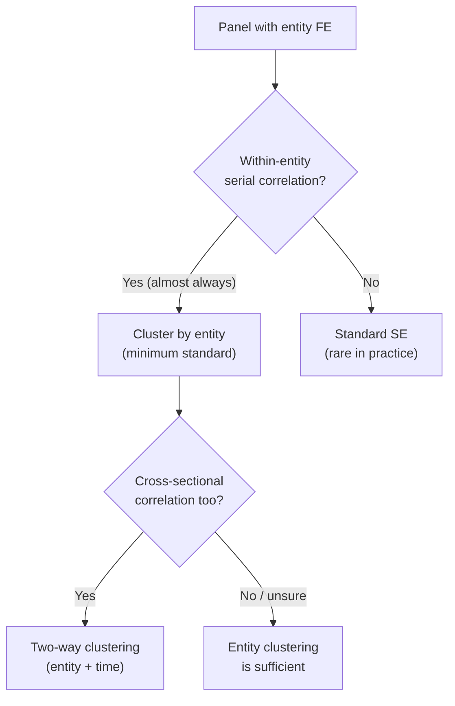
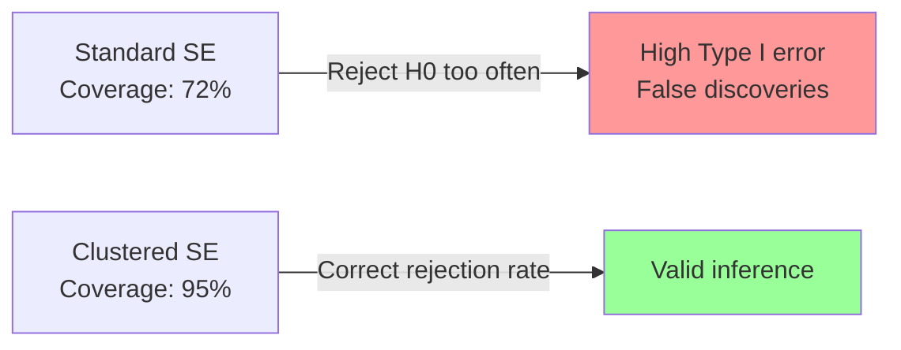
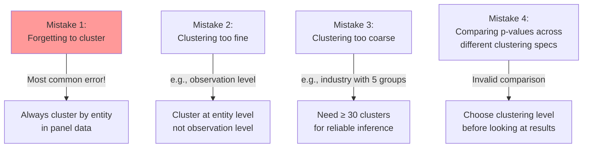

<!-- _class: lead -->

# Clustered Standard Errors
## Getting Inference Right in Panel Data

### Module 05 -- Advanced Topics

<!-- Speaker notes: Transition slide. Pause briefly before moving into the clustered standard errors section. -->
---

# In Brief

Panel data violates the i.i.d. assumption through within-entity correlation and heteroskedasticity. Clustered standard errors correct for this -- **without clustering, your t-statistics are inflated and p-values too small**.

> Forgetting to cluster is the most common mistake in applied panel econometrics.

<!-- Speaker notes: Read the highlighted quote aloud. This captures the key insight of the slide. -->
---

# Why Standard SE Fail

Standard OLS assumes:
$$\text{Var}(\hat{\beta}) = \sigma^2 (X'X)^{-1}$$

With clustering, the "sandwich" estimator:
$$\text{Var}(\hat{\beta}) = (X'X)^{-1} \left(\sum_{g} X_g' \hat{u}_g \hat{u}_g' X_g\right) (X'X)^{-1}$$



<!-- Speaker notes: Walk through the diagram from top to bottom. Explain each node and decision point. -->
---

# The Impact Is Dramatic

```
COMPARISON OF STANDARD ERRORS:
============================================================
Method               SE(β)      t-stat     95% CI Width
------------------------------------------------------------
Standard OLS         0.0142     105.63     0.0558
Robust (HC1)         0.0198      75.76     0.0777
Entity-Clustered     0.1134      13.23     0.4453
------------------------------------------------------------
```

> Clustered SE can be **8x larger** than standard SE. That changes conclusions.

<!-- Speaker notes: Read the highlighted quote aloud. This captures the key insight of the slide. -->
---

<!-- _class: lead -->

# Types of Clustering

<!-- Speaker notes: Transition slide. Pause briefly before moving into the types of clustering section. -->
---

# Three Clustering Approaches



<!-- Speaker notes: Walk through the diagram from top to bottom. Explain each node and decision point. -->
---

# 1. Entity Clustering

The default for panel data. Handles within-entity serial correlation.

```python
# linearmodels
fe = PanelOLS(y, X, entity_effects=True).fit(
    cov_type='clustered',
    cluster_entity=True
)

# statsmodels
ols = smf.ols('y ~ x', data=df).fit(
    cov_type='cluster',
    cov_kwds={'groups': df['entity']}
)
```

**Use when:** Treatment varies at entity level, errors persist within entities.

<!-- Speaker notes: Walk through the code step by step. Highlight the key function calls and explain what each does. -->
---

# 2. Time Clustering

For cross-sectional correlation -- when common shocks affect all entities.

```python
fe = PanelOLS(y, X, entity_effects=True).fit(
    cov_type='clustered',
    cluster_time=True
)
```

**Use when:** Market-wide events affect all firms simultaneously.

<!-- Speaker notes: Walk through the code step by step. Highlight the key function calls and explain what each does. -->
---

# 3. Two-Way Clustering

Handles both within-entity AND cross-sectional correlation.

```python
fe = PanelOLS(y, X, entity_effects=True).fit(
    cov_type='clustered',
    cluster_entity=True,
    cluster_time=True
)
```

**Use when:** Both entity persistence and common shocks present.

> Two-way is the most conservative -- larger SE, less power, but safer inference.

<!-- Speaker notes: Walk through the code step by step. Highlight the key function calls and explain what each does. -->
---

<!-- _class: lead -->

# Choosing the Clustering Level

<!-- Speaker notes: Transition slide. Pause briefly before moving into the choosing the clustering level section. -->
---

# Decision Guide



**Rules of thumb:**
- Panel with entity FE → cluster by entity (minimum)
- Time FE included → still cluster by entity
- Cross-sectional dependence → two-way clustering
- When in doubt → two-way is conservative

<!-- Speaker notes: Walk through the decision tree step by step. Ask students to apply it to a concrete example. -->
---

# Coverage Rate Simulation

```
95% CI COVERAGE RATES (should be 95%):
==========================================
Standard SE:   72.4%  ← Way too narrow!
Robust SE:     81.2%  ← Still too narrow
Clustered SE:  94.8%  ← Correct
```



<!-- Speaker notes: Walk through the diagram from top to bottom. Explain each node and decision point. -->
---

<!-- _class: lead -->

# Practical Considerations

<!-- Speaker notes: Transition slide. Pause briefly before moving into the practical considerations section. -->
---

# How Many Clusters Do You Need?

```
CLUSTER QUALITY ASSESSMENT:
============================================================
Number of clusters    Quality        Recommendation
------------------------------------------------------------
N ≥ 50              Good           Standard clustering OK
30 ≤ N < 50         Acceptable     Use finite-sample corrections
20 ≤ N < 30         Marginal       Consider wild cluster bootstrap
N < 20              Problematic    Wild cluster bootstrap essential
------------------------------------------------------------
```

> With few clusters, standard clustered SE can be **unreliable**.

<!-- Speaker notes: Read the highlighted quote aloud. This captures the key insight of the slide. -->
---

# Cluster Bootstrap (Part 1: Sampling)

For few clusters or unbalanced panels:

```python
def cluster_bootstrap(df, y_col, x_cols,
                      entity_col, n_bootstrap=500):
    entities = df[entity_col].unique()
    N = len(entities)
    bootstrap_estimates = []

    for _ in range(n_bootstrap):
        # Sample CLUSTERS (not observations)
        sampled = np.random.choice(
            entities, size=N, replace=True)
```

<!-- Speaker notes: Walk through the code step by step. Highlight the key function calls and explain what each does. -->
---

# Cluster Bootstrap (Part 2: Estimation)

```python
        # Build bootstrap sample from selected clusters
        df_boot = pd.concat([
            df[df[entity_col] == e].assign(
                **{entity_col: idx})
            for idx, e in enumerate(sampled)
        ])

        result = smf.ols(
            f'{y_col} ~ {" + ".join(x_cols)}',
            data=df_boot).fit()
        bootstrap_estimates.append(
            result.params[x_cols[0]])

    return np.std(bootstrap_estimates)  # Bootstrap SE
```

<!-- Speaker notes: Walk through the code step by step. Highlight the key function calls and explain what each does. -->
---

# Common Mistakes



<!-- Speaker notes: Emphasize that these are mistakes seen in practice, not just theory. Ask if anyone has encountered common mistakes. -->
---

# Practical Recommendations

1. **Default:** Always cluster by entity in panel data
2. **Minimum clusters:** Aim for N $\geq$ 50 (at least 30)
3. **Implementation:**
   - `linearmodels`: `cluster_entity=True`
   - `statsmodels`: `cov_type='cluster', cov_kwds={'groups': entity}`
4. **Reporting:** Always state the clustering level and number of clusters
5. **Robustness:** Show results with alternative clustering as sensitivity
6. **Few clusters:** Use wild cluster bootstrap

<!-- Speaker notes: Explain the key concepts on this slide. Check for questions before moving on. -->
---

# Key Takeaways

1. **Always cluster** standard errors in panel data -- it is the default

2. **Entity clustering** handles within-entity serial correlation

3. **Two-way clustering** is more conservative, handles cross-sectional correlation too

4. **Minimum clusters**: Need ~30+ for reliable inference

5. **Bootstrap** helps with few clusters or unbalanced panels

6. **Report clustering** -- it affects inference significantly

> Standard errors are not a detail. They determine whether your findings are real or noise.

<!-- Speaker notes: Summarize the main points. Ask students which takeaway surprised them most. -->