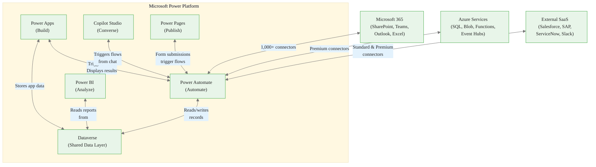
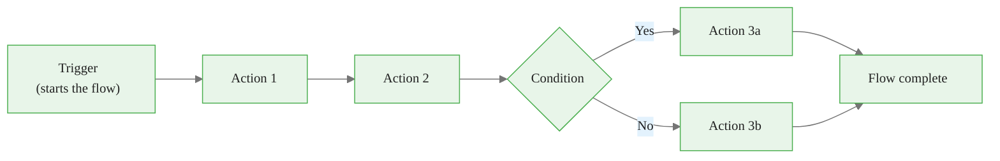
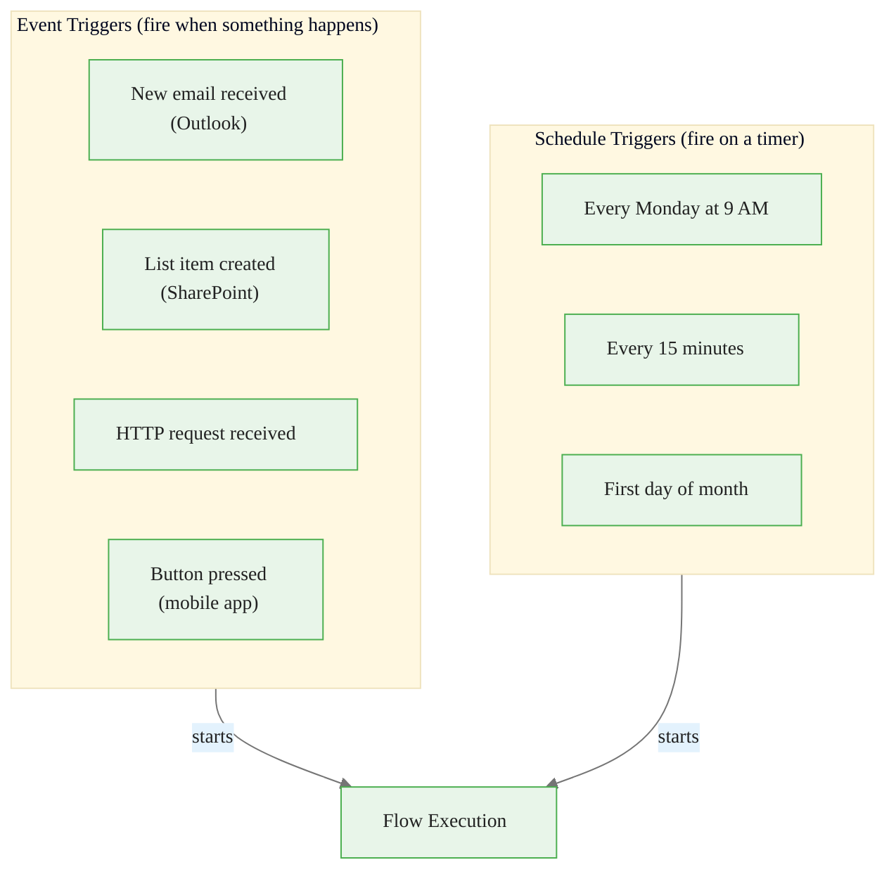
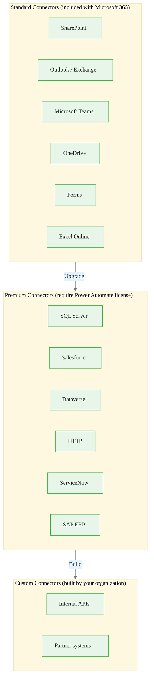
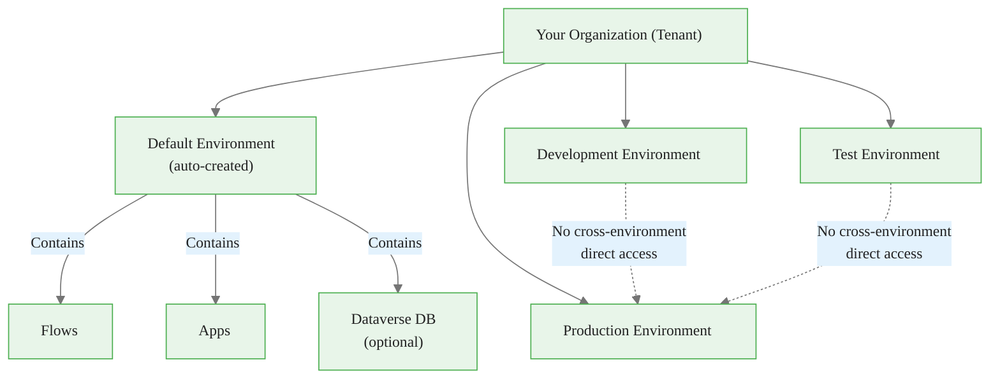
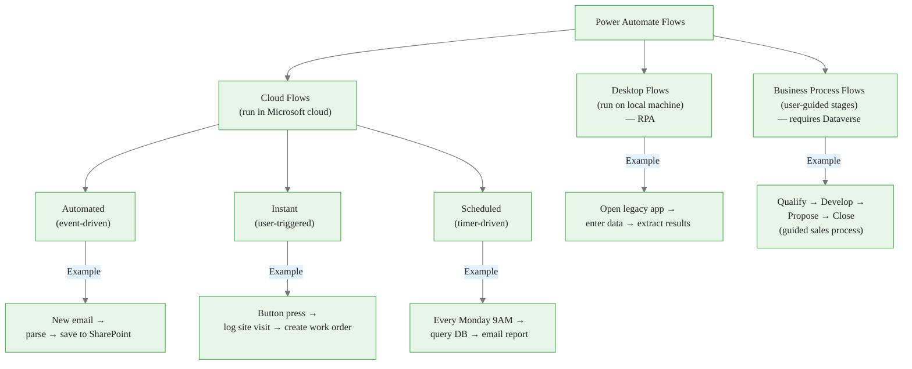
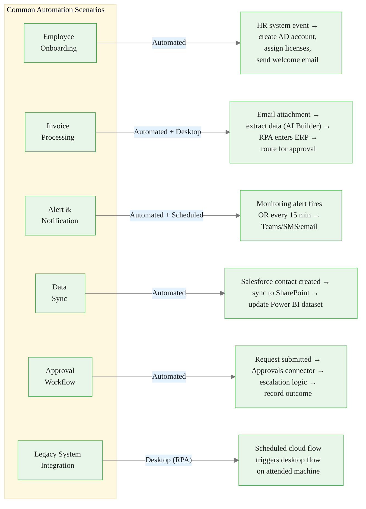
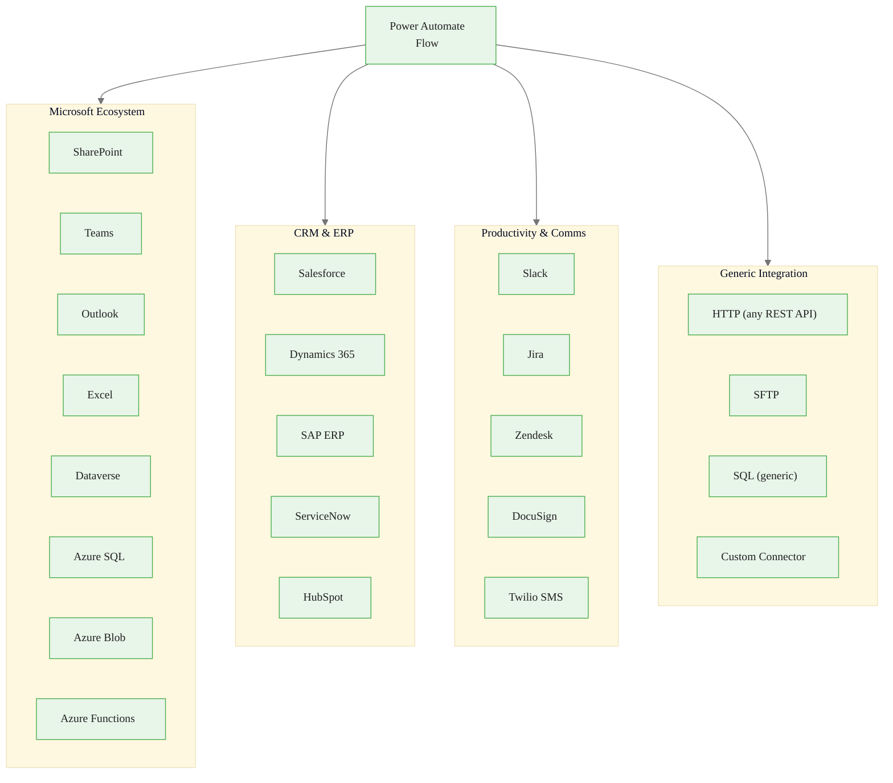

<!-- _class: lead -->

# Microsoft Power Automate
## Platform Overview

**Module 00 — Platform Orientation**

> Power Automate is the automation backbone of the Microsoft Power Platform — connecting over 1,000 apps and services through a low-code workflow engine.

<!-- Speaker notes: Welcome learners to Module 00. This module is the foundation for everything that follows. Three goals for this deck: (1) position Power Automate inside the broader Power Platform, (2) establish the core vocabulary every subsequent module assumes, and (3) show the five flow types so learners can immediately recognize which type a given problem calls for. No hands-on work in this deck — the notebook and exercise handle that. -->

---

# What Is Power Automate?

**Power Automate** is a cloud-based workflow automation service that connects applications and services through event-driven logic — without requiring traditional software development.

| It replaces... | With... |
|---|---|
| Manual copy-paste between systems | Automated data sync |
| Chasing approvals via email | Structured approval workflows |
| Manually running reports | Scheduled automation |
| Swivel-chair legacy app work | Desktop (RPA) flows |

> **Core idea:** When *something happens* in one system, Power Automate can *do something* in another system — automatically.


<div class="callout-insight">
<strong>Insight:</strong> This is a key takeaway from this section that connects to the broader course themes.
</div>

<!-- Speaker notes: Emphasize the "no-code/low-code" positioning carefully. Power Automate does support expressions and code blocks, so it is more accurate to call it "low-code" — especially by Module 03 when learners encounter Power Fx and dynamic content. The table on this slide gives learners an immediate mental model for what problem space this tool occupies. Ask: "What manual, repetitive tasks do you do every week?" — that is the target for automation. -->

---

# The Power Platform Ecosystem




<div class="callout-key">
<strong>Key Point:</strong> Remember this concept — it appears repeatedly in later modules.
</div>

<!-- Speaker notes: Walk through this diagram slowly. The key insight is that Power Automate is rarely used in isolation — it is the automation glue between tools. The three clouds at the bottom (M365, Azure, External SaaS) represent the real-world integration targets. Dataverse at the center of the Power Platform cluster is the shared brain. A common exam/interview question: "Which Power Platform product would you use to…" — knowing this diagram makes those questions straightforward. -->

---

# Power Platform: Each Product's Role

| Product | Question It Answers | Typical Output |
|---|---|---|
| **Power Apps** | "What should users interact with?" | Custom web/mobile app |
| **Power Automate** | "What should happen automatically?" | Automated workflow |
| **Power BI** | "What does the data tell us?" | Dashboards and reports |
| **Copilot Studio** | "How should AI answer questions?" | Conversational chatbot |
| **Power Pages** | "What should external users see?" | Public-facing website |
| **Dataverse** | "Where does the data live?" | Shared relational store |

All five products share: **authentication**, **environments**, **connectors**, and **DLP policies**.


<div class="callout-warning">
<strong>Warning:</strong> This is a common source of confusion. Pay close attention to the distinction here.
</div>

<!-- Speaker notes: The "question it answers" column is the most useful mental model. When a business stakeholder describes a problem, map their description to one of these questions. If they say "we need people to fill in a form," that is Power Apps. If they say "and then something should happen automatically," that is Power Automate. These tools complement rather than compete. A single business solution often uses three or four of them together. -->

---

<!-- _class: lead -->

# Core Vocabulary

> Five terms appear in every Power Automate conversation. Master these before building anything.

<!-- Speaker notes: Vocabulary precision matters enormously in Power Automate. Learners who confuse "connector" with "connection" or "trigger" with "action" will struggle to read documentation, interpret error messages, and communicate with colleagues. Spend real time on these five terms. -->

---

# Term 1: Flow

A **flow** is the fundamental unit of automation in Power Automate. It defines:
- The **event** that starts execution (trigger)
- The **steps** that run in response (actions)
- The **conditions** that control branching



Think of a flow as a **recipe**: the trigger is the starting gun, actions are the steps, conditions are the decision points.


<div class="callout-info">
<strong>Info:</strong> This detail is useful context but not required to memorize.
</div>

<!-- Speaker notes: The recipe analogy works well for beginners. A more technical analogy for those with programming backgrounds: a flow is an event handler function. The trigger is the event listener, and actions are the function body. Flows are stateless by default — each run is independent. State can be stored in Dataverse, SharePoint, or variables within a single run. -->

---

# Term 2: Trigger

A **trigger** is the event that starts a flow. Every flow has exactly one trigger.



**Critical rule:** You cannot change a flow's trigger type after creation. Design the trigger correctly upfront.

<!-- Speaker notes: The "cannot change trigger" rule surprises many learners. Emphasize it. In practice, if you realize you chose the wrong trigger type, you must clone the flow and rebuild from the trigger. Some experienced users keep a "flow skeleton" for each trigger type to avoid this pain. Also note: triggers have their own configuration options — for example, a SharePoint trigger can be scoped to a specific list, filtered by column values, etc. -->

---

# Term 3: Action

An **action** is a single operation the flow performs after the trigger fires.

| Category | Example Actions |
|---|---|
| **Communication** | Send email, Post Teams message, Send SMS |
| **Data** | Create row, Update record, Get file content |
| **Control** | Condition (if/else), Apply to each (loop), Scope |
| **Integration** | HTTP request, Parse JSON, Run child flow |
| **AI** | Classify text, Extract entities, Generate content |

Actions run **sequentially** by default. Parallel branches and loops are available as control actions.

> Actions from different connectors can be freely mixed in a single flow.

<!-- Speaker notes: Point out that the "Control" category actions are built-in to Power Automate — they are not connector-specific. Condition, Apply to each, Do until, Scope, and Switch are the primary control flow primitives. More advanced learners will ask about parallel branches — yes, they exist, but introduce them in Module 04. The AI category is growing rapidly; the AI Builder integration gives access to prebuilt models without any ML expertise. -->

---

# Term 4: Connector

A **connector** is a prebuilt adapter that wraps an external service's API and exposes its triggers and actions as named operations.

```mermaid
%%{init: {"theme": "base", "themeVariables": {"primaryColor": "#e8f5e9", "primaryBorderColor": "#4caf50", "primaryTextColor": "#212121", "secondaryColor": "#e3f2fd", "tertiaryColor": "#fff8e1", "lineColor": "#757575", "fontFamily": "Inter, sans-serif", "fontSize": "14px"}}}%%
graph LR
    subgraph PA["Power Automate"]
        FLOW["Your Flow"]
    end

    subgraph Connector["SharePoint Connector"]
        T["Trigger:\nWhen item created"]
        A["Action:\nCreate item"]
        U["Action:\nUpdate item"]
        G["Action:\nGet items"]
    end

    subgraph SP["SharePoint Online"]
        API["REST API\n/_api/lists"]
    end

    FLOW --> T
    FLOW --> A
    FLOW --> U
    FLOW --> G
    T <-->|"Handles auth,\nretry, throttling"| API
    A <-->|"Translates\noperations"| API
    U <-->|"to REST\ncalls"| API
    G <-->|""| API
```

Microsoft ships **1,000+ connectors**. The connector handles authentication, rate limiting, and API versioning — you never write HTTP calls directly (unless you want to).

<!-- Speaker notes: The connector abstraction is enormously valuable — it means learners do not need to understand OAuth flows, API versioning, or retry logic. The connector handles all of that. However, understanding what is happening underneath helps when things go wrong (throttling errors, authentication expiry, etc.). The 1,000+ number is current as of early 2025 and grows regularly. Custom connectors allow organizations to wrap their own internal APIs using an OpenAPI spec. -->

---

# Connector Tiers



> **On screen:** A diamond icon on a connector tile in `Data > Connectors` indicates it is a Premium connector requiring an upgraded license.

<!-- Speaker notes: The licensing implications are real-world critical. Many organizations start with Standard connectors (free with M365) and discover a key integration requires a Premium connector — triggering a license procurement process. Knowing the tiers upfront helps learners design automations within their organization's current license posture and make the business case for upgrades when needed. The HTTP connector being Premium is especially notable — it means any custom REST call requires a Premium license. -->

---

# Term 5: Environment

An **environment** is an isolated container holding flows, apps, connections, and data.



Environments are the primary **security and governance boundary**. Each has its own DLP policies, maker permissions, and Dataverse database.

<!-- Speaker notes: The environment model is where Power Automate governance gets serious. Organizations that skip environment planning end up with all automation in the Default environment — no separation between dev/test/prod, no DLP boundaries, shared connections across teams. Best practice is at least three environments: Development, Test, Production. Learners who go on to admin roles will spend significant time managing environments and DLP policies. The environment selector in the portal top-right corner is something to point out during any live demo. -->

---

<!-- _class: lead -->

# Flow Types

> Five types. Each solves a different problem. Choosing the wrong type is the most common beginner mistake.

<!-- Speaker notes: This is arguably the most decision-critical slide in Module 00. The flow type determines trigger availability, execution model, licensing requirements, and deployment complexity. Before learners build anything, they need to answer: "Which type is this?" Run through each type quickly here; the guide document has full details. -->

---

# Flow Types Taxonomy



<!-- Speaker notes: Use this diagram to teach the decision tree. First question: does it run in the cloud or on a local machine? If it touches desktop apps with no API, it is a Desktop flow. If everything is cloud-accessible, it is a cloud flow. Second question for cloud flows: what starts it? An event → Automated. A user action → Instant. A timer → Scheduled. Business Process Flows are the odd one out — they are user-facing UI overlays rather than background processes, and they require Dataverse. -->

---

# Choosing the Right Flow Type

| Scenario | Flow Type | Why |
|---|---|---|
| New SharePoint row should send a Teams message | **Automated** | Event-driven, cloud-to-cloud |
| Field tech taps a button to log a visit | **Instant** | User-initiated, on-demand |
| Weekly exception report every Monday | **Scheduled** | Timer-driven, batch |
| Enter data into a local Windows desktop app | **Desktop (RPA)** | No API available |
| Guide sales team through a 4-stage process | **Business Process** | Human-driven, stage-gated |

> **Rule:** If the trigger is an event → Automated. If a user → Instant. If a clock → Scheduled. If a desktop app with no API → Desktop.

<!-- Speaker notes: Walk through each row. The "why" column is the reasoning learners should internalize. Present a few more scenarios verbally and ask learners to call out the type — this is a great quick-check activity. Common traps: learners try to use Scheduled flows for event-driven work (polling instead of push), which wastes run quota and adds latency. Also: Instant flows can be triggered from Power Apps, which confuses learners who think Power Apps "runs" the automation — it triggers the Instant flow, which then runs independently. -->

---

# Real-World Use Case Map



<!-- Speaker notes: This diagram shows that real-world solutions often combine multiple flow types. The invoice processing example is particularly common in enterprise — it mixes an Automated cloud flow (catching the email) with AI Builder (extracting invoice fields) with a Desktop flow (entering data into an ERP that has no API). Approval workflows are one of the most-requested automations in any organization — Power Automate's built-in Approvals connector handles the full lifecycle cleanly. -->

---

# Connector Ecosystem Overview



<!-- Speaker notes: The breadth of the connector ecosystem is a key selling point. When a learner asks "can it connect to X?" — the answer is almost always yes, either through a named connector or the generic HTTP connector (which can call any REST API). The Custom Connector path means learners can wrap any internal system. A practical exercise: have learners search for their organization's key business systems in the connector gallery and identify which tier they fall into. -->

---

# Module 00 Summary

**What you now know:**

1. Power Automate is the automation layer of the Microsoft Power Platform, sharing Dataverse, environments, and connectors with Power Apps, Power BI, Copilot Studio, and Power Pages.

2. Every flow has a **trigger** (one event that starts it) and **actions** (steps that execute in response).

3. **Connectors** wrap external APIs — 1,000+ available in Standard, Premium, and Custom tiers.

4. **Environments** are isolated security boundaries — use Dev/Test/Prod separation from the start.

5. There are five flow types — Automated, Instant, Scheduled, Desktop, and Business Process — each suited to a different problem pattern.

**Next:** Module 01 — Building your first automated cloud flow end-to-end.

<!-- Speaker notes: Close by asking learners to name one automation they would build with what they know now. Even at this early stage, learners should be able to say "I would use an Automated flow triggered by SharePoint to send a Teams notification." That level of design fluency is the goal of Module 00. The notebook (01_power_automate_overview.ipynb) will show them how to interact with flows programmatically via the Graph API — a powerful perspective that most no-code learners never encounter. -->

---

<!-- _class: lead -->

# Up Next: Navigating the Portal

**Guide 02** walks through every section of `make.powerautomate.com` — licensing tiers, environment management, and the connector marketplace.

> Open the portal now at `make.powerautomate.com` and follow along with Guide 02.

<!-- Speaker notes: Encourage learners to have the portal open as they work through Guide 02. The portal UI changes frequently — Microsoft ships updates regularly — so some screenshots in third-party materials may be outdated. The guide uses menu paths and UI descriptions rather than screenshots for this reason. The official Microsoft documentation at learn.microsoft.com/power-automate is always the authoritative reference for current UI. -->
