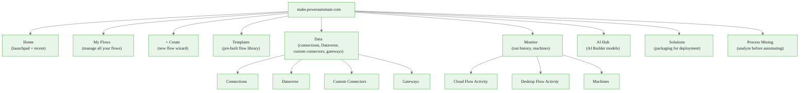
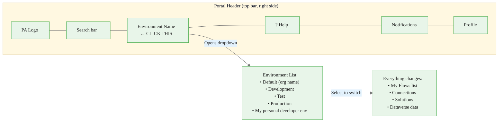
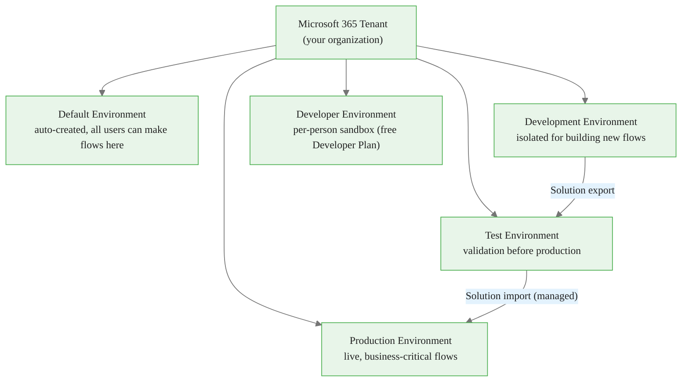
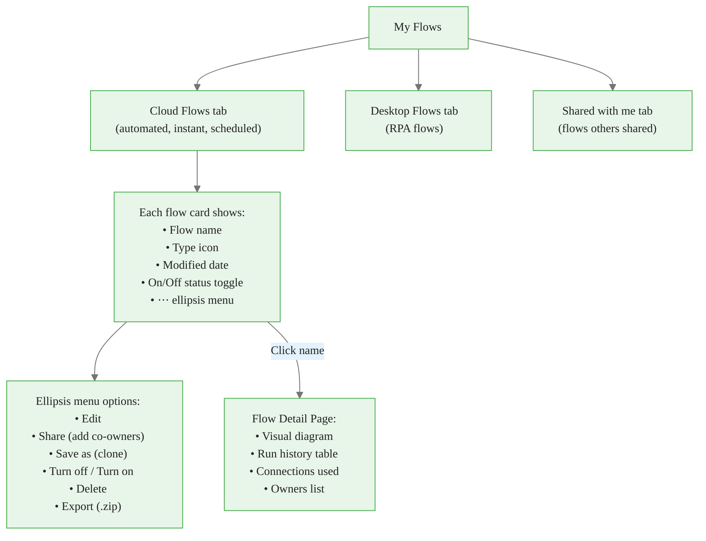
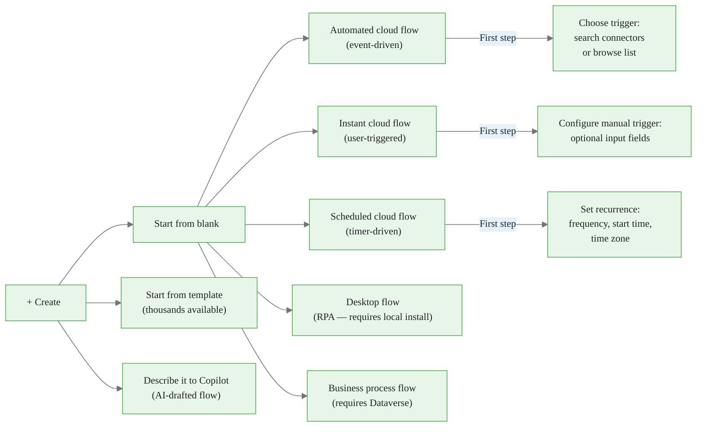
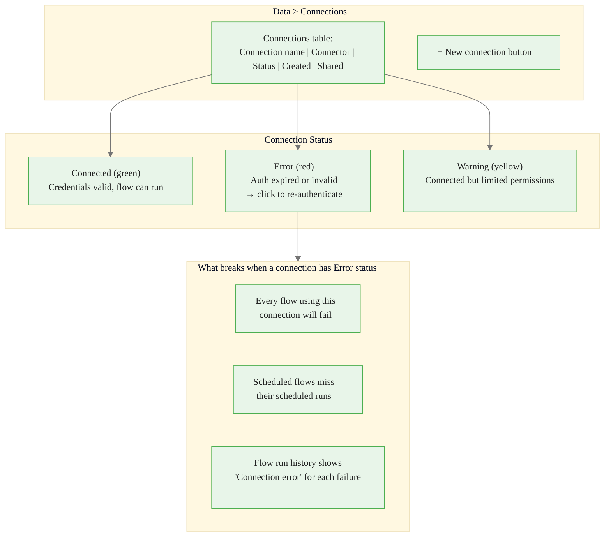
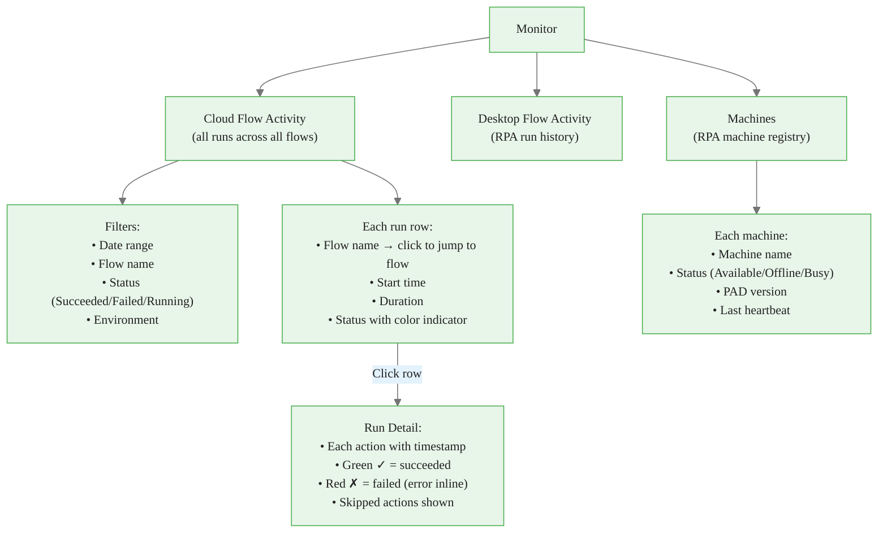
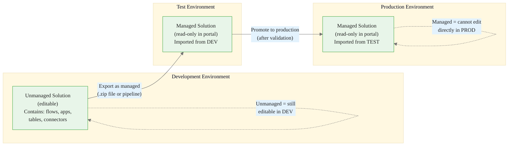
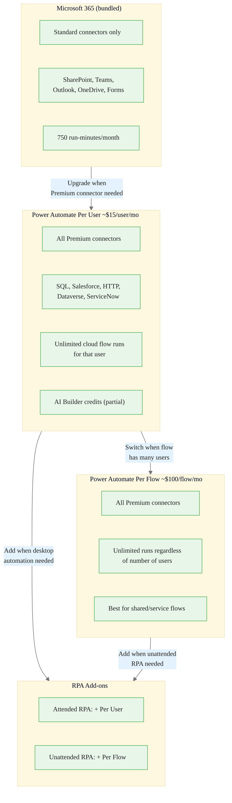

<!-- _class: lead -->

# Navigating the Power Automate Portal

**Module 00 — Platform Orientation**

> `make.powerautomate.com` — your primary workspace for building, managing, and monitoring flows.

<!-- Speaker notes: This deck accompanies Guide 02. Its job is to give learners a mental map of the portal before they start clicking around. The portal changes frequently — Microsoft ships weekly updates — so emphasize that the concepts and purposes of each section are stable even if button labels or icon positions shift. Encourage learners to have the portal open during this deck so they can follow along in real time. -->

---

# Portal Navigation Structure

<strong>Insight:</strong> This is a key takeaway from this section that connects to the broader course themes.

<!-- Speaker notes: This is the site map. Point out that the hierarchy goes: portal → section → sub-section. The most frequently used sections for a flow maker are Create, My Flows, Monitor, and Data > Connections. Solutions become important from Module 01 onward when we adopt ALM-first practices (always build inside a solution). Process Mining and AI Hub are module-specific — Desktop Flows (Module 07) and Copilot Agents (Module 09) respectively. -->

---

# The Environment Selector: Check This First

> **Rule:** Before asking "where is my flow?", check which environment you are in. Flows in Environment A are invisible when you are in Environment B.

<strong>Key Point:</strong> Remember this concept — it appears repeatedly in later modules.

<!-- Speaker notes: The environment selector is the single most overlooked UI element for new learners. I recommend making this a ritual: every time you open the portal, glance at the environment name in the top right. It is highlighted in yellow on this diagram for that reason. The most common support question is "I can't find my flow" — 80% of the time, the user is in the wrong environment. -->

---

# Environment Hierarchy

**Best practice:** Never build production flows in the Default environment. Default has no isolation, no promotion path, and everyone in the tenant can see everything.

<strong>Warning:</strong> This is a common source of confusion. Pay close attention to the distinction here.

<!-- Speaker notes: The Dev → Test → Prod pipeline shown here is the ALM (Application Lifecycle Management) pattern Microsoft recommends. Solutions are the vehicle for this promotion. Flows built outside solutions cannot be cleanly promoted — they must be exported as packages (which is fragile) or rebuilt. This is why Module 01 immediately teaches building inside a solution. The Default environment is fine for personal productivity automations but should never be used for business-critical processes. -->

---

# My Flows: Managing Your Automations

<strong>Info:</strong> This detail is useful context but not required to memorize.

<!-- Speaker notes: The status toggle (On/Off) on each flow card is important — it lets you disable a flow without deleting it. This is useful during maintenance windows or when a connected system is down. The "Save as" (clone) option is used constantly — when building a new flow similar to an existing one, clone and modify rather than starting from blank. The Flow Detail page's run history is the first stop for debugging: click any failed run to see exactly which action failed and why. -->

---

# Create: Choosing a Starting Point

<!-- Speaker notes: Walk through the decision: what starts this flow? Event → Automated. User action → Instant. Clock → Scheduled. Local desktop app → Desktop. Human-guided stage process → Business Process Flow. The Copilot drafting option is interesting — it generates a plausible flow structure from a text description, but always requires review and cleanup before production use. It is best thought of as a fast first draft. The template route is great for common scenarios like "send approval when a SharePoint item is created" — the template handles the wiring, you just fill in specifics. -->

---

# Data > Connections: The Most Important Management Page

> **First debug step:** When flows start failing, check `Data > Connections` before anything else.

<!-- Speaker notes: Connection errors are the most common operational issue. OAuth tokens expire (typically 90 days for Microsoft connections, shorter for some third-party connectors). Service account passwords change. API keys rotate. When this happens, all flows using that connection fail simultaneously — which is why the Monitor section shows spikes of failures. The fix is simple: go to the connection, click it, and re-authenticate. But learners need to know where to find this page. Emphasize: fix the connection, do not recreate the flow. -->

---

# Monitor: Your Operational Dashboard

<!-- Speaker notes: The Cloud Flow Activity view is underused by beginners. It lets you see all flow runs across all your flows in one place — invaluable for spotting patterns. If five different flows all failed at 2:47 AM on the same day, something external happened (service outage, gateway went offline, etc.) — you would never spot that by looking at individual flows. Run Detail is the debugging workhorse: expand each failed action to see the exact error message, the input it received, and what output it tried to produce. This is often enough to diagnose and fix the issue without any external tools. -->

---

# Solutions: The Right Way to Deploy Flows

> Build every flow inside a solution. Flows outside solutions cannot be cleanly promoted across environments.

<!-- Speaker notes: The solution-first approach is a habit to build from day one. The cost of creating a solution before starting work is 30 seconds. The cost of not using solutions — having to manually recreate flows in production or use fragile package exports — is hours of work and risk. Managed solutions (imported into Test and Prod) protect production from accidental edits. If someone tries to open a managed flow to edit it in the production portal, they cannot — which is the point. Changes go through the DEV environment and the promotion pipeline. -->

---

# Licensing Tiers Comparison

<!-- Speaker notes: Licensing is a real constraint in every organization. Learners will encounter "you need a premium license" messages in the portal. This diagram gives them the mental model for why and what to do about it. The M365 bundled access is often sufficient for personal productivity automations using only Microsoft 365 apps. The moment you need SQL Server, Salesforce, HTTP calls, or Dataverse, you need Per User or Per Flow. Per Flow is cost-effective when a flow is triggered by many users (e.g., a shared approval flow in a 500-person department) — paying once for the flow rather than once per user. Always check current pricing at powerautomate.microsoft.com/pricing. -->

---

# Module 00 Portal Navigation Summary

**Five pages to know before building anything:**

| Page | Why You Need It |
|---|---|
| Environment selector (top right) | Know which environment you are in |
| `My Flows` | Find, manage, enable/disable flows |
| `+ Create` | Start new flows (blank or from template) |
| `Data > Connections` | Debug authentication failures |
| `Monitor > Cloud Flow Activity` | Diagnose run failures across all flows |

**And one workflow to follow from day one:**
`Solutions` → New Solution → Create flows inside it → Export managed to Test → Promote to Production

<!-- Speaker notes: This summary slide is the takeaway. Five pages, one workflow. Before the next module, encourage learners to navigate to each of these five pages in their own portal and take 60 seconds to read what is there. Familiarity with the portal layout reduces cognitive load during hands-on modules — learners can focus on the flow logic rather than hunting for menu items. The Solutions workflow will become automatic by Module 02. -->

---

<!-- _class: lead -->

# Ready to Build

You now have the vocabulary (Guide 01) and the navigation map (Guide 02).

**Module 01** puts both to work: you will build a complete automated cloud flow end-to-end — inside a solution, with a real trigger, real actions, and real error handling.

> Open `make.powerautomate.com`, verify your environment, and proceed to the Module 01 notebook.

<!-- Speaker notes: The transition to Module 01 is a significant step — from orientation to hands-on building. Remind learners that it is normal to feel uncertain at this point. The goal of Module 00 was not to make them experts but to give them enough context that the Module 01 steps make sense. Every term they encounter in the flow designer — trigger, action, connector, connection, environment — was defined in this module. When in doubt, return to Guide 01 for the definition. -->
