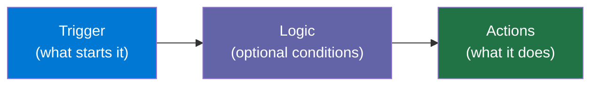
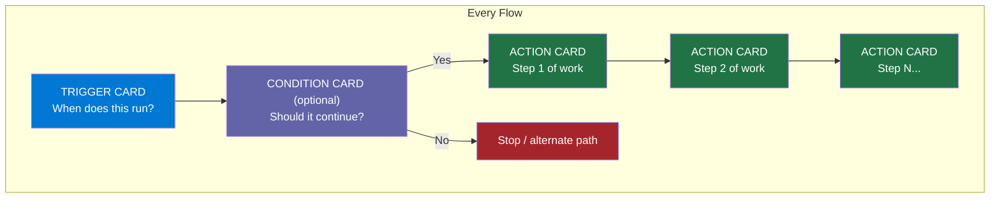
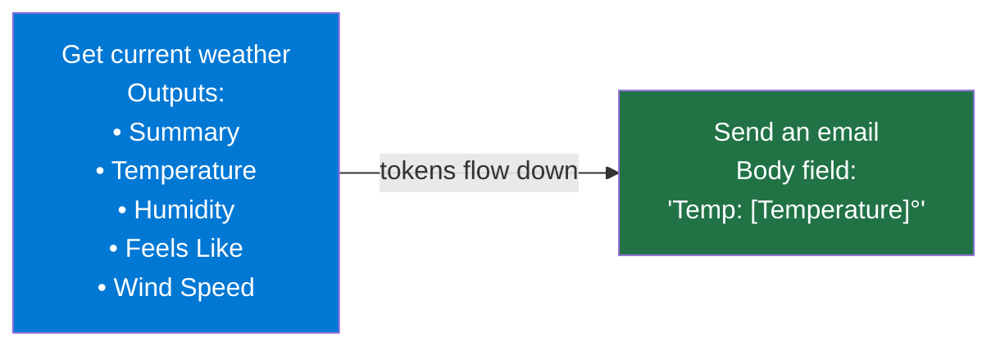
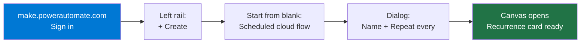
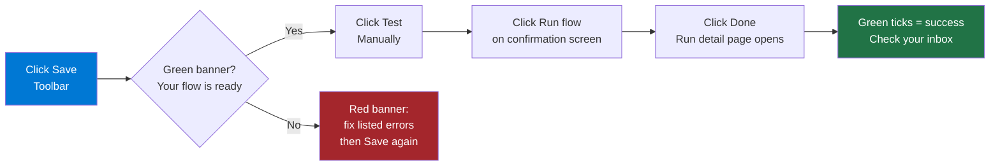

<!-- _class: lead -->

# Your First Cloud Flow

**Module 01 — Power Automate for Beginners**

> Every automation starts with the same three parts: a trigger, optional logic, and actions. Master this pattern and you can automate almost anything.

<!--
Speaker notes: Welcome learners to Module 01. Set expectations: by the end of this deck they will understand how a flow is structured, where to find each part in the designer, and have seen a complete working example built step by step. No prior Power Automate experience is assumed.
-->

---

# What Is a Cloud Flow?

A cloud flow is a sequence of automated steps that runs on Microsoft's servers — no infrastructure to manage.



**Three core concepts:**

| Part | Role | Example |
|------|------|---------|
| Trigger | The event that fires the flow | A button press, a schedule, a new email |
| Logic | Conditions and loops | "Only if attachment is PDF" |
| Actions | The work performed | Send email, create file, post to Teams |

<!--
Speaker notes: Emphasise that the trigger-logic-action model is universal. Every single flow the learner ever builds follows this pattern. Point to real-world analogies: a smoke detector (trigger) checks if smoke is present (logic) then sounds an alarm (action). Keep this slide brief — the diagram does the heavy lifting.
-->

---

# Anatomy of a Flow



Cards are stacked vertically on the canvas. Each card is collapsible — click to expand and configure, click again to collapse.

<!--
Speaker notes: Walk through each card type. Trigger cards are always first and there is exactly one per flow. Condition cards create branches. Action cards can be chained indefinitely. Point out the stop/alternate path — this is where error handling and "do nothing" branches live. Learners will build the condition card in Module 04.
-->

---

<!-- _class: lead -->

# The Flow Designer Canvas

<!--
Speaker notes: Transition slide. The next three slides break down the canvas layout in detail. Learners who know where every button lives will be faster and less frustrated when building their first flow. Ask learners to open make.powerautomate.com alongside this presentation if they can.
-->

---

# Canvas Layout Overview

```
┌──────────────────────────────────────────────────────────────────┐
│  TOOLBAR:  [← Back]  [Save]  [Test]  [Flow Checker]  [New step] │
├─────────────────┬────────────────────────────────────────────────┤
│                 │                                                 │
│   LEFT RAIL     │                CANVAS (centre)                 │
│                 │   ┌──────────────────────────────┐             │
│  + Create       │   │  TRIGGER CARD                │             │
│  My flows       │   │  Recurrence — every 1 day    │             │
│  Templates      │   └──────────────┬───────────────┘             │
│  Connectors     │                  │                              │
│  Monitor        │   ┌──────────────▼───────────────┐             │
│                 │   │  ACTION CARD                 │             │
│                 │   │  Get current weather         │             │
│                 │   └──────────────┬───────────────┘             │
│                 │                  │                              │
│                 │   ┌──────────────▼───────────────┐             │
│                 │   │  ACTION CARD                 │             │
│                 │   │  Send an email (V2)          │             │
│                 │   └──────────────────────────────┘             │
│                 │                                                 │
│                 │   [+ New step]                                  │
└─────────────────┴────────────────────────────────────────────────┘
```

<!--
Speaker notes: Orient learners to the three regions: the left rail for navigation, the toolbar for flow-level operations, and the canvas for assembling steps. The canvas is where they will spend most of their time. The left rail does not change as steps are added — it is always the global navigation. Toolbar buttons apply to the whole flow, not individual steps.
-->

---

# Toolbar Deep Dive

| Button | What it does | When to use it |
|--------|-------------|----------------|
| **Save** | Persists the current state | After every significant change |
| **Test** | Runs the flow immediately (bypasses schedule) | After saving, to verify logic |
| **Flow Checker** | Scans for missing required fields | Before testing — catches config errors |
| **New step** | Opens the connector/action search panel | When adding the next action |
| **← Back** | Returns to My flows list | After saving — navigates away |

> Always click **Save** before **Test**. The test runs the last saved version, not what is currently on screen.

<!--
Speaker notes: The Save-before-Test rule trips up almost every beginner. Write it on a sticky note. Flow Checker is underused — it catches 90% of "why didn't it work?" issues before the learner even runs the flow. Demonstrate that clicking New step opens a search panel on the right-hand side of the canvas, not a new page.
-->

---

# Dynamic Content Panel

When you click inside any text field in an action card, a **dynamic content panel** appears. It lists all outputs from every upstream step.



**How it works at runtime:**

1. Power Automate runs the weather action and captures its outputs
2. Each output becomes a named token (shown in the panel as a pill)
3. Downstream actions substitute the token for the real value

Only outputs from steps that are **above** the current card appear in the panel.

<!--
Speaker notes: Dynamic content is the glue of Power Automate. Every learner struggles with it at first. Key point: you cannot use an output from step 5 inside step 3 — data only flows downward. The pills are colour-coded by the connector that produced them, making it easy to find the right token. Walk through the weather-to-email example explicitly: the word "Temperature" in the email body gets replaced with "72" (or whatever the real temperature is) every time the flow runs.
-->

---

<!-- _class: lead -->

# Building: Daily Weather Email

**The complete step-by-step walkthrough**

<!--
Speaker notes: Now we build. This is the hands-on section. Learners should follow along in a second browser tab if possible. The flow we are building: a scheduled cloud flow that calls MSN Weather and emails the result to the learner's own inbox. It uses two connectors — MSN Weather (free, no auth) and Office 365 Outlook (requires M365 work/school account). Total build time is approximately 10 minutes.
-->

---

# Step 1 & 2 — Create the Flow



**Dialog values to enter:**

| Field | Value |
|-------|-------|
| Flow name | `Daily Weather Email` |
| Repeat every | `1` `Day` |
| Starting | Today (leave default) |

> **On screen:** Home → + Create → Scheduled cloud flow → fill dialog → Create

<!--
Speaker notes: Walk learners through the exact click path. The "Scheduled cloud flow" option is in the "Start from blank" row at the top of the Create page — it is not a template. After clicking Create the canvas opens immediately with a Recurrence card already placed. No further action needed for the trigger type — just configure the time.
-->

---

# Step 3 — Configure the Recurrence Trigger

> **On screen:** Click the **Recurrence** card to expand it. Set **At these hours** to `8`.

```
┌─────────────────────────────────────────┐
│  Recurrence                          ▲  │
│  ─────────────────────────────────────  │
│  Interval:    [ 1      ]                │
│  Frequency:   [ Day    ]                │
│  Time zone:   [ UTC    ]                │
│  At these hours: [ 8   ]  ← type this  │
│  At these minutes: [ 00 ]               │
└─────────────────────────────────────────┘
```

Setting **At these hours** to `8` schedules the flow for 8:00 AM in the selected time zone. The default (empty) means midnight.

<!--
Speaker notes: The "At these hours" field accepts a comma-separated list: "8,12,17" would run three times a day. For this exercise, one value is enough. Remind learners to check their time zone — if left at UTC and the learner is in a different zone, the email will arrive at an unexpected hour. They can change this later without rebuilding the flow.
-->

---

# Step 4 — Add MSN Weather Action

> **On screen:** Click **+ New step** → search `MSN Weather` → click connector → click **Get current weather**

```
┌─────────────────────────────────────────┐
│  Get current weather                 ▲  │
│  ─────────────────────────────────────  │
│  Location:  [ London, UK           ]   │
│  Units:     [ Imperial             ▼]  │
└─────────────────────────────────────────┘
```

**MSN Weather connector facts:**
- Free — no API key or authentication required
- Managed by Microsoft, always available
- Outputs: Summary, Temperature, Feels Like, Humidity, Wind Speed, UV Index, Visibility

> Enter your own city in the **Location** field. Both city names and postal codes work.

<!--
Speaker notes: MSN Weather is deliberately chosen for beginners because it needs no authentication. If a learner sees a "Sign in" button on a connector, that connector requires an account — MSN Weather does not. Demonstrate typing a city name and confirm the autocomplete suggestions that appear. Warn learners: if Location is left blank the flow fails at this step with a "Bad Request" error.
-->

---

# Step 5 — Add Outlook Send Email Action

> **On screen:** Click **+ New step** → search `Send an email` → click **Office 365 Outlook** → click **Send an email (V2)**

**Configure the card:**

| Field | Value | How |
|-------|-------|-----|
| To | your own email address | Type directly |
| Subject | `Today's Weather: ` then `[Summary]` | Type prefix, then Add dynamic content |
| Body | Full weather report (see below) | Type text + insert dynamic tokens |

**Body template** (insert each `[token]` via dynamic content panel):

```
Good morning!

Today's weather for [Location]:
Conditions:  [Summary]
Temperature: [Temperature] degrees
Feels Like:  [Feels Like] degrees
Humidity:    [Humidity]%
Wind Speed:  [Wind Speed]
```

<!--
Speaker notes: Walk through the dynamic content insertion step by step. Click into the Subject field, type "Today's Weather: ", then click "Add dynamic content" (the lightning bolt). The panel slides out on the right. Under the "Get current weather" heading, click "Summary". The token pill appears in the field. Repeat for each token in the body. Warn learners: if they cannot see "Get current weather" tokens in the panel, it means they forgot to add that action above, or they are editing a field that is not in a downstream step.
-->

---

# Step 6 & 7 — Save and Test



The email arrives in your inbox within **60 seconds** of the test completing.

<!--
Speaker notes: The test bypasses the 8 AM schedule and runs immediately. This is intentional — you never want to wait until morning to verify your flow works. Walk through the run detail page: each card in the flow shows a green tick or red X. Clicking a card expands it to show the exact inputs it received and the exact outputs it produced. This is the same view used for debugging in Guide 02.
-->

---

<!-- _class: lead -->

# Common First-Flow Mistakes

<!--
Speaker notes: Transition to the mistakes section. Every beginner hits at least one of these. Reviewing them now saves 30 minutes of confused debugging later.
-->

---

# Top 5 Mistakes and Fixes

| Mistake | What you see | Fix |
|---------|-------------|-----|
| Wrong account signed in | Outlook action fails "unauthorized" | Sign out, sign in with M365 work/school account |
| Location field blank in MSN Weather | Flow fails at weather step | Enter a city name or postal code |
| Wrong dynamic token inserted | Email shows wrong value | Delete the token, re-open panel, select from correct step group |
| Forgot to Save before Test | Test runs stale version | Always Save → then Test |
| Time zone not set | Email arrives at wrong hour | Expand Recurrence, set Time zone to your local zone |

```mermaid
graph TD
    E["Flow fails or wrong output"] --> Q1{"Which step\nhas the red X?"}
    Q1 --> Q2{"Is it the\nWeather step?"}
    Q1 --> Q3{"Is it the\nOutlook step?"}
    Q2 -->|Yes| F1["Check Location field\nis not blank"]
    Q3 -->|Yes| F2["Check account\nis M365 work/school"]
    style E fill:#A4262C,color:#fff
    style F1 fill:#217346,color:#fff
    style F2 fill:#217346,color:#fff
-->

<!--
Speaker notes: The "wrong token" mistake deserves extra attention. Learners sometimes select a token from the wrong step (e.g., using the Recurrence timestamp instead of the weather Summary). The fix is straightforward: click the token pill to select it, press Backspace to delete it, then re-insert the correct one from the dynamic content panel. The error diagnosis flowchart mirrors what Guide 02 covers in depth.
-->

---

# Summary and What Is Next

```mermaid
graph LR
    A["Trigger-Logic-Action\npattern"] --> B["Canvas layout\n& toolbar"] --> C["Dynamic content\ntokens"] --> D["Save → Test\nworkflow"]
    D --> E["Guide 02:\nTesting & Debugging"]
    style A fill:#0078D4,color:#fff
    style B fill:#0078D4,color:#fff
    style C fill:#0078D4,color:#fff
    style D fill:#217346,color:#fff
    style E fill:#6264A7,color:#fff
```

**You can now:**
- Navigate the Power Automate portal with confidence
- Choose the right flow type and configure a schedule trigger
- Add and connect actions using dynamic content tokens
- Save, test, and read a run result

**Next:** Guide 02 covers the testing pane, run history, input/output inspection, and the Flow Checker in depth.

<!--
Speaker notes: Recap the four skills from the learning objectives. Confirm that learners have a working flow in their environment before moving on. If anyone did not receive the test email, direct them to Guide 02 where the debugging workflow is covered step by step. The Notebook for this module (01_trigger_flow_via_http.ipynb) shows how to trigger a flow programmatically from Python — a useful skill for integrating Power Automate with data pipelines.
-->
