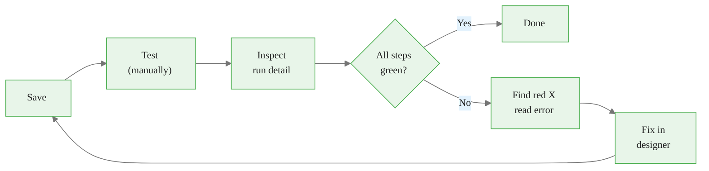
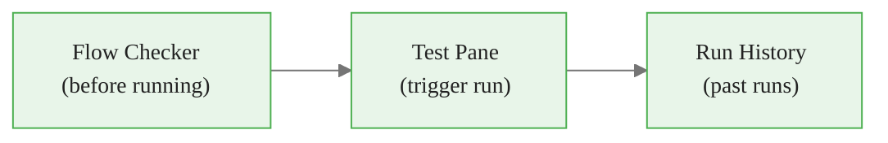
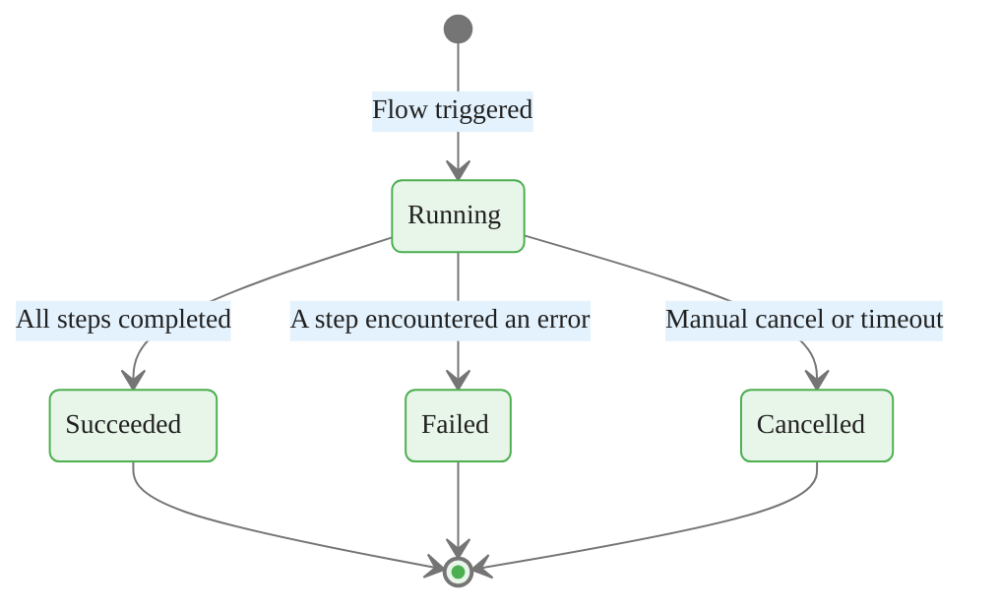
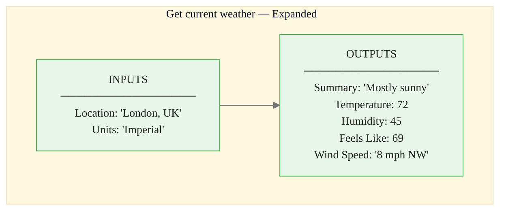
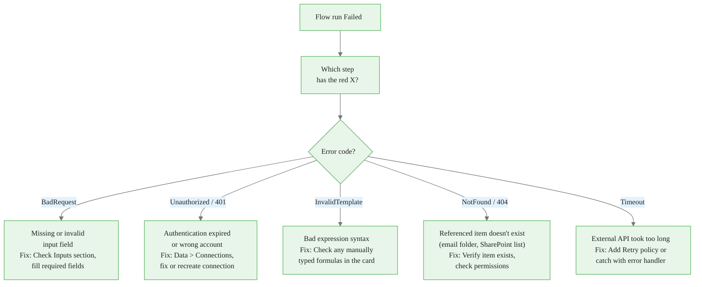
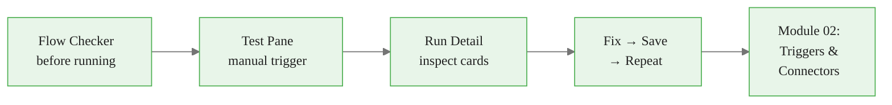

<!-- _class: lead -->

# Testing and Debugging Your Flow

**Module 01 — Power Automate for Beginners**

> A flow that passes the first test is rare. A flow that is never broken and never fixed is never improved. Learn the tools, embrace the cycle.

<!--
Speaker notes: Open with the expectation that things will go wrong — and that is fine. The goal of this deck is to make learners comfortable with the debugging tools so that a red X feels like information, not a failure. By the end, learners should be able to find the root cause of any first-flow error in under two minutes.
-->

<!-- Speaker notes: Cover the key points on this slide about Testing and Debugging Your Flow. Pause for questions if the audience seems uncertain. -->

---

# The Testing Cycle



**The rule:** Save before every test. The test pane runs the last **saved** version.

Changes on the canvas that have not been saved do not affect the test result.

<!--
Speaker notes: Draw attention to the cycle: it is a loop, not a one-way street. Even experienced Power Automate developers iterate through this cycle multiple times per flow. The Save rule is the single most common source of confusion for beginners — they change a field, click Test, and wonder why nothing changed. Write Save-Test-Inspect on the board or in the chat.
-->


<div class="callout-insight">
<strong>Insight:</strong> This is a key takeaway from this section that connects to the broader course themes.
</div>

<!-- Speaker notes: Cover the key points on this slide about The Testing Cycle. Pause for questions if the audience seems uncertain. -->

---

# Three Testing Tools

<div class="columns">
<div>

**Test Pane**
- Runs the flow immediately
- Bypasses all schedules
- Two modes: Manually or Automatically (reuse last run data)
- Opens from toolbar: **Test** button

</div>
<div>

**Run History**
- Lists every past execution
- Filterable by status
- 28-day retention
- Opens from flow overview page

**Flow Checker**
- Scans for config errors before running
- Opens from toolbar: checkmark icon
- Catches missing required fields instantly

</div>
</div>



<!--
Speaker notes: These three tools are used in order: Flow Checker catches static config errors, the Test Pane triggers an execution, and Run History lets you browse the results of any past execution including that test run. Each tool has a specific job — learners who try to use only one of them spend far more time debugging. Emphasise that the Test Pane and Run History both show the same run detail page; they are two entry points to the same data.
-->


<div class="callout-key">
<strong>Key Point:</strong> Remember this concept — it appears repeatedly in later modules.
</div>

<!-- Speaker notes: Cover the key points on this slide about Three Testing Tools. Pause for questions if the audience seems uncertain. -->

---

# Flow Run States



| State | Icon | What it means |
|-------|------|--------------|
| **Succeeded** | Green circle + tick | Every step completed without error |
| **Failed** | Red circle + X | At least one step errored and halted the flow |
| **Cancelled** | Grey circle + slash | Manually cancelled, or flow timed out (30-day limit) |
| **Running** | Spinning indicator | Still executing — refresh in a few seconds |

<!--
Speaker notes: A "Failed" run does not mean every step failed — usually only one step failed. The rest of the steps above it succeeded, and the steps below it never ran. This is important because learners sometimes think a Failed run means they have to rebuild the flow. They only need to fix the one failing step. The 30-day timeout applies to very long-running flows with approval steps; for typical automation flows it is not a concern.
-->


<div class="callout-warning">
<strong>Warning:</strong> This is a common source of confusion. Pay close attention to the distinction here.
</div>

<!-- Speaker notes: Cover the key points on this slide about Flow Run States. Pause for questions if the audience seems uncertain. -->

---

# Reading the Run Detail Page

```
┌──────────────────────────────────────────────────────────┐
│  Run started: 8:00 AM  Duration: 3.2s  Status: Failed    │
│                                                          │
│  ✓  Recurrence                            0.1s           │
│  ✗  Get current weather                   1.8s  ← click  │
│     (skipped)  Send an email                             │
└──────────────────────────────────────────────────────────┘

Expand the red X card:

  INPUTS
    Location:  ""        ← empty! this is the cause
    Units:     "Imperial"

  ERROR
    Code:    BadRequest
    Message: "The value provided for 'location' is not valid"
```

<!--
Speaker notes: Walk through this example carefully. Learners should notice three things: (1) The Recurrence card succeeded — the trigger fired correctly. (2) The weather card failed because Location was empty. (3) The email card shows "(skipped)" — it never ran because the step before it failed. Reading the Inputs section of the failed card immediately shows the empty Location field. This is the moment learners understand why input/output inspection is powerful.
-->


<div class="callout-info">
<strong>Info:</strong> This detail is useful context but not required to memorize.
</div>

<!-- Speaker notes: Cover the key points on this slide about Reading the Run Detail Page. Pause for questions if the audience seems uncertain. -->

---

# Inspecting Inputs and Outputs

Every expanded card shows two sections:



**Debugging strategy:**

1. Find the step with the red X
2. Expand it and read Inputs — was the data it received correct?
3. If Inputs look wrong, expand the step above and read its Outputs
4. Repeat until you find where the bad data originated

<!--
Speaker notes: This upstream-tracing strategy works for any data problem in any flow. The learner starts at the failure point and works backward. In most first-flow scenarios, the problem is either in the Inputs (a misconfigured field) or in a dynamic content token that resolved to the wrong value. The Inputs section always shows the resolved values — tokens have already been substituted by this point.
-->

<!-- Speaker notes: Cover the key points on this slide about Inspecting Inputs and Outputs. Pause for questions if the audience seems uncertain. -->

---

<!-- _class: lead -->

# Error Diagnosis Flowchart

<!--
Speaker notes: Transition to the structured diagnosis section. The following slide presents a decision tree that guides learners from "flow failed" to "root cause" in a few steps. Encourage learners to save this as a reference during their first few weeks of building flows.
-->

<!-- Speaker notes: Cover the key points on this slide about Error Diagnosis Flowchart. Pause for questions if the audience seems uncertain. -->

---

# Diagnose Any First-Flow Error



<!--
Speaker notes: Walk through each branch. BadRequest is the most common for beginners — it almost always means a required field was left empty. Unauthorized errors appear when the learner used a personal Microsoft account instead of a work/school M365 account, or when a connection token has expired. InvalidTemplate errors come from expressions typed manually into fields — learners encounter these in Module 03 when they start writing Power Automate expressions. NotFound and Timeout errors are less common in Module 01 flows but learners should know they exist.
-->

<!-- Speaker notes: Cover the key points on this slide about Diagnose Any First-Flow Error. Pause for questions if the audience seems uncertain. -->

---

# The Flow Checker

> **On screen:** In the designer toolbar, click the **Flow Checker** icon (checkmark circle, right of Test button).

```
Flow Checker Results
──────────────────────────────────────
✗  Send an email (V2)
   Required field "To" is missing.

✗  Get current weather
   Required field "Location" is missing.

✓  No expression errors found.
──────────────────────────────────────
Run Flow Checker before every test.
```

**Flow Checker vs. runtime errors:**

| Flow Checker catches | Runtime errors (Flow Checker misses) |
|---------------------|--------------------------------------|
| Missing required fields | Wrong credentials |
| Invalid expression syntax | API returning unexpected data |
| Disconnected connectors | Network timeouts |

<!--
Speaker notes: Flow Checker is a static analyser — it reads the flow definition without executing it. It catches the "you forgot to fill in a required field" class of errors immediately, saving a full test-fail-inspect cycle. It cannot catch runtime errors because it does not make any API calls. Think of it like a linter: useful but not a substitute for running the code. Recommend learners run it every time before clicking Test — takes two seconds.
-->

<!-- Speaker notes: Cover the key points on this slide about The Flow Checker. Pause for questions if the audience seems uncertain. -->

---

# Top 5 First-Flow Errors

<div class="columns">
<div>

**Error 1: BadRequest — Location empty**
Weather step fails immediately.
Fix: Enter city name in Location field.

**Error 2: Unauthorized — wrong account**
Outlook step fails with 401.
Fix: Recreate connection with M365 work/school account.

**Error 3: Wrong dynamic token**
Flow succeeds, email shows wrong value.
Fix: Delete token, re-insert from correct step group.

</div>
<div>

**Error 4: Email not arriving**
All steps green, inbox empty.
Fix: Check spam folder; verify To address in Inputs.

**Error 5: Test runs old version**
Fixed a field, same error recurs.
Fix: Click Save before clicking Test.

</div>
</div>

<!--
Speaker notes: These five errors account for roughly 95% of module 01 support questions. If learners bookmark one slide from this deck, it should be this one. Error 5 is the sneakiest — the learner is certain they fixed the problem, yet the same error appears. The instant question is "did you save first?" which resolves it every time.
-->

<!-- Speaker notes: Cover the key points on this slide about Top 5 First-Flow Errors. Pause for questions if the audience seems uncertain. -->

---

# Summary and What Is Next



**You can now:**
- Use the Flow Checker to catch config errors before running
- Trigger a manual test and read run states
- Expand any card to see its exact inputs and outputs
- Diagnose the five most common first-flow errors by error code

**Notebook:** `01_trigger_flow_via_http.ipynb` — trigger your flow from Python and inspect the HTTP response programmatically.

<!--
Speaker notes: Wrap up by connecting to what comes next. Module 02 goes deep on trigger types and connector authentication — both topics that this debugging knowledge directly supports. If a connection fails in Module 02, learners already know to go to Data > Connections and read the error code. The notebook is a hands-on complement: it lets learners trigger the flow outside the browser UI, which is useful for integration testing and pipeline automation.
-->

<!-- Speaker notes: Cover the key points on this slide about Summary and What Is Next. Pause for questions if the audience seems uncertain. -->
